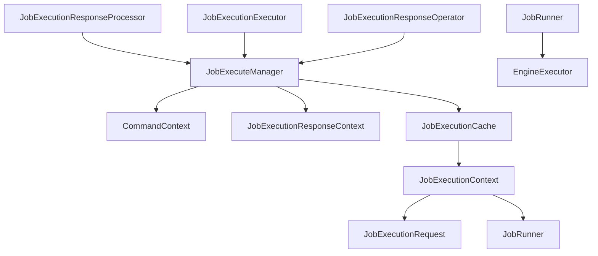
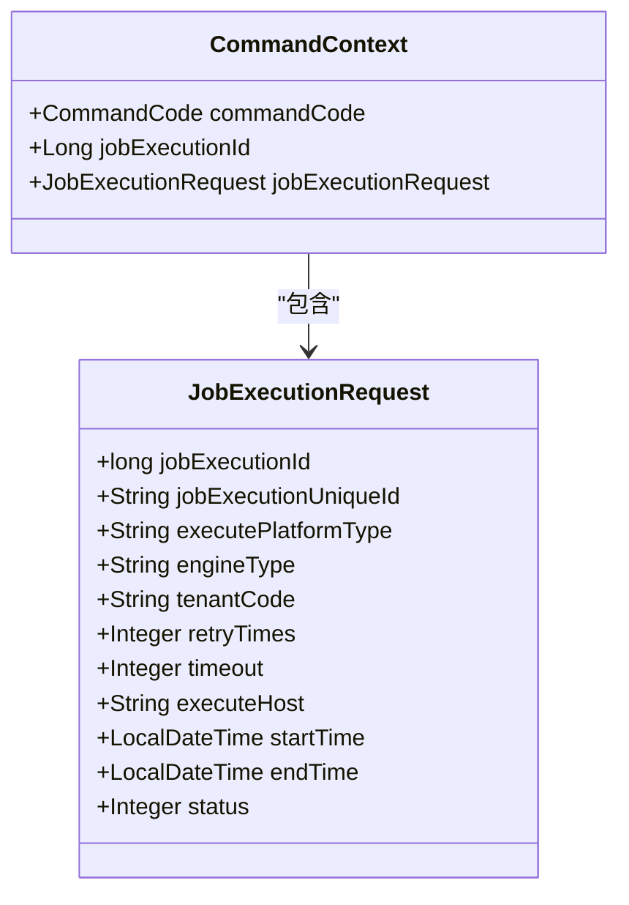
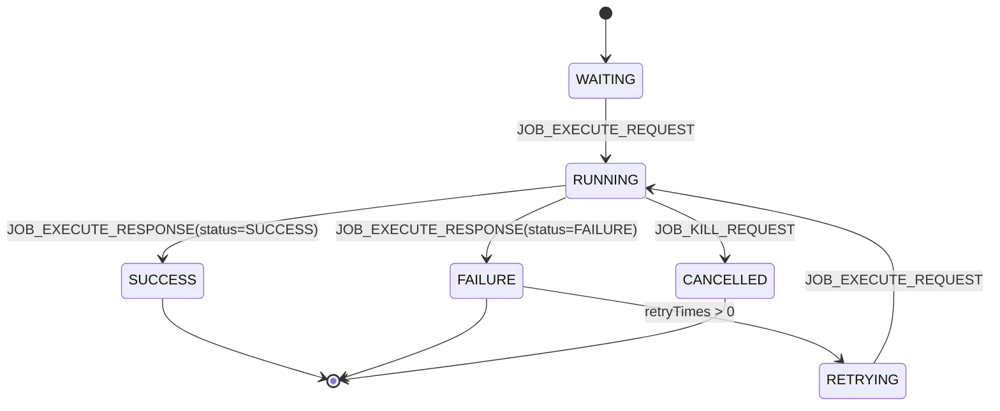
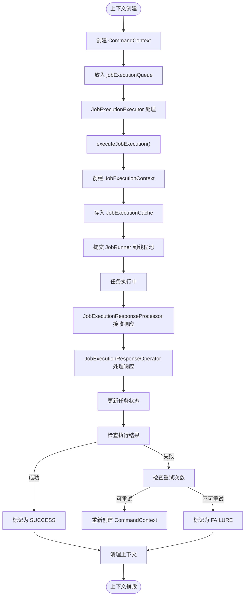
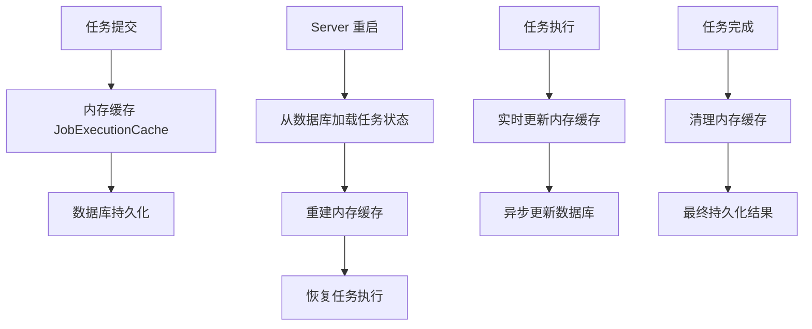
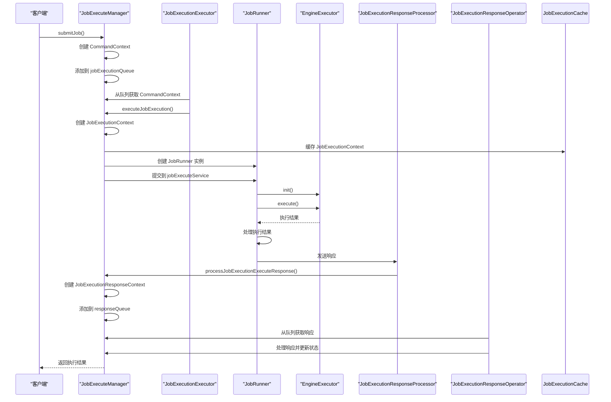

# 执行上下文管理

<cite>
**本文档引用的文件**   
- [JobExecuteManager.java](file://datavines-server/src/main/java/io/datavines/server/dqc/coordinator/cache/JobExecuteManager.java)
- [CommandContext.java](file://datavines-server/src/main/java/io/datavines/server/dqc/coordinator/cache/CommandContext.java)
- [JobExecutionResponseContext.java](file://datavines-server/src/main/java/io/datavines/server/dqc/coordinator/cache/JobExecutionResponseContext.java)
- [JobExecutionCache.java](file://datavines-server/src/main/java/io/datavines/server/dqc/executor/cache/JobExecutionCache.java)
- [JobExecutionContext.java](file://datavines-server/src/main/java/io/datavines/server/dqc/executor/cache/JobExecutionContext.java)
- [JobExecutionRequest.java](file://datavines-common/src/main/java/io/datavines/common/entity/JobExecutionRequest.java)
- [JobRunner.java](file://datavines-runner/src/main/java/io/datavines/runner/JobRunner.java)
- [ExecutionStatus.java](file://datavines-common/src/main/java/io/datavines/common/enums/ExecutionStatus.java)
</cite>

## 目录
1. [简介](#简介)
2. [执行上下文管理架构](#执行上下文管理架构)
3. [CommandContext 任务元数据管理](#commandcontext-任务元数据管理)
4. [JobExecutionResponseContext 状态机管理](#jobexecutionresponsecontext-状态机管理)
5. [上下文生命周期管理](#上下文生命周期管理)
6. [故障恢复与持久化策略](#故障恢复与持久化策略)
7. [执行流程时序分析](#执行流程时序分析)

## 简介
本文档深入分析 DataVines 系统中 JobExecuteManager 如何实现分布式任务执行上下文的管理。详细说明 CommandContext 如何存储任务的元数据、配置参数和执行环境信息，以及 JobExecutionResponseContext 如何维护任务状态机的转换过程。同时解释上下文对象在 Server 重启后的恢复机制，以及内存缓存与数据库持久化的同步策略。

## 执行上下文管理架构

**图表来源**
- [JobExecuteManager.java](file://datavines-server/src/main/java/io/datavines/server/dqc/coordinator/cache/JobExecuteManager.java#L73-L616)

## CommandContext 任务元数据管理

CommandContext 是任务执行命令的上下文容器，负责存储任务的元数据、配置参数和执行环境信息。该对象作为任务执行请求的载体，在分布式系统中传递任务执行指令。

**图表来源**
- [CommandContext.java](file://datavines-server/src/main/java/io/datavines/server/dqc/coordinator/cache/CommandContext.java#L22-L31)
- [JobExecutionRequest.java](file://datavines-common/src/main/java/io/datavines/common/entity/JobExecutionRequest.java#L26-L85)

### 元数据存储结构
CommandContext 通过以下方式管理任务元数据：

1. **任务标识信息**：存储 jobExecutionId 作为任务的唯一标识
2. **执行平台信息**：记录 executePlatformType 和 executePlatformParameter
3. **引擎配置**：保存 engineType 和 engineParameter
4. **执行环境**：包含 tenantCode、env 等环境变量
5. **执行控制参数**：管理 retryTimes、timeout、timeoutStrategy 等控制参数

当任务被提交时，JobExecuteManager 会创建 CommandContext 对象并将其放入 jobExecutionQueue 队列中等待处理。

**代码路径**
- [JobExecuteManager.java](file://datavines-server/src/main/java/io/datavines/server/dqc/coordinator/cache/JobExecuteManager.java#L541-L552)

## JobExecutionResponseContext 状态机管理

JobExecutionResponseContext 负责维护任务状态机的转换过程，通过 CommandCode 和 JobExecutionRequest 的组合来跟踪任务的执行状态变化。

**图表来源**
- [JobExecutionResponseContext.java](file://datavines-server/src/main/java/io/datavines/server/dqc/coordinator/cache/JobExecutionResponseContext.java#L25-L40)
- [ExecutionStatus.java](file://datavines-common/src/main/java/io/datavines/common/enums/ExecutionStatus.java#L78-L141)

### 状态转换机制
JobExecutionResponseContext 通过 JobExecutionResponseOperator 线程监听 responseQueue 队列中的响应消息，根据不同的 CommandCode 执行相应的状态转换逻辑：

1. **JOB_EXECUTE_ACK**：任务开始执行，更新任务状态为 RUNNING_EXECUTION
2. **JOB_EXECUTE_RESPONSE**：任务执行完成，根据实际状态更新为 SUCCESS 或 FAILURE
3. **超时处理**：通过 HashedWheelTimer 监控任务执行时间，超时则触发 KILL 操作

状态转换过程中，系统会更新数据库中的任务状态，并在必要时触发重试机制。

**代码路径**
- [JobExecuteManager.java](file://datavines-server/src/main/java/io/datavines/server/dqc/coordinator/cache/JobExecuteManager.java#L276-L351)

## 上下文生命周期管理

执行上下文的生命周期管理涉及创建、更新和销毁三个阶段，确保任务执行过程中的状态一致性。

**图表来源**
- [JobExecuteManager.java](file://datavines-server/src/main/java/io/datavines/server/dqc/coordinator/cache/JobExecuteManager.java#L177-L213)
- [JobExecuteManager.java](file://datavines-server/src/main/java/io/datavines/server/dqc/coordinator/cache/JobExecuteManager.java#L276-L351)

### 创建过程
当任务被提交时，系统执行以下创建流程：
1. 调用 addExecuteCommand 方法创建 JobExecutionRequest
2. 构建 CommandContext 对象并设置 JOB_EXECUTE_REQUEST 命令码
3. 将 CommandContext 放入 jobExecutionQueue 队列
4. JobExecutionExecutor 线程从队列中取出 CommandContext
5. 调用 executeJobExecution 方法执行任务
6. 创建 JobExecutionContext 并存入 JobExecutionCache
7. 提交 JobRunner 到线程池执行

### 更新过程
任务执行过程中，上下文通过以下方式更新：
1. 执行开始时发送 JOB_EXECUTE_ACK 响应
2. 执行完成时发送 JOB_EXECUTE_RESPONSE 响应
3. 状态更新通过 JobExecutionResponseOperator 处理
4. 根据执行结果更新数据库中的任务状态

### 销毁过程
上下文销毁发生在以下情况：
1. 任务成功完成，从缓存中移除
2. 任务失败且无重试机会，清理相关资源
3. 任务被取消或超时，执行清理操作
4. Server 关闭时，关闭相关线程池

**代码路径**
- [JobExecuteManager.java](file://datavines-server/src/main/java/io/datavines/server/dqc/coordinator/cache/JobExecuteManager.java#L177-L213)
- [JobExecuteManager.java](file://datavines-server/src/main/java/io/datavines/server/dqc/coordinator/cache/JobExecuteManager.java#L384-L393)

## 故障恢复与持久化策略

系统通过内存缓存与数据库持久化的协同工作，确保在 Server 重启后能够恢复执行上下文。

**图表来源**
- [JobExecutionCache.java](file://datavines-server/src/main/java/io/datavines/server/dqc/executor/cache/JobExecutionCache.java#L23-L48)
- [JobExecuteManager.java](file://datavines-server/src/main/java/io/datavines/server/dqc/coordinator/cache/JobExecuteManager.java#L89-L90)

### 内存缓存机制
JobExecutionCache 采用单例模式实现，使用 ConcurrentHashMap 存储 JobExecutionContext 对象：

1. **缓存结构**：以 jobExecutionId 为键，JobExecutionContext 为值的并发哈希映射
2. **线程安全**：使用 ConcurrentHashMap 确保多线程环境下的安全性
3. **快速访问**：提供 getById、cache、remove 等方法实现高效的上下文管理

### 持久化同步策略
系统通过以下策略确保内存缓存与数据库的一致性：

1. **写前持久化**：任务提交前先在数据库中创建记录
2. **状态实时同步**：任务状态变更时立即更新数据库
3. **结果最终持久化**：任务完成后持久化最终结果
4. **异常清理机制**：任务失败时清理中间结果

当 Server 重启时，系统会从数据库加载未完成的任务状态，并重建内存中的执行上下文，确保任务能够继续执行或正确处理。

**代码路径**
- [JobExecutionCache.java](file://datavines-server/src/main/java/io/datavines/server/dqc/executor/cache/JobExecutionCache.java#L23-L48)
- [JobExecuteManager.java](file://datavines-server/src/main/java/io/datavines/server/dqc/coordinator/cache/JobExecuteManager.java#L384-L393)

## 执行流程时序分析

**图表来源**
- [JobExecuteManager.java](file://datavines-server/src/main/java/io/datavines/server/dqc/coordinator/cache/JobExecuteManager.java#L143-L174)
- [JobExecuteManager.java](file://datavines-server/src/main/java/io/datavines/server/dqc/coordinator/cache/JobExecuteManager.java#L277-L351)
- [JobRunner.java](file://datavines-runner/src/main/java/io/datavines/runner/JobRunner.java#L63-L81)

该时序图展示了任务从提交到完成的完整执行流程，包括命令的创建与处理、上下文的管理、任务的执行以及状态的更新等关键步骤。