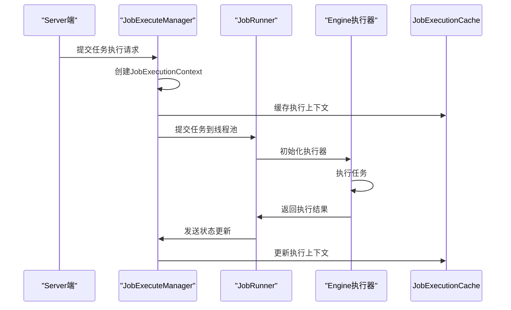
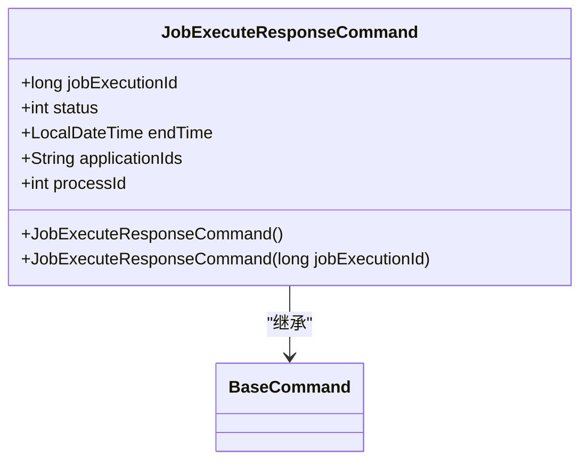
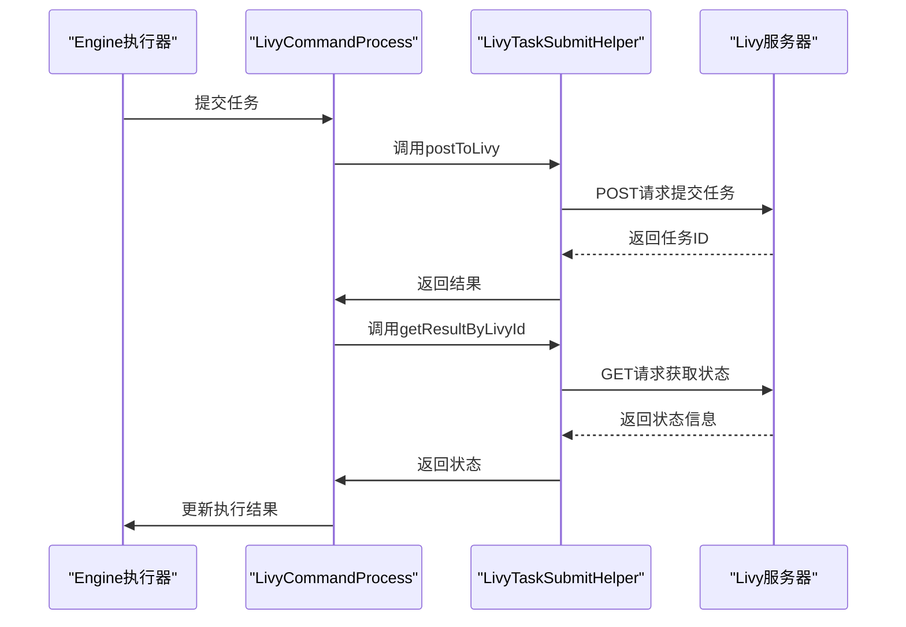

# 状态同步机制

<cite>
**本文档引用的文件**   
- [JobExecuteManager.java](file://datavines-server/src/main/java/io/datavines/server/dqc/coordinator/cache/JobExecuteManager.java)
- [JobExecuteResponseCommand.java](file://datavines-server/src/main/java/io/datavines/server/dqc/command/JobExecuteResponseCommand.java)
- [JobExecuteAckCommand.java](file://datavines-server/src/main/java/io/datavines/server/dqc/command/JobExecuteAckCommand.java)
- [JobExecutionResponseContext.java](file://datavines-server/src/main/java/io/datavines/server/dqc/coordinator/cache/JobExecutionResponseContext.java)
- [JobExecutionContext.java](file://datavines-server/src/main/java/io/datavines/server/dqc/executor/cache/JobExecutionContext.java)
- [JobExecutionRequest.java](file://datavines-common/src/main/java/io/datavines/common/entity/JobExecutionRequest.java)
- [LivyTaskSubmitHelper.java](file://datavines-engine/datavines-engine-executor/src/main/java/io/datavines/engine/executor/core/helper/LivyTaskSubmitHelper.java)
- [LivyCommandProcess.java](file://datavines-engine/datavines-engine-executor/src/main/java/io/datavines/engine/executor/core/executor/LivyCommandProcess.java)
- [EngineExecutor.java](file://datavines-engine/datavines-engine-api/src/main/java/io/datavines/engine/api/engine/EngineExecutor.java)
- [JobRunner.java](file://datavines-runner/src/main/java/io/datavines/runner/JobRunner.java)
- [ExecutionStatus.java](file://datavines-common/src/main/java/io/datavines/common/enums/ExecutionStatus.java)
- [CommandCode.java](file://datavines-server/src/main/java/io/datavines/server/dqc/command/CommandCode.java)
</cite>

## 目录
1. [简介](#简介)
2. [核心组件](#核心组件)
3. [状态同步流程](#状态同步流程)
4. [消息结构设计](#消息结构设计)
5. [外部计算框架集成](#外部计算框架集成)
6. [结论](#结论)

## 简介
DataVines的分布式状态同步机制是其核心功能之一，确保了Server端与Engine执行器之间的实时通信和状态同步。该机制通过一系列精心设计的命令和回调接口，实现了任务执行上下文的维护、任务状态的实时推送以及命令的确认应答。本文将深入分析这一机制，重点探讨JobExecuteManager如何维护任务执行上下文，Engine执行器如何通过回调接口将任务状态（提交中、运行中、成功、失败）实时推送回Server，以及Command命令的确认应答机制。此外，还将详细分析JobExecuteResponseCommand的消息结构设计，包括执行日志流式传输、进度百分比更新和最终结果持久化等环节，并通过LivyTaskSubmitHelper的实现说明与外部计算框架集成时的状态监听和异常传播机制。

## 核心组件

DataVines的状态同步机制涉及多个核心组件，这些组件协同工作以确保任务状态的准确同步。主要组件包括JobExecuteManager、JobExecuteResponseCommand、JobExecuteAckCommand、JobExecutionResponseContext、JobExecutionContext、JobExecutionRequest、LivyTaskSubmitHelper、LivyCommandProcess、EngineExecutor和JobRunner。

**Section sources**
- [JobExecuteManager.java](file://datavines-server/src/main/java/io/datavines/server/dqc/coordinator/cache/JobExecuteManager.java#L73-L617)
- [JobExecuteResponseCommand.java](file://datavines-server/src/main/java/io/datavines/server/dqc/command/JobExecuteResponseCommand.java#L1-L46)
- [JobExecuteAckCommand.java](file://datavines-server/src/main/java/io/datavines/server/dqc/command/JobExecuteAckCommand.java#L1-L47)
- [JobExecutionResponseContext.java](file://datavines-server/src/main/java/io/datavines/server/dqc/coordinator/cache/JobExecutionResponseContext.java#L1-L40)
- [JobExecutionContext.java](file://datavines-server/src/main/java/io/datavines/server/dqc/executor/cache/JobExecutionContext.java#L1-L30)
- [JobExecutionRequest.java](file://datavines-common/src/main/java/io/datavines/common/entity/JobExecutionRequest.java#L1-L86)
- [LivyTaskSubmitHelper.java](file://datavines-engine/datavines-engine-executor/src/main/java/io/datavines/engine/executor/core/helper/LivyTaskSubmitHelper.java#L1-L258)
- [LivyCommandProcess.java](file://datavines-engine/datavines-engine-executor/src/main/java/io/datavines/engine/executor/core/executor/LivyCommandProcess.java#L1-L30)
- [EngineExecutor.java](file://datavines-engine/datavines-engine-api/src/main/java/io/datavines/engine/api/engine/EngineExecutor.java#L1-L42)
- [JobRunner.java](file://datavines-runner/src/main/java/io/datavines/runner/JobRunner.java#L60-L93)

## 状态同步流程

DataVines的状态同步流程始于Server端的JobExecuteManager，它负责维护所有任务的执行上下文。当一个任务被提交时，JobExecuteManager会创建一个JobExecutionContext，并将其存储在JobExecutionCache中。这个上下文包含了任务的所有必要信息，如任务ID、执行平台类型、引擎类型、执行参数等。

**Diagram sources**
- [JobExecuteManager.java](file://datavines-server/src/main/java/io/datavines/server/dqc/coordinator/cache/JobExecuteManager.java#L178-L214)
- [JobRunner.java](file://datavines-runner/src/main/java/io/datavines/runner/JobRunner.java#L65-L80)

Engine执行器通过实现EngineExecutor接口来执行任务。在执行过程中，执行器会通过回调接口将任务状态实时推送回Server。这些状态包括提交中、运行中、成功和失败。状态更新通过JobExecuteResponseCommand和JobExecuteAckCommand两种命令实现。JobExecuteAckCommand用于确认任务已成功提交，而JobExecuteResponseCommand则用于报告任务的最终执行结果。

**Section sources**
- [JobExecuteManager.java](file://datavines-server/src/main/java/io/datavines/server/dqc/coordinator/cache/JobExecuteManager.java#L294-L347)
- [JobRunner.java](file://datavines-runner/src/main/java/io/datavines/runner/JobRunner.java#L70-L93)
- [EngineExecutor.java](file://datavines-engine/datavines-engine-api/src/main/java/io/datavines/engine/api/engine/EngineExecutor.java#L29-L42)

## 消息结构设计

JobExecuteResponseCommand是状态同步机制中的关键消息类型，其设计旨在高效地传输任务执行结果。该命令包含多个字段，如jobExecutionId、status、endTime、applicationIds和processId，这些字段共同描述了任务的执行状态和结果。

**Diagram sources**
- [JobExecuteResponseCommand.java](file://datavines-server/src/main/java/io/datavines/server/dqc/command/JobExecuteResponseCommand.java#L1-L46)
- [BaseCommand.java](file://datavines-server/src/main/java/io/datavines/server/dqc/command/BaseCommand.java#L1-L32)

执行日志的流式传输通过JobExecutionResponseContext实现，该上下文包含了命令代码和任务执行请求。进度百分比的更新则通过定期发送JobExecuteResponseCommand来实现，每次更新都包含最新的进度信息。最终结果的持久化则在任务完成后，通过将执行结果写入数据库来完成。

**Section sources**
- [JobExecuteResponseCommand.java](file://datavines-server/src/main/java/io/datavines/server/dqc/command/JobExecuteResponseCommand.java#L1-L46)
- [JobExecutionResponseContext.java](file://datavines-server/src/main/java/io/datavines/server/dqc/coordinator/cache/JobExecutionResponseContext.java#L1-L40)
- [JobExecuteManager.java](file://datavines-server/src/main/java/io/datavines/server/dqc/coordinator/cache/JobExecuteManager.java#L448-L464)

## 外部计算框架集成

与外部计算框架（如Livy）的集成通过LivyTaskSubmitHelper实现。该辅助类负责与Livy服务器通信，提交任务并监听状态变化。LivyTaskSubmitHelper通过REST API与Livy服务器交互，提交任务后会定期轮询任务状态，直到任务完成或失败。

**Diagram sources**
- [LivyCommandProcess.java](file://datavines-engine/datavines-engine-executor/src/main/java/io/datavines/engine/executor/core/executor/LivyCommandProcess.java#L1-L30)
- [LivyTaskSubmitHelper.java](file://datavines-engine/datavines-engine-executor/src/main/java/io/datavines/engine/executor/core/helper/LivyTaskSubmitHelper.java#L1-L258)

异常传播机制通过捕获和处理各种异常来实现。例如，当与Livy服务器的通信失败时，LivyTaskSubmitHelper会捕获HttpClientErrorException并记录错误日志。如果任务提交失败，Engine执行器会将任务状态设置为失败，并通过JobExecuteResponseCommand通知Server端。

**Section sources**
- [LivyTaskSubmitHelper.java](file://datavines-engine/datavines-engine-executor/src/main/java/io/datavines/engine/executor/core/helper/LivyTaskSubmitHelper.java#L134-L140)
- [LivyCommandProcess.java](file://datavines-engine/datavines-engine-executor/src/main/java/io/datavines/engine/executor/core/executor/LivyCommandProcess.java#L62-L75)
- [JobRunner.java](file://datavines-runner/src/main/java/io/datavines/runner/JobRunner.java#L80-L93)

## 结论

DataVines的分布式状态同步机制通过精心设计的组件和流程，实现了Server端与Engine执行器之间的高效通信和状态同步。JobExecuteManager通过维护任务执行上下文，确保了任务状态的准确跟踪。Engine执行器通过回调接口实时推送任务状态，保证了状态的及时更新。JobExecuteResponseCommand的消息结构设计合理，支持执行日志流式传输、进度百分比更新和最终结果持久化。通过LivyTaskSubmitHelper的实现，DataVines能够与外部计算框架无缝集成，实现了状态监听和异常传播。这一机制为DataVines的可靠性和可扩展性提供了坚实的基础。