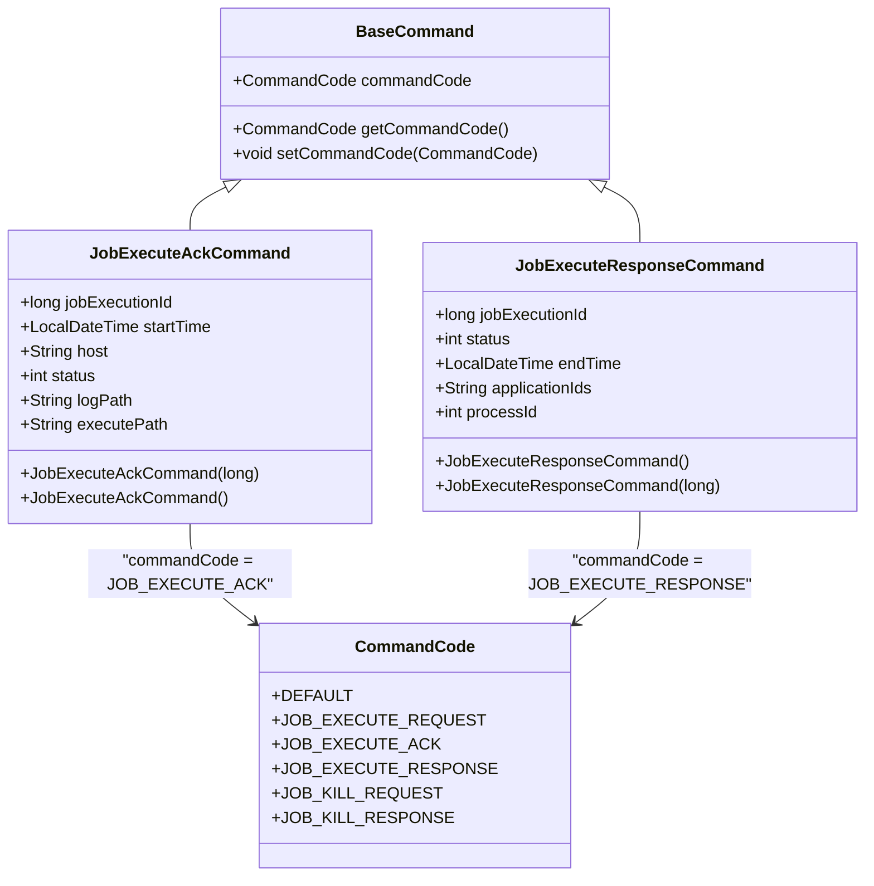
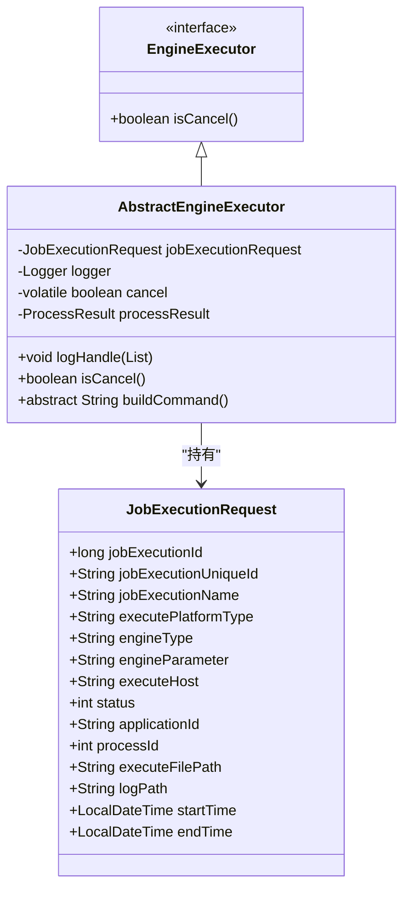
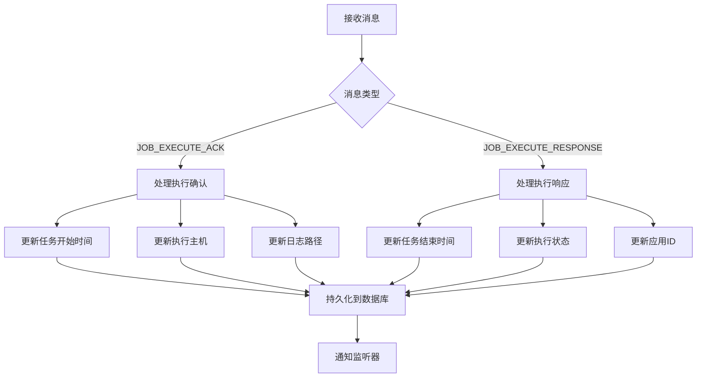
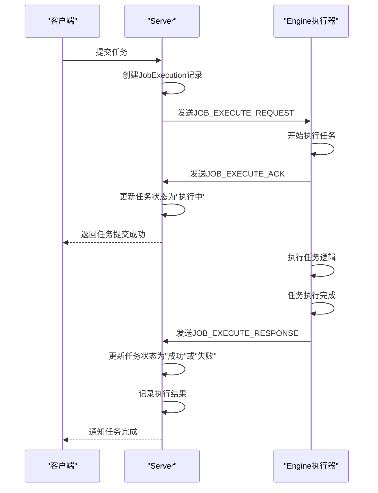

# 状态消息通信

<cite>
**本文档引用的文件**   
- [JobExecuteResponseCommand.java](file://datavines-server\src\main\java\io\datavines\server\dqc\command\JobExecuteResponseCommand.java)
- [JobExecuteAckCommand.java](file://datavines-server\src\main\java\io\datavines\server\dqc\command\JobExecuteAckCommand.java)
- [CommandCode.java](file://datavines-server\src\main\java\io\datavines\server\dqc\command\CommandCode.java)
- [AbstractEngineExecutor.java](file://datavines-engine\datavines-engine-executor\src\main\java\io\datavines\engine\executor\core\base\AbstractEngineExecutor.java)
- [JobExecuteManager.java](file://datavines-server\src\main\java\io\datavines\server\dqc\coordinator\cache\JobExecuteManager.java)
- [JobExecutionRequest.java](file://datavines-common\src\main\java\io\datavines\common\entity\JobExecutionRequest.java)
- [JSONUtils.java](file://datavines-common\src\main\java\io\datavines\common\utils\JSONUtils.java)
- [ExecutionStatus.java](file://datavines-common\src\main\java\io\datavines\common\enums\ExecutionStatus.java)
</cite>

## 目录
1. [引言](#引言)
2. [消息通信机制概述](#消息通信机制概述)
3. [消息设计原理](#消息设计原理)
4. [状态上报接口实现](#状态上报接口实现)
5. [消息处理机制](#消息处理机制)
6. [通信序列图](#通信序列图)
7. [总结](#总结)

## 引言
本文档详细解析DataVines系统中状态同步的消息通信机制。重点阐述JobExecuteResponseCommand和JobExecuteAckCommand的设计原理，包括消息序列化格式、版本控制和校验机制。同时说明Engine执行器如何通过AbstractEngineExecutor基类实现标准化的状态上报接口，以及Server端如何处理乱序消息和重复消息。

## 消息通信机制概述
DataVines系统采用基于命令模式的消息通信机制来实现Engine执行器与Server之间的状态同步。该机制通过定义不同类型的消息命令，实现任务执行过程中的状态上报、确认和结果反馈。

系统中的消息通信主要涉及以下核心组件：
- **JobExecuteAckCommand**: 任务执行确认命令，用于Engine向Server上报任务开始执行的状态
- **JobExecuteResponseCommand**: 任务执行响应命令，用于Engine向Server上报任务执行完成的结果
- **CommandCode**: 命令代码枚举，定义了系统中所有支持的命令类型
- **JobExecuteManager**: 任务执行管理器，负责处理来自Engine的各种命令

消息通信采用JSON格式进行序列化，通过统一的通信通道进行传输，确保了消息的可读性和跨平台兼容性。

## 消息设计原理

### 消息序列化格式
系统采用JSON格式作为消息的序列化格式，主要基于以下考虑：

1. **可读性强**: JSON格式具有良好的可读性，便于调试和问题排查
2. **跨平台兼容**: JSON是广泛支持的数据交换格式，确保了不同语言实现的组件之间的兼容性
3. **灵活性高**: JSON格式支持嵌套结构，能够灵活表达复杂的数据结构

消息序列化由JSONUtils工具类统一处理，该类基于Jackson库实现，配置了以下特性：
- 忽略未知属性（FAIL_ON_UNKNOWN_PROPERTIES为false）
- 支持空数组和空字符串作为null值处理
- 支持Java 8时间类型（LocalDateTime）的序列化
- 日期格式统一为"yyyy-MM-dd HH:mm:ss"
- 空值字段不进行序列化（NON_NULL）

**图来源**
- [JobExecuteAckCommand.java](file://datavines-server\src\main\java\io\datavines\server\dqc\command\JobExecuteAckCommand.java)
- [JobExecuteResponseCommand.java](file://datavines-server\src\main\java\io\datavines\server\dqc\command\JobExecuteResponseCommand.java)
- [CommandCode.java](file://datavines-server\src\main\java\io\datavines\server\dqc\command\CommandCode.java)

### 版本控制机制
系统通过CommandCode枚举实现消息的版本控制。CommandCode定义了所有支持的命令类型，包括：
- JOB_EXECUTE_REQUEST: 任务执行请求
- JOB_EXECUTE_ACK: 任务执行确认
- JOB_EXECUTE_RESPONSE: 任务执行响应
- JOB_KILL_REQUEST: 任务终止请求
- JOB_KILL_RESPONSE: 任务终止响应

这种设计允许系统在不影响现有功能的情况下扩展新的命令类型。当新增命令时，只需在CommandCode中添加新的枚举值，而不会影响已有的消息处理逻辑。

### 校验机制
消息校验主要通过以下机制实现：

1. **状态码校验**: 使用ExecutionStatus枚举确保状态值的有效性
2. **必填字段校验**: 关键字段如jobExecutionId不能为空
3. **时间顺序校验**: 确保startTime早于endTime
4. **状态转换校验**: 验证状态转换的合法性（如不能从"成功"状态转换为"执行中"）

ExecutionStatus枚举定义了系统中所有可能的任务状态，包括：
- SUBMITTED_SUCCESS: 已提交
- RUNNING_EXECUTION: 执行中
- SUCCESS: 成功
- FAILURE: 失败
- KILL: 强制终止

每个状态都有对应的code、description和zhDescription，便于国际化支持。

**本节来源**
- [JobExecuteAckCommand.java](file://datavines-server\src\main\java\io\datavines\server\dqc\command\JobExecuteAckCommand.java#L26-L36)
- [JobExecuteResponseCommand.java](file://datavines-server\src\main\java\io\datavines\server\dqc\command\JobExecuteResponseCommand.java#L26-L34)
- [ExecutionStatus.java](file://datavines-common\src\main\java\io\datavines\common\enums\ExecutionStatus.java#L45-L56)

## 状态上报接口实现

### AbstractEngineExecutor基类
Engine执行器通过继承AbstractEngineExecutor基类实现标准化的状态上报接口。该基类提供了统一的状态上报机制，确保所有Engine实现遵循相同的消息通信规范。

**图来源**
- [AbstractEngineExecutor.java](file://datavines-engine\datavines-engine-executor\src\main\java\io\datavines\engine\executor\core\base\AbstractEngineExecutor.java)
- [JobExecutionRequest.java](file://datavines-common\src\main\java\io\datavines\common\entity\JobExecutionRequest.java)

### 核心功能
AbstractEngineExecutor基类提供了以下核心功能：

1. **状态管理**: 通过jobExecutionRequest对象管理任务执行状态
2. **日志处理**: 提供logHandle方法统一处理执行日志
3. **取消检测**: isCancel方法用于检测任务是否被取消
4. **命令构建**: buildCommand抽象方法由子类实现，用于构建具体的执行命令

### 状态上报流程
Engine执行器的状态上报流程如下：

1. 任务开始执行时，创建JobExecuteAckCommand对象，设置开始时间、执行主机等信息
2. 通过通信通道发送JOB_EXECUTE_ACK命令到Server
3. 任务执行完成后，创建JobExecuteResponseCommand对象，设置结束时间、执行状态、应用ID等信息
4. 通过通信通道发送JOB_EXECUTE_RESPONSE命令到Server

这种分阶段上报的机制确保了Server能够实时跟踪任务的执行状态，及时发现和处理异常情况。

**本节来源**
- [AbstractEngineExecutor.java](file://datavines-engine\datavines-engine-executor\src\main\java\io\datavines\engine\executor\core\base\AbstractEngineExecutor.java#L27-L55)
- [JobExecutionRequest.java](file://datavines-common\src\main\java\io\datavines\common\entity\JobExecutionRequest.java#L28-L84)

## 消息处理机制

### 乱序消息处理
Server端通过以下机制处理乱序消息：

1. **消息队列**: 使用阻塞队列(jobExecutionQueue)缓存接收到的消息，确保消息按顺序处理
2. **状态机验证**: 根据ExecutionStatus的状态转换规则验证消息的合理性
3. **时间戳校验**: 比较消息中的时间戳，确保逻辑顺序的正确性

当接收到JOB_EXECUTE_ACK消息时，系统会更新任务的开始时间、执行主机等信息；当接收到JOB_EXECUTE_RESPONSE消息时，系统会更新任务的结束时间、执行状态等信息。

### 重复消息处理
系统通过以下机制处理重复消息：

1. **幂等性设计**: 消息处理逻辑设计为幂等操作，重复处理相同消息不会产生副作用
2. **状态检查**: 在处理消息前检查任务的当前状态，避免状态回退
3. **唯一标识**: 使用jobExecutionId作为消息的唯一标识，避免重复处理

**图来源**
- [JobExecuteManager.java](file://datavines-server\src\main\java\io\datavines\server\dqc\coordinator\cache\JobExecuteManager.java#L294-L304)
- [JobExecuteManager.java](file://datavines-server\src\main\java\io\datavines\server\dqc\coordinator\cache\JobExecuteManager.java#L448-L464)

### 消息处理流程
Server端的消息处理流程如下：

1. 接收来自Engine的消息
2. 根据commandCode判断消息类型
3. 对于JOB_EXECUTE_ACK消息：
   - 更新任务的开始时间
   - 更新执行状态为"执行中"
   - 更新执行文件路径和日志路径
   - 更新执行主机信息
   - 持久化到数据库
4. 对于JOB_EXECUTE_RESPONSE消息：
   - 更新任务的结束时间
   - 更新执行状态
   - 更新应用ID
   - 更新进程ID
   - 持久化到数据库

**本节来源**
- [JobExecuteManager.java](file://datavines-server\src\main\java\io\datavines\server\dqc\coordinator\cache\JobExecuteManager.java#L294-L464)

## 通信序列图

**图来源**
- [JobExecuteManager.java](file://datavines-server\src\main\java\io\datavines\server\dqc\coordinator\cache\JobExecuteManager.java)
- [AbstractEngineExecutor.java](file://datavines-engine\datavines-engine-executor\src\main\java\io\datavines\engine\executor\core\base\AbstractEngineExecutor.java)

### 完整消息交互流程
从任务提交到完成的完整消息交互流程如下：

1. **任务提交阶段**:
   - 客户端向Server提交任务
   - Server创建JobExecution记录，状态为"已提交"
   - Server向Engine发送JOB_EXECUTE_REQUEST命令

2. **任务执行确认阶段**:
   - Engine收到执行请求，开始执行任务
   - Engine创建JobExecuteAckCommand，包含开始时间、执行主机等信息
   - Engine向Server发送JOB_EXECUTE_ACK命令
   - Server更新任务状态为"执行中"，记录开始时间和执行主机

3. **任务执行阶段**:
   - Engine执行具体的任务逻辑
   - 执行过程中可能产生日志，通过其他机制上报

4. **任务完成阶段**:
   - Engine完成任务执行，创建JobExecuteResponseCommand
   - JobExecuteResponseCommand包含结束时间、执行状态、应用ID等信息
   - Engine向Server发送JOB_EXECUTE_RESPONSE命令
   - Server更新任务状态为"成功"或"失败"，记录执行结果

5. **结果通知阶段**:
   - Server向客户端通知任务完成
   - 客户端可以查询详细的执行结果

这种分阶段的状态上报机制确保了任务执行过程的可追溯性，即使在Engine或Server发生故障的情况下，也能通过状态信息进行故障排查和恢复。

**本节来源**
- [JobExecuteManager.java](file://datavines-server\src\main\java\io\datavines\server\dqc\coordinator\cache\JobExecuteManager.java)
- [AbstractEngineExecutor.java](file://datavines-engine\datavines-engine-executor\src\main\java\io\datavines\engine\executor\core\base\AbstractEngineExecutor.java)

## 总结
DataVines系统的状态同步消息通信机制设计合理，具有以下特点：

1. **清晰的命令划分**: 通过JobExecuteAckCommand和JobExecuteResponseCommand分别处理任务执行确认和结果反馈，职责分明
2. **标准化的接口**: AbstractEngineExecutor基类提供了统一的状态上报接口，确保了不同Engine实现的一致性
3. **健壮的消息处理**: Server端能够有效处理乱序和重复消息，保证了系统的稳定性
4. **完善的序列化机制**: 基于JSON的序列化格式，配合JSONUtils工具类，确保了消息的可读性和兼容性
5. **严格的状态管理**: 通过ExecutionStatus枚举和状态转换规则，确保了任务状态的正确性

该机制为DataVines系统提供了可靠的状态同步能力，是系统稳定运行的重要保障。