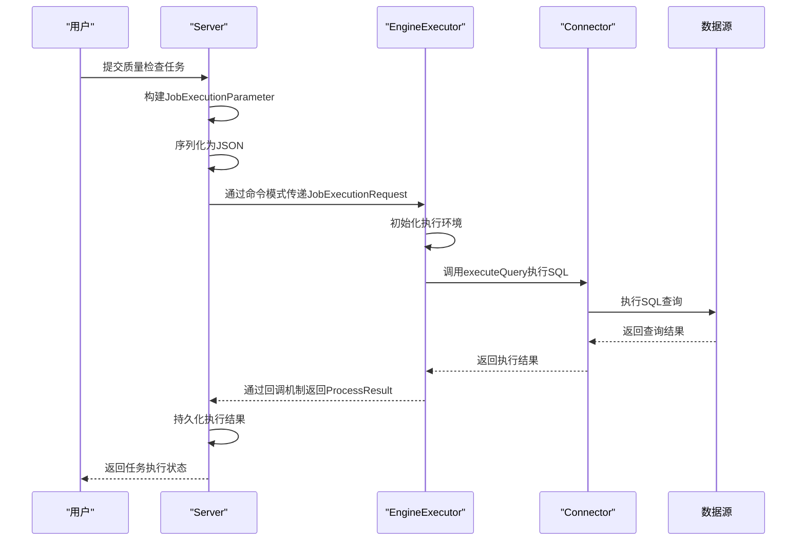
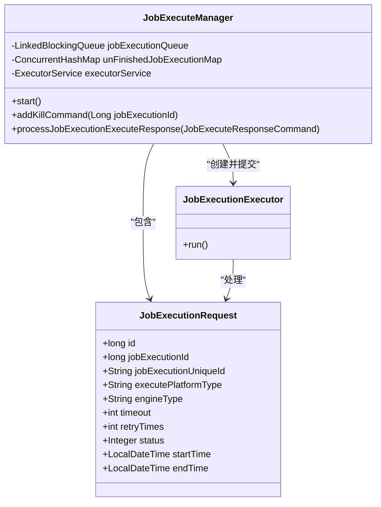
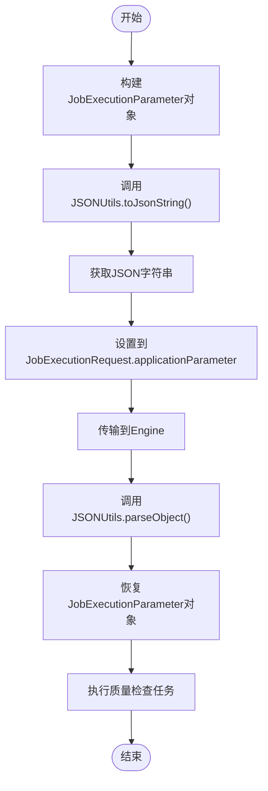
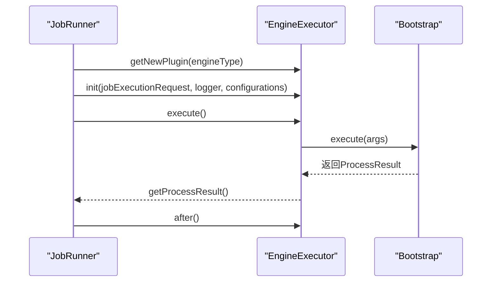
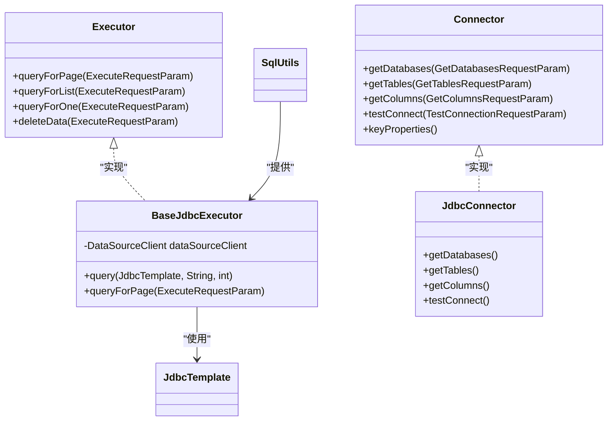
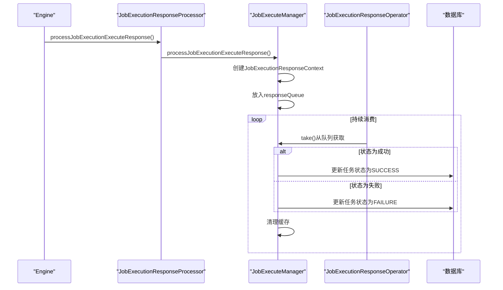

# 组件交互模式

<cite>
**本文档引用的文件**   
- [JobExecutionParameter.java](file://datavines-common/src/main/java/io/datavines/common/entity/JobExecutionParameter.java)
- [EngineExecutor.java](file://datavines-engine/datavines-engine-api/src/main/java/io/datavines/engine/api/engine/EngineExecutor.java)
- [Connector.java](file://datavines-connector/datavines-connector-api/src/main/java/io/datavines/connector/api/Connector.java)
- [JobExecutionRequest.java](file://datavines-common/src/main/java/io/datavines/common/entity/JobExecutionRequest.java)
- [DataVinesServer.java](file://datavines-server/src/main/java/io/datavines/server/DataVinesServer.java)
- [LocalEngineExecutor.java](file://datavines-engine/datavines-engine-plugins/datavines-engine-local/datavines-engine-local-executor/src/main/java/io/datavines/engine/local/executor/LocalEngineExecutor.java)
- [JobRunner.java](file://datavines-server/src/main/java/io/datavines/server/dqc/executor/runner/JobRunner.java)
- [AbstractEngineExecutor.java](file://datavines-engine/datavines-engine-executor/src/main/java/io/datavines/engine/executor/core/base/AbstractEngineExecutor.java)
- [BaseJdbcExecutor.java](file://datavines-connector/datavines-connector-plugins/datavines-connector-jdbc/src/main/java/io/datavines/connector/plugin/BaseJdbcExecutor.java)
- [JSONUtils.java](file://datavines-common/src/main/java/io/datavines/common/utils/JSONUtils.java)
- [DataQualityJobParameterBuilder.java](file://datavines-server/src/main/java/io/datavines/server/dqc/coordinator/builder/DataQualityJobParameterBuilder.java)
- [JobExecuteManager.java](file://datavines-server/src/main/java/io/datavines/server/dqc/coordinator/cache/JobExecuteManager.java)
- [JobExecutionResponseContext.java](file://datavines-server/src/main/java/io/datavines/server/dqc/coordinator/cache/JobExecutionResponseContext.java)
- [JobExecutionResponseProcessor.java](file://datavines-server/src/main/java/io/datavines/server/dqc/coordinator/cache/JobExecutionResponseProcessor.java)
</cite>

## 目录
1. [引言](#引言)
2. [核心组件交互流程](#核心组件交互流程)
3. [命令模式与任务封装](#命令模式与任务封装)
4. [参数序列化协议](#参数序列化协议)
5. [引擎执行器调用链](#引擎执行器调用链)
6. [连接器数据源交互](#连接器数据源交互)
7. [异步回调与状态更新](#异步回调与状态更新)
8. [松耦合架构优势](#松耦合架构优势)
9. [结论](#结论)

## 引言

DataVines是一个数据质量监控系统，其核心架构采用松耦合的组件交互模式。当用户提交质量检查任务后，系统通过一系列精心设计的组件协作完成任务的执行与结果反馈。本文档深入分析从用户提交任务开始，Server如何通过命令模式将任务参数封装并传递给Engine执行器，Engine如何调用Connector进行数据源连接和SQL执行，以及结果如何通过回调机制返回Server进行持久化。重点解析基于JSON的参数序列化协议、RESTful API通信机制和异步任务状态更新流程。

## 核心组件交互流程

DataVines的核心交互流程始于用户提交质量检查任务。Server接收到任务后，首先通过`DataQualityJobParameterBuilder`构建`JobExecutionParameter`对象，该对象封装了任务所需的所有参数，包括数据源连接信息和质量检查指标参数。随后，Server将这些参数序列化为JSON格式，并通过`JobExecutionRequest`对象封装执行平台、引擎类型、超时策略等执行上下文信息。

**图示来源**
- [DataQualityJobParameterBuilder.java](file://datavines-server/src/main/java/io/datavines/server/dqc/coordinator/builder/DataQualityJobParameterBuilder.java)
- [JobExecutionRequest.java](file://datavines-common/src/main/java/io/datavines/common/entity/JobExecutionRequest.java)
- [EngineExecutor.java](file://datavines-engine/datavines-engine-api/src/main/java/io/datavines/engine/api/engine/EngineExecutor.java)
- [Connector.java](file://datavines-connector/datavines-connector-api/src/main/java/io/datavines/connector/api/Connector.java)

## 命令模式与任务封装

DataVines系统采用命令模式（Command Pattern）来封装和传递质量检查任务。`JobExecutionRequest`类作为命令对象，封装了任务执行所需的所有信息，包括任务ID、执行平台类型、引擎类型、超时时间、重试次数等。这种设计模式将请求封装为对象，使得可以用不同的请求对客户进行参数化。

Server通过`JobExecuteManager`管理任务队列，将`JobExecutionRequest`放入`jobExecutionQueue`中等待处理。`JobExecutionExecutor`作为命令执行者，从队列中取出命令并执行。这种解耦设计使得请求的发送者（Server）和接收者（EngineExecutor）之间无需直接耦合，提高了系统的灵活性和可扩展性。

**图示来源**
- [JobExecutionRequest.java](file://datavines-common/src/main/java/io/datavines/common/entity/JobExecutionRequest.java)
- [JobExecuteManager.java](file://datavines-server/src/main/java/io/datavines/server/dqc/coordinator/cache/JobExecuteManager.java)

## 参数序列化协议

DataVines系统采用JSON作为参数序列化协议，实现了跨平台、跨语言的数据交换。`JSONUtils`工具类提供了完整的JSON序列化和反序列化功能，支持对象到JSON字符串的转换、JSON字符串到对象的解析、JSON数组和映射的处理等。

`JobExecutionParameter`对象通过`JSONUtils.toJsonString()`方法序列化为JSON字符串，然后作为`applicationParameter`字段嵌入到`JobExecutionRequest`中。在Engine端，通过`JSONUtils.parseObject()`方法将JSON字符串反序列化为`JobExecutionParameter`对象，从而恢复完整的任务参数。

**图示来源**
- [JobExecutionParameter.java](file://datavines-common/src/main/java/io/datavines/common/entity/JobExecutionParameter.java)
- [JSONUtils.java](file://datavines-common/src/main/java/io/datavines/common/utils/JSONUtils.java)

## 引擎执行器调用链

Engine执行器的调用链遵循标准的执行生命周期：初始化（init）、执行（execute）、后续处理（after）和取消（cancel）。`EngineExecutor`接口定义了这一生命周期，所有具体的执行器实现都必须遵循此契约。

当`JobRunner`接收到`JobExecutionRequest`后，通过SPI机制加载对应的`EngineExecutor`实现。调用链从`init()`方法开始，设置执行上下文；然后调用`execute()`方法执行实际的任务；任务完成后调用`after()`方法进行清理；如果任务被取消，则调用`cancel()`方法。

**图示来源**
- [EngineExecutor.java](file://datavines-engine/datavines-engine-api/src/main/java/io/datavines/engine/api/engine/EngineExecutor.java)
- [JobRunner.java](file://datavines-server/src/main/java/io/datavines/server/dqc/executor/runner/JobRunner.java)
- [LocalEngineExecutor.java](file://datavines-engine/datavines-engine-plugins/datavines-engine-local/datavines-engine-local-executor/src/main/java/io/datavines/engine/local/executor/LocalEngineExecutor.java)

## 连接器数据源交互

Connector组件负责与各种数据源进行交互，实现了统一的数据访问接口。`Connector`接口定义了获取数据库、表、列等元数据的方法，以及执行SQL查询的核心功能。`Executor`接口则专门负责SQL执行，通过`queryForPage`、`queryForList`等方法提供分页查询和列表查询功能。

`BaseJdbcExecutor`作为JDBC连接器的基类，实现了通用的SQL执行逻辑。它通过`JdbcTemplate`与数据库交互，使用`SqlUtils.query()`方法执行SQL并返回带有列信息的结果集。这种设计使得不同数据库的连接器可以共享大部分代码，只需实现特定的方言和配置即可。

**图示来源**
- [Connector.java](file://datavines-connector/datavines-connector-api/src/main/java/io/datavines/connector/api/Connector.java)
- [Executor.java](file://datavines-connector/datavines-connector-api/src/main/java/io/datavines/connector/api/Executor.java)
- [BaseJdbcExecutor.java](file://datavines-connector/datavines-connector-plugins/datavines-connector-jdbc/src/main/java/io/datavines/connector/plugin/BaseJdbcExecutor.java)

## 异步回调与状态更新

DataVines系统采用异步回调机制处理任务执行结果，实现了非阻塞的任务处理流程。`JobExecutionResponseProcessor`作为回调处理器，接收来自Engine的执行结果，并通过`JobExecuteManager`更新任务状态。

当Engine完成任务执行后，会创建`JobExecuteResponseCommand`对象，包含任务ID、状态码、结束时间等信息。该命令被放入`responseQueue`队列中，由`JobExecutionResponseOperator`线程消费。操作符根据命令类型更新数据库中的任务状态，并清理相关缓存。

**图示来源**
- [JobExecutionResponseProcessor.java](file://datavines-server/src/main/java/io/datavines/server/dqc/coordinator/cache/JobExecutionResponseProcessor.java)
- [JobExecuteManager.java](file://datavines-server/src/main/java/io/datavines/server/dqc/coordinator/cache/JobExecuteManager.java)
- [JobExecutionResponseContext.java](file://datavines-server/src/main/java/io/datavines/server/dqc/coordinator/cache/JobExecutionResponseContext.java)

## 松耦合架构优势

DataVines的松耦合交互模式带来了显著的扩展性和容错性优势。通过命令模式和JSON序列化协议，Server与Engine之间实现了完全的解耦，使得可以独立开发和部署不同版本的组件。SPI机制允许动态加载执行器和连接器，无需修改核心代码即可支持新的计算引擎和数据源。

异步回调机制提高了系统的响应性和可靠性。即使某个任务执行失败，也不会阻塞其他任务的处理。`JobExecuteManager`中的超时定时器（`HashedWheelTimer`）能够自动处理长时间运行的任务，防止资源泄漏。任务状态的持久化确保了系统重启后能够恢复执行上下文，提高了系统的容错能力。

此外，基于接口的编程和依赖注入使得组件易于测试和替换。`EngineExecutor`和`Connector`的接口定义了清晰的契约，任何符合契约的实现都可以无缝集成到系统中。这种设计模式为系统的长期演进和维护提供了坚实的基础。

## 结论

DataVines通过精心设计的组件交互模式，实现了高效、可靠的数据质量检查功能。从用户提交任务开始，系统通过命令模式封装任务参数，利用JSON协议进行序列化，通过Engine执行器调用链执行任务，借助Connector与数据源交互，并通过异步回调机制更新任务状态。这种松耦合架构不仅提高了系统的扩展性和容错性，还为未来的功能演进提供了灵活的基础。深入理解这一交互模式，对于优化系统性能、排查问题和开发新功能都具有重要意义。