# Connector组件

<cite>
**本文档中引用的文件**
- [Connector.java](file://datavines-connector/datavines-connector-api/src/main/java/io/datavines/connector/api/Connector.java)
- [ConnectorFactory.java](file://datavines-connector/datavines-connector-api/src/main/java/io/datavines/connector/api/ConnectorFactory.java)
- [Dialect.java](file://datavines-connector/datavines-connector-api/src/main/java/io/datavines/connector/api/Dialect.java)
- [Executor.java](file://datavines-connector/datavines-connector-api/src/main/java/io/datavines/connector/api/Executor.java)
- [DataSourceClient.java](file://datavines-connector/datavines-connector-api/src/main/java/io/datavines/connector/api/DataSourceClient.java)
- [JdbcConnector.java](file://datavines-connector/datavines-connector-plugins/datavines-connector-jdbc/src/main/java/io/datavines/connector/plugin/JdbcConnector.java)
- [BaseJdbcExecutor.java](file://datavines-connector/datavines-connector-plugins/datavines-connector-jdbc/src/main/java/io/datavines/connector/plugin/BaseJdbcExecutor.java)
- [JdbcDataSourceClient.java](file://datavines-connector/datavines-connector-plugins/datavines-connector-jdbc/src/main/java/io/datavines/connector/plugin/JdbcDataSourceClient.java)
- [JdbcDialect.java](file://datavines-connector/datavines-connector-plugins/datavines-connector-jdbc/src/main/java/io/datavines/connector/plugin/JdbcDialect.java)
- [AbstractJdbcConnectorFactory.java](file://datavines-connector/datavines-connector-plugins/datavines-connector-jdbc/src/main/java/io/datavines/connector/plugin/AbstractJdbcConnectorFactory.java)
- [MysqlConnectorFactory.java](file://datavines-connector/datavines-connector-plugins/datavines-connector-mysql/src/main/java/io/datavines/connector/plugin/MysqlConnectorFactory.java)
- [PostgreSqlConnectorFactory.java](file://datavines-connector/datavines-connector-plugins/datavines-connector-postgresql/src/main/java/io/datavines/connector/plugin/PostgreSqlConnectorFactory.java)
- [MysqlDialect.java](file://datavines-connector/datavines-connector-plugins/datavines-connector-mysql/src/main/java/io/datavines/connector/plugin/MysqlDialect.java)
- [PostgreSqlDialect.java](file://datavines-connector/datavines-connector-plugins/datavines-connector-postgresql/src/main/java/io/datavines/connector/plugin/PostgreSqlDialect.java)
</cite>

## 目录
1. [引言](#引言)
2. [插件化架构设计](#插件化架构设计)
3. [核心接口与职责](#核心接口与职责)
4. [JDBC通用连接实现](#jdbc通用连接实现)
5. [具体数据源插件实现](#具体数据源插件实现)
6. [SPI插件发现机制](#spi插件发现机制)
7. [连接池与连接管理](#连接池与连接管理)
8. [SQL执行与结果处理](#sql执行与结果处理)
9. [跨数据库方言兼容性](#跨数据库方言兼容性)
10. [安全与防护机制](#安全与防护机制)
11. [扩展新数据源连接器](#扩展新数据源连接器)
12. [总结](#总结)

## 引言

DataVines Connector组件采用插件化设计，为大数据质量监控系统提供了灵活、可扩展的数据源连接能力。该组件通过定义清晰的接口契约和SPI（Service Provider Interface）机制，实现了对20多种数据源的统一管理和动态加载。本文将深入剖析Connector组件的架构设计，重点分析其插件化机制、JDBC通用连接逻辑以及MySQL、PostgreSQL等具体数据源的实现方式。

## 插件化架构设计

DataVines Connector的插件化架构基于SPI机制构建，通过分层设计实现了功能解耦和灵活扩展。整个架构分为核心API层、JDBC通用实现层和具体数据源插件层。

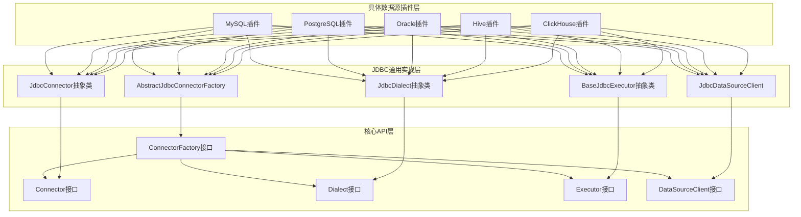

**图示来源**
- [ConnectorFactory.java](file://datavines-connector/datavines-connector-api/src/main/java/io/datavines/connector/api/ConnectorFactory.java)
- [JdbcConnector.java](file://datavines-connector/datavines-connector-plugins/datavines-connector-jdbc/src/main/java/io/datavines/connector/plugin/JdbcConnector.java)
- [BaseJdbcExecutor.java](file://datavines-connector/datavines-connector-plugins/datavines-connector-jdbc/src/main/java/io/datavines/connector/plugin/BaseJdbcExecutor.java)

**本节来源**
- [ConnectorFactory.java](file://datavines-connector/datavines-connector-api/src/main/java/io/datavines/connector/api/ConnectorFactory.java)
- [JdbcConnector.java](file://datavines-connector/datavines-connector-plugins/datavines-connector-jdbc/src/main/java/io/datavines/connector/plugin/JdbcConnector.java)

## 核心接口与职责

Connector组件定义了一系列核心接口，每个接口都有明确的职责划分，实现了关注点分离的设计原则。

### Connector接口

`Connector`接口是数据源连接器的核心接口，定义了数据源的基本操作能力：

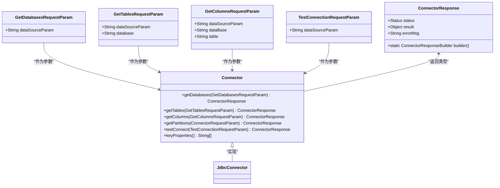

**图示来源**
- [Connector.java](file://datavines-connector/datavines-connector-api/src/main/java/io/datavines/connector/api/Connector.java)

**本节来源**
- [Connector.java](file://datavines-connector/datavines-connector-api/src/main/java/io/datavines/connector/api/Connector.java)

### ConnectorFactory接口

`ConnectorFactory`接口是插件工厂接口，通过SPI注解标记，用于创建和管理连接器实例：

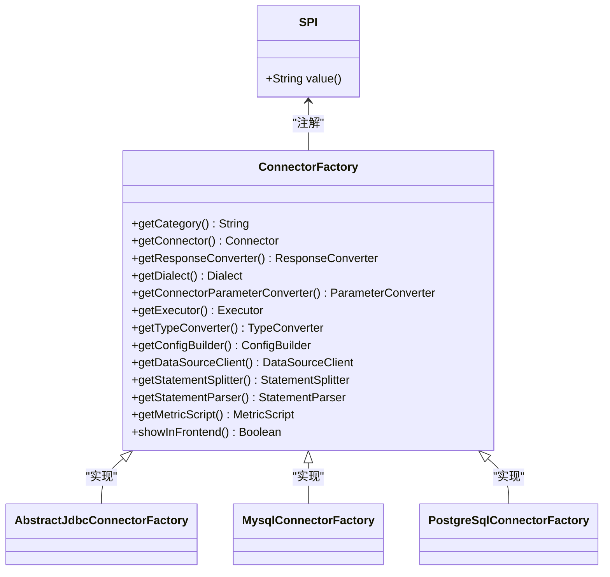

**图示来源**
- [ConnectorFactory.java](file://datavines-connector/datavines-connector-api/src/main/java/io/datavines/connector/api/ConnectorFactory.java)

**本节来源**
- [ConnectorFactory.java](file://datavines-connector/datavines-connector-api/src/main/java/io/datavines/connector/api/ConnectorFactory.java)

### Dialect接口

`Dialect`接口定义了数据库方言相关的操作，处理不同数据库的SQL语法差异：

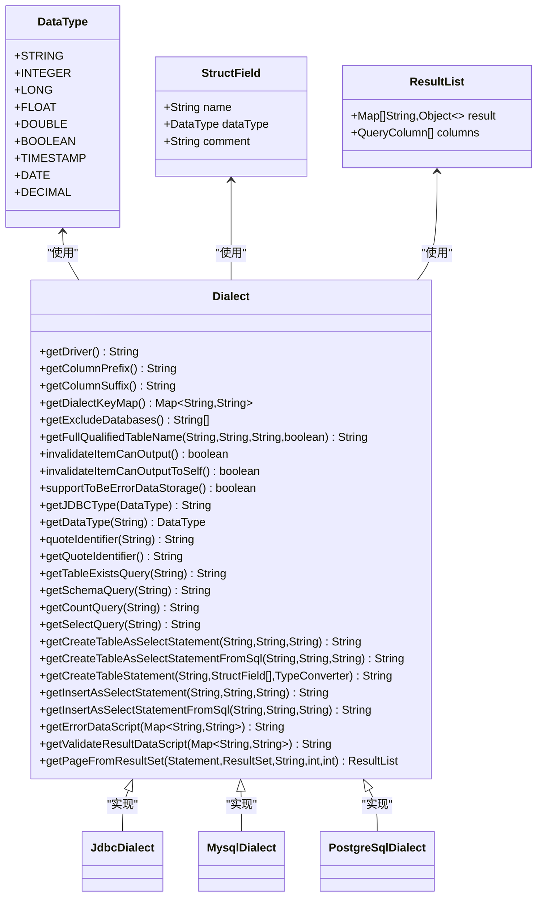

**图示来源**
- [Dialect.java](file://datavines-connector/datavines-connector-api/src/main/java/io/datavines/connector/api/Dialect.java)

**本节来源**
- [Dialect.java](file://datavines-connector/datavines-connector-api/src/main/java/io/datavines/connector/api/Dialect.java)

## JDBC通用连接实现

JDBC通用连接实现层提供了基于JDBC标准的通用连接逻辑，为各种支持JDBC的数据源提供了基础实现。

### JdbcConnector抽象类

`JdbcConnector`是所有JDBC数据源连接器的基类，实现了`Connector`接口的核心功能：

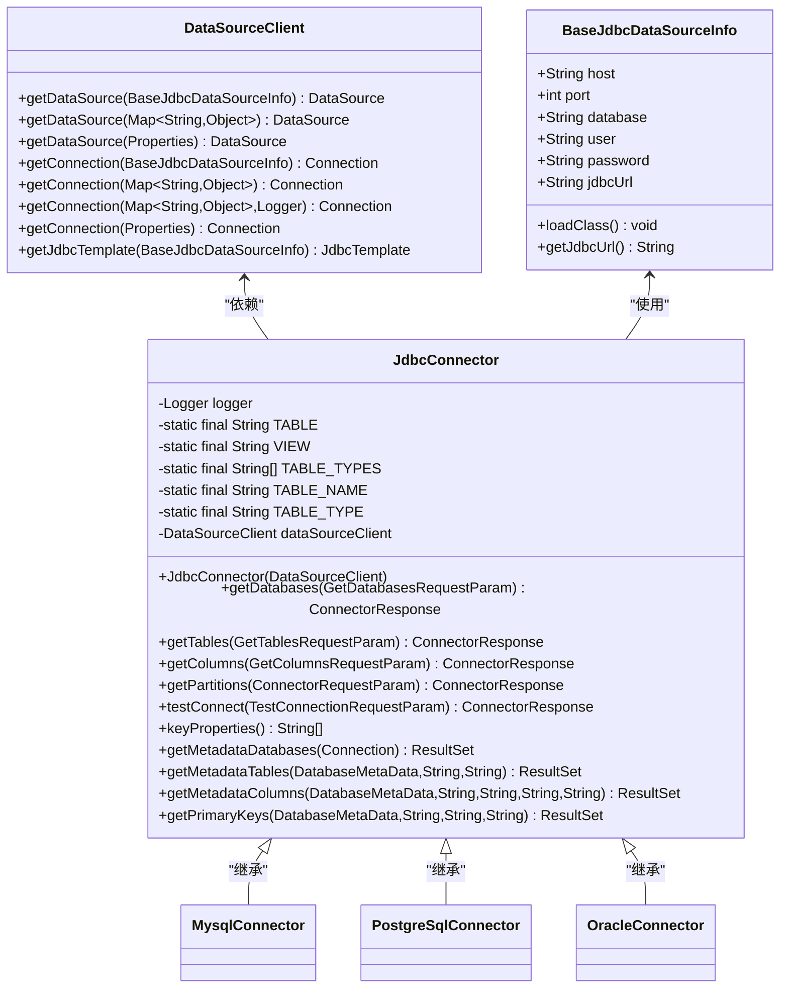

**图示来源**
- [JdbcConnector.java](file://datavines-connector/datavines-connector-plugins/datavines-connector-jdbc/src/main/java/io/datavines/connector/plugin/JdbcConnector.java)
- [DataSourceClient.java](file://datavines-connector/datavines-connector-api/src/main/java/io/datavines/connector/api/DataSourceClient.java)

**本节来源**
- [JdbcConnector.java](file://datavines-connector/datavines-connector-plugins/datavines-connector-jdbc/src/main/java/io/datavines/connector/plugin/JdbcConnector.java)

### BaseJdbcExecutor抽象类

`BaseJdbcExecutor`提供了JDBC执行器的通用实现，封装了SQL查询的通用逻辑：

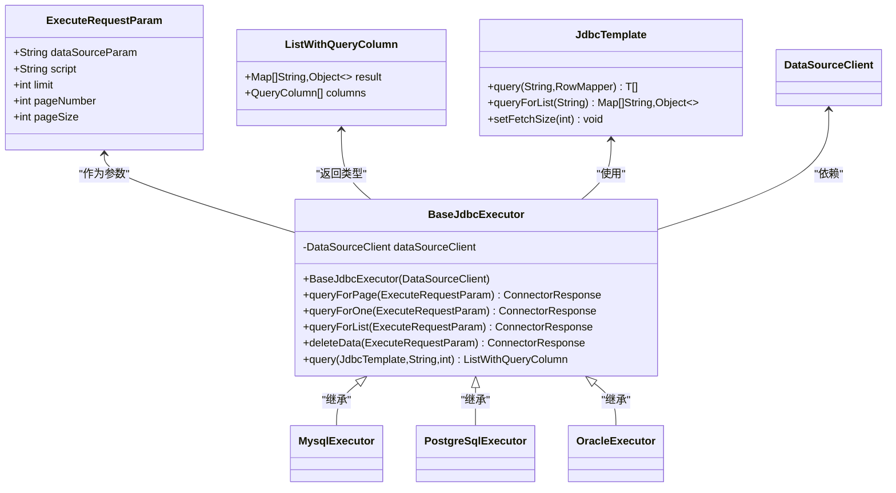

**图示来源**
- [BaseJdbcExecutor.java](file://datavines-connector/datavines-connector-plugins/datavines-connector-jdbc/src/main/java/io/datavines/connector/plugin/BaseJdbcExecutor.java)

**本节来源**
- [BaseJdbcExecutor.java](file://datavines-connector/datavines-connector-plugins/datavines-connector-jdbc/src/main/java/io/datavines/connector/plugin/BaseJdbcExecutor.java)

### JdbcDataSourceClient实现

`JdbcDataSourceClient`实现了`DataSourceClient`接口，负责数据源的创建和连接管理：

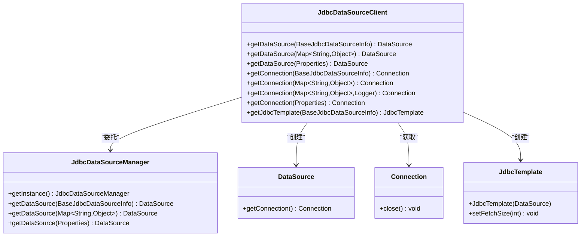

**图示来源**
- [JdbcDataSourceClient.java](file://datavines-connector/datavines-connector-plugins/datavines-connector-jdbc/src/main/java/io/datavines/connector/plugin/JdbcDataSourceClient.java)

**本节来源**
- [JdbcDataSourceClient.java](file://datavines-connector/datavines-connector-plugins/datavines-connector-jdbc/src/main/java/io/datavines/connector/plugin/JdbcDataSourceClient.java)

## 具体数据源插件实现

具体数据源插件通过继承JDBC通用实现层的基类，针对特定数据库进行定制化实现。

### MySQL插件实现

MySQL插件通过`MysqlConnectorFactory`工厂类创建，实现了MySQL特有的连接参数和SQL方言：

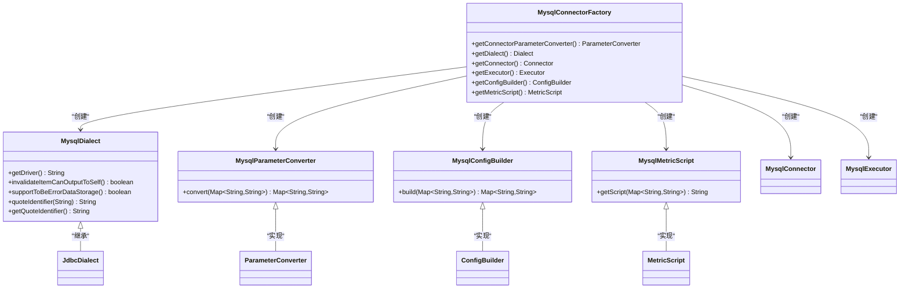

**图示来源**
- [MysqlConnectorFactory.java](file://datavines-connector/datavines-connector-plugins/datavines-connector-mysql/src/main/java/io/datavines/connector/plugin/MysqlConnectorFactory.java)
- [MysqlDialect.java](file://datavines-connector/datavines-connector-plugins/datavines-connector-mysql/src/main/java/io/datavines/connector/plugin/MysqlDialect.java)

**本节来源**
- [MysqlConnectorFactory.java](file://datavines-connector/datavines-connector-plugins/datavines-connector-mysql/src/main/java/io/datavines/connector/plugin/MysqlConnectorFactory.java)
- [MysqlDialect.java](file://datavines-connector/datavines-connector-plugins/datavines-connector-mysql/src/main/java/io/datavines/connector/plugin/MysqlDialect.java)

### PostgreSQL插件实现

PostgreSQL插件的实现与MySQL类似，但针对PostgreSQL的特性进行了定制：

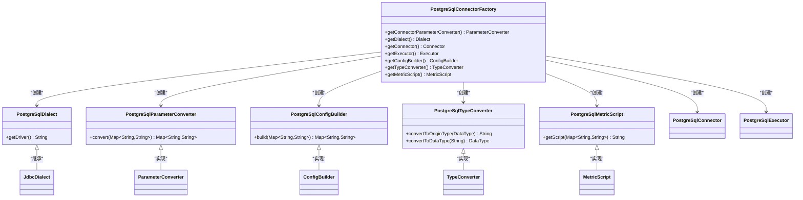

**图示来源**
- [PostgreSqlConnectorFactory.java](file://datavines-connector/datavines-connector-plugins/datavines-connector-postgresql/src/main/java/io/datavines/connector/plugin/PostgreSqlConnectorFactory.java)
- [PostgreSqlDialect.java](file://datavines-connector/datavines-connector-plugins/datavines-connector-postgresql/src/main/java/io/datavines/connector/plugin/PostgreSqlDialect.java)

**本节来源**
- [PostgreSqlConnectorFactory.java](file://datavines-connector/datavines-connector-plugins/datavines-connector-postgresql/src/main/java/io/datavines/connector/plugin/PostgreSqlConnectorFactory.java)
- [PostgreSqlDialect.java](file://datavines-connector/datavines-connector-plugins/datavines-connector-postgresql/src/main/java/io/datavines/connector/plugin/PostgreSqlDialect.java)

## SPI插件发现机制

DataVines Connector组件通过Java的SPI（Service Provider Interface）机制实现插件的动态发现和加载。

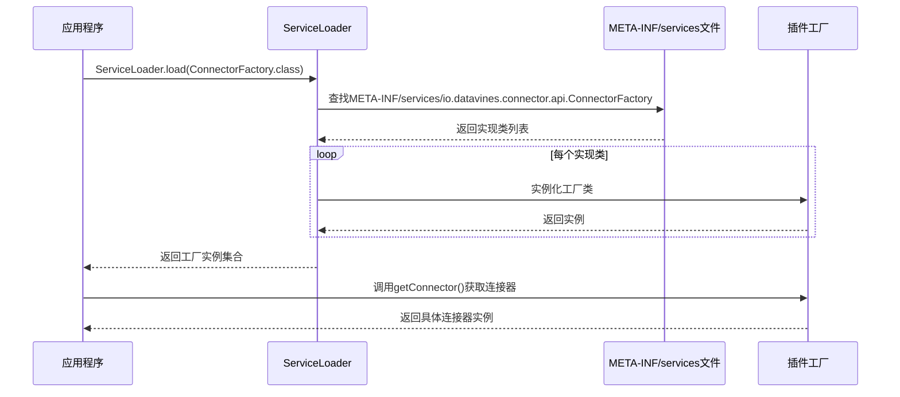

**图示来源**
- [ConnectorFactory.java](file://datavines-connector/datavines-connector-api/src/main/java/io/datavines/connector/api/ConnectorFactory.java)

**本节来源**
- [ConnectorFactory.java](file://datavines-connector/datavines-connector-api/src/main/java/io/datavines/connector/api/ConnectorFactory.java)

## 连接池与连接管理

Connector组件通过`JdbcDataSourceManager`实现连接池管理，确保连接的高效复用和资源释放。

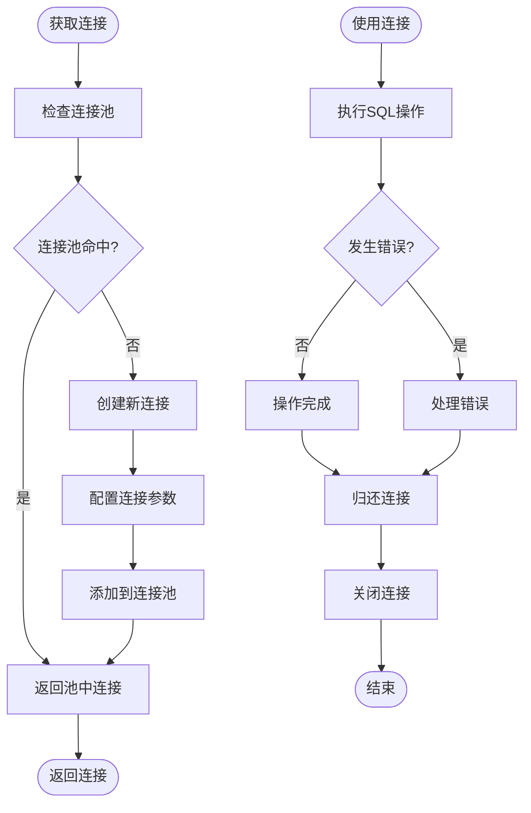

**图示来源**
- [JdbcDataSourceClient.java](file://datavines-connector/datavines-connector-plugins/datavines-connector-jdbc/src/main/java/io/datavines/connector/plugin/JdbcDataSourceClient.java)

**本节来源**
- [JdbcDataSourceClient.java](file://datavines-connector/datavines-connector-plugins/datavines-connector-jdbc/src/main/java/io/datavines/connector/plugin/JdbcDataSourceClient.java)

## SQL执行与结果处理

SQL执行和结果处理流程确保了查询的安全性和结果的正确性。

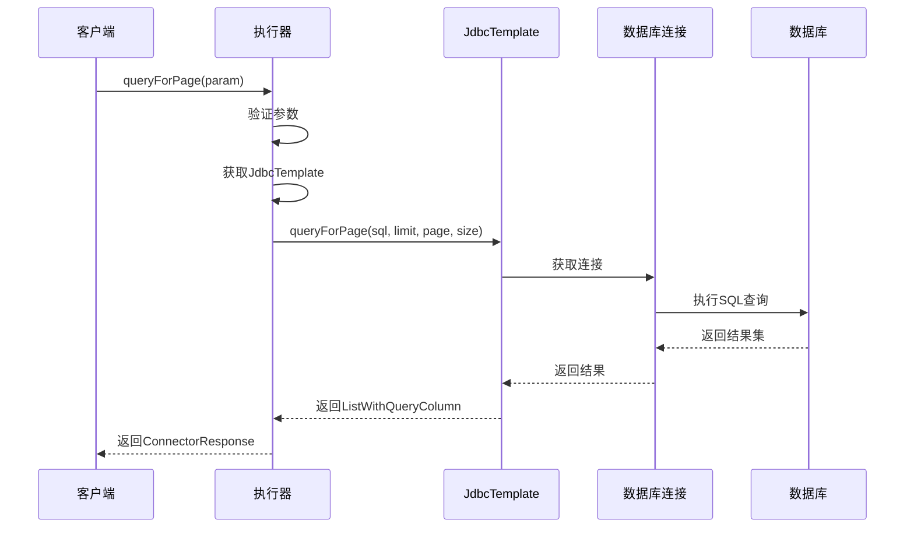

**图示来源**
- [BaseJdbcExecutor.java](file://datavines-connector/datavines-connector-plugins/datavines-connector-jdbc/src/main/java/io/datavines/connector/plugin/BaseJdbcExecutor.java)

**本节来源**
- [BaseJdbcExecutor.java](file://datavines-connector/datavines-connector-plugins/datavines-connector-jdbc/src/main/java/io/datavines/connector/plugin/BaseJdbcExecutor.java)

## 跨数据库方言兼容性

通过`Dialect`接口的分层实现，Connector组件实现了对不同数据库方言的兼容性处理。

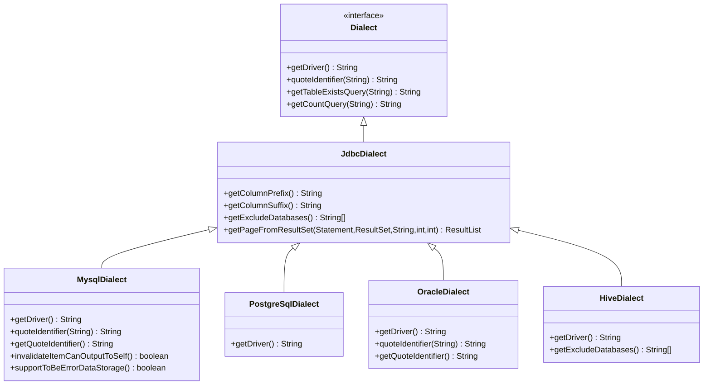

**图示来源**
- [Dialect.java](file://datavines-connector/datavines-connector-api/src/main/java/io/datavines/connector/api/Dialect.java)
- [JdbcDialect.java](file://datavines-connector/datavines-connector-plugins/datavines-connector-jdbc/src/main/java/io/datavines/connector/plugin/JdbcDialect.java)

**本节来源**
- [Dialect.java](file://datavines-connector/datavines-connector-api/src/main/java/io/datavines/connector/api/Dialect.java)
- [JdbcDialect.java](file://datavines-connector/datavines-connector-plugins/datavines-connector-jdbc/src/main/java/io/datavines/connector/plugin/JdbcDialect.java)

## 安全与防护机制

Connector组件实现了多种安全机制，包括SQL注入防护和连接参数加密。

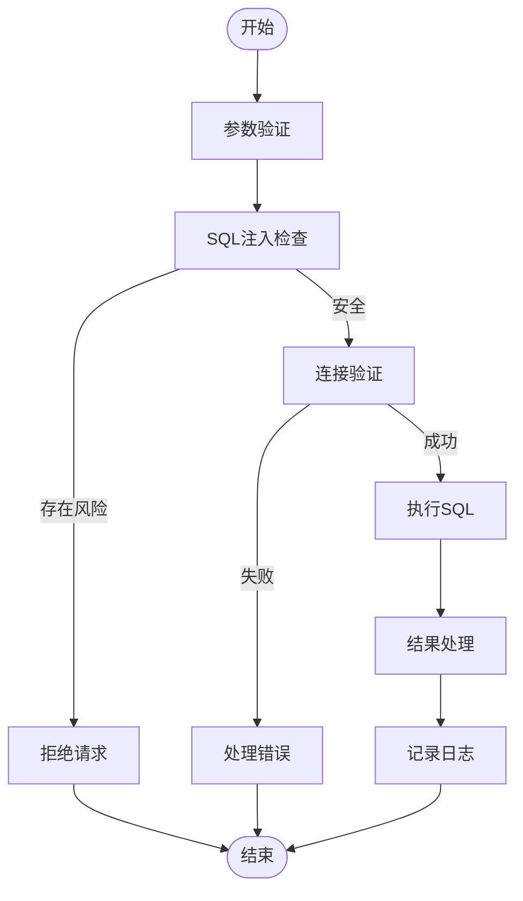

**图示来源**
- [JdbcConnector.java](file://datavines-connector/datavines-connector-plugins/datavines-connector-jdbc/src/main/java/io/datavines/connector/plugin/JdbcConnector.java)

**本节来源**
- [JdbcConnector.java](file://datavines-connector/datavines-connector-plugins/datavines-connector-jdbc/src/main/java/io/datavines/connector/plugin/JdbcConnector.java)

## 扩展新数据源连接器

扩展新的数据源连接器需要遵循特定的实现模式，通过继承和实现相关接口来完成。

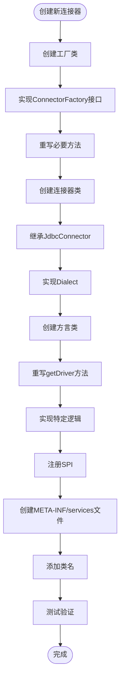

**图示来源**
- [AbstractJdbcConnectorFactory.java](file://datavines-connector/datavines-connector-plugins/datavines-connector-jdbc/src/main/java/io/datavines/connector/plugin/AbstractJdbcConnectorFactory.java)

**本节来源**
- [AbstractJdbcConnectorFactory.java](file://datavines-connector/datavines-connector-plugins/datavines-connector-jdbc/src/main/java/io/datavines/connector/plugin/AbstractJdbcConnectorFactory.java)

## 总结

DataVines Connector组件通过精心设计的插件化架构，实现了对多种数据源的统一管理和灵活扩展。其核心设计特点包括：

1. **清晰的接口分层**：通过`Connector`、`Dialect`、`Executor`等接口的分离，实现了关注点的解耦。
2. **通用JDBC实现**：提供了`JdbcConnector`和`BaseJdbcExecutor`等基类，为支持JDBC的数据源提供了通用实现。
3. **SPI插件机制**：利用Java SPI机制实现了插件的动态发现和加载，支持20多种数据源的扩展。
4. **方言兼容性**：通过`Dialect`接口的分层实现，处理了不同数据库的SQL语法差异。
5. **连接池管理**：通过`JdbcDataSourceManager`实现了连接的高效复用和资源管理。
6. **安全防护**：实现了SQL注入防护和连接参数加密等安全机制。

这种设计使得DataVines能够灵活地支持各种数据源，同时保持了代码的可维护性和扩展性，为大数据质量监控提供了坚实的基础。