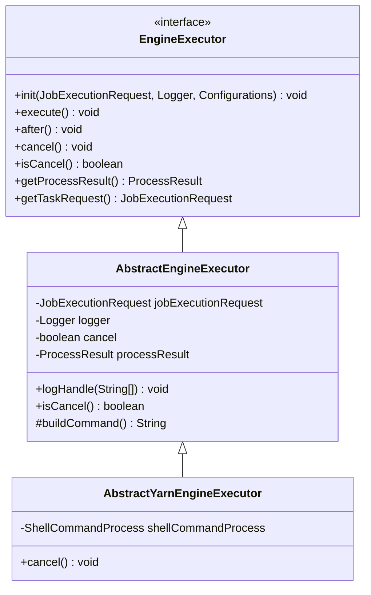
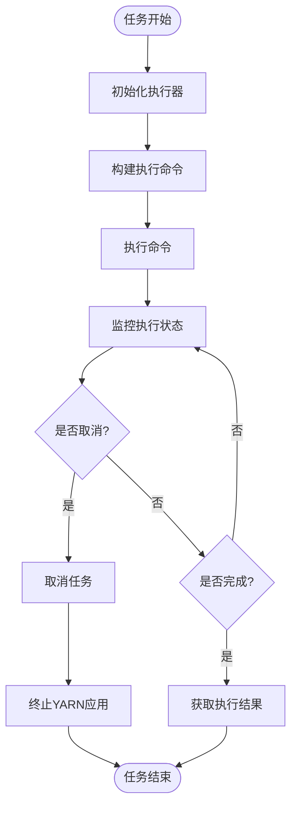
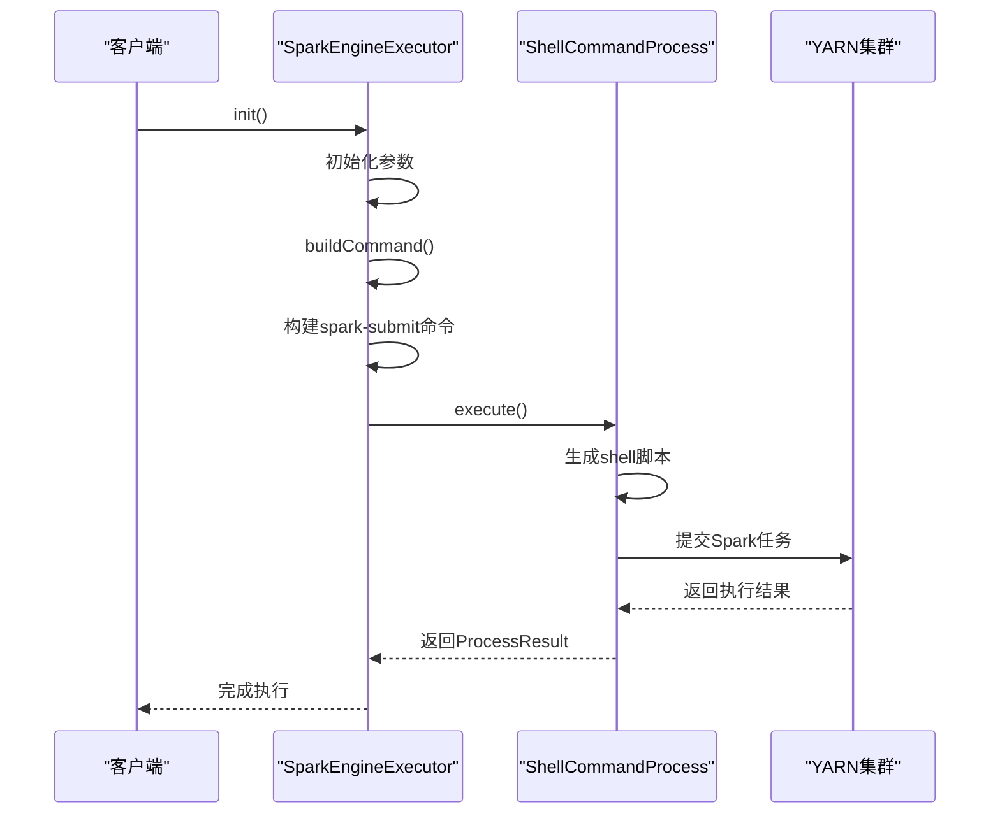
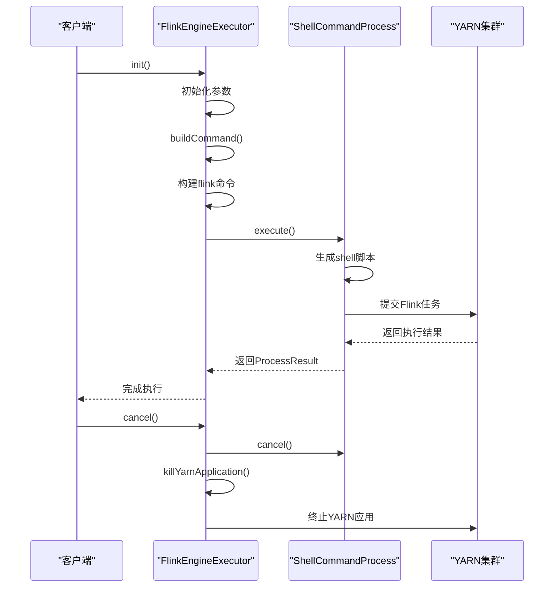
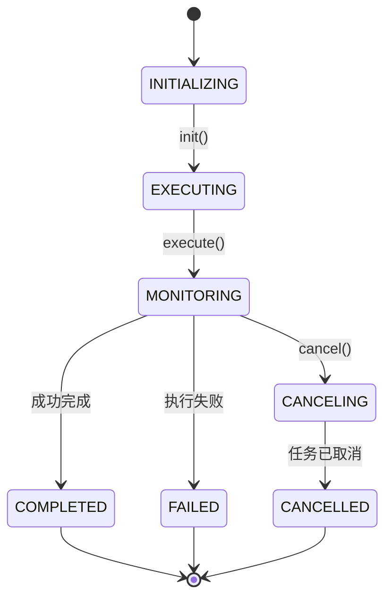
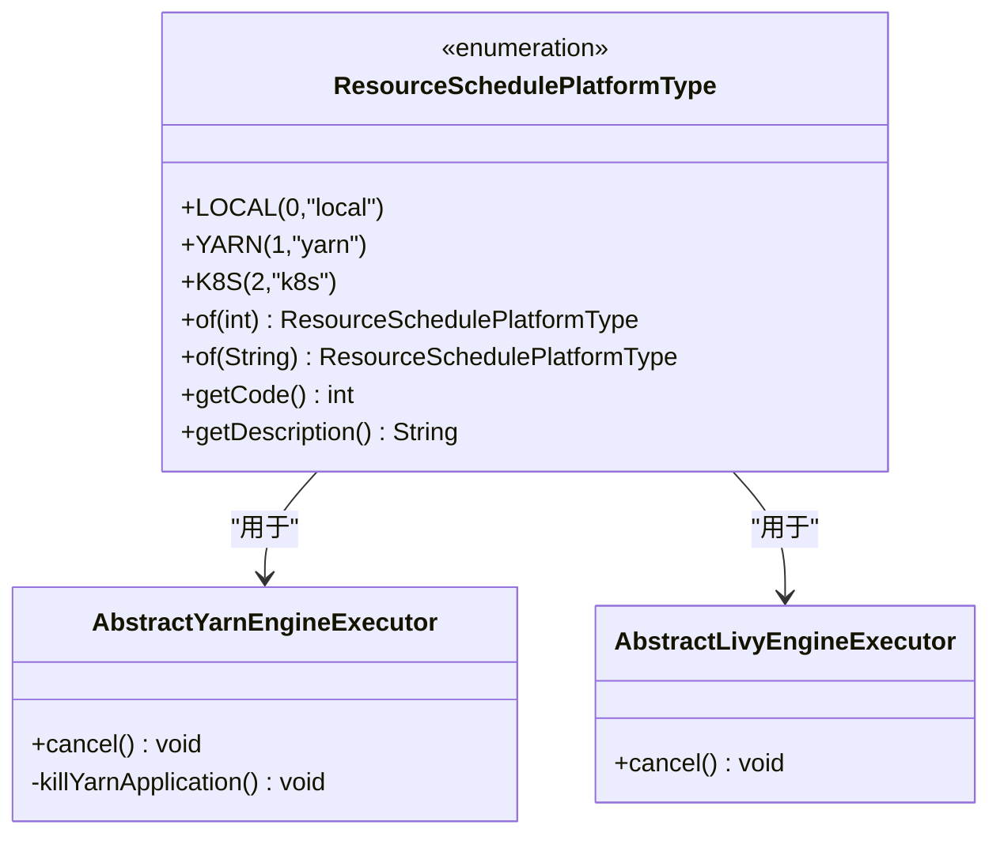

# Engine组件

<cite>
**本文档中引用的文件**  
- [EngineExecutor.java](file://datavines-engine/datavines-engine-api/src/main/java/io/datavines/engine/api/engine/EngineExecutor.java)
- [AbstractEngineExecutor.java](file://datavines-engine/datavines-engine-executor/src/main/java/io/datavines/engine/executor/core/base/AbstractEngineExecutor.java)
- [AbstractYarnEngineExecutor.java](file://datavines-engine/datavines-engine-executor/src/main/java/io/datavines/engine/executor/core/base/AbstractYarnEngineExecutor.java)
- [SparkEngineExecutor.java](file://datavines-engine/datavines-engine-plugins/datavines-engine-spark/datavines-engine-spark-executor/src/main/java/io/datavines/engine/spark/executor/SparkEngineExecutor.java)
- [FlinkEngineExecutor.java](file://datavines-engine/datavines-engine-plugins/datavines-engine-flink/datavines-engine-flink-executor/src/main/java/io/datavines/engine/flink/executor/FlinkEngineExecutor.java)
- [SparkParameters.java](file://datavines-engine/datavines-engine-plugins/datavines-engine-spark/datavines-engine-spark-executor/src/main/java/io/datavines/engine/spark/executor/parameter/SparkParameters.java)
- [FlinkParameters.java](file://datavines-engine/datavines-engine-plugins/datavines-engine-flink/datavines-engine-flink-executor/src/main/java/io/datavines/engine/flink/executor/parameter/FlinkParameters.java)
- [SparkArgsUtils.java](file://datavines-engine/datavines-engine-plugins/datavines-engine-spark/datavines-engine-spark-executor/src/main/java/io/datavines/engine/spark/executor/parameter/SparkArgsUtils.java)
- [FlinkArgsUtils.java](file://datavines-engine/datavines-engine-plugins/datavines-engine-flink/datavines-engine-flink-executor/src/main/java/io/datavines/engine/flink/executor/parameter/FlinkArgsUtils.java)
- [ShellCommandProcess.java](file://datavines-engine/datavines-engine-executor/src/main/java/io/datavines/engine/executor/core/executor/ShellCommandProcess.java)
- [ResourceSchedulePlatformType.java](file://datavines-engine/datavines-engine-executor/src/main/java/io/datavines/engine/executor/core/enums/ResourceSchedulePlatformType.java)
- [SparkEngineParameter.java](file://datavines-common/src/main/java/io/datavines/common/entity/SparkEngineParameter.java)
</cite>

## 目录
1. [引言](#引言)
2. [执行引擎抽象机制](#执行引擎抽象机制)
3. [核心执行流程](#核心执行流程)
4. [Spark执行器实现](#spark执行器实现)
5. [Flink执行器实现](#flink执行器实现)
6. [任务生命周期管理](#任务生命周期管理)
7. [执行参数配置](#执行参数配置)
8. [资源调度平台适配](#资源调度平台适配)
9. [性能特征与适用场景](#性能特征与适用场景)

## 引言

DataVines Engine组件提供了统一的执行引擎抽象机制，用于支持多种计算引擎（如Spark和Flink）的数据质量检测任务执行。该组件通过接口抽象和模板方法模式，实现了对不同计算引擎的统一管理和调度，同时支持多种资源调度平台（如Yarn、Livy）的适配。本文档将深入解析Engine组件的执行引擎抽象机制与任务执行流程。

## 执行引擎抽象机制

DataVines Engine组件通过`EngineExecutor`接口定义了执行引擎的统一契约，所有具体的执行器实现都必须遵循这一接口规范。该接口采用SPI（Service Provider Interface）机制进行扩展，允许动态加载不同类型的执行器。

**图源**  
- [EngineExecutor.java](file://datavines-engine/datavines-engine-api/src/main/java/io/datavines/engine/api/engine/EngineExecutor.java#L27-L42)
- [AbstractEngineExecutor.java](file://datavines-engine/datavines-engine-executor/src/main/java/io/datavines/engine/executor/core/base/AbstractEngineExecutor.java#L27-L56)
- [AbstractYarnEngineExecutor.java](file://datavines-engine/datavines-engine-executor/src/main/java/io/datavines/engine/executor/core/base/AbstractYarnEngineExecutor.java#L25-L60)

**本节来源**  
- [EngineExecutor.java](file://datavines-engine/datavines-engine-api/src/main/java/io/datavines/engine/api/engine/EngineExecutor.java#L27-L42)
- [AbstractEngineExecutor.java](file://datavines-engine/datavines-engine-executor/src/main/java/io/datavines/engine/executor/core/base/AbstractEngineExecutor.java#L27-L56)

## 核心执行流程

DataVines Engine组件的任务执行流程遵循标准的初始化-执行-清理生命周期模式。执行流程从`init`方法开始，经过`execute`方法执行核心逻辑，最后通过`after`方法进行资源清理。

**图源**  
- [AbstractEngineExecutor.java](file://datavines-engine/datavines-engine-executor/src/main/java/io/datavines/engine/executor/core/base/AbstractEngineExecutor.java#L27-L56)
- [AbstractYarnEngineExecutor.java](file://datavines-engine/datavines-engine-executor/src/main/java/io/datavines/engine/executor/core/base/AbstractYarnEngineExecutor.java#L25-L60)

**本节来源**  
- [AbstractEngineExecutor.java](file://datavines-engine/datavines-engine-executor/src/main/java/io/datavines/engine/executor/core/base/AbstractEngineExecutor.java#L27-L56)
- [AbstractYarnEngineExecutor.java](file://datavines-engine/datavines-engine-executor/src/main/java/io/datavines/engine/executor/core/base/AbstractYarnEngineExecutor.java#L25-L60)

## Spark执行器实现

Spark执行器通过`SparkEngineExecutor`类实现，继承自`AbstractYarnEngineExecutor`，专门用于提交Spark任务到YARN集群。该实现通过构建`spark-submit`命令来启动Spark应用程序。

**图源**  
- [SparkEngineExecutor.java](file://datavines-engine/datavines-engine-plugins/datavines-engine-spark/datavines-engine-spark-executor/src/main/java/io/datavines/engine/spark/executor/SparkEngineExecutor.java#L41-L152)
- [SparkArgsUtils.java](file://datavines-engine/datavines-engine-plugins/datavines-engine-spark/datavines-engine-spark-executor/src/main/java/io/datavines/engine/spark/executor/parameter/SparkArgsUtils.java#L25-L130)

**本节来源**  
- [SparkEngineExecutor.java](file://datavines-engine/datavines-engine-plugins/datavines-engine-spark/datavines-engine-spark-executor/src/main/java/io/datavines/engine/spark/executor/SparkEngineExecutor.java#L41-L152)
- [SparkArgsUtils.java](file://datavines-engine/datavines-engine-plugins/datavines-engine-spark/datavines-engine-spark-executor/src/main/java/io/datavines/engine/spark/executor/parameter/SparkArgsUtils.java#L25-L130)

## Flink执行器实现

Flink执行器通过`FlinkEngineExecutor`类实现，同样继承自`AbstractYarnEngineExecutor`，用于提交Flink任务到YARN集群。与Spark执行器类似，它通过构建`flink`命令来启动Flink作业。

**图源**  
- [FlinkEngineExecutor.java](file://datavines-engine/datavines-engine-plugins/datavines-engine-flink/datavines-engine-flink-executor/src/main/java/io/datavines/engine/flink/executor/FlinkEngineExecutor.java#L38-L182)
- [FlinkArgsUtils.java](file://datavines-engine/datavines-engine-plugins/datavines-engine-flink/datavines-engine-flink-executor/src/main/java/io/datavines/engine/flink/executor/parameter/FlinkArgsUtils.java#L24-L124)

**本节来源**  
- [FlinkEngineExecutor.java](file://datavines-engine/datavines-engine-plugins/datavines-engine-flink/datavines-engine-flink-executor/src/main/java/io/datavines/engine/flink/executor/FlinkEngineExecutor.java#L38-L182)
- [FlinkArgsUtils.java](file://datavines-engine/datavines-engine-plugins/datavines-engine-flink/datavines-engine-flink-executor/src/main/java/io/datavines/engine/flink/executor/parameter/FlinkArgsUtils.java#L24-L124)

## 任务生命周期管理

DataVines Engine组件对任务的完整生命周期进行了精细化管理，包括任务的提交、状态监控、结果获取和取消操作。每个任务都有唯一的执行ID，用于在YARN等资源调度平台上进行跟踪。

**图源**  
- [EngineExecutor.java](file://datavines-engine/datavines-engine-api/src/main/java/io/datavines/engine/api/engine/EngineExecutor.java#L27-L42)
- [AbstractEngineExecutor.java](file://datavines-engine/datavines-engine-executor/src/main/java/io/datavines/engine/executor/core/base/AbstractEngineExecutor.java#L27-L56)

**本节来源**  
- [EngineExecutor.java](file://datavines-engine/datavines-engine-api/src/main/java/io/datavines/engine/api/engine/EngineExecutor.java#L27-L42)
- [AbstractEngineExecutor.java](file://datavines-engine/datavines-engine-executor/src/main/java/io/datavines/engine/executor/core/base/AbstractEngineExecutor.java#L27-L56)

## 执行参数配置

DataVines Engine组件支持灵活的执行参数配置，允许用户为不同的计算引擎指定特定的执行参数。这些参数通过JSON格式传递，并在执行器初始化时解析。

### Spark执行参数

Spark执行参数通过`SparkParameters`类定义，包含以下主要配置项：

| 参数名称 | 描述 | 示例值 |
|--------|------|-------|
| mainJar | 主JAR包路径 | /path/to/data-quality.jar |
| mainClass | 主类名称 | io.datavines.engine.spark.core.SparkDataVinesBootstrap |
| deployMode | 部署模式 | cluster |
| driverCores | Driver核心数 | 1 |
| driverMemory | Driver内存 | 1g |
| numExecutors | Executor数量 | 2 |
| executorCores | 每个Executor核心数 | 2 |
| executorMemory | 每个Executor内存 | 2g |
| appName | 应用名称 | data-quality-job |
| queue | YARN队列 | default |
| others | 其他参数 | --conf spark.yarn.tags=job123 |

**本节来源**  
- [SparkParameters.java](file://datavines-engine/datavines-engine-plugins/datavines-engine-spark/datavines-engine-spark-executor/src/main/java/io/datavines/engine/spark/executor/parameter/SparkParameters.java#L19-L219)
- [SparkEngineParameter.java](file://datavines-common/src/main/java/io/datavines/common/entity/SparkEngineParameter.java#L26-L68)

### Flink执行参数

Flink执行参数通过`FlinkParameters`类定义，包含以下主要配置项：

| 参数名称 | 描述 | 示例值 |
|--------|------|-------|
| mainJar | 主JAR包路径 | /path/to/data-quality-flink.jar |
| mainClass | 主类名称 | io.datavines.engine.flink.core.FlinkDataVinesBootstrap |
| deployMode | 部署模式 | yarn-per-job |
| taskManagerCount | TaskManager数量 | 2 |
| taskManagerMemory | TaskManager内存 | 2g |
| jobManagerMemory | JobManager内存 | 1g |
| parallelism | 并行度 | 4 |
| yarnQueue | YARN队列 | default |
| jobName | 作业名称 | flink-data-quality |
| flinkOthers | 其他Flink参数 | -Dexecution.checkpointing.interval=60000 |

**本节来源**  
- [FlinkParameters.java](file://datavines-engine/datavines-engine-plugins/datavines-engine-flink/datavines-engine-flink-executor/src/main/java/io/datavines/engine/flink/executor/parameter/FlinkParameters.java#L22-L49)

## 资源调度平台适配

DataVines Engine组件支持多种资源调度平台，通过`ResourceSchedulePlatformType`枚举定义了不同的调度平台类型。目前支持本地、YARN和K8S三种调度方式。

**图源**  
- [ResourceSchedulePlatformType.java](file://datavines-engine/datavines-engine-executor/src/main/java/io/datavines/engine/executor/core/enums/ResourceSchedulePlatformType.java#L19-L60)
- [AbstractYarnEngineExecutor.java](file://datavines-engine/datavines-engine-executor/src/main/java/io/datavines/engine/executor/core/base/AbstractYarnEngineExecutor.java#L25-L60)
- [AbstractLivyEngineExecutor.java](file://datavines-engine/datavines-engine-executor/src/main/java/io/datavines/engine/executor/core/base/AbstractLivyEngineExecutor.java#L23-L36)

**本节来源**  
- [ResourceSchedulePlatformType.java](file://datavines-engine/datavines-engine-executor/src/main/java/io/datavines/engine/executor/core/enums/ResourceSchedulePlatformType.java#L19-L60)
- [AbstractYarnEngineExecutor.java](file://datavines-engine/datavines-engine-executor/src/main/java/io/datavines/engine/executor/core/base/AbstractYarnEngineExecutor.java#L25-L60)

## 性能特征与适用场景

DataVines Engine组件针对不同的计算引擎和资源调度平台，展现出不同的性能特征和适用场景。

### Spark执行模式

Spark执行模式适用于批处理场景，特别是大规模数据质量检测任务。其性能特征包括：

- **启动时间**：相对较长，因为需要启动Driver和Executor进程
- **资源利用率**：高，能够充分利用集群资源进行并行处理
- **容错性**：强，支持RDD的容错机制
- **适用场景**：大规模数据集的批处理质量检测

### Flink执行模式

Flink执行模式适用于流处理和微批处理场景，其性能特征包括：

- **启动时间**：相对较短，特别是使用yarn-session模式时
- **延迟**：低，适合实时或近实时数据质量检测
- **资源利用率**：中等，需要持续运行JobManager和TaskManager
- **适用场景**：实时数据流的质量监控和检测

### 资源调度平台比较

| 调度平台 | 启动速度 | 资源隔离 | 管理复杂度 | 适用场景 |
|--------|--------|--------|--------|--------|
| 本地模式 | 快 | 低 | 低 | 开发测试 |
| YARN | 中等 | 高 | 中等 | 生产环境批处理 |
| K8S | 中等 | 高 | 高 | 云原生环境 |

**本节来源**  
- [SparkEngineExecutor.java](file://datavines-engine/datavines-engine-plugins/datavines-engine-spark/datavines-engine-spark-executor/src/main/java/io/datavines/engine/spark/executor/SparkEngineExecutor.java#L41-L152)
- [FlinkEngineExecutor.java](file://datavines-engine/datavines-engine-plugins/datavines-engine-flink/datavines-engine-flink-executor/src/main/java/io/datavines/engine/flink/executor/FlinkEngineExecutor.java#L38-L182)
- [ResourceSchedulePlatformType.java](file://datavines-engine/datavines-engine-executor/src/main/java/io/datavines/engine/executor/core/enums/ResourceSchedulePlatformType.java#L19-L60)