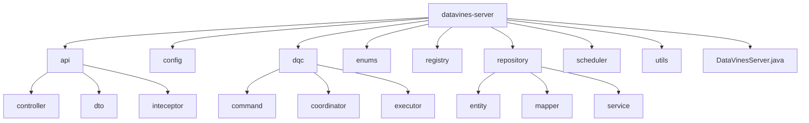
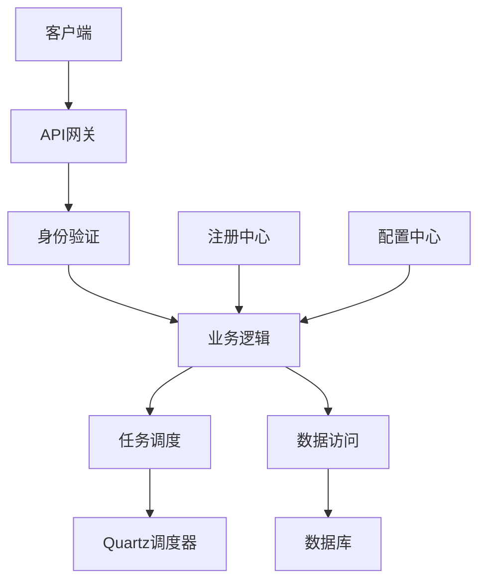
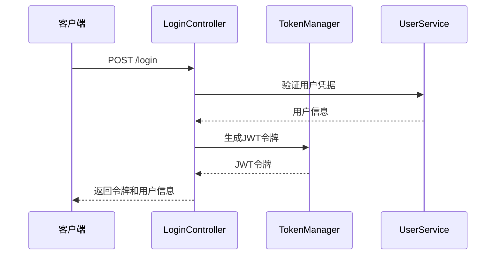
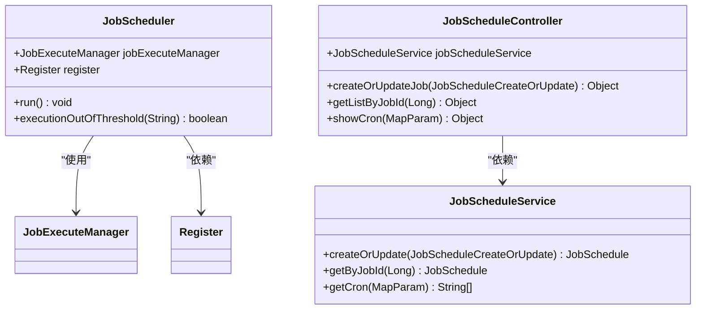
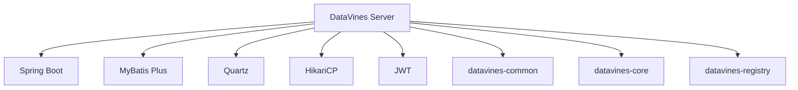

# Server组件

<cite>
**本文档中引用的文件**  
- [DataVinesServer.java](file://datavines-server/src/main/java/io/datavines/server/DataVinesServer.java)
- [application.yaml](file://datavines-server/src/main/resources/application.yaml)
- [LoginController.java](file://datavines-server/src/main/java/io/datavines/server/api/controller/LoginController.java)
- [JobScheduleController.java](file://datavines-server/src/main/java/io/datavines/server/api/controller/JobScheduleController.java)
- [JobScheduler.java](file://datavines-server/src/main/java/io/datavines/server/dqc/coordinator/runner/JobScheduler.java)
- [CommonTaskScheduler.java](file://datavines-server/src/main/java/io/datavines/server/scheduler/CommonTaskScheduler.java)
- [TokenManager.java](file://datavines-core/src/main/java/io/datavines/core/utils/TokenManager.java)
- [AuthenticationInterceptor.java](file://datavines-server/src/main/java/io/datavines/server/api/inteceptor/AuthenticationInterceptor.java)
- [DataVinesExceptionHandler.java](file://datavines-server/src/main/java/io/datavines/server/api/inteceptor/DataVinesExceptionHandler.java)
- [WebMvcConfig.java](file://datavines-server/src/main/java/io/datavines/server/api/config/WebMvcConfig.java)
- [JobScheduleService.java](file://datavines-server/src/main/java/io/datavines/server/repository/service/JobScheduleService.java)
</cite>

## 目录
1. [简介](#简介)
2. [项目结构](#项目结构)
3. [核心组件](#核心组件)
4. [架构概述](#架构概述)
5. [详细组件分析](#详细组件分析)
6. [依赖分析](#依赖分析)
7. [性能考虑](#性能考虑)
8. [故障排除指南](#故障排除指南)
9. [结论](#结论)

## 简介
DataVines Server组件是整个数据质量平台的核心服务模块，承担着API网关、任务调度中心和状态管理器的多重职责。该组件基于Spring Boot框架构建，采用MVC架构模式，实现了RESTful API接口、JWT身份验证机制以及全局异常处理等关键功能。通过集成Quartz调度器，实现了定时任务的创建、触发和管理。本文档将深入分析其架构设计与核心职责，详细阐述各项功能的实现机制。

## 项目结构
DataVines Server组件的项目结构清晰地体现了其模块化设计。核心代码位于`datavines-server`模块中，主要包含API接口、配置、数据质量检查、注册中心、存储库、调度器和工具类等子模块。其中，`api`包负责提供RESTful API接口，`dqc`包实现数据质量检查相关功能，`scheduler`包负责任务调度，`repository`包处理数据持久化操作。

**图示来源**  
- [DataVinesServer.java](file://datavines-server/src/main/java/io/datavines/server/DataVinesServer.java#L1-L160)

## 核心组件
DataVines Server的核心组件包括API网关、任务调度引擎和状态管理器。API网关通过Spring MVC实现RESTful接口，处理所有客户端请求；任务调度引擎基于Quartz框架，负责定时任务的管理和执行；状态管理器维护系统运行时的状态信息，确保各组件间的协调工作。

**组件来源**  
- [DataVinesServer.java](file://datavines-server/src/main/java/io/datavines/server/DataVinesServer.java#L50-L159)
- [application.yaml](file://datavines-server/src/main/resources/application.yaml#L17-L96)

## 架构概述
DataVines Server采用典型的分层架构设计，从上到下分为接口层、业务逻辑层和数据访问层。接口层通过Spring MVC处理HTTP请求，业务逻辑层实现核心功能，数据访问层使用MyBatis Plus进行数据库操作。系统通过JWT实现身份验证，利用Quartz实现任务调度，并通过注册中心实现服务发现和状态同步。

**图示来源**  
- [DataVinesServer.java](file://datavines-server/src/main/java/io/datavines/server/DataVinesServer.java#L75-L108)
- [application.yaml](file://datavines-server/src/main/resources/application.yaml#L39-L59)

## 详细组件分析

### API网关与MVC架构
DataVines Server的API网关基于Spring Boot的MVC架构实现，通过@Controller和@RequestMapping注解定义RESTful接口。系统使用Swagger生成API文档，便于开发者理解和使用。接口层与业务逻辑层通过DTO对象进行数据传输，确保了接口的稳定性和灵活性。

#### RESTful API设计
系统遵循RESTful设计原则，使用标准的HTTP方法（GET、POST、PUT、DELETE）对应资源的查询、创建、更新和删除操作。API路径采用层次化设计，如`/api/job/schedule`表示作业调度相关的接口。

**组件来源**  
- [LoginController.java](file://datavines-server/src/main/java/io/datavines/server/api/controller/LoginController.java#L39-L77)
- [JobScheduleController.java](file://datavines-server/src/main/java/io/datavines/server/api/controller/JobScheduleController.java#L36-L71)

### JWT身份验证机制
系统采用JWT（JSON Web Token）实现无状态的身份验证机制。TokenManager组件负责JWT令牌的生成、验证和刷新。用户登录成功后，服务器生成包含用户信息的JWT令牌并返回给客户端，后续请求通过在HTTP头中携带该令牌进行身份验证。

**图示来源**  
- [TokenManager.java](file://datavines-core/src/main/java/io/datavines/core/utils/TokenManager.java#L40-L197)
- [LoginController.java](file://datavines-server/src/main/java/io/datavines/server/api/controller/LoginController.java#L54-L58)

### 全局异常处理
系统通过@ControllerAdvice注解实现全局异常处理，DataVinesExceptionHandler类统一处理各种异常情况，包括业务异常、参数验证异常和系统异常。异常处理机制能够捕获异常并返回标准化的错误响应，便于客户端进行错误处理。

**组件来源**  
- [DataVinesExceptionHandler.java](file://datavines-server/src/main/java/io/datavines/server/api/inteceptor/DataVinesExceptionHandler.java#L42-L133)

### 任务调度中心
任务调度中心是DataVines Server的核心功能之一，负责管理和执行各种定时任务。系统基于Quartz调度器实现，通过JobScheduleController提供API接口，允许用户创建、更新和删除定时任务。

#### Quartz调度器集成
系统在application.yaml中配置Quartz使用JDBC JobStore，实现集群环境下的任务调度。通过配置`org.quartz.jobStore.isClustered: true`，确保多个Server实例能够协同工作，避免任务重复执行。

**图示来源**  
- [JobScheduler.java](file://datavines-server/src/main/java/io/datavines/server/dqc/coordinator/runner/JobScheduler.java#L39-L155)
- [JobScheduleController.java](file://datavines-server/src/main/java/io/datavines/server/api/controller/JobScheduleController.java#L41-L71)
- [JobScheduleService.java](file://datavines-server/src/main/java/io/datavines/server/repository/service/JobScheduleService.java#L28-L43)

### 状态管理器
状态管理器负责维护系统的运行时状态，包括任务执行状态、服务注册状态等。通过RegistryHolder和Register组件，实现服务的注册与发现，确保系统各组件能够及时感知状态变化。

**组件来源**  
- [DataVinesServer.java](file://datavines-server/src/main/java/io/datavines/server/DataVinesServer.java#L61-L63)
- [Register.java](file://datavines-server/src/main/java/io/datavines/server/registry/Register.java)

## 依赖分析
DataVines Server组件依赖于多个外部库和内部模块。主要依赖包括Spring Boot生态系统、MyBatis Plus、Quartz调度器、HikariCP连接池等。通过Maven进行依赖管理，确保各组件版本的兼容性。

**图示来源**  
- [pom.xml](file://datavines-server/pom.xml)
- [DataVinesServer.java](file://datavines-server/src/main/java/io/datavines/server/DataVinesServer.java#L19-L36)

## 性能考虑
在高并发场景下，DataVines Server通过多种机制优化性能。首先，使用HikariCP作为数据库连接池，提供高效的连接管理；其次，通过Quartz的集群模式实现任务调度的负载均衡；最后，利用缓存机制减少数据库访问频率。

系统还实现了资源检查机制，在执行任务前检查CPU负载和内存使用情况，避免因资源不足导致系统不稳定。通过配置`max.cpu.load.avg`和`reserved.memory`参数，可以灵活调整资源使用策略。

## 故障排除指南
当系统出现故障时，可以按照以下步骤进行排查：
1. 检查日志文件，定位错误信息
2. 验证数据库连接是否正常
3. 检查Quartz调度器状态
4. 确认服务注册中心是否正常工作
5. 验证JWT令牌的有效性

对于任务调度失败的情况，需要检查任务配置是否正确，执行环境是否满足要求，以及是否有足够的系统资源。

**故障排除来源**  
- [DataVinesExceptionHandler.java](file://datavines-server/src/main/java/io/datavines/server/api/inteceptor/DataVinesExceptionHandler.java#L48-L95)
- [JobScheduler.java](file://datavines-server/src/main/java/io/datavines/server/dqc/coordinator/runner/JobScheduler.java#L122-L131)

## 结论
DataVines Server组件通过合理的架构设计和功能实现，成功地承担了API网关、任务调度中心和状态管理器的多重职责。基于Spring Boot的MVC架构提供了稳定可靠的RESTful API接口，JWT身份验证机制确保了系统的安全性，Quartz调度器的集成实现了灵活的任务调度功能。系统在高并发场景下的性能优化策略，保证了其在生产环境中的稳定运行。未来可以进一步优化任务调度算法，提升系统的整体性能和可靠性。