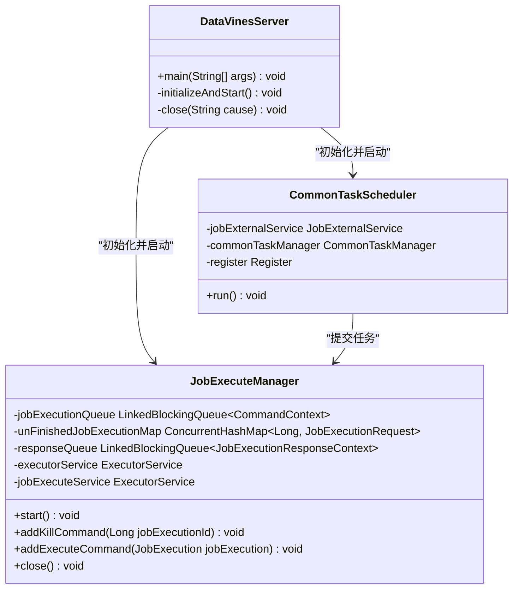
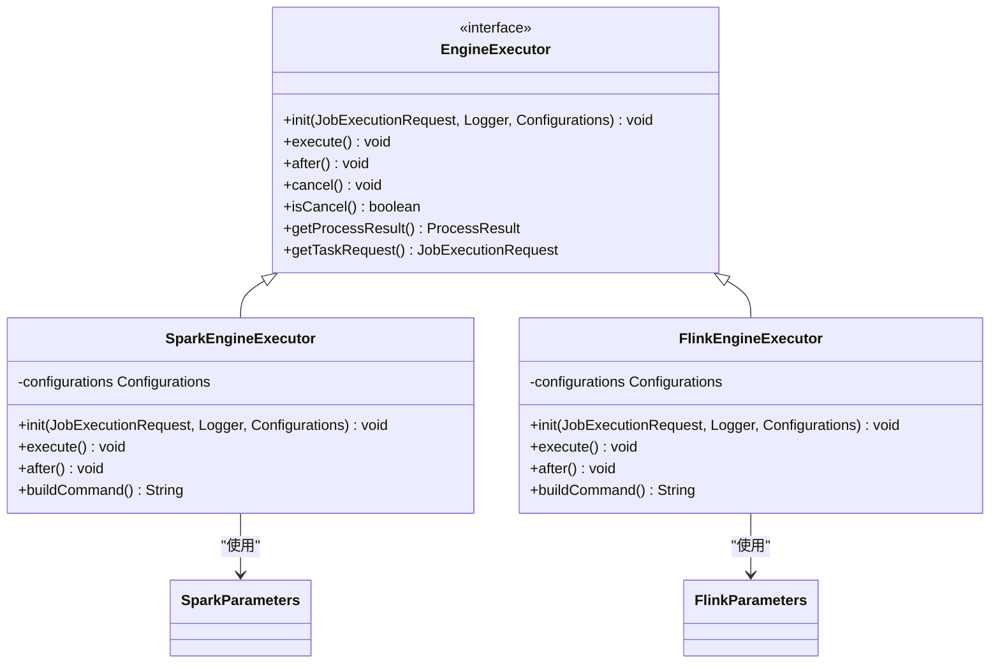
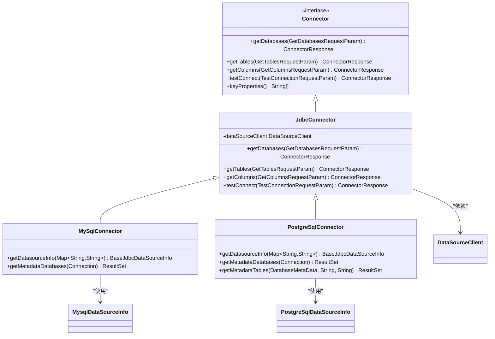
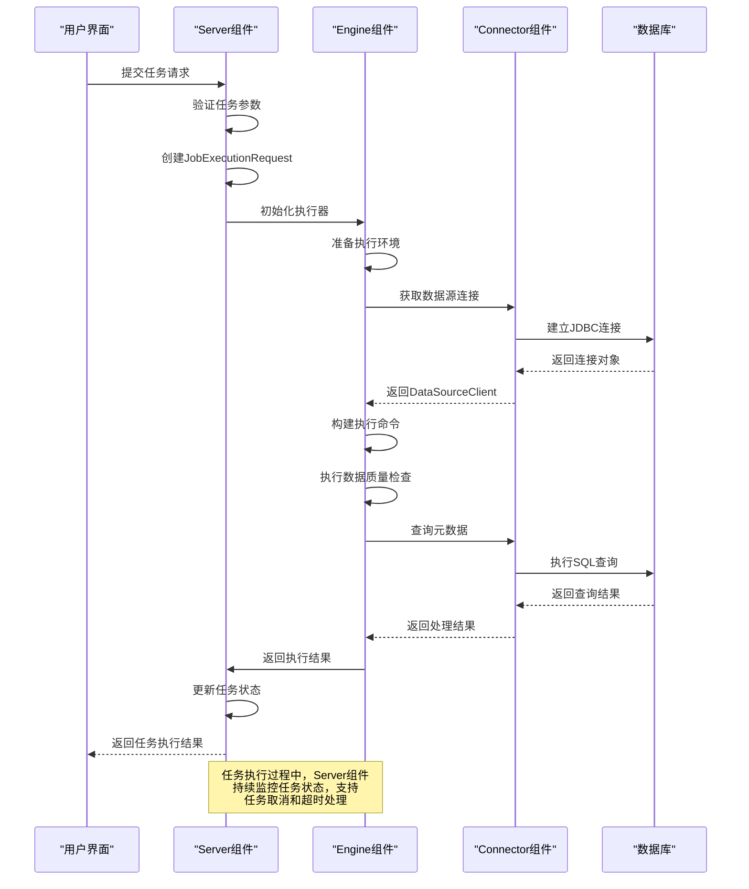

# 组件职责划分

<cite>
**本文档引用的文件**
- [DataVinesServer.java](file://datavines-server/src/main/java/io/datavines/server/DataVinesServer.java)
- [CommonTaskScheduler.java](file://datavines-server/src/main/java/io/datavines/server/scheduler/CommonTaskScheduler.java)
- [JobExecuteManager.java](file://datavines-server/src/main/java/io/datavines/server/dqc/coordinator/cache/JobExecuteManager.java)
- [EngineExecutor.java](file://datavines-engine/datavines-engine-api/src/main/java/io/datavines/engine/api/engine/EngineExecutor.java)
- [SparkEngineExecutor.java](file://datavines-engine/datavines-engine-plugins/datavines-engine-spark/datavines-engine-spark-executor/src/main/java/io/datavines/engine/spark/executor/SparkEngineExecutor.java)
- [FlinkEngineExecutor.java](file://datavines-engine/datavines-engine-plugins/datavines-engine-flink/datavines-engine-flink-executor/src/main/java/io/datavines/engine/flink/executor/FlinkEngineExecutor.java)
- [Connector.java](file://datavines-connector/datavines-connector-api/src/main/java/io/datavines/connector/api/Connector.java)
- [JdbcConnector.java](file://datavines-connector/datavines-connector-plugins/datavines-connector-jdbc/src/main/java/io/datavines/connector/plugin/JdbcConnector.java)
- [MySqlConnector.java](file://datavines-connector/datavines-connector-plugins/datavines-connector-mysql/src/main/java/io/datavines/connector/plugin/MySqlConnector.java)
- [PostgreSqlConnector.java](file://datavines-connector/datavines-connector-plugins/datavines-connector-postgresql/src/main/java/io/datavines/connector/plugin/PostgreSqlConnector.java)
</cite>

## 目录
1. [引言](#引言)
2. [Server组件职责](#server组件职责)
3. [Engine组件职责](#engine组件职责)
4. [Connector组件职责](#connector组件职责)
5. [组件间调用时序](#组件间调用时序)
6. [分层架构优势](#分层架构优势)
7. [结论](#结论)

## 引言
DataVines是一个数据质量监控平台，采用分层架构设计，将系统划分为三大核心组件：Server组件、Engine组件和Connector组件。这种架构设计实现了关注点分离，提高了系统的可维护性和可扩展性。本文档详细阐述这三个核心组件的职责划分，分析其关键技术实现，并通过时序图展示组件间的调用关系。

## Server组件职责
Server组件是DataVines的核心，负责API网关、任务调度和状态管理。它基于Spring Boot框架构建MVC架构，实现了RESTful API接口，为前端UI和其他客户端提供服务。Server组件的核心职责包括任务调度、状态管理和API网关功能。

在任务调度方面，Server组件集成了Quartz调度器（通过CommonTaskScheduler实现），负责定时触发数据质量检查任务。`CommonTaskScheduler`类继承自Thread，通过轮询机制从任务队列中获取待执行的任务命令，并将其提交给任务管理器进行处理。调度器还实现了资源检查机制，确保在系统资源充足的情况下才执行任务，避免因资源不足导致系统不稳定。

状态管理是Server组件的另一项重要职责。`JobExecuteManager`类负责管理所有正在执行的任务的状态，维护一个未完成任务的映射表（unFinishedJobExecutionMap），并提供任务的启动、停止和状态查询功能。该组件还实现了任务超时机制，使用HashedWheelTimer定时器监控任务执行时间，一旦任务超时就自动终止。

**图示来源**
- [DataVinesServer.java](file://datavines-server/src/main/java/io/datavines/server/DataVinesServer.java#L48-L159)
- [CommonTaskScheduler.java](file://datavines-server/src/main/java/io/datavines/server/scheduler/CommonTaskScheduler.java#L31-L90)
- [JobExecuteManager.java](file://datavines-server/src/main/java/io/datavines/server/dqc/coordinator/cache/JobExecuteManager.java#L73-L616)

**本节来源**
- [DataVinesServer.java](file://datavines-server/src/main/java/io/datavines/server/DataVinesServer.java#L48-L159)
- [CommonTaskScheduler.java](file://datavines-server/src/main/java/io/datavines/server/scheduler/CommonTaskScheduler.java#L31-L90)
- [JobExecuteManager.java](file://datavines-server/src/main/java/io/datavines/server/dqc/coordinator/cache/JobExecuteManager.java#L73-L616)

## Engine组件职责
Engine组件负责执行引擎的抽象和任务执行，是DataVines的计算核心。该组件通过接口抽象的方式，实现了对Spark、Flink等多种计算引擎的适配，使得系统能够灵活地选择最适合的计算框架来执行数据质量检查任务。

`EngineExecutor`接口是Engine组件的核心抽象，定义了执行器的生命周期方法，包括init()、execute()、after()、cancel()等。所有具体的执行器实现都必须实现这个接口，从而保证了统一的调用方式。这种设计模式使得系统可以轻松地扩展支持新的计算引擎，只需实现相应的执行器类即可。

对于Spark引擎，`SparkEngineExecutor`类继承自`AbstractYarnEngineExecutor`，负责构建和提交Spark作业。该类通过`buildCommand()`方法生成spark-submit命令，将任务配置、JAR包路径、主类等参数组装成完整的命令行。特别地，该实现还支持动态加载插件JAR包，通过扫描插件目录并将所有JAR包添加到--jars参数中，实现了插件化扩展能力。

**图示来源**
- [EngineExecutor.java](file://datavines-engine/datavines-engine-api/src/main/java/io/datavines/engine/api/engine/EngineExecutor.java#L27-L42)
- [SparkEngineExecutor.java](file://datavines-engine/datavines-engine-plugins/datavines-engine-spark/datavines-engine-spark-executor/src/main/java/io/datavines/engine/spark/executor/SparkEngineExecutor.java#L41-L152)
- [FlinkEngineExecutor.java](file://datavines-engine/datavines-engine-plugins/datavines-engine-flink/datavines-engine-flink-executor/src/main/java/io/datavines/engine/flink/executor/FlinkEngineExecutor.java)

**本节来源**
- [EngineExecutor.java](file://datavines-engine/datavines-engine-api/src/main/java/io/datavines/engine/api/engine/EngineExecutor.java#L27-L42)
- [SparkEngineExecutor.java](file://datavines-engine/datavines-engine-plugins/datavines-engine-spark/datavines-engine-spark-executor/src/main/java/io/datavines/engine/spark/executor/SparkEngineExecutor.java#L41-L152)
- [FlinkEngineExecutor.java](file://datavines-engine/datavines-engine-plugins/datavines-engine-flink/datavines-engine-flink-executor/src/main/java/io/datavines/engine/flink/executor/FlinkEngineExecutor.java)

## Connector组件职责
Connector组件负责数据源连接和SQL执行，是DataVines与各种数据存储系统交互的桥梁。该组件采用插件化设计，支持MySQL、PostgreSQL、Oracle、SQL Server等20多种数据源，通过统一的接口抽象，实现了对不同数据库系统的适配。

`Connector`接口是Connector组件的核心，定义了获取数据库、表、列等元数据的方法，以及测试连接、执行SQL等基本操作。所有具体的连接器实现都继承自`JdbcConnector`抽象类，该类提供了JDBC连接的通用实现，包括连接管理、元数据查询、结果集处理等基础功能。

为了支持多种数据库，DataVines采用了工厂模式和SPI（Service Provider Interface）机制。每个数据库类型都有对应的`DataSourceInfo`实现类，用于解析连接参数并生成JDBC URL。例如，`MySqlConnector`和`PostgreSqlConnector`分别实现了MySQL和PostgreSQL的特定连接逻辑，包括获取数据库列表、表列表和列信息的方法。

**图示来源**
- [Connector.java](file://datavines-connector/datavines-connector-api/src/main/java/io/datavines/connector/api/Connector.java#L24-L72)
- [JdbcConnector.java](file://datavines-connector/datavines-connector-plugins/datavines-connector-jdbc/src/main/java/io/datavines/connector/plugin/JdbcConnector.java#L42-L283)
- [MySqlConnector.java](file://datavines-connector/datavines-connector-plugins/datavines-connector-mysql/src/main/java/io/datavines/connector/plugin/MySqlConnector.java#L28-L45)
- [PostgreSqlConnector.java](file://datavines-connector/datavines-connector-plugins/datavines-connector-postgresql/src/main/java/io/datavines/connector/plugin/PostgreSqlConnector.java#L28-L54)

**本节来源**
- [Connector.java](file://datavines-connector/datavines-connector-api/src/main/java/io/datavines/connector/api/Connector.java#L24-L72)
- [JdbcConnector.java](file://datavines-connector/datavines-connector-plugins/datavines-connector-jdbc/src/main/java/io/datavines/connector/plugin/JdbcConnector.java#L42-L283)
- [MySqlConnector.java](file://datavines-connector/datavines-connector-plugins/datavines-connector-mysql/src/main/java/io/datavines/connector/plugin/MySqlConnector.java#L28-L45)
- [PostgreSqlConnector.java](file://datavines-connector/datavines-connector-plugins/datavines-connector-postgresql/src/main/java/io/datavines/connector/plugin/PostgreSqlConnector.java#L28-L54)

## 组件间调用时序
DataVines的三大核心组件通过明确定义的接口进行交互，形成了清晰的调用流程。当用户提交一个数据质量检查任务时，首先由Server组件接收请求，然后调度Engine组件执行任务，Engine组件在执行过程中通过Connector组件访问数据源。

**图示来源**
- [DataVinesServer.java](file://datavines-server/src/main/java/io/datavines/server/DataVinesServer.java#L48-L159)
- [JobExecuteManager.java](file://datavines-server/src/main/java/io/datavines/server/dqc/coordinator/cache/JobExecuteManager.java#L73-L616)
- [EngineExecutor.java](file://datavines-engine/datavines-engine-api/src/main/java/io/datavines/engine/api/engine/EngineExecutor.java#L27-L42)
- [Connector.java](file://datavines-connector/datavines-connector-api/src/main/java/io/datavines/connector/api/Connector.java#L24-L72)

**本节来源**
- [DataVinesServer.java](file://datavines-server/src/main/java/io/datavines/server/DataVinesServer.java#L48-L159)
- [JobExecuteManager.java](file://datavines-server/src/main/java/io/datavines/server/dqc/coordinator/cache/JobExecuteManager.java#L73-L616)
- [EngineExecutor.java](file://datavines-engine/datavines-engine-api/src/main/java/io/datavines/engine/api/engine/EngineExecutor.java#L27-L42)
- [Connector.java](file://datavines-connector/datavines-connector-api/src/main/java/io/datavines/connector/api/Connector.java#L24-L72)

## 分层架构优势
DataVines采用的分层架构设计带来了显著的优势，主要体现在关注点分离和可维护性提升两个方面。

首先，通过将系统划分为Server、Engine和Connector三个明确的层次，实现了关注点的完全分离。Server组件专注于任务调度和状态管理，不关心具体的计算逻辑；Engine组件专注于计算引擎的抽象和任务执行，不关心数据源的具体实现；Connector组件专注于数据源的连接和SQL执行，不关心任务的调度策略。这种分离使得每个组件都可以独立开发、测试和优化，大大降低了系统的复杂性。

其次，这种架构显著提升了系统的可维护性和可扩展性。由于各组件之间通过明确定义的接口进行交互，当需要修改某个组件的实现时，只要保持接口不变，就不会影响到其他组件。例如，可以轻松地添加对新的计算引擎（如Trino）的支持，只需实现相应的EngineExecutor即可；同样，可以方便地支持新的数据源类型，只需实现相应的Connector即可。

此外，插件化设计进一步增强了系统的灵活性。通过SPI机制，新的功能模块可以以插件的形式动态加载，无需修改核心代码。这种设计不仅便于功能扩展，也使得系统更容易适应不同的部署环境和业务需求。

## 结论
DataVines通过Server、Engine和Connector三大核心组件的职责划分，构建了一个高度模块化和可扩展的数据质量监控平台。Server组件作为系统的控制中心，负责任务调度和状态管理；Engine组件作为计算核心，实现了对多种计算引擎的抽象和适配；Connector组件作为数据访问层，支持20多种数据源的插件化设计。这种分层架构不仅实现了关注点的分离，还极大地提升了系统的可维护性和可扩展性，为数据质量监控提供了坚实的技术基础。