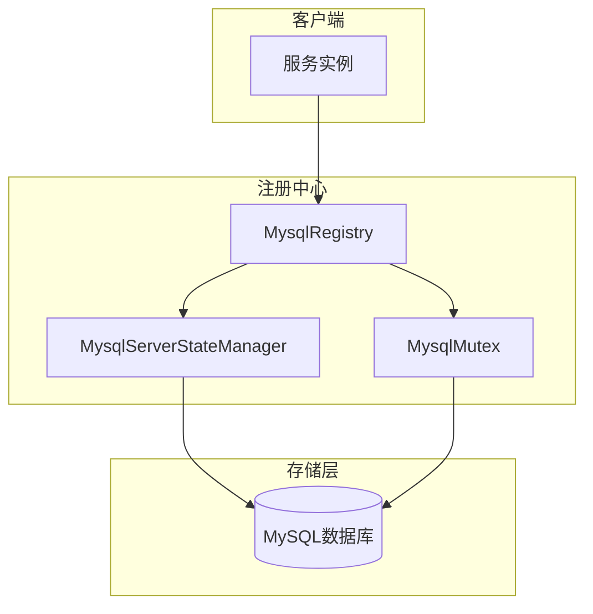
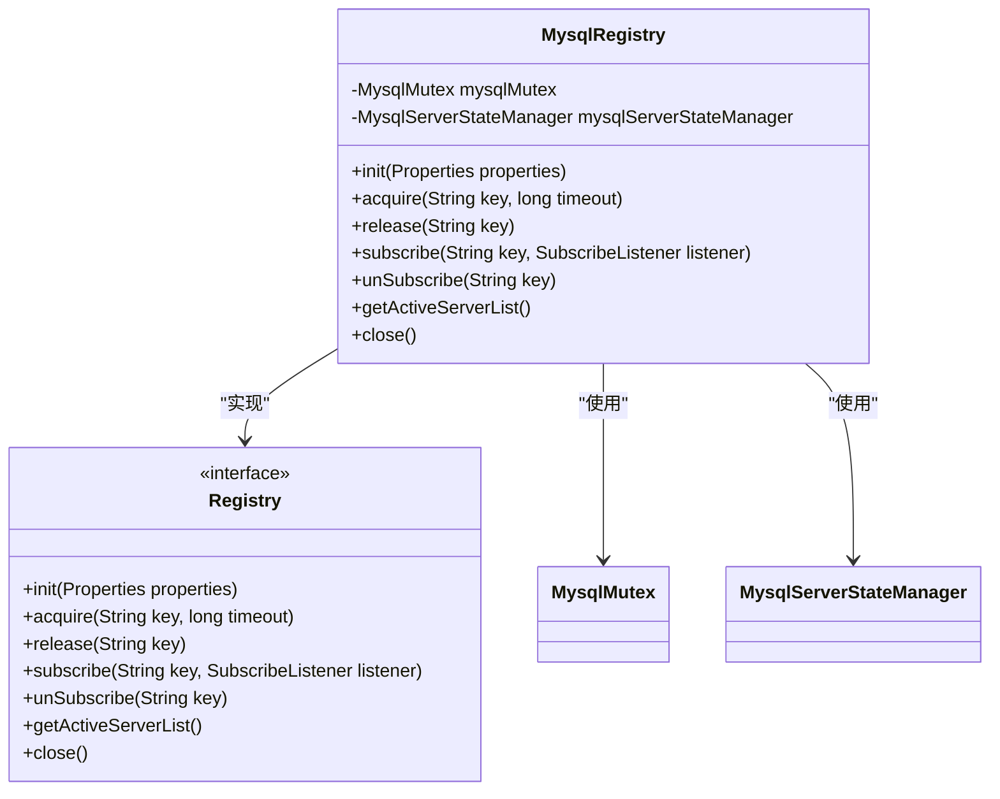
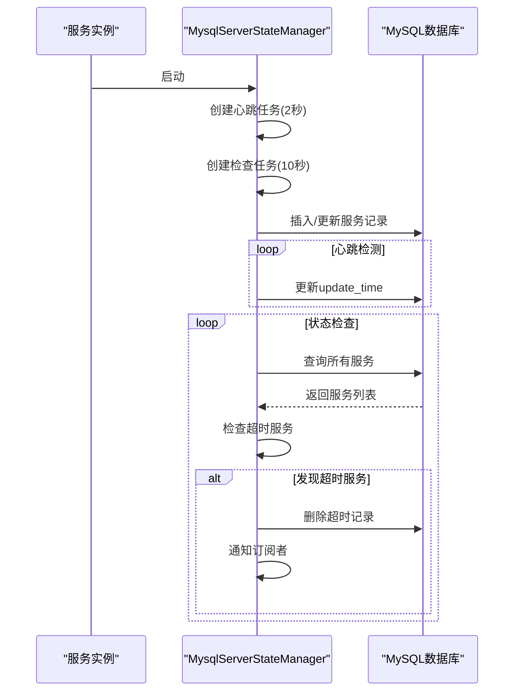
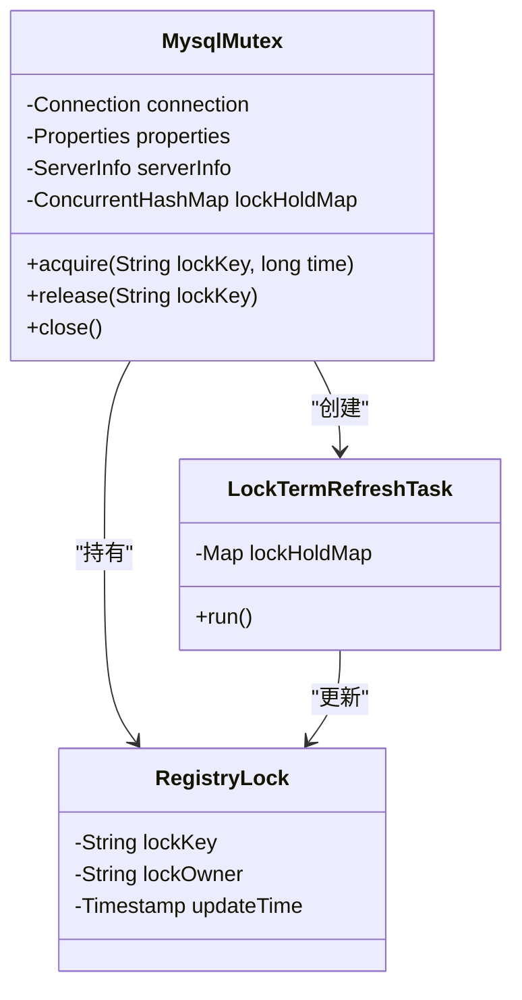
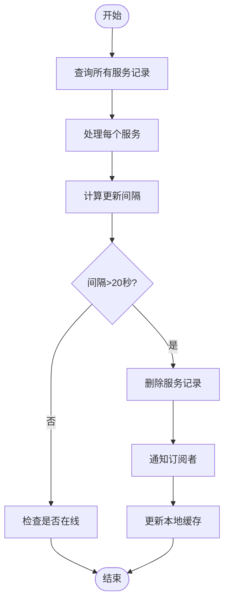
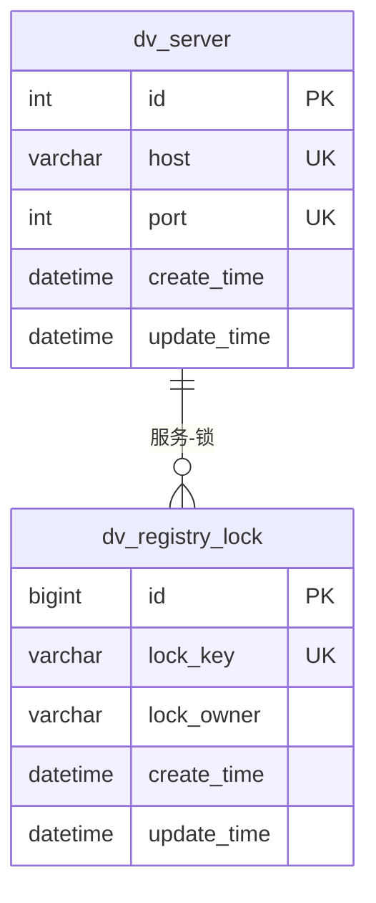
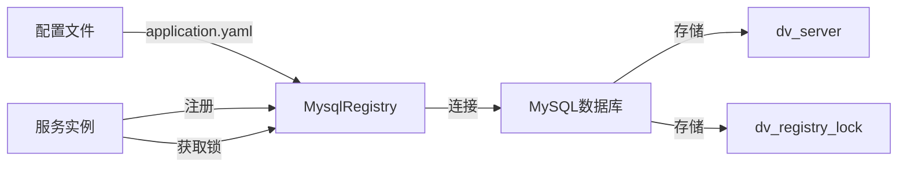

# MySQL实现

<cite>
**本文档引用的文件**   
- [MysqlRegistry.java](file://datavines-registry\datavines-registry-plugins\datavines-registry-mysql\src\main\java\io\datavines\registry\plugin\MysqlRegistry.java)
- [MysqlServerStateManager.java](file://datavines-registry\datavines-registry-plugins\datavines-registry-mysql\src\main\java\io\datavines\registry\plugin\MysqlServerStateManager.java)
- [MysqlMutex.java](file://datavines-registry\datavines-registry-plugins\datavines-registry-mysql\src\main\java\io\datavines\registry\plugin\MysqlMutex.java)
- [RegistryLock.java](file://datavines-registry\datavines-registry-plugins\datavines-registry-mysql\src\main\java\io\datavines\registry\plugin\RegistryLock.java)
- [datavines-mysql.sql](file://scripts\sql\datavines-mysql.sql)
- [Registry.java](file://datavines-registry\datavines-registry-api\src\main\java\io\datavines\registry\api\Registry.java)
- [ServerInfo.java](file://datavines-registry\datavines-registry-api\src\main\java\io\datavines\registry\api\ServerInfo.java)
- [application.yaml](file://datavines-server\src\main\resources\application.yaml)
</cite>

## 目录
1. [引言](#引言)
2. [MySQL注册中心架构](#mysql注册中心架构)
3. [MysqlRegistry服务注册机制](#mysqlregistry服务注册机制)
4. [MysqlServerStateManager服务状态管理](#mysqlserverstatemanager服务状态管理)
5. [分布式锁实现原理](#分布式锁实现原理)
6. [心跳检测与故障剔除](#心跳检测与故障剔除)
7. [数据库表结构设计](#数据库表结构设计)
8. [性能评估与高可用部署](#性能评估与高可用部署)
9. [配置与使用](#配置与使用)
10. [总结](#总结)

## 引言

DataVines MySQL注册中心是基于MySQL数据库实现的服务注册与发现组件，为分布式系统提供可靠的服务状态管理。该注册中心通过数据库表存储服务实例信息，利用数据库的ACID特性确保数据一致性，同时通过心跳机制和分布式锁实现服务的高可用性。本文档详细描述了MySQL注册中心的实现原理，包括服务注册、状态管理、分布式锁、心跳检测等核心机制，为系统架构师和开发人员提供深入的技术参考。

## MySQL注册中心架构

DataVines MySQL注册中心采用分层架构设计，主要包括服务注册层、状态管理层和存储层。服务注册层通过MysqlRegistry接口提供统一的注册服务，状态管理层由MysqlServerStateManager负责服务实例的生命周期管理，存储层则基于MySQL数据库实现数据持久化。整个架构通过数据库事务保证操作的原子性，通过定时任务实现心跳检测和故障剔除，形成一个完整的服务治理解决方案。

**图源**
- [MysqlRegistry.java](file://datavines-registry\datavines-registry-plugins\datavines-registry-mysql\src\main\java\io\datavines\registry\plugin\MysqlRegistry.java#L29-L106)
- [MysqlServerStateManager.java](file://datavines-registry\datavines-registry-plugins\datavines-registry-mysql\src\main\java\io\datavines\registry\plugin\MysqlServerStateManager.java#L33-L257)
- [MysqlMutex.java](file://datavines-registry\datavines-registry-plugins\datavines-registry-mysql\src\main\java\io\datavines\registry\plugin\MysqlMutex.java#L36-L218)

## MysqlRegistry服务注册机制

MysqlRegistry是MySQL注册中心的核心实现类，实现了Registry接口，负责服务的注册、发现和分布式锁管理。该类在初始化时创建数据库连接，并实例化MysqlMutex和MysqlServerStateManager组件。服务注册通过调用MysqlServerStateManager的registry方法实现，将服务实例信息写入dv_server表。服务发现通过getActiveServerList方法获取当前活跃的服务列表，支持服务订阅和通知机制，当服务状态发生变化时，通过SubscribeListener通知监听者。

**图源**
- [MysqlRegistry.java](file://datavines-registry\datavines-registry-plugins\datavines-registry-mysql\src\main\java\io\datavines\registry\plugin\MysqlRegistry.java#L29-L106)
- [Registry.java](file://datavines-registry\datavines-registry-api\src\main\java\io\datavines\registry\api\Registry.java#L26-L44)

**本节源码**
- [MysqlRegistry.java](file://datavines-registry\datavines-registry-plugins\datavines-registry-mysql\src\main\java\io\datavines\registry\plugin\MysqlRegistry.java#L29-L106)

## MysqlServerStateManager服务状态管理

MysqlServerStateManager负责管理服务实例的状态，包括服务注册、心跳更新和故障检测。该组件在初始化时创建定时任务，每2秒执行一次心跳更新，每10秒执行一次服务状态检查。服务注册时，首先检查服务是否已存在，若存在则更新更新时间，否则插入新记录。心跳检测通过比较update_time字段与当前时间的差值来判断服务是否存活，超过20秒未更新的服务被视为已下线。故障剔除机制会定期清理失效服务，并通知订阅者服务状态变化。

**图源**
- [MysqlServerStateManager.java](file://datavines-registry\datavines-registry-plugins\datavines-registry-mysql\src\main\java\io\datavines\registry\plugin\MysqlServerStateManager.java#L33-L257)

**本节源码**
- [MysqlServerStateManager.java](file://datavines-registry\datavines-registry-plugins\datavines-registry-mysql\src\main\java\io\datavines\registry\plugin\MysqlServerStateManager.java#L33-L257)

## 分布式锁实现原理

MySQL注册中心通过MysqlMutex和RegistryLock实现分布式锁机制，确保集群环境下关键操作的互斥性。MysqlMutex是分布式锁的主要实现类，通过dv_registry_lock表存储锁信息。获取锁时尝试插入记录，利用数据库的唯一约束防止重复获取；释放锁时删除对应记录。RegistryLock类封装了锁的元数据，包括锁键、持有者和更新时间。锁的持有时间通过定时任务定期更新，防止锁过期。该实现利用数据库的行级锁和事务特性，确保了锁的可靠性和一致性。

**图源**
- [MysqlMutex.java](file://datavines-registry\datavines-registry-plugins\datavines-registry-mysql\src\main\java\io\datavines\registry\plugin\MysqlMutex.java#L36-L218)
- [RegistryLock.java](file://datavines-registry\datavines-registry-plugins\datavines-registry-mysql\src\main\java\io\datavines\registry\plugin\RegistryLock.java#L28-L36)

**本节源码**
- [MysqlMutex.java](file://datavines-registry\datavines-registry-plugins\datavines-registry-mysql\src\main\java\io\datavines\registry\plugin\MysqlMutex.java#L36-L218)
- [RegistryLock.java](file://datavines-registry\datavines-registry-plugins\datavines-registry-mysql\src\main\java\io\datavines\registry\plugin\RegistryLock.java#L28-L36)

## 心跳检测与故障剔除

心跳检测和故障剔除是MySQL注册中心的核心功能，确保服务列表的实时性和准确性。心跳检测通过定时更新服务实例的update_time字段实现，频率为每2秒一次。故障剔除机制每10秒执行一次，查询所有服务记录，计算每个服务的最后更新时间与当前时间的差值，超过20秒的服务被视为失效。系统会从数据库中删除失效服务记录，同时从本地缓存中移除，并通过事件通知机制告知订阅者。该机制有效防止了僵尸服务的存在，保证了服务发现的可靠性。

**图源**
- [MysqlServerStateManager.java](file://datavines-registry\datavines-registry-plugins\datavines-registry-mysql\src\main\java\io\datavines\registry\plugin\MysqlServerStateManager.java#L212-L244)

**本节源码**
- [MysqlServerStateManager.java](file://datavines-registry\datavines-registry-plugins\datavines-registry-mysql\src\main\java\io\datavines\registry\plugin\MysqlServerStateManager.java#L212-L244)

## 数据库表结构设计

MySQL注册中心的数据库表结构设计简洁高效，主要包括dv_server和dv_registry_lock两个核心表。dv_server表存储服务实例信息，包含host、port、create_time和update_time字段，通过唯一索引确保服务实例的唯一性。dv_registry_lock表实现分布式锁，包含lock_key、lock_owner、create_time和update_time字段，通过唯一索引保证锁的互斥性。表结构设计充分考虑了查询性能和数据一致性，为注册中心的稳定运行提供了基础保障。

**图源**
- [datavines-mysql.sql](file://scripts\sql\datavines-mysql.sql#L677-L702)

**本节源码**
- [datavines-mysql.sql](file://scripts\sql\datavines-mysql.sql#L677-L702)

## 性能评估与高可用部署

MySQL注册中心的性能主要受数据库性能和网络延迟影响。在高并发场景下，频繁的心跳更新可能对数据库造成压力，建议通过调整心跳间隔和连接池配置来优化性能。高可用部署方面，推荐使用MySQL主从复制或集群方案，确保注册中心的高可用性。同时，应配置合理的连接超时和重试机制，应对网络波动。监控方面，建议监控数据库连接数、查询响应时间和锁等待时间等关键指标，及时发现和解决性能瓶颈。

**本节源码**
- [MysqlServerStateManager.java](file://datavines-registry\datavines-registry-plugins\datavines-registry-mysql\src\main\java\io\datavines\registry\plugin\MysqlServerStateManager.java#L51-L54)
- [MysqlMutex.java](file://datavines-registry\datavines-registry-plugins\datavines-registry-mysql\src\main\java\io\datavines\registry\plugin\MysqlMutex.java#L55-L62)

## 配置与使用

MySQL注册中心的配置主要通过application.yaml文件完成。在Spring配置文件中，通过激活mysql配置文件来使用MySQL注册中心。配置包括数据库连接信息、驱动类、URL、用户名和密码等。使用时，服务实例通过MysqlRegistry接口进行注册和发现，通过acquire和release方法获取和释放分布式锁。建议在生产环境中配置连接池和连接超时参数，确保系统的稳定性和可靠性。

**图源**
- [application.yaml](file://datavines-server\src\main\resources\application.yaml#L84-L96)

**本节源码**
- [application.yaml](file://datavines-server\src\main\resources\application.yaml#L84-L96)

## 总结

DataVines MySQL注册中心通过简洁而高效的设计，实现了可靠的服务注册与发现功能。基于MySQL数据库的存储方案，充分利用了关系型数据库的ACID特性，确保了数据的一致性和可靠性。心跳检测和故障剔除机制保证了服务列表的实时性，分布式锁实现了集群环境下的互斥操作。该注册中心适用于对数据一致性要求较高的场景，为分布式系统提供了稳定的服务治理基础。未来可进一步优化性能，支持更多数据库类型，提升系统的灵活性和可扩展性。