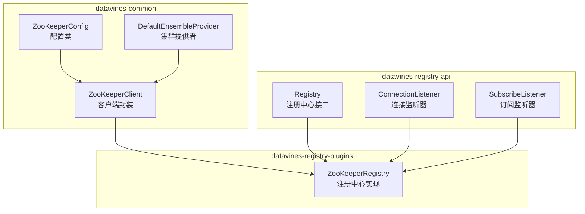
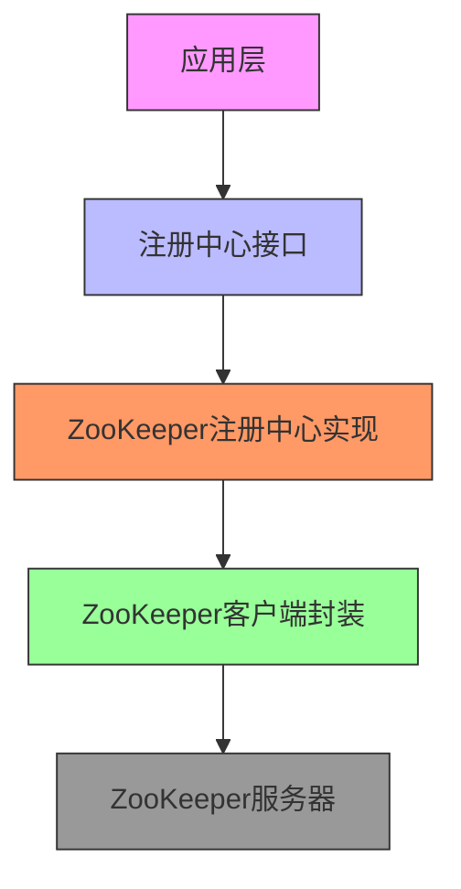
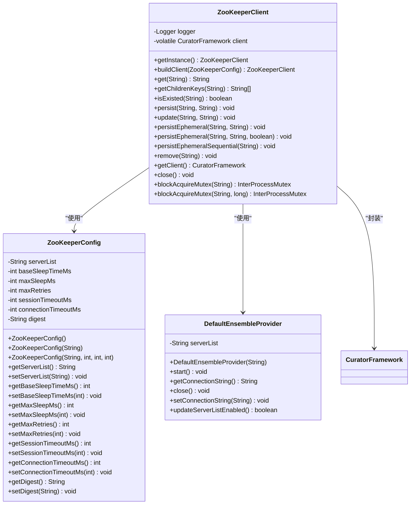
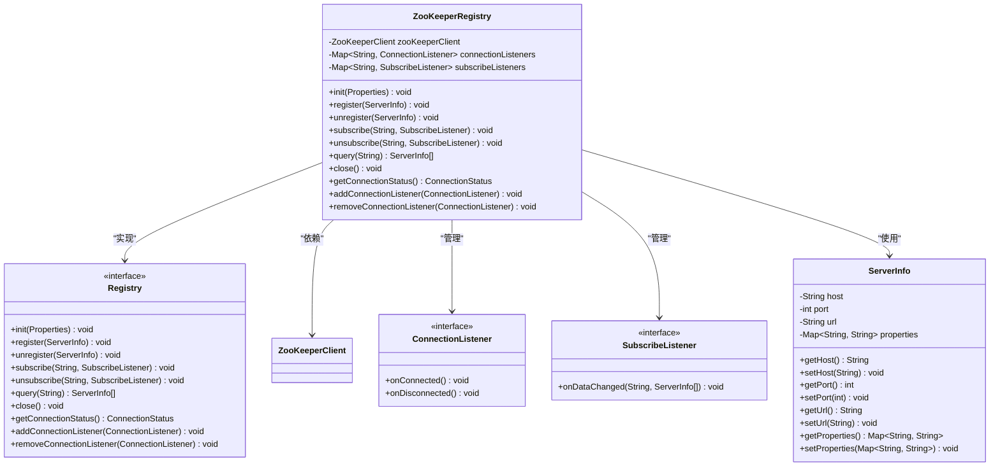
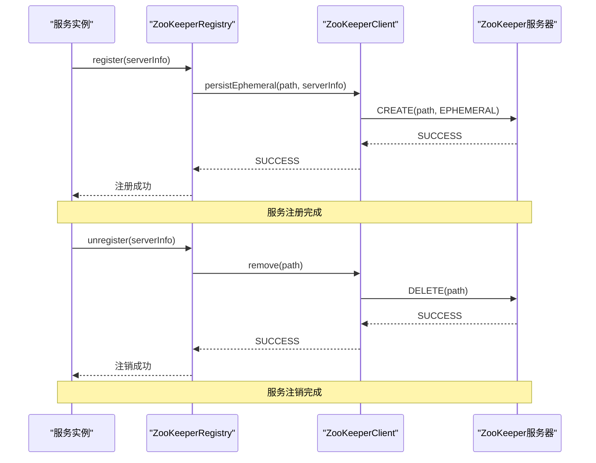
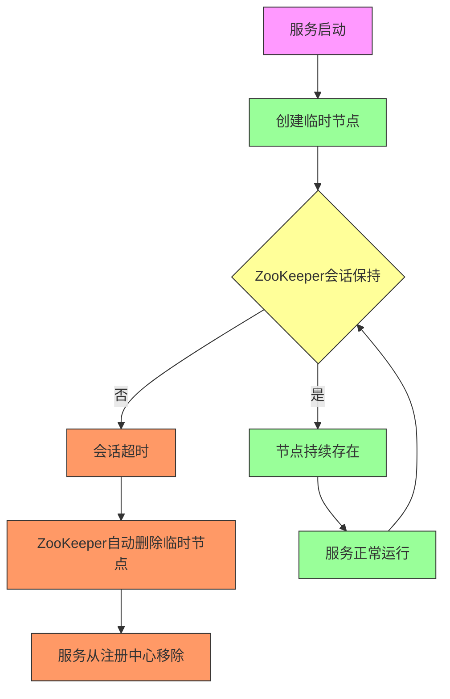
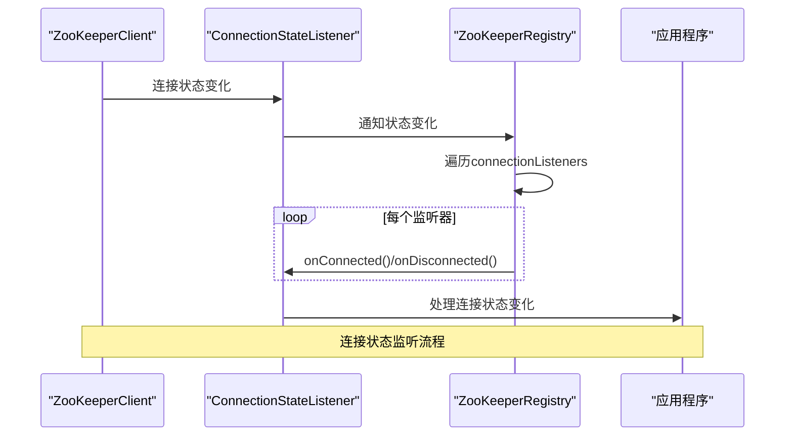
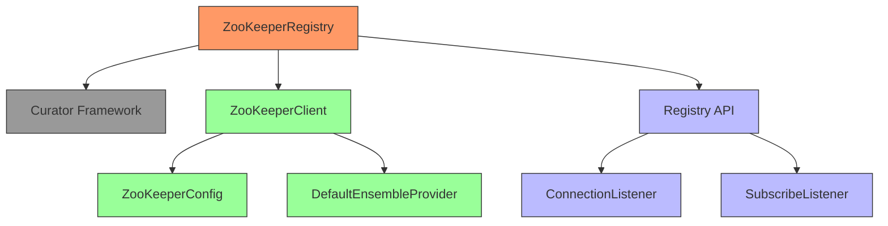

# ZooKeeper实现

<cite>
**本文档引用文件**  
- [ZooKeeperClient.java](file://datavines-common/src/main/java/io/datavines/common/zookeeper/ZooKeeperClient.java)
- [ZooKeeperConfig.java](file://datavines-common/src/main/java/io/datavines/common/zookeeper/ZooKeeperConfig.java)
- [DefaultEnsembleProvider.java](file://datavines-common/src/main/java/io/datavines/common/zookeeper/DefaultEnsembleProvider.java)
- [ZooKeeperRegistry.java](file://datavines-registry/ datavines-registry-plugins/ datavines-registry-zookeeper/ src/main/java/io/ datavines/registry/plugin/ZooKeeperRegistry.java)
- [Registry.java](file://datavines-registry/ datavines-registry-api/ src/main/java/io/ datavines/registry/api/Registry.java)
- [ConnectionListener.java](file://datavines-registry/ datavines-registry-api/ src/main/java/io/ datavines/registry/api/ConnectionListener.java)
- [SubscribeListener.java](file://datavines-registry/ datavines-registry-api/ src/main/java/io/ datavines/registry/api/SubscribeListener.java)
</cite>

## 目录
1. [简介](#简介)
2. [项目结构](#项目结构)
3. [核心组件](#核心组件)
4. [架构概述](#架构概述)
5. [详细组件分析](#详细组件分析)
6. [依赖分析](#依赖分析)
7. [性能考虑](#性能考虑)
8. [故障排除指南](#故障排除指南)
9. [结论](#结论)

## 简介
本文档详细描述了DataVines中基于ZooKeeper的服务注册与发现机制。文档涵盖了ZooKeeper客户端封装、服务注册、心跳检测、故障剔除、连接状态监听等核心功能的实现原理。通过分析ZooKeeperRegistry、ZooKeeperClient等关键组件，深入解析了临时节点的使用方式、会话管理机制以及ZooKeeper配置参数的调优建议。

## 项目结构
DataVines的ZooKeeper注册中心实现主要分布在两个模块中：`datavines-common`和`datavines-registry-plugins`。`datavines-common`模块提供了ZooKeeper客户端的基础封装，而`datavines-registry-plugins`模块实现了具体的注册中心功能。

**图示来源**
- [ZooKeeperClient.java](file://datavines-common/src/main/java/io/datavines/common/zookeeper/ZooKeeperClient.java)
- [ZooKeeperConfig.java](file://datavines-common/src/main/java/io/datavines/common/zookeeper/ZooKeeperConfig.java)
- [DefaultEnsembleProvider.java](file://datavines-common/src/main/java/io/datavines/common/zookeeper/DefaultEnsembleProvider.java)
- [ZooKeeperRegistry.java](file://datavines-registry/datavines-registry-plugins/datavines-registry-zookeeper/src/main/java/io/datavines/registry/plugin/ZooKeeperRegistry.java)
- [Registry.java](file://datavines-registry/datavines-registry-api/src/main/java/io/datavines/registry/api/Registry.java)

**本节来源**
- [ZooKeeperClient.java](file://datavines-common/src/main/java/io/datavines/common/zookeeper/ZooKeeperClient.java)
- [ZooKeeperConfig.java](file://datavines-common/src/main/java/io/datavines/common/zookeeper/ZooKeeperConfig.java)
- [ZooKeeperRegistry.java](file://datavines-registry/datavines-registry-plugins/datavines-registry-zookeeper/src/main/java/io/datavines/registry/plugin/ZooKeeperRegistry.java)

## 核心组件
DataVines的ZooKeeper注册中心实现包含几个核心组件：ZooKeeperClient负责与ZooKeeper服务器的底层通信，ZooKeeperConfig用于配置连接参数，ZooKeeperRegistry实现了服务注册与发现的具体逻辑。

**本节来源**
- [ZooKeeperClient.java](file://datavines-common/src/main/java/io/datavines/common/zookeeper/ZooKeeperClient.java)
- [ZooKeeperConfig.java](file://datavines-common/src/main/java/io/datavines/common/zookeeper/ZooKeeperConfig.java)
- [ZooKeeperRegistry.java](file://datavines-registry/datavines-registry-plugins/datavines-registry-zookeeper/src/main/java/io/datavines/registry/plugin/ZooKeeperRegistry.java)

## 架构概述
DataVines的ZooKeeper注册中心采用分层架构设计，上层为注册中心接口，中层为具体实现，底层为ZooKeeper客户端封装。这种设计实现了关注点分离，提高了代码的可维护性和可扩展性。

**图示来源**
- [Registry.java](file://datavines-registry/datavines-registry-api/src/main/java/io/datavines/registry/api/Registry.java)
- [ZooKeeperRegistry.java](file://datavines-registry/datavines-registry-plugins/datavines-registry-zookeeper/src/main/java/io/datavines/registry/plugin/ZooKeeperRegistry.java)
- [ZooKeeperClient.java](file://datavines-common/src/main/java/io/datavines/common/zookeeper/ZooKeeperClient.java)

## 详细组件分析

### ZooKeeper客户端封装分析
ZooKeeperClient类是DataVines对Curator Framework的封装，提供了单例模式的ZooKeeper客户端实例。该类负责管理与ZooKeeper服务器的连接，提供基本的CRUD操作。

**图示来源**
- [ZooKeeperClient.java](file://datavines-common/src/main/java/io/datavines/common/zookeeper/ZooKeeperClient.java#L39-L224)
- [ZooKeeperConfig.java](file://datavines-common/src/main/java/io/datavines/common/zookeeper/ZooKeeperConfig.java#L19-L104)
- [DefaultEnsembleProvider.java](file://datavines-common/src/main/java/io/datavines/common/zookeeper/DefaultEnsembleProvider.java#L23-L55)

**本节来源**
- [ZooKeeperClient.java](file://datavines-common/src/main/java/io/datavines/common/zookeeper/ZooKeeperClient.java)
- [ZooKeeperConfig.java](file://datavines-common/src/main/java/io/datavines/common/zookeeper/ZooKeeperConfig.java)
- [DefaultEnsembleProvider.java](file://datavines-common/src/main/java/io/datavines/common/zookeeper/DefaultEnsembleProvider.java)

### ZooKeeper注册中心实现分析
ZooKeeperRegistry类实现了Registry接口，提供了基于ZooKeeper的服务注册与发现功能。该类利用ZooKeeper的临时节点特性来实现服务的心跳检测和故障剔除。

**图示来源**
- [ZooKeeperRegistry.java](file://datavines-registry/datavines-registry-plugins/datavines-registry-zookeeper/src/main/java/io/datavines/registry/plugin/ZooKeeperRegistry.java)
- [Registry.java](file://datavines-registry/datavines-registry-api/src/main/java/io/datavines/registry/api/Registry.java)
- [ConnectionListener.java](file://datavines-registry/datavines-registry-api/src/main/java/io/datavines/registry/api/ConnectionListener.java)
- [SubscribeListener.java](file://datavines-registry/datavines-registry-api/src/main/java/io/datavines/registry/api/SubscribeListener.java)

**本节来源**
- [ZooKeeperRegistry.java](file://datavines-registry/datavines-registry-plugins/datavines-registry-zookeeper/src/main/java/io/datavines/registry/plugin/ZooKeeperRegistry.java)

### 服务注册与发现流程分析
当服务启动时，会通过ZooKeeperRegistry注册自身信息。注册过程使用临时节点，确保服务下线时能自动从注册中心移除。

**图示来源**
- [ZooKeeperRegistry.java](file://datavines-registry/datavines-registry-plugins/datavines-registry-zookeeper/src/main/java/io/datavines/registry/plugin/ZooKeeperRegistry.java#L50-L80)
- [ZooKeeperClient.java](file://datavines-common/src/main/java/io/datavines/common/zookeeper/ZooKeeperClient.java#L153-L180)

**本节来源**
- [ZooKeeperRegistry.java](file://datavines-registry/datavines-registry-plugins/datavines-registry-zookeeper/src/main/java/io/datavines/registry/plugin/ZooKeeperRegistry.java)
- [ZooKeeperClient.java](file://datavines-common/src/main/java/io/datavines/common/zookeeper/ZooKeeperClient.java)

### 心跳检测与故障剔除机制分析
ZooKeeper的临时节点特性是实现心跳检测和故障剔除的核心。当服务与ZooKeeper的会话断开时，临时节点会自动被删除，从而实现故障服务的自动剔除。

**图示来源**
- [ZooKeeperClient.java](file://datavines-common/src/main/java/io/datavines/common/zookeeper/ZooKeeperClient.java#L153-L163)
- [ZooKeeperRegistry.java](file://datavines-registry/datavines-registry-plugins/datavines-registry-zookeeper/src/main/java/io/datavines/registry/plugin/ZooKeeperRegistry.java)

**本节来源**
- [ZooKeeperClient.java](file://datavines-common/src/main/java/io/datavines/common/zookeeper/ZooKeeperClient.java)
- [ZooKeeperRegistry.java](file://datavines-registry/datavines-registry-plugins/datavines-registry-zookeeper/src/main/java/io/datavines/registry/plugin/ZooKeeperRegistry.java)

### 连接状态监听处理分析
ZooKeeperConnectionStateListener负责监听ZooKeeper客户端的连接状态变化，并通知注册的ConnectionListener。

**图示来源**
- [ZooKeeperRegistry.java](file://datavines-registry/datavines-registry-plugins/datavines-registry-zookeeper/src/main/java/io/datavines/registry/plugin/ZooKeeperRegistry.java)
- [ConnectionListener.java](file://datavines-registry/datavines-registry-api/src/main/java/io/datavines/registry/api/ConnectionListener.java)

**本节来源**
- [ZooKeeperRegistry.java](file://datavines-registry/datavines-registry-plugins/datavines-registry-zookeeper/src/main/java/io/datavines/registry/plugin/ZooKeeperRegistry.java)
- [ConnectionListener.java](file://datavines-registry/datavines-registry-api/src/main/java/io/datavines/registry/api/ConnectionListener.java)

## 依赖分析
DataVines的ZooKeeper注册中心实现依赖于Curator Framework作为ZooKeeper的客户端库，同时遵循SPI机制，允许通过配置切换不同的注册中心实现。

**图示来源**
- [ZooKeeperRegistry.java](file://datavines-registry/datavines-registry-plugins/datavines-registry-zookeeper/src/main/java/io/datavines/registry/plugin/ZooKeeperRegistry.java)
- [ZooKeeperClient.java](file://datavines-common/src/main/java/io/datavines/common/zookeeper/ZooKeeperClient.java)
- [Registry.java](file://datavines-registry/datavines-registry-api/src/main/java/io/datavines/registry/api/Registry.java)

**本节来源**
- [ZooKeeperRegistry.java](file://datavines-registry/datavines-registry-plugins/datavines-registry-zookeeper/src/main/java/io/datavines/registry/plugin/ZooKeeperRegistry.java)
- [ZooKeeperClient.java](file://datavines-common/src/main/java/io/datavines/common/zookeeper/ZooKeeperClient.java)
- [Registry.java](file://datavines-registry/datavines-registry-api/src/main/java/io/datavines/registry/api/Registry.java)

## 性能考虑
在使用ZooKeeper注册中心时，需要注意以下性能调优点：

1. **会话超时配置**：合理设置sessionTimeoutMs参数，避免过短导致频繁重连，过长导致故障检测延迟。
2. **连接重试策略**：通过baseSleepTimeMs、maxSleepMs和maxRetries参数配置指数退避重试策略。
3. **连接超时**：设置合理的connectionTimeoutMs，避免在ZooKeeper不可用时长时间阻塞。
4. **批量操作**：对于大量节点操作，考虑使用事务或批量API减少网络开销。

**本节来源**
- [ZooKeeperConfig.java](file://datavines-common/src/main/java/io/datavines/common/zookeeper/ZooKeeperConfig.java)
- [ZooKeeperClient.java](file://datavines-common/src/main/java/io/datavines/common/zookeeper/ZooKeeperClient.java)

## 故障排除指南
当遇到ZooKeeper注册中心相关问题时，可以参考以下排查步骤：

1. **连接问题**：检查ZooKeeper服务器地址和端口配置是否正确。
2. **认证问题**：如果启用了ACL，确保digest配置正确。
3. **会话超时**：监控ZooKeeper客户端日志，查看是否有频繁的会话超时。
4. **节点冲突**：确保服务注册的路径唯一，避免节点冲突。

**本节来源**
- [ZooKeeperClient.java](file://datavines-common/src/main/java/io/datavines/common/zookeeper/ZooKeeperClient.java)
- [ZooKeeperRegistry.java](file://datavines-registry/datavines-registry-plugins/datavines-registry-zookeeper/src/main/java/io/datavines/registry/plugin/ZooKeeperRegistry.java)

## 结论
DataVines的ZooKeeper注册中心实现通过封装Curator Framework，提供了稳定可靠的服务注册与发现功能。利用ZooKeeper的临时节点特性，实现了自动的心跳检测和故障剔除机制。通过清晰的接口设计和SPI机制，保证了系统的可扩展性和灵活性。合理的配置参数和性能调优建议有助于在生产环境中稳定运行。