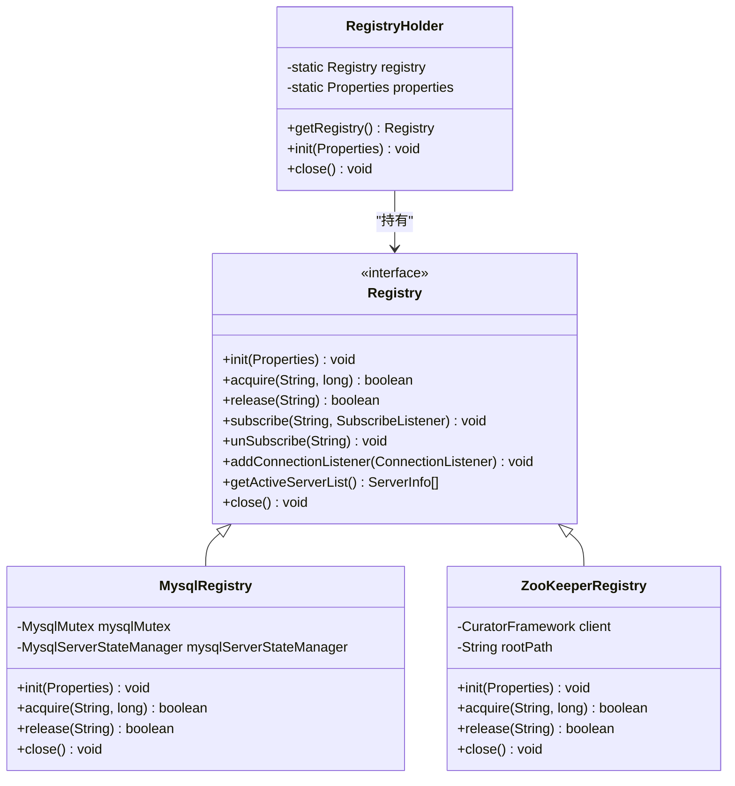
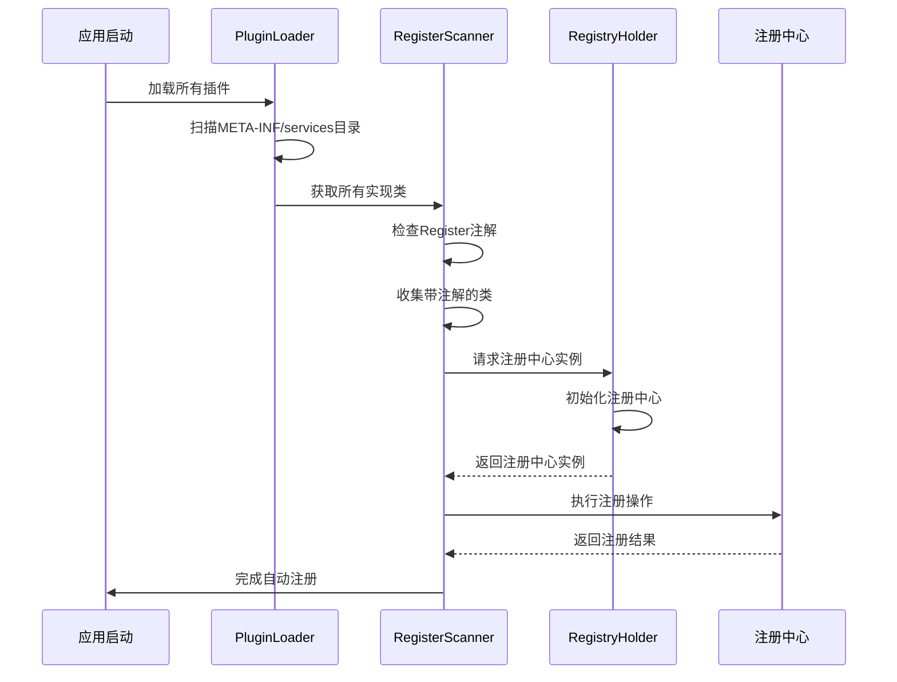
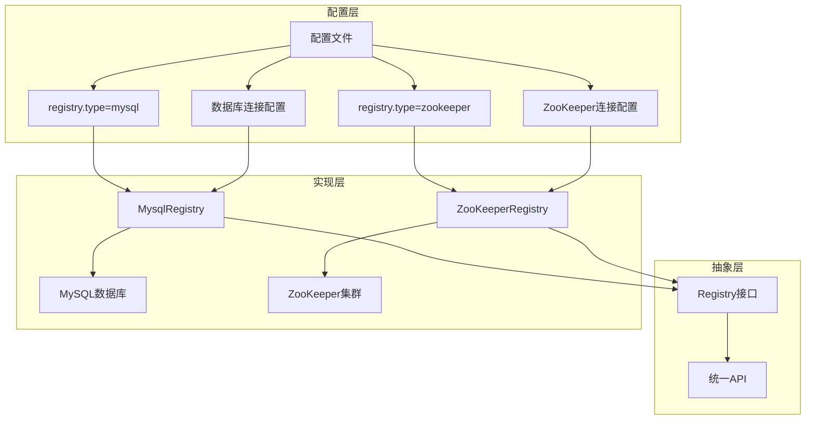

# 客户端管理

<cite>
**本文档引用的文件**
- [Registry.java](file://datavines-registry/datavines-registry-api/src/main/java/io/datavines/registry/api/Registry.java)
- [MysqlRegistry.java](file://datavines-registry/datavines-registry-plugins/datavines-registry-mysql/src/main/java/io/datavines/registry/plugin/MysqlRegistry.java)
- [ZooKeeperRegistry.java](file://datavines-registry/datavines-registry-plugins/datavines-registry-zookeeper/src/main/java/io/datavines/registry/plugin/ZooKeeperRegistry.java)
- [RegistryHolder.java](file://datavines-server/src/main/java/io/datavines/server/registry/RegistryHolder.java)
- [Register.java](file://datavines-server/src/main/java/io/datavines/server/registry/Register.java)
- [PluginLoader.java](file://datavines-spi/src/main/java/io/datavines/spi/PluginLoader.java)
- [SPI.java](file://datavines-spi/src/main/java/io/datavines/spi/SPI.java)
</cite>

## 目录
1. [简介](#简介)
2. [注册中心客户端统一管理](#注册中心客户端统一管理)
3. [Register注解与自动注册机制](#register注解与自动注册机制)
4. [客户端生命周期管理](#客户端生命周期管理)
5. [多注册中心配置支持](#多注册中心配置支持)
6. [客户端配置参数说明](#客户端配置参数说明)
7. [连接池管理建议](#连接池管理建议)

## 简介
DataVines注册中心客户端管理机制提供了一套完整的注册中心实例管理方案，通过RegistryHolder统一管理注册中心客户端实例，支持多种注册中心实现（如MySQL、ZooKeeper），并提供自动注册、连接管理和资源释放等核心功能。本文档详细说明了注册中心客户端的管理机制、生命周期、配置策略和最佳实践。

## 注册中心客户端统一管理

DataVines通过RegistryHolder类实现注册中心客户端实例的统一管理。RegistryHolder作为注册中心客户端的全局持有者，负责注册中心实例的创建、获取和生命周期管理。该机制基于SPI（Service Provider Interface）扩展机制，允许系统动态加载不同类型的注册中心实现。

RegistryHolder通过单例模式确保全局唯一性，所有组件通过RegistryHolder获取注册中心客户端实例，避免了重复创建和资源浪费。当需要访问注册中心时，系统通过RegistryHolder.getRegistry()方法获取相应的注册中心实例，该方法根据配置的注册中心类型返回具体的实现。

注册中心接口（Registry）定义了统一的操作契约，包括初始化、获取锁、订阅、获取活跃服务器列表和关闭连接等核心方法。不同的注册中心实现（如MysqlRegistry和ZooKeeperRegistry）都实现了这个接口，确保了API的一致性。



**图示来源**
- [Registry.java](file://datavines-registry/datavines-registry-api/src/main/java/io/datavines/registry/api/Registry.java)
- [MysqlRegistry.java](file://datavines-registry/datavines-registry-plugins/datavines-registry-mysql/src/main/java/io/datavines/registry/plugin/MysqlRegistry.java)
- [ZooKeeperRegistry.java](file://datavines-registry/datavines-registry-plugins/datavines-registry-zookeeper/src/main/java/io/datavines/registry/plugin/ZooKeeperRegistry.java)
- [RegistryHolder.java](file://datavines-server/src/main/java/io/datavines/server/registry/RegistryHolder.java)

**本节来源**
- [Registry.java](file://datavines-registry/datavines-registry-api/src/main/java/io/datavines/registry/api/Registry.java#L25-L43)
- [RegistryHolder.java](file://datavines-server/src/main/java/io/datavines/server/registry/RegistryHolder.java)

## Register注解与自动注册机制

DataVines通过Register注解实现服务的自动注册功能。Register注解用于标记需要注册到注册中心的组件或服务，系统在启动时会扫描带有该注解的类，并自动将其注册到配置的注册中心中。

自动注册机制基于Java的SPI扩展机制和反射技术实现。系统通过PluginLoader加载所有实现了特定接口的插件，并检查这些类是否带有Register注解。如果发现带有Register注解的类，系统会自动创建该类的实例并将其注册信息写入注册中心。

Register注解通常包含注册路径、服务名称、权重等元数据信息，这些信息用于在注册中心中创建相应的节点。注册中心会根据这些信息创建持久节点或临时节点，具体取决于服务的类型和需求。



**图示来源**
- [Register.java](file://datavines-server/src/main/java/io/datavines/server/registry/Register.java)
- [PluginLoader.java](file://datavines-spi/src/main/java/io/datavines/spi/PluginLoader.java)
- [RegistryHolder.java](file://datavines-server/src/main/java/io/datavines/server/registry/RegistryHolder.java)
- [Registry.java](file://datavines-registry/datavines-registry-api/src/main/java/io/datavines/registry/api/Registry.java)

**本节来源**
- [Register.java](file://datavines-server/src/main/java/io/datavines/server/registry/Register.java)
- [PluginLoader.java](file://datavines-spi/src/main/java/io/datavines/spi/PluginLoader.java#L70-L486)

## 客户端生命周期管理

注册中心客户端的生命周期管理包括初始化、连接管理和资源释放三个主要阶段。RegistryHolder负责协调整个生命周期，确保客户端实例的正确创建和销毁。

在初始化阶段，RegistryHolder根据配置的注册中心类型（通过配置文件指定）创建相应的注册中心实例。初始化过程包括读取配置属性、建立网络连接、创建必要的数据结构等。对于MySQL注册中心，初始化会建立数据库连接并创建必要的表结构；对于ZooKeeper注册中心，初始化会建立ZooKeeper会话并创建根路径。

连接管理阶段涉及连接的健康检查、重连机制和连接池管理。注册中心客户端会定期检查连接状态，当检测到连接断开时，会自动尝试重新连接。系统还支持连接监听器（ConnectionListener），允许注册回调函数来处理连接状态变化事件。

资源释放阶段在系统关闭时执行，RegistryHolder会调用注册中心实例的close()方法，释放所有占用的资源，包括数据库连接、网络会话和内存数据结构。这个过程确保了资源的优雅释放，避免了资源泄漏。

```mermaid
flowchart TD
A[客户端生命周期开始] --> B[初始化]
B --> B1[读取配置属性]
B1 --> B2[创建注册中心实例]
B2 --> B3[建立连接]
B3 --> B4[初始化数据结构]
B4 --> C[连接管理]
C --> C1[健康检查]
C1 --> C2{连接正常?}
C2 --> |是| C3[继续服务]
C2 --> |否| C4[尝试重连]
C4 --> C5{重连成功?}
C5 --> |是| C3
C5 --> |否| C6[触发连接监听器]
C6 --> C7[等待重试]
C7 --> C1
C --> D[资源释放]
D --> D1[调用close()方法]
D1 --> D2[释放数据库连接]
D2 --> D3[关闭网络会话]
D3 --> D4[清理内存数据]
D4 --> E[客户端生命周期结束]
```

**图示来源**
- [RegistryHolder.java](file://datavines-server/src/main/java/io/datavines/server/registry/RegistryHolder.java)
- [Registry.java](file://datavines-registry/datavines-registry-api/src/main/java/io/datavines/registry/api/Registry.java#L28-L42)
- [MysqlRegistry.java](file://datavines-registry/datavines-registry-plugins/datavines-registry-mysql/src/main/java/io/datavines/registry/plugin/MysqlRegistry.java#L35-L38)

**本节来源**
- [RegistryHolder.java](file://datavines-server/src/main/java/io/datavines/server/registry/RegistryHolder.java)
- [Registry.java](file://datavines-registry/datavines-registry-api/src/main/java/io/datavines/registry/api/Registry.java)
- [MysqlRegistry.java](file://datavines-registry/datavines-registry-plugins/datavines-registry-mysql/src/main/java/io/datavines/registry/plugin/MysqlRegistry.java)

## 多注册中心配置支持

DataVines支持多注册中心配置策略，允许系统根据不同的场景和需求选择合适的注册中心实现。这种灵活性通过配置驱动的方式实现，用户可以在配置文件中指定使用的注册中心类型。

多注册中心支持基于SPI机制实现，不同的注册中心实现被打包为独立的插件模块。系统通过PluginLoader动态加载这些插件，并根据配置创建相应的实例。这种设计实现了注册中心实现与核心逻辑的解耦，使得添加新的注册中心支持变得简单。

配置文件中通过"registry.type"属性指定注册中心类型，可选值包括"mysql"、"zookeeper"等。相应的配置属性（如数据库连接信息或ZooKeeper连接字符串）也会根据注册中心类型进行组织。这种配置策略使得系统可以在不同环境中灵活切换注册中心实现。



**图示来源**
- [Registry.java](file://datavines-registry/datavines-registry-api/src/main/java/io/datavines/registry/api/Registry.java)
- [MysqlRegistry.java](file://datavines-registry/datavines-registry-plugins/datavines-registry-mysql/src/main/java/io/datavines/registry/plugin/MysqlRegistry.java)
- [ZooKeeperRegistry.java](file://datavines-registry/datavines-registry-plugins/datavines-registry-zookeeper/src/main/java/io/datavines/registry/plugin/ZooKeeperRegistry.java)

**本节来源**
- [Registry.java](file://datavines-registry/datavines-registry-api/src/main/java/io/datavines/registry/api/Registry.java)
- [MysqlRegistry.java](file://datavines-registry/datavines-registry-plugins/datavines-registry-mysql/src/main/java/io/datavines/registry/plugin/MysqlRegistry.java)
- [ZooKeeperRegistry.java](file://datavines-registry/datavines-registry-plugins/datavines-registry-zookeeper/src/main/java/io/datavines/registry/plugin/ZooKeeperRegistry.java)

## 客户端配置参数说明

注册中心客户端的配置通过Properties对象传递，包含连接信息、超时设置、重试策略等关键参数。主要配置参数包括：

- **registry.type**: 注册中心类型，可选值为"mysql"或"zookeeper"
- **db.url**: 数据库连接URL（MySQL注册中心使用）
- **db.username**: 数据库用户名（MySQL注册中心使用）
- **db.password**: 数据库密码（MySQL注册中心使用）
- **zk.connect.string**: ZooKeeper连接字符串（ZooKeeper注册中心使用）
- **session.timeout**: 会话超时时间
- **connection.timeout**: 连接超时时间
- **retry.policy**: 重试策略配置
- **base.path**: 注册中心根路径

这些配置参数在系统启动时由RegistryHolder读取，并传递给具体的注册中心实现进行初始化。配置的灵活性使得系统可以适应不同的部署环境和性能要求。

**本节来源**
- [MysqlRegistry.java](file://datavines-registry/datavines-registry-plugins/datavines-registry-mysql/src/main/java/io/datavines/registry/plugin/MysqlRegistry.java#L35-L38)
- [ZooKeeperRegistry.java](file://datavines-registry/datavines-registry-plugins/datavines-registry-zookeeper/src/main/java/io/datavines/registry/plugin/ZooKeeperRegistry.java)

## 连接池管理建议

对于基于数据库的注册中心（如MySQL注册中心），建议配置适当的连接池参数以优化性能和资源利用率。关键的连接池管理建议包括：

1. **连接池大小**: 根据并发需求设置合理的连接池大小，避免过多连接导致数据库压力过大，同时确保有足够的连接处理并发请求。

2. **连接超时**: 设置适当的连接超时时间，避免客户端长时间等待连接，影响系统响应性。

3. **空闲连接回收**: 配置空闲连接回收策略，定期清理长时间未使用的连接，释放数据库资源。

4. **连接验证**: 启用连接验证功能，在从连接池获取连接时检查连接的有效性，避免使用已失效的连接。

5. **监控和告警**: 实施连接池监控，跟踪连接使用情况、等待时间和错误率，设置告警阈值及时发现潜在问题。

对于ZooKeeper注册中心，虽然不使用传统意义上的连接池，但建议合理配置会话超时和重试策略，确保在网络波动时能够快速恢复连接。

**本节来源**
- [MysqlRegistry.java](file://datavines-registry/datavines-registry-plugins/datavines-registry-mysql/src/main/java/io/datavines/registry/plugin/MysqlRegistry.java)
- [ConnectionUtils.java](file://datavines-common/src/main/java/io/datavines/common/utils/ConnectionUtils.java)