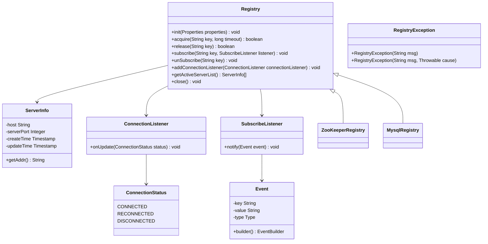
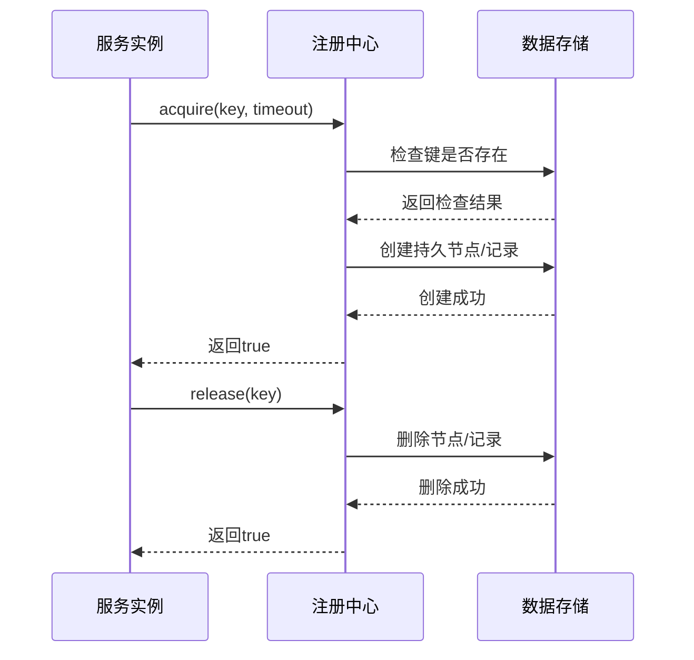
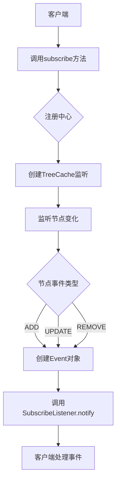
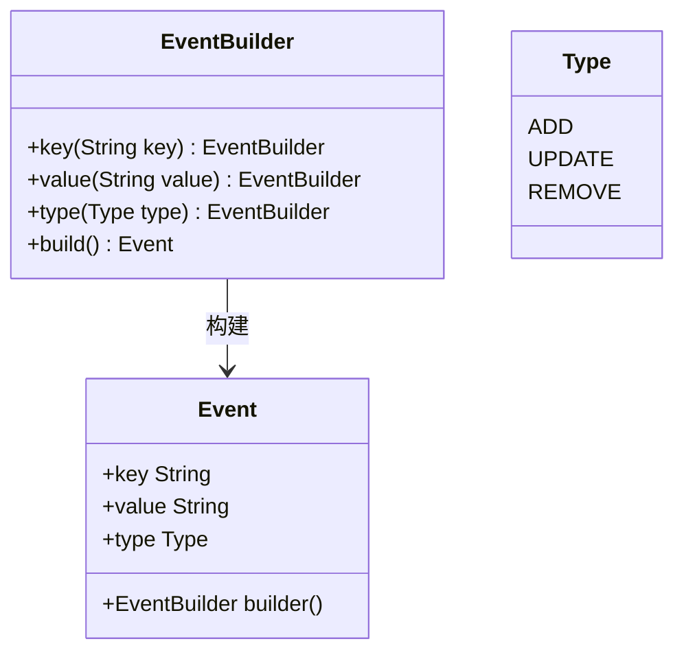
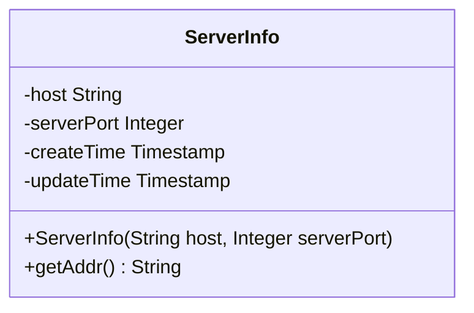
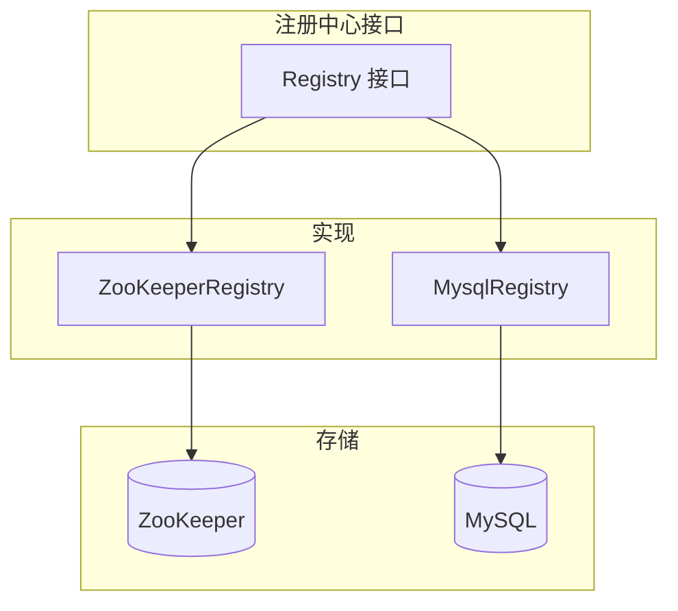
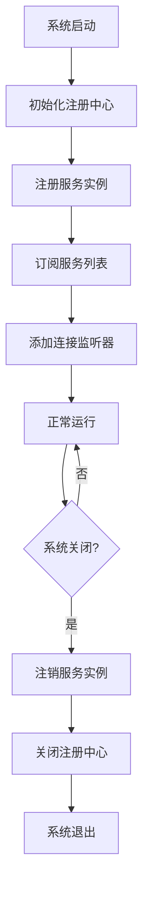

# 注册中心接口设计

<cite>
**本文档引用的文件**
- [Registry.java](file://datavines-registry/datavines-registry-api/src/main/java/io/datavines/registry/api/Registry.java)
- [ServerInfo.java](file://datavines-registry/datavines-registry-api/src/main/java/io/datavines/registry/api/ServerInfo.java)
- [ConnectionListener.java](file://datavines-registry/datavines-registry-api/src/main/java/io/datavines/registry/api/ConnectionListener.java)
- [SubscribeListener.java](file://datavines-registry/datavines-registry-api/src/main/java/io/datavines/registry/api/SubscribeListener.java)
- [Event.java](file://datavines-registry/datavines-registry-api/src/main/java/io/datavines/registry/api/Event.java)
- [ZooKeeperRegistry.java](file://datavines-registry/datavines-registry-plugins/datavines-registry-zookeeper/src/main/java/io/datavines/registry/plugin/ZooKeeperRegistry.java)
- [MysqlRegistry.java](file://datavines-registry/datavines-registry-plugins/datavines-registry-mysql/src/main/java/io/datavines/registry/plugin/MysqlRegistry.java)
- [Register.java](file://datavines-server/src/main/java/io/datavines/server/registry/Register.java)
</cite>

## 目录
1. [引言](#引言)
2. [核心接口契约定义](#核心接口契约定义)
3. [服务注册与注销机制](#服务注册与注销机制)
4. [订阅与监听功能](#订阅与监听功能)
5. [回调接口设计](#回调接口设计)
6. [服务实例数据结构](#服务实例数据结构)
7. [多注册中心实现支持](#多注册中心实现支持)
8. [使用示例与最佳实践](#使用示例与最佳实践)
9. [结论](#结论)

## 引言
DataVines注册中心接口为分布式系统提供了统一的服务发现和协调机制。该接口设计遵循SPI（Service Provider Interface）规范，支持多种注册中心实现，如ZooKeeper和MySQL。通过该接口，系统组件可以实现服务注册、发现、订阅和状态监控等功能，确保系统的高可用性和弹性。

## 核心接口契约定义

DataVines注册中心的核心接口`Registry`定义了服务发现和协调的基本契约。该接口通过`@SPI`注解标记，表明其为服务提供者接口，允许不同的实现插件通过SPI机制进行扩展。



**图示来源**
- [Registry.java](file://datavines-registry/datavines-registry-api/src/main/java/io/datavines/registry/api/Registry.java)
- [ServerInfo.java](file://datavines-registry/datavines-registry-api/src/main/java/io/datavines/registry/api/ServerInfo.java)
- [ConnectionListener.java](file://datavines-registry/datavines-registry-api/src/main/java/io/datavines/registry/api/ConnectionListener.java)
- [SubscribeListener.java](file://datavines-registry/datavines-registry-api/src/main/java/io/datavines/registry/api/SubscribeListener.java)
- [Event.java](file://datavines-registry/datavines-registry-api/src/main/java/io/datavines/registry/api/Event.java)

**本节来源**
- [Registry.java](file://datavines-registry/datavines-registry-api/src/main/java/io/datavines/registry/api/Registry.java#L26-L43)

## 服务注册与注销机制

注册中心接口提供了服务注册和注销的核心功能。`acquire`方法用于获取分布式锁或注册服务实例，`release`方法用于释放锁或注销服务。这些方法确保了在分布式环境中的互斥访问和资源管理。

服务注册通常在系统启动时完成，通过`acquire`方法将服务实例信息写入注册中心。注册信息包括服务地址、端口和时间戳等元数据。当服务实例正常关闭时，应调用`release`方法清理注册信息，实现优雅的服务注销。



**图示来源**
- [Registry.java](file://datavines-registry/datavines-registry-api/src/main/java/io/datavines/registry/api/Registry.java#L30-L32)
- [ZooKeeperRegistry.java](file://datavines-registry/datavines-registry-plugins/datavines-registry-zookeeper/src/main/java/io/datavines/registry/plugin/ZooKeeperRegistry.java)

**本节来源**
- [Registry.java](file://datavines-registry/datavines-registry-api/src/main/java/io/datavines/registry/api/Registry.java#L30-L32)

## 订阅与监听功能

注册中心接口提供了基于发布-订阅模式的服务发现机制。`subscribe`方法允许客户端订阅特定的键路径，当该路径下的数据发生变化时，注册中心会通过`SubscribeListener`回调通知订阅者。

这种机制对于实现服务发现特别有用。例如，客户端可以订阅服务列表的路径，当有新的服务实例注册或现有实例注销时，会收到相应的事件通知，从而及时更新本地的服务列表缓存。



**图示来源**
- [Registry.java](file://datavines-registry/datavines-registry-api/src/main/java/io/datavines/registry/api/Registry.java#L34-L36)
- [SubscribeListener.java](file://datavines-registry/datavines-registry-api/src/main/java/io/datavines/registry/api/SubscribeListener.java)
- [ZooKeeperRegistry.java](file://datavines-registry/datavines-registry-plugins/datavines-registry-zookeeper/src/main/java/io/datavines/registry/plugin/ZooKeeperRegistry.java)

**本节来源**
- [Registry.java](file://datavines-registry/datavines-registry-api/src/main/java/io/datavines/registry/api/Registry.java#L34-L36)
- [SubscribeListener.java](file://datavines-registry/datavines-registry-api/src/main/java/io/datavines/registry/api/SubscribeListener.java#L19-L21)

## 回调接口设计

注册中心接口定义了两个重要的回调接口：`ConnectionListener`和`SubscribeListener`，用于实现异步事件通知。

`ConnectionListener`接口用于监听注册中心连接状态的变化。当与注册中心的连接建立、重新连接或断开时，会调用`onUpdate`方法并传入相应的`ConnectionStatus`枚举值。这对于实现连接状态监控和故障恢复机制非常重要。

`SubscribeListener`接口用于处理订阅路径下的数据变更事件。当监听的节点发生添加、更新或删除操作时，会创建相应的`Event`对象并通过`notify`方法通知监听器。`Event`类包含了事件的键、值和类型信息，使监听器能够根据事件类型执行相应的业务逻辑。



**图示来源**
- [Event.java](file://datavines-registry/datavines-registry-api/src/main/java/io/datavines/registry/api/Event.java)
- [ConnectionListener.java](file://datavines-registry/datavines-registry-api/src/main/java/io/datavines/registry/api/ConnectionListener.java)
- [SubscribeListener.java](file://datavines-registry/datavines-registry-api/src/main/java/io/datavines/registry/api/SubscribeListener.java)

**本节来源**
- [ConnectionListener.java](file://datavines-registry/datavines-registry-api/src/main/java/io/datavines/registry/api/ConnectionListener.java#L19-L21)
- [SubscribeListener.java](file://datavines-registry/datavines-registry-api/src/main/java/io/datavines/registry/api/SubscribeListener.java#L19-L21)
- [Event.java](file://datavines-registry/datavines-registry-api/src/main/java/io/datavines/registry/api/Event.java#L19-L105)

## 服务实例数据结构

`ServerInfo`类定义了服务实例的核心数据结构，包含了服务发现所需的关键信息。该类使用Lombok注解简化了代码，自动生成getter、setter、toString等方法。

`ServerInfo`包含以下主要属性：
- `host`：服务实例的主机地址
- `serverPort`：服务实例的端口号
- `createTime`：服务创建时间戳
- `updateTime`：服务更新时间戳

此外，`ServerInfo`还提供了一个便捷的`getAddr`方法，用于获取主机和端口的组合字符串，这在服务调用时非常有用。



**图示来源**
- [ServerInfo.java](file://datavines-registry/datavines-registry-api/src/main/java/io/datavines/registry/api/ServerInfo.java)

**本节来源**
- [ServerInfo.java](file://datavines-registry/datavines-registry-api/src/main/java/io/datavines/registry/api/ServerInfo.java#L30-L48)

## 多注册中心实现支持

DataVines注册中心接口通过SPI机制支持多种注册中心实现。目前提供了ZooKeeper和MySQL两种实现，分别位于`datavines-registry-plugins`模块中。

`ZooKeeperRegistry`实现了基于ZooKeeper的注册中心功能，利用ZooKeeper的临时节点特性实现服务的自动发现和故障检测。当服务实例与ZooKeeper的会话断开时，其创建的临时节点会自动删除，从而实现服务的自动注销。

`MysqlRegistry`实现了基于MySQL数据库的注册中心功能，使用数据库表来存储服务实例信息。通过数据库的行级锁机制实现分布式锁功能，确保服务注册的互斥性。

SPI配置文件`META-INF/plugins/io.datavines.registry.api.Registry`定义了可用的实现：
```
zookeeper=io.datavines.registry.plugin.ZooKeeperRegistry
mysql=io.datavines.registry.plugin.MysqlRegistry
```

这种设计使得系统可以根据实际需求选择合适的注册中心实现，提高了系统的灵活性和可移植性。



**图示来源**
- [ZooKeeperRegistry.java](file://datavines-registry/datavines-registry-plugins/datavines-registry-zookeeper/src/main/java/io/datavines/registry/plugin/ZooKeeperRegistry.java)
- [MysqlRegistry.java](file://datavines-registry/datavines-registry-plugins/datavines-registry-mysql/src/main/java/io/datavines/registry/plugin/MysqlRegistry.java)
- [io.datavines.registry.api.Registry](file://datavines-registry/datavines-registry-plugins/datavines-registry-zookeeper/src/main/resources/META-INF/plugins/io.datavines.registry.api.Registry)

**本节来源**
- [ZooKeeperRegistry.java](file://datavines-registry/datavines-registry-plugins/datavines-registry-zookeeper/src/main/java/io/datavines/registry/plugin/ZooKeeperRegistry.java#L43-L53)
- [MysqlRegistry.java](file://datavines-registry/datavines-registry-plugins/datavines-registry-mysql/src/main/java/io/datavines/registry/plugin/MysqlRegistry.java#L29-L38)

## 使用示例与最佳实践

在DataVines系统中，注册中心的使用通常遵循以下模式：

1. **初始化**：在系统启动时，通过`init`方法初始化注册中心，传入必要的配置属性。
2. **服务注册**：调用`acquire`方法注册服务实例，通常使用服务地址作为键。
3. **订阅服务**：调用`subscribe`方法订阅感兴趣的服务路径，注册相应的监听器。
4. **状态监控**：添加`ConnectionListener`以监控注册中心的连接状态。
5. **资源清理**：在系统关闭时，调用`close`方法释放资源。

最佳实践包括：
- 使用有意义的键路径组织服务实例，便于管理和发现
- 为`acquire`操作设置合理的超时时间，避免无限等待
- 在`SubscribeListener`的`notify`方法中实现幂等性，以处理可能的重复事件
- 及时处理连接状态变化事件，实现故障恢复机制
- 在系统关闭时确保正确调用`release`和`close`方法，避免资源泄漏



**图示来源**
- [Register.java](file://datavines-server/src/main/java/io/datavines/server/registry/Register.java)
- [Registry.java](file://datavines-registry/datavines-registry-api/src/main/java/io/datavines/registry/api/Registry.java)

**本节来源**
- [Registry.java](file://datavines-registry/datavines-registry-api/src/main/java/io/datavines/registry/api/Registry.java)
- [Register.java](file://datavines-server/src/main/java/io/datavines/server/registry/Register.java)

## 结论
DataVines注册中心接口设计简洁而强大，通过定义清晰的契约和回调机制，实现了灵活的服务发现和协调功能。接口的SPI设计模式支持多种注册中心实现，使系统能够适应不同的部署环境和需求。通过合理使用服务注册、订阅和监听功能，可以构建高可用、弹性的分布式系统。在实际应用中，应遵循最佳实践，确保系统的稳定性和可靠性。