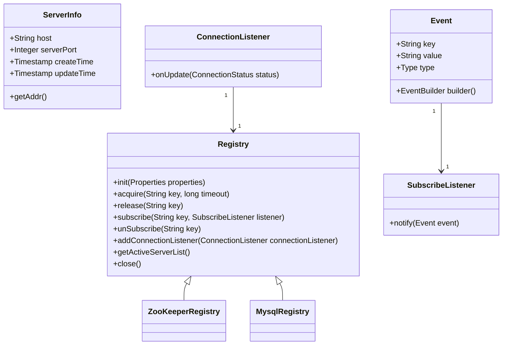
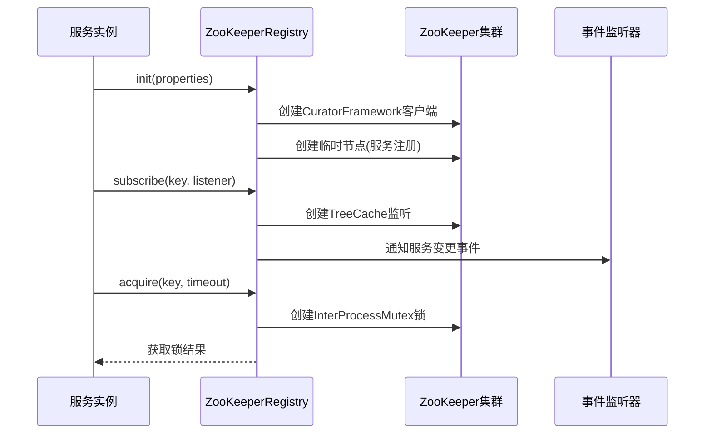
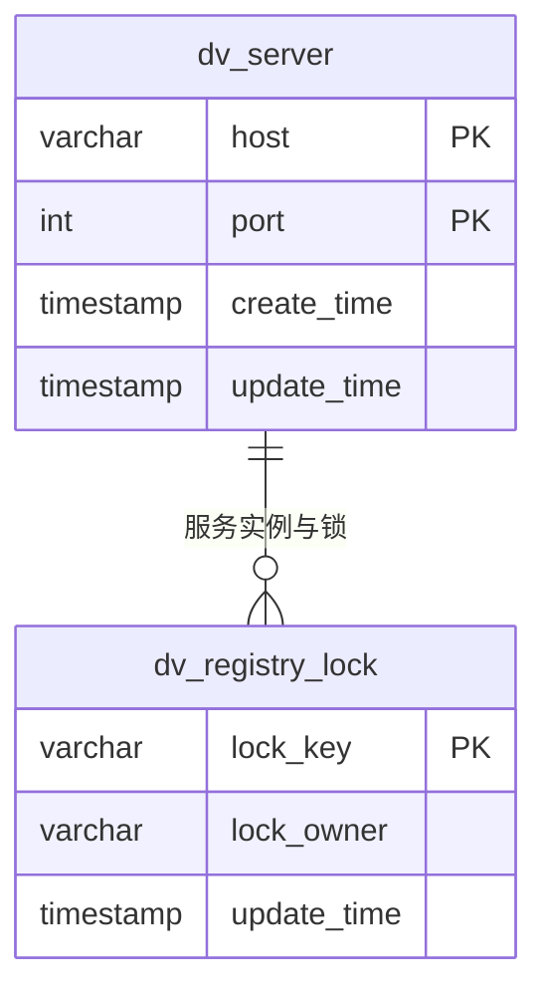
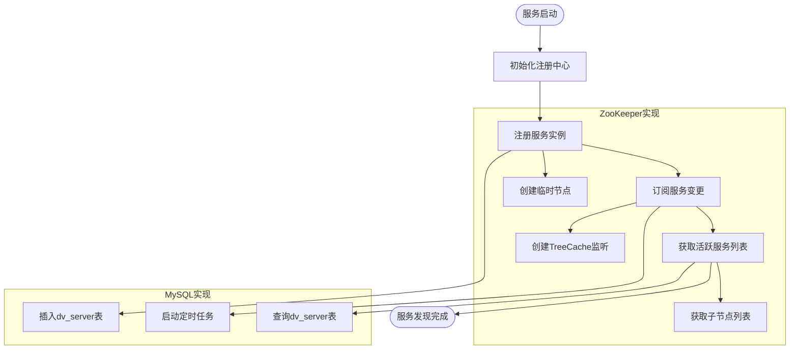
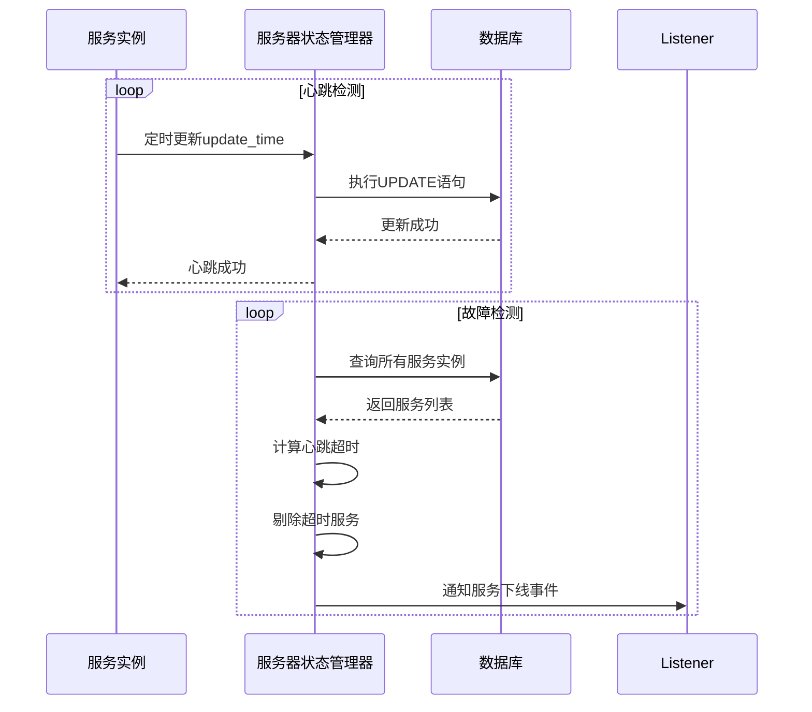
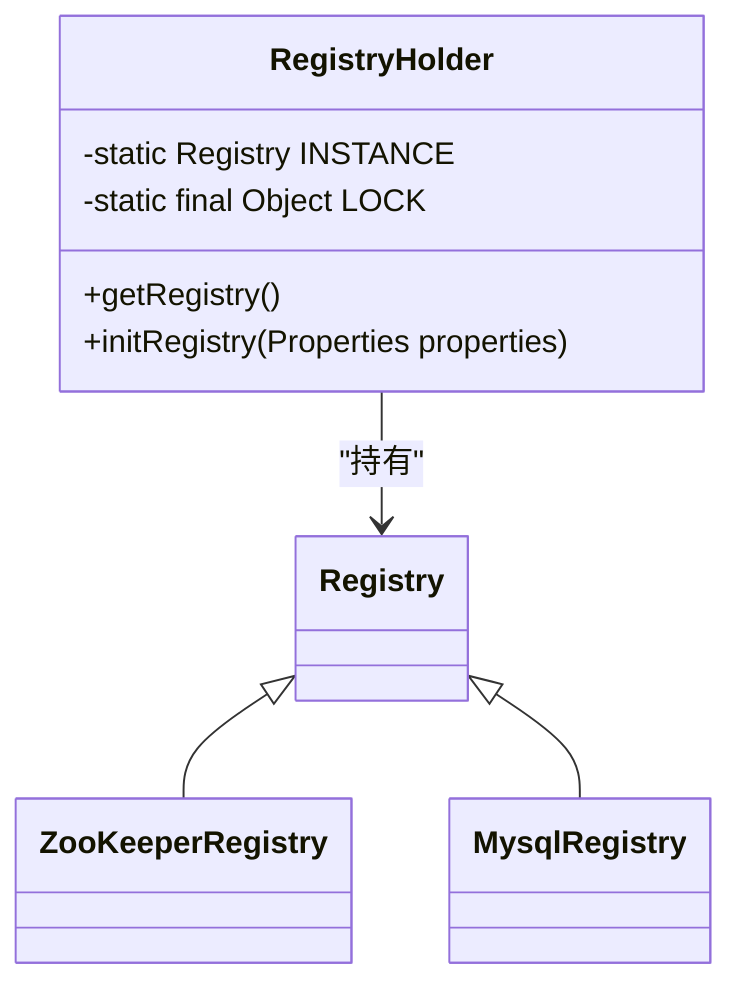
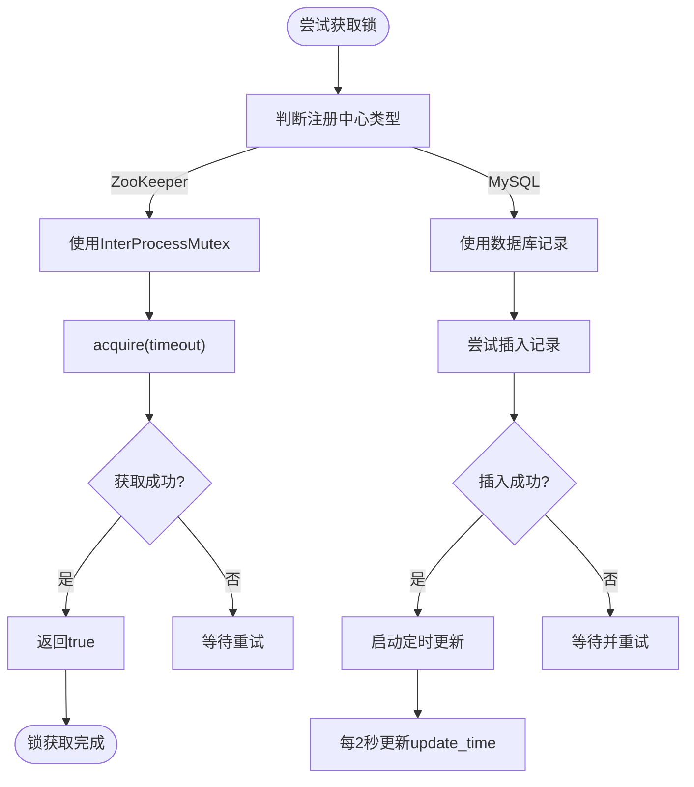

# 注册中心机制

<cite>
**本文档引用的文件**  
- [Registry.java](file://datavines-registry/datavines-registry-api/src/main/java/io/datavines/registry/api/Registry.java)
- [ServerInfo.java](file://datavines-registry/datavines-registry-api/src/main/java/io/datavines/registry/api/ServerInfo.java)
- [ZooKeeperRegistry.java](file://datavines-registry/datavines-registry-plugins/datavines-registry-zookeeper/src/main/java/io/datavines/registry/plugin/ZooKeeperRegistry.java)
- [MysqlRegistry.java](file://datavines-registry/datavines-registry-plugins/datavines-registry-mysql/src/main/java/io/datavines/registry/plugin/MysqlRegistry.java)
- [MysqlMutex.java](file://datavines-registry/datavines-registry-plugins/datavines-registry-mysql/src/main/java/io/datavines/registry/plugin/MysqlMutex.java)
- [MysqlServerStateManager.java](file://datavines-registry/datavines-registry-plugins/datavines-registry-mysql/src/main/java/io/datavines/registry/plugin/MysqlServerStateManager.java)
- [RegistryHolder.java](file://datavines-server/src/main/java/io/datavines/server/registry/RegistryHolder.java)
- [ZooKeeperClient.java](file://datavines-common/src/main/java/io/datavines/common/zookeeper/ZooKeeperClient.java)
- [ZooKeeperConfig.java](file://datavines-common/src/main/java/io/datavines/common/zookeeper/ZooKeeperConfig.java)
</cite>

## 目录
1. [引言](#引言)
2. [注册中心接口设计](#注册中心接口设计)
3. [ZooKeeper实现机制](#zookeeper实现机制)
4. [MySQL实现机制](#mysql实现机制)
5. [服务注册与发现流程](#服务注册与发现流程)
6. [心跳检测与故障剔除](#心跳检测与故障剔除)
7. [RegistryHolder客户端管理](#registryholder客户端管理)
8. [分布式锁实现原理](#分布式锁实现原理)
9. [注册中心选型建议](#注册中心选型建议)
10. [性能优化方案](#性能优化方案)

## 引言
DataVines注册中心机制为分布式系统提供了服务注册与发现的核心功能。该机制通过统一的Registry接口抽象，支持ZooKeeper和MySQL两种注册中心实现方式，满足不同场景下的高可用和性能需求。注册中心负责管理服务实例的生命周期，包括服务注册、心跳维持、故障检测和分布式锁管理等功能，为DataVines集群的稳定运行提供基础保障。

## 注册中心接口设计
DataVines注册中心采用接口抽象设计，定义了统一的Registry接口，包含服务注册、发现、分布式锁和事件监听等核心功能。

**图示来源**
- [Registry.java](file://datavines-registry/datavines-registry-api/src/main/java/io/datavines/registry/api/Registry.java)
- [ServerInfo.java](file://datavines-registry/datavines-registry-api/src/main/java/io/datavines/registry/api/ServerInfo.java)
- [Event.java](file://datavines-registry/datavines-registry-api/src/main/java/io/datavines/registry/api/Event.java)
- [SubscribeListener.java](file://datavines-registry/datavines-registry-api/src/main/java/io/datavines/registry/api/SubscribeListener.java)
- [ConnectionListener.java](file://datavines-registry/datavines-registry-api/src/main/java/io/datavines/registry/api/ConnectionListener.java)

**本节来源**
- [Registry.java](file://datavines-registry/datavines-registry-api/src/main/java/io/datavines/registry/api/Registry.java#L26-L42)
- [ServerInfo.java](file://datavines-registry/datavines-registry-api/src/main/java/io/datavines/registry/api/ServerInfo.java#L30-L48)

## ZooKeeper实现机制
ZooKeeper注册中心实现基于Curator框架，利用ZooKeeper的临时节点特性实现服务注册与发现，通过TreeCache实现事件监听，使用InterProcessMutex实现分布式锁。

**图示来源**
- [ZooKeeperRegistry.java](file://datavines-registry/datavines-registry-plugins/datavines-registry-zookeeper/src/main/java/io/datavines/registry/plugin/ZooKeeperRegistry.java)
- [ZooKeeperClient.java](file://datavines-common/src/main/java/io/datavines/common/zookeeper/ZooKeeperClient.java)

**本节来源**
- [ZooKeeperRegistry.java](file://datavines-registry/datavines-registry-plugins/datavines-registry-zookeeper/src/main/java/io/datavines/registry/plugin/ZooKeeperRegistry.java#L43-L241)
- [ZooKeeperClient.java](file://datavines-common/src/main/java/io/datavines/common/zookeeper/ZooKeeperClient.java#L39-L224)
- [ZooKeeperConfig.java](file://datavines-common/src/main/java/io/datavines/common/zookeeper/ZooKeeperConfig.java#L19-L105)

## MySQL实现机制
MySQL注册中心实现基于关系型数据库，通过数据库表记录服务实例信息和锁状态，使用定时任务实现心跳检测和故障剔除。

**图示来源**
- [MysqlRegistry.java](file://datavines-registry/datavines-registry-plugins/datavines-registry-mysql/src/main/java/io/datavines/registry/plugin/MysqlRegistry.java)
- [MysqlServerStateManager.java](file://datavines-registry/datavines-registry-plugins/datavines-registry-mysql/src/main/java/io/datavines/registry/plugin/MysqlServerStateManager.java)
- [MysqlMutex.java](file://datavines-registry/datavines-registry-plugins/datavines-registry-mysql/src/main/java/io/datavines/registry/plugin/MysqlMutex.java)

**本节来源**
- [MysqlRegistry.java](file://datavines-registry/datavines-registry-plugins/datavines-registry-mysql/src/main/java/io/datavines/registry/plugin/MysqlRegistry.java#L29-L107)
- [MysqlMutex.java](file://datavines-registry/datavines-registry-plugins/datavines-registry-mysql/src/main/java/io/datavines/registry/plugin/MysqlMutex.java#L36-L218)
- [MysqlServerStateManager.java](file://datavines-registry/datavines-registry-plugins/datavines-registry-mysql/src/main/java/io/datavines/registry/plugin/MysqlServerStateManager.java#L33-L257)

## 服务注册与发现流程
DataVines注册中心的服务注册与发现流程包括初始化、注册、订阅和获取活跃服务列表等关键步骤。

**图示来源**
- [ZooKeeperRegistry.java](file://datavines-registry/datavines-registry-plugins/datavines-registry-zookeeper/src/main/java/io/datavines/registry/plugin/ZooKeeperRegistry.java)
- [MysqlRegistry.java](file://datavines-registry/datavines-registry-plugins/datavines-registry-mysql/src/main/java/io/datavines/registry/plugin/MysqlRegistry.java)

**本节来源**
- [ZooKeeperRegistry.java](file://datavines-registry/datavines-registry-plugins/datavines-registry-zookeeper/src/main/java/io/datavines/registry/plugin/ZooKeeperRegistry.java#L56-L74)
- [MysqlRegistry.java](file://datavines-registry/datavines-registry-plugins/datavines-registry-mysql/src/main/java/io/datavines/registry/plugin/MysqlRegistry.java#L36-L50)
- [ZooKeeperRegistry.java](file://datavines-registry/datavines-registry-plugins/datavines-registry-zookeeper/src/main/java/io/datavines/registry/plugin/ZooKeeperRegistry.java#L191-L205)
- [MysqlServerStateManager.java](file://datavines-registry/datavines-registry-plugins/datavines-registry-mysql/src/main/java/io/datavines/registry/plugin/MysqlServerStateManager.java#L200-L210)

## 心跳检测与故障剔除
注册中心通过心跳机制维持服务实例的活跃状态，并在检测到故障时及时剔除失效节点。

**图示来源**
- [MysqlServerStateManager.java](file://datavines-registry/datavines-registry-plugins/datavines-registry-mysql/src/main/java/io/datavines/registry/plugin/MysqlServerStateManager.java)

**本节来源**
- [MysqlServerStateManager.java](file://datavines-registry/datavines-registry-plugins/datavines-registry-mysql/src/main/java/io/datavines/registry/plugin/MysqlServerStateManager.java#L51-L54)
- [MysqlServerStateManager.java](file://datavines-registry/datavines-registry-plugins/datavines-registry-mysql/src/main/java/io/datavines/registry/plugin/MysqlServerStateManager.java#L212-L228)
- [MysqlServerStateManager.java](file://datavines-registry/datavines-registry-plugins/datavines-registry-mysql/src/main/java/io/datavines/registry/plugin/MysqlServerStateManager.java#L231-L244)
- [MysqlServerStateManager.java](file://datavines-registry/datavines-registry-plugins/datavines-registry-mysql/src/main/java/io/datavines/registry/plugin/MysqlServerStateManager.java#L73-L130)

## RegistryHolder客户端管理
RegistryHolder采用单例模式管理注册中心客户端实例，确保系统中只有一个注册中心连接。

**图示来源**
- [RegistryHolder.java](file://datavines-server/src/main/java/io/datavines/server/registry/RegistryHolder.java)

**本节来源**
- [RegistryHolder.java](file://datavines-server/src/main/java/io/datavines/server/registry/RegistryHolder.java)

## 分布式锁实现原理
DataVines注册中心提供了两种分布式锁实现：基于ZooKeeper的InterProcessMutex和基于MySQL的乐观锁机制。

**图示来源**
- [ZooKeeperRegistry.java](file://datavines-registry/datavines-registry-plugins/datavines-registry-zookeeper/src/main/java/io/datavines/registry/plugin/ZooKeeperRegistry.java)
- [MysqlMutex.java](file://datavines-registry/datavines-registry-plugins/datavines-registry-mysql/src/main/java/io/datavines/registry/plugin/MysqlMutex.java)

**本节来源**
- [ZooKeeperRegistry.java](file://datavines-registry/datavines-registry-plugins/datavines-registry-zookeeper/src/main/java/io/datavines/registry/plugin/ZooKeeperRegistry.java#L77-L112)
- [MysqlMutex.java](file://datavines-registry/datavines-registry-plugins/datavines-registry-mysql/src/main/java/io/datavines/registry/plugin/MysqlMutex.java#L67-L96)
- [MysqlMutex.java](file://datavines-registry/datavines-registry-plugins/datavines-registry-mysql/src/main/java/io/datavines/registry/plugin/MysqlMutex.java#L184-L217)

## 注册中心选型建议
根据不同的应用场景和需求，建议如下：

| 选型维度 | ZooKeeper | MySQL |
|---------|---------|-------|
| **一致性** | 强一致性 | 最终一致性 |
| **可用性** | 高可用 | 依赖数据库可用性 |
| **性能** | 高性能读写 | 受数据库性能限制 |
| **复杂性** | 需要维护ZooKeeper集群 | 利用现有数据库 |
| **适用场景** | 高并发、低延迟场景 | 已有MySQL基础设施 |
| **数据持久化** | 内存+磁盘 | 持久化存储 |
| **扩展性** | 易于水平扩展 | 受单机性能限制 |

**本节来源**
- [ZooKeeperRegistry.java](file://datavines-registry/datavines-registry-plugins/datavines-registry-zookeeper/src/main/java/io/datavines/registry/plugin/ZooKeeperRegistry.java)
- [MysqlRegistry.java](file://datavines-registry/datavines-registry-plugins/datavines-registry-mysql/src/main/java/io/datavines/registry/plugin/MysqlRegistry.java)

## 性能优化方案
针对注册中心的性能优化，建议采取以下措施：

1. **连接池优化**：对MySQL注册中心使用数据库连接池，减少连接创建开销
2. **缓存机制**：在客户端缓存服务列表，减少对注册中心的频繁查询
3. **批量操作**：合并多个注册/注销操作，减少网络往返次数
4. **异步处理**：将非关键操作异步化，提高响应速度
5. **参数调优**：
   - ZooKeeper会话超时时间设置为60秒
   - MySQL心跳检测间隔设置为2秒
   - 故障剔除超时时间设置为20秒
6. **监控告警**：建立注册中心健康度监控，及时发现和处理异常
7. **降级策略**：在网络分区等异常情况下，启用本地缓存降级模式

**本节来源**
- [ZooKeeperConfig.java](file://datavines-common/src/main/java/io/datavines/common/zookeeper/ZooKeeperConfig.java#L23-L31)
- [MysqlServerStateManager.java](file://datavines-registry/datavines-registry-plugins/datavines-registry-mysql/src/main/java/io/datavines/registry/plugin/MysqlServerStateManager.java#L51-L54)
- [MysqlMutex.java](file://datavines-registry/datavines-registry-plugins/datavines-registry-mysql/src/main/java/io/datavines/registry/plugin/MysqlMutex.java#L38-L40)