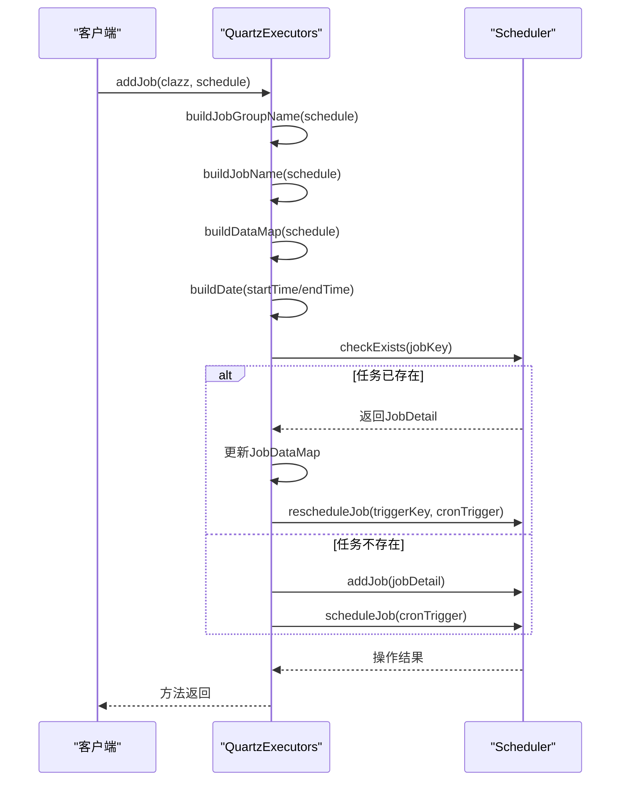
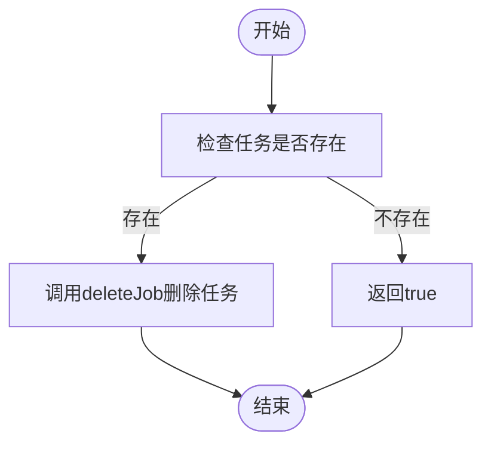
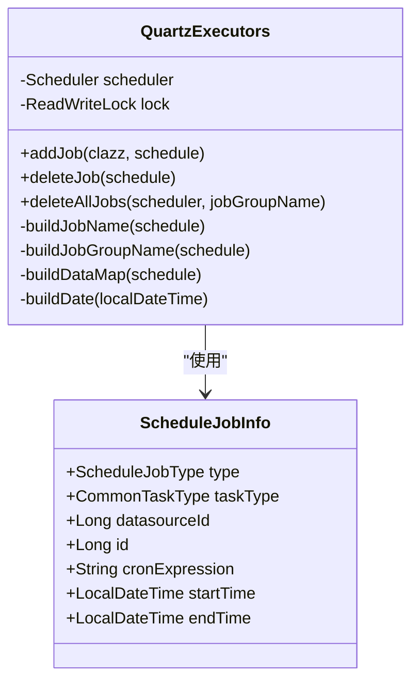
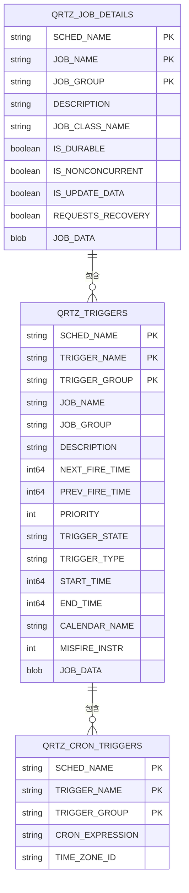

# Quartz调度器

<cite>
**本文档引用的文件**
- [QuartzExecutors.java](file://datavines-server\src\main\java\io\datavines\server\dqc\coordinator\quartz\QuartzExecutors.java)
- [ScheduleJobInfo.java](file://datavines-server\src\main\java\io\datavines\server\dqc\coordinator\quartz\ScheduleJobInfo.java)
- [application.yaml](file://datavines-server\src\main\resources\application.yaml)
- [CommonTaskScheduleServiceImpl.java](file://datavines-server\src\main\java\io\datavines\server\repository\service\impl\CommonTaskScheduleServiceImpl.java)
</cite>

## 目录
1. [引言](#引言)
2. [QuartzExecutors类概述](#quartzexecutors类概述)
3. [定时任务创建与注册](#定时任务创建与注册)
4. [任务删除机制](#任务删除机制)
5. [任务标识符生成](#任务标识符生成)
6. [时区转换逻辑](#时区转换逻辑)
7. [配置最佳实践与性能调优](#配置最佳实践与性能调优)
8. [结论](#结论)

## 引言
Quartz调度器是DataVines系统中用于管理定时任务的核心组件。它通过QuartzExecutors类实现对调度器实例的统一管理，支持定时任务的创建、更新、删除等操作。本文档详细阐述了QuartzExecutors类的工作机制，包括任务的创建与注册、删除机制、唯一标识符生成以及时区转换等关键功能。

## QuartzExecutors类概述
QuartzExecutors类是DataVines系统中Quartz调度器的执行器，负责管理调度器实例。该类通过@Autowired注入Scheduler实例，利用ReadWriteLock实现线程安全的读写操作。QuartzExecutors提供了addJob、deleteJob、deleteAllJobs等核心方法，用于管理定时任务的生命周期。

**本文档引用的文件**
- [QuartzExecutors.java](file://datavines-server\src\main\java\io\datavines\server\dqc\coordinator\quartz\QuartzExecutors.java)

## 定时任务创建与注册
### JobDetail与CronTrigger的构建过程
addJob方法负责创建和注册定时任务。该方法接收Job类和ScheduleJobInfo对象作为参数，首先通过buildJobGroupName和buildJobName方法生成任务组名和任务名，然后构建JobDataMap包含任务相关数据。



**图示来源**
- [QuartzExecutors.java](file://datavines-server\src\main\java\io\datavines\server\dqc\coordinator\quartz\QuartzExecutors.java#L74-L148)

**本节来源**
- [QuartzExecutors.java](file://datavines-server\src\main\java\io\datavines\server\dqc\coordinator\quartz\QuartzExecutors.java#L74-L148)
- [ScheduleJobInfo.java](file://datavines-server\src\main\java\io\datavines\server\dqc\coordinator\quartz\ScheduleJobInfo.java#L27-L41)

## 任务删除机制
### deleteJob方法
deleteJob方法用于删除指定的定时任务。该方法首先获取任务名称和组名，创建JobKey对象，然后检查任务是否存在。如果任务存在，则调用scheduler.deleteJob(jobKey)进行删除；如果任务不存在，则返回true表示删除成功。

### deleteAllJobs方法
deleteAllJobs方法用于删除指定任务组中的所有任务。该方法通过GroupMatcher.groupEndsWith(jobGroupName)获取任务组中所有任务的JobKey，然后调用scheduler.deleteJobs(jobKeys)批量删除任务。



**图示来源**
- [QuartzExecutors.java](file://datavines-server\src\main\java\io\datavines\server\dqc\coordinator\quartz\QuartzExecutors.java#L157-L196)

**本节来源**
- [QuartzExecutors.java](file://datavines-server\src\main\java\io\datavines\server\dqc\coordinator\quartz\QuartzExecutors.java#L157-L196)

## 任务标识符生成
### buildJobName方法
buildJobName方法用于生成任务的唯一名称。该方法将任务类型描述与任务ID通过下划线连接，形成"类型_job_任务ID"的格式。

### buildJobGroupName方法
buildJobGroupName方法用于生成任务组的唯一名称。该方法将任务类型描述与数据源ID通过下划线连接，形成"类型_job_group_数据源ID"的格式。



**图示来源**
- [QuartzExecutors.java](file://datavines-server\src\main\java\io\datavines\server\dqc\coordinator\quartz\QuartzExecutors.java#L204-L215)
- [ScheduleJobInfo.java](file://datavines-server\src\main\java\io\datavines\server\dqc\coordinator\quartz\ScheduleJobInfo.java#L27-L41)

**本节来源**
- [QuartzExecutors.java](file://datavines-server\src\main\java\io\datavines\server\dqc\coordinator\quartz\QuartzExecutors.java#L204-L215)
- [ScheduleJobInfo.java](file://datavines-server\src\main\java\io\datavines\server\dqc\coordinator\quartz\ScheduleJobInfo.java#L27-L41)

## 时区转换逻辑
### buildDate方法
buildDate方法实现了时区转换逻辑。该方法接收LocalDateTime对象，将其转换为系统默认时区的ZonedDateTime，再转换为Instant，最后生成Date对象。这种转换机制确保了在不同时区环境下任务调度的准确性。

```mermaid
flowchart LR
A[LocalDateTime] --> B[ZoneId.systemDefault()]
B --> C[ZonedDateTime]
C --> D[Instant]
D --> E[Date]
```

**图示来源**
- [QuartzExecutors.java](file://datavines-server\src\main\java\io\datavines\server\dqc\coordinator\quartz\QuartzExecutors.java#L232-L237)

**本节来源**
- [QuartzExecutors.java](file://datavines-server\src\main\java\io\datavines\server\dqc\coordinator\quartz\QuartzExecutors.java#L232-L237)

## 配置最佳实践与性能调优
### Quartz配置最佳实践
根据application.yaml中的配置，Quartz调度器采用JDBC存储类型，支持集群部署。关键配置包括：
- job-store-type: jdbc（使用数据库存储任务信息）
- org.quartz.jobStore.isClustered: true（启用集群模式）
- org.quartz.threadPool.threadCount: 25（线程池大小）
- org.quartz.jobStore.misfireThreshold: 60000（错失触发阈值）

### 性能调优建议
1. 合理设置线程池大小，避免过多线程导致系统资源耗尽
2. 配置合适的错失触发阈值，平衡任务执行的及时性和系统负载
3. 使用集群模式提高系统的可用性和扩展性
4. 定期清理已完成的任务，避免数据库表过大影响性能



**图示来源**
- [application.yaml](file://datavines-server\src\main\resources\application.yaml#L39-L59)

**本节来源**
- [application.yaml](file://datavines-server\src\main\resources\application.yaml#L39-L59)
- [QuartzExecutors.java](file://datavines-server\src\main\java\io\datavines\server\dqc\coordinator\quartz\QuartzExecutors.java)

## 结论
QuartzExecutors类作为DataVines系统中Quartz调度器的核心管理组件，提供了完整的定时任务管理功能。通过合理的任务标识符生成策略、时区转换机制和集群配置，确保了定时任务的准确执行和系统的高可用性。在实际应用中，应根据具体需求调整配置参数，优化系统性能。