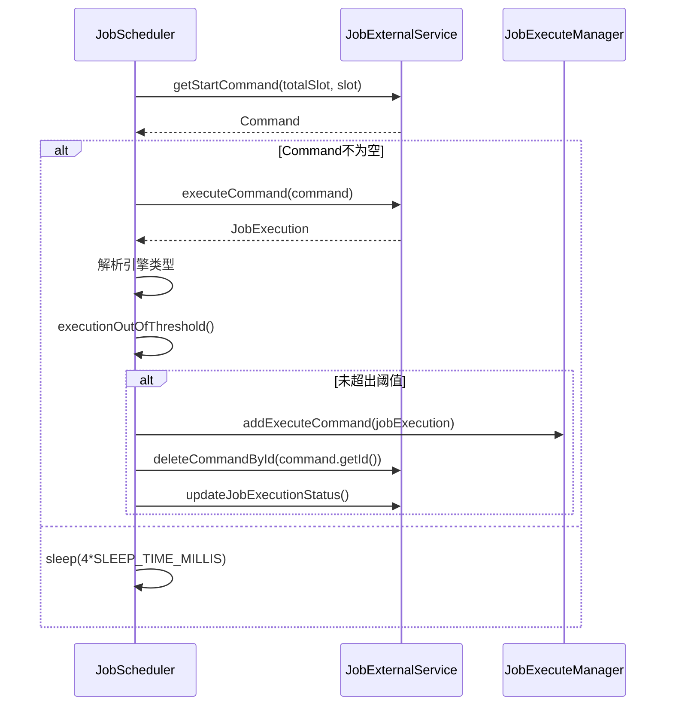
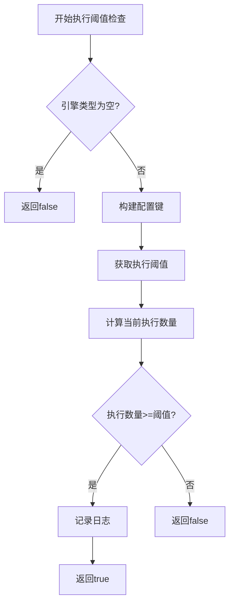

# 作业执行调度器

<cite>
**本文档引用的文件**
- [JobScheduler.java](file://datavines-server/src/main/java/io/datavines/server/dqc/coordinator/runner/JobScheduler.java)
- [JobExecuteManager.java](file://datavines-server/src/main/java/io/datavines/server/dqc/coordinator/cache/JobExecuteManager.java)
- [JobExternalService.java](file://datavines-server/src/main/java/io/datavines/server/repository/service/impl/JobExternalService.java)
- [Register.java](file://datavines-server/src/main/java/io/datavines/server/registry/Register.java)
- [OSUtils.java](file://datavines-common/src/main/java/io/datavines/common/utils/OSUtils.java)
- [CommonPropertyUtils.java](file://datavines-common/src/main/java/io/datavines/common/utils/CommonPropertyUtils.java)
- [Command.java](file://datavines-server/src/main/java/io/datavines/server/repository/entity/Command.java)
</cite>

## 目录
1. [引言](#引言)
2. [核心工作机制](#核心工作机制)
3. [主循环资源检查](#主循环资源检查)
4. [命令获取与执行](#命令获取与执行)
5. [执行阈值控制](#执行阈值控制)
6. [重试机制与异常处理](#重试机制与异常处理)
7. [性能监控与故障排查](#性能监控与故障排查)

## 引言
作业执行调度器是DataVines系统中的核心组件，负责协调和管理数据质量检查作业的执行。该调度器通过一个独立的线程运行，持续监控系统资源，从外部服务获取待执行的命令，并根据系统负载和配置策略决定是否执行作业。调度器实现了完善的重试机制、异常处理和故障恢复功能，确保作业执行的可靠性和稳定性。

**Section sources**
- [JobScheduler.java](file://datavines-server/src/main/java/io/datavines/server/dqc/coordinator/runner/JobScheduler.java#L39-L154)

## 核心工作机制
作业执行调度器（JobScheduler）继承自Thread类，作为一个独立的守护线程运行。其核心工作机制围绕run方法中的无限循环展开，该循环周期性地执行以下操作：检查系统资源、获取待执行命令、验证执行阈值、提交作业执行请求。调度器通过与JobExecuteManager、JobExternalService和Register等组件的协作，实现了作业执行的全流程管理。

```mermaid
sequenceDiagram
participant Scheduler as JobScheduler
participant Manager as JobExecuteManager
participant Service as JobExternalService
participant Register as Register
loop 主循环
Scheduler->>Service : listKillCommandByExecuteHost()
Service-->>Scheduler : Kill命令列表
alt 存在Kill命令
Scheduler->>Manager : addKillCommand()
Scheduler->>Service : deleteCommandById()
end
Scheduler->>OSUtils : checkResource()
OSUtils-->>Scheduler : 资源检查结果
alt 资源不足
Scheduler->>Scheduler : sleep(10*SLEEP_TIME_MILLIS)
break
end
Scheduler->>Service : getStartCommand()
Service-->>Scheduler : Start命令
alt 存在Start命令
Scheduler->>Service : executeCommand()
Service-->>Scheduler : JobExecution
Scheduler->>Scheduler : executionOutOfThreshold()
alt 未超出阈值
Scheduler->>Manager : addExecuteCommand()
Scheduler->>Service : deleteCommandById()
Scheduler->>Service : updateJobExecution()
end
else
Scheduler->>Scheduler : sleep(4*SLEEP_TIME_MILLIS)
end
end
```

**Diagram sources**
- [JobScheduler.java](file://datavines-server/src/main/java/io/datavines/server/dqc/coordinator/runner/JobScheduler.java#L58-L134)

**Section sources**
- [JobScheduler.java](file://datavines-server/src/main/java/io/datavines/server/dqc/coordinator/runner/JobScheduler.java#L39-L154)

## 主循环资源检查
调度器的主循环首先通过OSUtils工具类检查系统资源使用情况，确保在系统负载过高时不启动新的作业执行，避免对系统造成过大压力。资源检查主要关注CPU负载和内存使用情况，通过配置参数MAX_CPU_LOAD_AVG和RESERVED_MEMORY来定义资源使用上限。

```mermaid
flowchart TD
A[开始资源检查] --> B{Stopper.isRunning()}
B --> |否| C[退出循环]
B --> |是| D[获取CPU负载上限]
D --> E[获取保留内存大小]
E --> F[调用OSUtils.checkResource()]
F --> G{资源检查通过?}
G --> |否| H[休眠10倍SLEEP_TIME_MILLIS]
H --> B
G --> |是| I[继续执行流程]
```

**Diagram sources**
- [JobScheduler.java](file://datavines-server/src/main/java/io/datavines/server/dqc/coordinator/runner/JobScheduler.java#L80-L87)
- [OSUtils.java](file://datavines-common/src/main/java/io/datavines/common/utils/OSUtils.java)

**Section sources**
- [JobScheduler.java](file://datavines-server/src/main/java/io/datavines/server/dqc/coordinator/runner/JobScheduler.java#L80-L87)

## 命令获取与执行
调度器通过JobExternalService与外部服务交互，获取待执行的命令。命令分为Kill命令和Start命令两种类型。对于Kill命令，调度器会将其添加到JobExecuteManager的kill命令队列中；对于Start命令，调度器会获取作业执行信息，检查执行阈值，并将作业提交到执行队列。



**Diagram sources**
- [JobScheduler.java](file://datavines-server/src/main/java/io/datavines/server/dqc/coordinator/runner/JobScheduler.java#L89-L119)
- [JobExternalService.java](file://datavines-server/src/main/java/io/datavines/server/repository/service/impl/JobExternalService.java#L84-L106)
- [JobExecuteManager.java](file://datavines-server/src/main/java/io/datavines/server/dqc/coordinator/cache/JobExecuteManager.java#L542-L553)

**Section sources**
- [JobScheduler.java](file://datavines-server/src/main/java/io/datavines/server/dqc/coordinator/runner/JobScheduler.java#L89-L119)

## 执行阈值控制
调度器通过executionOutOfThreshold方法实现执行阈值控制，防止特定类型的引擎作业执行数量过多，导致系统资源耗尽。该方法根据引擎类型动态获取配置的执行阈值，并计算当前已执行的作业数量，当数量达到或超过阈值时，将阻止新的作业执行。



**Diagram sources**
- [JobScheduler.java](file://datavines-server/src/main/java/io/datavines/server/dqc/coordinator/runner/JobScheduler.java#L137-L153)
- [JobExecuteManager.java](file://datavines-server/src/main/java/io/datavines/server/dqc/coordinator/cache/JobExecuteManager.java#L533-L540)

**Section sources**
- [JobScheduler.java](file://datavines-server/src/main/java/io/datavines/server/dqc/coordinator/runner/JobScheduler.java#L137-L153)

## 重试机制与异常处理
调度器实现了基于退避算法的重试机制（RETRY_BACKOFF），在发生异常时能够自动重试，同时避免频繁重试对系统造成过大压力。重试间隔时间呈指数增长，最大间隔为10秒。异常处理机制确保在任何异常情况下都能正确更新命令状态，并记录详细的错误日志。

```mermaid
sequenceDiagram
participant Scheduler as JobScheduler
participant Service as JobExternalService
loop 主循环
try
Scheduler->>Scheduler : 执行核心逻辑
catch
Scheduler->>Scheduler : 重试次数+1
Scheduler->>Service : updateCommand(type=ERROR)
Scheduler->>Scheduler : 记录错误日志
Scheduler->>Scheduler : sleep(RETRY_BACKOFF[retryNum])
finally
Scheduler->>Service : refreshCommonProperties()
end
end
```

**Diagram sources**
- [JobScheduler.java](file://datavines-server/src/main/java/io/datavines/server/dqc/coordinator/runner/JobScheduler.java#L122-L133)
- [JobExternalService.java](file://datavines-server/src/main/java/io/datavines/server/repository/service/impl/JobExternalService.java#L223-L229)

**Section sources**
- [JobScheduler.java](file://datavines-server/src/main/java/io/datavines/server/dqc/coordinator/runner/JobScheduler.java#L43-L44)
- [JobScheduler.java](file://datavines-server/src/main/java/io/datavines/server/dqc/coordinator/runner/JobScheduler.java#L122-L133)

## 性能监控与故障排查
调度器的性能监控主要通过日志记录和系统资源检查实现。关键监控指标包括：调度器运行状态、资源检查结果、命令处理情况、执行阈值状态和异常信息。故障排查时应重点关注日志中的错误信息、资源使用情况和配置参数。

### 常见问题及解决方案
| 问题现象 | 可能原因 | 解决方案 |
|---------|--------|--------|
| 调度器无法启动 | 依赖服务未就绪 | 检查数据库连接、注册中心状态 |
| 作业执行缓慢 | 系统资源不足 | 调整MAX_CPU_LOAD_AVG、RESERVED_MEMORY配置 |
| 作业无法提交 | 执行阈值达到上限 | 检查引擎类型执行阈值配置 |
| 频繁重试 | 外部服务不稳定 | 检查JobExternalService健康状态 |
| 内存泄漏 | 未及时清理执行上下文 | 检查JobExecuteManager的缓存清理机制 |

**Section sources**
- [JobScheduler.java](file://datavines-server/src/main/java/io/datavines/server/dqc/coordinator/runner/JobScheduler.java)
- [JobExecuteManager.java](file://datavines-server/src/main/java/io/datavines/server/dqc/coordinator/cache/JobExecuteManager.java)
- [OSUtils.java](file://datavines-common/src/main/java/io/datavines/common/utils/OSUtils.java)
- [CommonPropertyUtils.java](file://datavines-common/src/main/java/io/datavines/common/utils/CommonPropertyUtils.java)