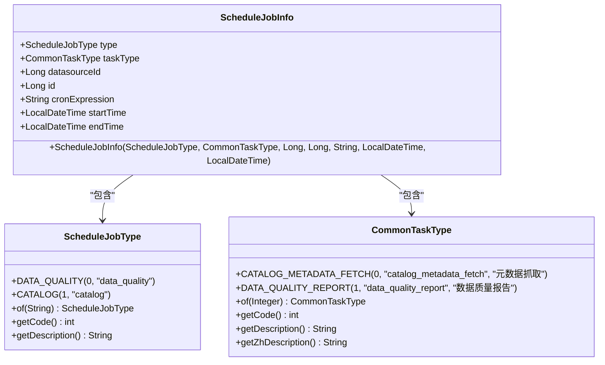
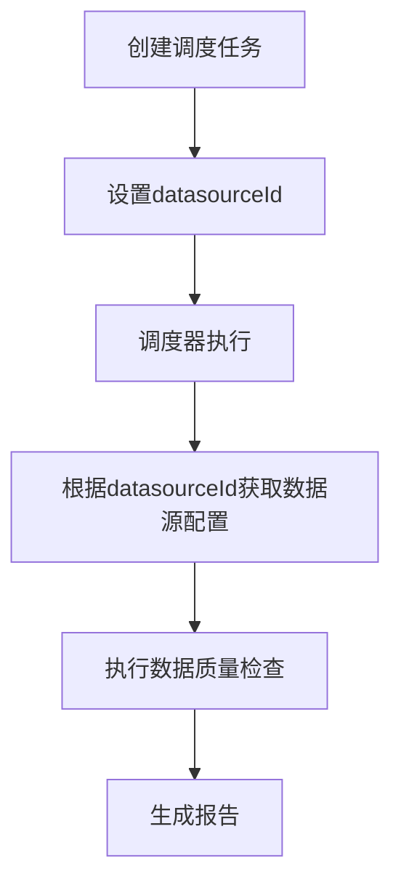
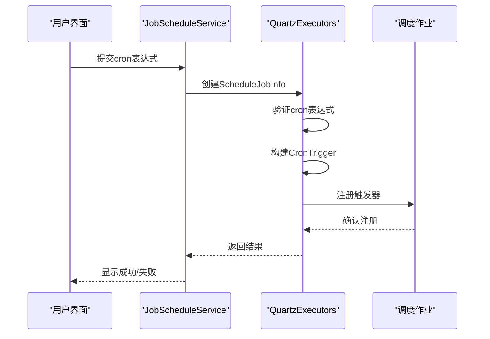
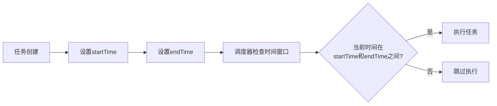
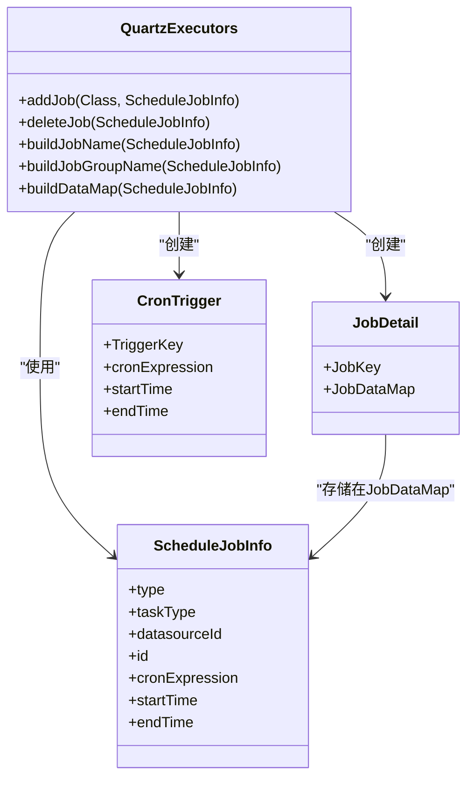
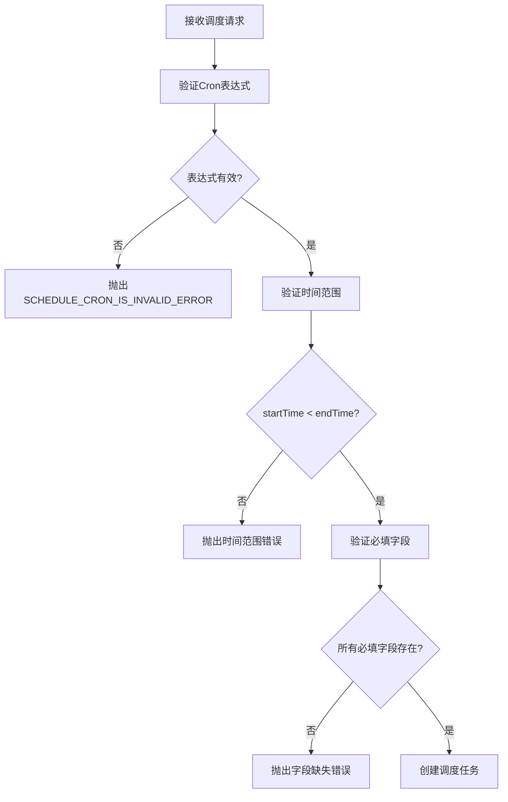

# 调度任务元数据

<cite>
**本文档引用的文件**   
- [ScheduleJobInfo.java](file://datavines-server/src/main/java/io/datavines/server/dqc/coordinator/quartz/ScheduleJobInfo.java)
- [QuartzExecutors.java](file://datavines-server/src/main/java/io/datavines/server/dqc/coordinator/quartz/QuartzExecutors.java)
- [JobScheduleServiceImpl.java](file://datavines-server/src/main/java/io/datavines/server/repository/service/impl/JobScheduleServiceImpl.java)
- [JobSchedule.java](file://datavines-server/src/main/java/io/datavines/server/repository/entity/JobSchedule.java)
- [ScheduleJobType.java](file://datavines-server/src/main/java/io/datavines/server/enums/ScheduleJobType.java)
- [CommonTaskType.java](file://datavines-server/src/main/java/io/datavines/server/enums/CommonTaskType.java)
</cite>

## 目录
1. [调度任务元数据概述](#调度任务元数据概述)
2. [ScheduleJobInfo类结构分析](#schedulejobinfo类结构分析)
3. [核心字段详解](#核心字段详解)
4. [执行计划定义](#执行计划定义)
5. [Quartz调度器集成](#quartz调度器集成)
6. [元数据验证与错误处理](#元数据验证与错误处理)
7. [最佳实践建议](#最佳实践建议)

## 调度任务元数据概述

调度任务元数据是DataVines系统中用于定义和管理定时任务的核心数据结构。该元数据通过`ScheduleJobInfo`类实现，作为Quartz调度框架与业务逻辑之间的数据传输载体。该类封装了任务调度所需的所有必要信息，包括任务类型、数据源、执行周期等关键属性，确保调度系统能够准确地执行数据质量检查、元数据采集等周期性任务。

**Section sources**
- [ScheduleJobInfo.java](file://datavines-server/src/main/java/io/datavines/server/dqc/coordinator/quartz/ScheduleJobInfo.java#L1-L57)

## ScheduleJobInfo类结构分析

`ScheduleJobInfo`类是调度任务元数据的核心实现，采用Lombok注解简化代码结构，提供完整的getter和setter方法。该类定义了调度任务所需的所有属性，并通过构造函数确保对象的完整初始化。

**Diagram sources**
- [ScheduleJobInfo.java](file://datavines-server/src/main/java/io/datavines/server/dqc/coordinator/quartz/ScheduleJobInfo.java#L25-L57)
- [ScheduleJobType.java](file://datavines-server/src/main/java/io/datavines/server/enums/ScheduleJobType.java#L24-L64)
- [CommonTaskType.java](file://datavines-server/src/main/java/io/datavines/server/enums/CommonTaskType.java#L24-L74)

**Section sources**
- [ScheduleJobInfo.java](file://datavines-server/src/main/java/io/datavines/server/dqc/coordinator/quartz/ScheduleJobInfo.java#L25-L57)

## 核心字段详解

### type字段
`type`字段表示调度任务的类型，使用`ScheduleJobType`枚举定义。目前支持两种类型：
- **DATA_QUALITY**: 数据质量检查任务
- **CATALOG**: 元数据采集任务

该字段决定了任务的处理逻辑和所属模块，在调度器中用于区分不同类型的作业。

### taskType字段
`taskType`字段表示具体的任务子类型，使用`CommonTaskType`枚举定义。该字段提供了更细粒度的任务分类：
- **CATALOG_METADATA_FETCH**: 元数据抓取
- **DATA_QUALITY_REPORT**: 数据质量报告

### datasourceId字段
`datasourceId`字段存储关联的数据源ID，用于标识任务执行时需要访问的具体数据源。该ID在执行任务时被传递给数据访问组件，确保任务能够正确连接到目标数据源。

**Diagram sources**
- [ScheduleJobInfo.java](file://datavines-server/src/main/java/io/datavines/server/dqc/coordinator/quartz/ScheduleJobInfo.java#L32-L33)
- [JobScheduleServiceImpl.java](file://datavines-server/src/main/java/io/datavines/server/repository/service/impl/JobScheduleServiceImpl.java#L170-L178)

**Section sources**
- [ScheduleJobInfo.java](file://datavines-server/src/main/java/io/datavines/server/dqc/coordinator/quartz/ScheduleJobInfo.java#L28-L34)
- [ScheduleJobType.java](file://datavines-server/src/main/java/io/datavines/server/enums/ScheduleJobType.java#L24-L34)
- [CommonTaskType.java](file://datavines-server/src/main/java/io/datavines/server/enums/CommonTaskType.java#L24-L32)

## 执行计划定义

### cronExpression字段
`cronExpression`字段使用标准的Cron表达式语法定义任务的执行周期。系统支持完整的Cron语法，包括秒、分、时、日、月、周等时间单位的灵活配置。

**Diagram sources**
- [QuartzExecutors.java](file://datavines-server/src/main/java/io/datavines/server/dqc/coordinator/quartz/QuartzExecutors.java#L118-L125)
- [ScheduleJobInfo.java](file://datavines-server/src/main/java/io/datavines/server/dqc/coordinator/quartz/ScheduleJobInfo.java#L36-L37)

### startTime和endTime字段
`startTime`和`endTime`字段使用`LocalDateTime`类型定义任务的有效执行时间窗口。这两个字段共同确定了任务的生命周期：

- **startTime**: 任务开始生效的时间点，调度器在此时间之后才开始执行任务
- **endTime**: 任务结束生效的时间点，调度器在此时间之后停止执行任务

**Diagram sources**
- [ScheduleJobInfo.java](file://datavines-server/src/main/java/io/datavines/server/dqc/coordinator/quartz/ScheduleJobInfo.java#L38-L40)
- [QuartzExecutors.java](file://datavines-server/src/main/java/io/datavines/server/dqc/coordinator/quartz/QuartzExecutors.java#L90-L91)

**Section sources**
- [ScheduleJobInfo.java](file://datavines-server/src/main/java/io/datavines/server/dqc/coordinator/quartz/ScheduleJobInfo.java#L36-L40)
- [QuartzExecutors.java](file://datavines-server/src/main/java/io/datavines/server/dqc/coordinator/quartz/QuartzExecutors.java#L74-L148)

## Quartz调度器集成

`ScheduleJobInfo`对象作为Quartz调度器与业务逻辑之间的桥梁，通过`QuartzExecutors`类实现集成。当创建或更新调度任务时，系统会将`ScheduleJobInfo`对象转换为Quartz的`JobDetail`和`CronTrigger`。

**Diagram sources**
- [QuartzExecutors.java](file://datavines-server/src/main/java/io/datavines/server/dqc/coordinator/quartz/QuartzExecutors.java#L74-L148)
- [ScheduleJobInfo.java](file://datavines-server/src/main/java/io/datavines/server/dqc/coordinator/quartz/ScheduleJobInfo.java#L25-L57)

**Section sources**
- [QuartzExecutors.java](file://datavines-server/src/main/java/io/datavines/server/dqc/coordinator/quartz/QuartzExecutors.java#L74-L148)
- [JobScheduleServiceImpl.java](file://datavines-server/src/main/java/io/datavines/server/repository/service/impl/JobScheduleServiceImpl.java#L169-L178)

## 元数据验证与错误处理

系统提供了完善的元数据验证机制，确保调度任务配置的正确性。主要验证包括：

1. **Cron表达式验证**: 使用Quartz的`CronExpression.isValidExpression()`方法验证表达式语法
2. **时间范围验证**: 确保`startTime`早于`endTime`
3. **必填字段验证**: 检查关键字段是否为空

**Diagram sources**
- [QuartzExecutors.java](file://datavines-server/src/main/java/io/datavines/server/dqc/coordinator/quartz/QuartzExecutors.java#L239-L263)
- [JobScheduleServiceImpl.java](file://datavines-server/src/main/java/io/datavines/server/repository/service/impl/JobScheduleServiceImpl.java#L73-L88)

**Section sources**
- [QuartzExecutors.java](file://datavines-server/src/main/java/io/datavines/server/dqc/coordinator/quartz/QuartzExecutors.java#L239-L263)
- [JobScheduleServiceImpl.java](file://datavines-server/src/main/java/io/datavines/server/repository/service/impl/JobScheduleServiceImpl.java#L73-L88)

## 最佳实践建议

1. **合理设置时间窗口**: 确保`startTime`和`endTime`设置合理，避免任务在不需要的时间段执行
2. **Cron表达式测试**: 在生产环境部署前，使用`listFutureCronRunTimes`方法测试Cron表达式的执行时间
3. **错误处理**: 捕获并处理`DataVinesServerException`异常，提供友好的错误提示
4. **资源管理**: 及时清理不再需要的调度任务，避免资源浪费
5. **监控告警**: 对关键调度任务设置监控和告警，及时发现执行异常

**Section sources**
- [QuartzExecutors.java](file://datavines-server/src/main/java/io/datavines/server/dqc/coordinator/quartz/QuartzExecutors.java#L244-L263)
- [JobScheduleServiceImpl.java](file://datavines-server/src/main/java/io/datavines/server/repository/service/impl/JobScheduleServiceImpl.java#L180-L198)