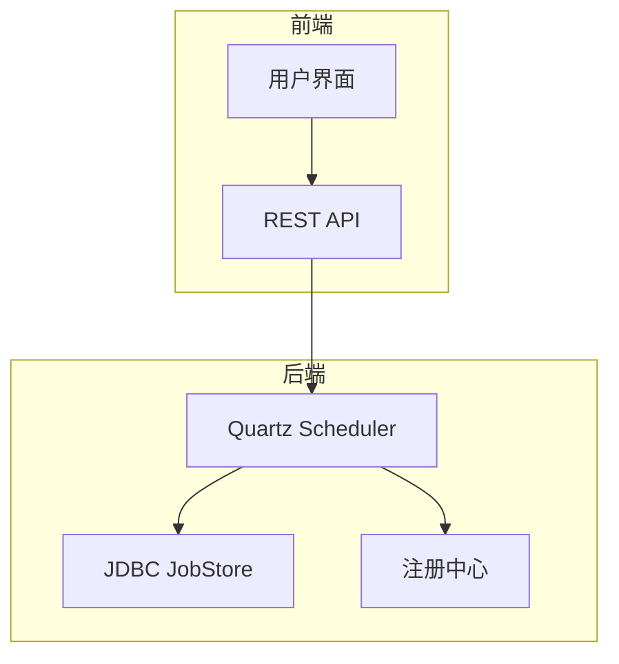
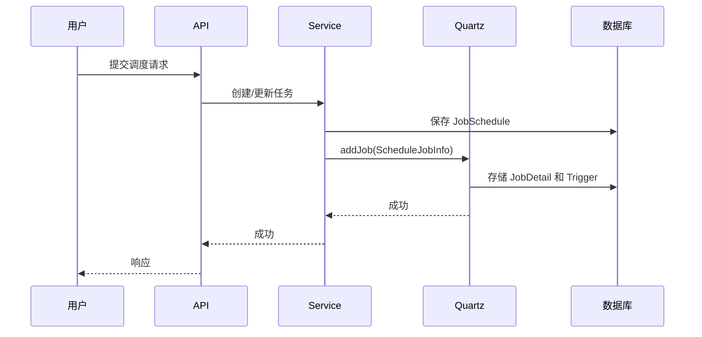
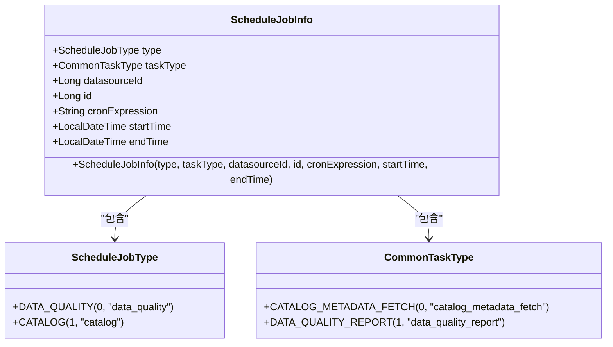
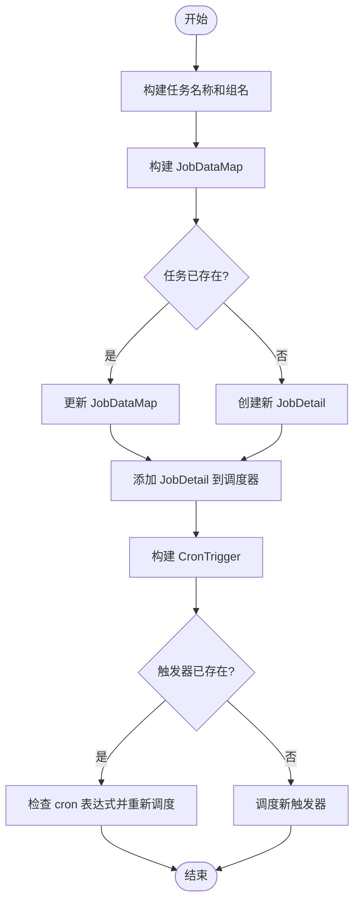
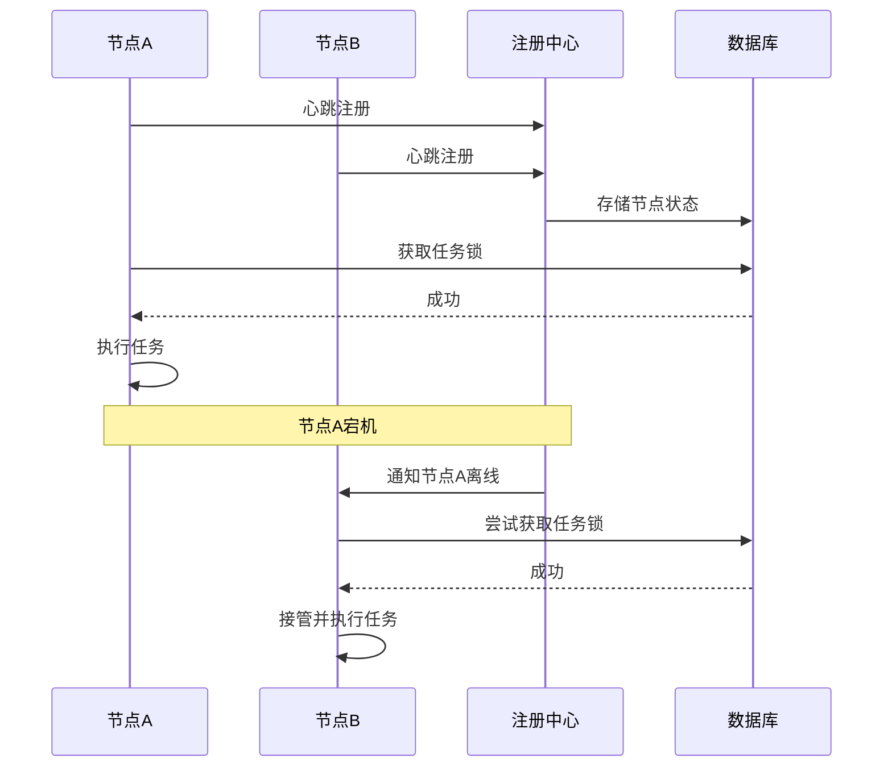

# 调度机制

<cite>
**本文档中引用的文件**  
- [QuartzExecutors.java](file://datavines-server/src/main/java/io/datavines/server/dqc/coordinator/quartz/QuartzExecutors.java)
- [ScheduleJobInfo.java](file://datavines-server/src/main/java/io/datavines/server/dqc/coordinator/quartz/ScheduleJobInfo.java)
- [DataQualityScheduleJob.java](file://datavines-server/src/main/java/io/datavines/server/dqc/coordinator/quartz/DataQualityScheduleJob.java)
- [JobScheduleServiceImpl.java](file://datavines-server/src/main/java/io/datavines/server/repository/service/impl/JobScheduleServiceImpl.java)
- [JobSchedule.java](file://datavines-server/src/main/java/io/datavines/server/repository/entity/JobSchedule.java)
- [application.yaml](file://datavines-server/src/main/resources/application.yaml)
- [ScheduleJobType.java](file://datavines-server/src/main/java/io/datavines/server/enums/ScheduleJobType.java)
- [CommonTaskType.java](file://datavines-server/src/main/java/io/datavines/server/enums/CommonTaskType.java)
</cite>

## 目录
1. [引言](#引言)
2. [调度系统架构](#调度系统架构)
3. [定时任务的创建与存储](#定时任务的创建与存储)
4. [ScheduleJobInfo 调度元数据封装](#schedulejobinfo-调度元数据封装)
5. [QuartzExecutors 调度器管理](#quartzexecutors-调度器管理)
6. [分布式任务协调与故障转移](#分布式任务协调与故障转移)
7. [调度性能优化建议](#调度性能优化建议)
8. [常见问题排查指南](#常见问题排查指南)

## 引言
DataVines 是一个开源的数据质量平台，其核心功能之一是基于 Quartz 的分布式调度系统。该系统负责管理数据质量检查、元数据抓取等周期性任务的执行。本文档详细描述了 DataVines 的调度机制，包括定时任务的创建、存储、触发流程，以及在分布式环境下的协调和故障转移机制。

## 调度系统架构

DataVines 的调度系统采用 Quartz 作为核心调度引擎，并通过 Spring 框架进行集成。系统架构主要包括以下几个组件：

- **Quartz 调度器 (Scheduler)**：负责管理任务的调度和触发。
- **JobDetail**：定义任务的具体执行逻辑。
- **Trigger**：定义任务的触发条件，如 cron 表达式。
- **JobStore**：用于持久化任务和触发器信息，支持 JDBC 存储，实现集群环境下的数据共享。
- **分布式协调**：通过数据库和注册中心（如 ZooKeeper）实现多节点间的协调和故障转移。

**图表来源**
- [QuartzExecutors.java](file://datavines-server/src/main/java/io/datavines/server/dqc/coordinator/quartz/QuartzExecutors.java)
- [application.yaml](file://datavines-server/src/main/resources/application.yaml)

## 定时任务的创建与存储

定时任务的创建流程如下：

1. 用户通过 API 提交任务调度请求。
2. 服务端验证请求参数，包括 cron 表达式、起止时间等。
3. 创建 `JobSchedule` 实体并持久化到数据库。
4. 调用 `QuartzExecutors` 将任务添加到 Quartz 调度器中。

任务的存储分为两部分：元数据存储在业务数据库中，而调度信息则存储在 Quartz 的 `QRTZ_*` 表中。

**图表来源**
- [JobScheduleServiceImpl.java](file://datavines-server/src/main/java/io/datavines/server/repository/service/impl/JobScheduleServiceImpl.java)
- [JobSchedule.java](file://datavines-server/src/main/java/io/datavines/server/repository/entity/JobSchedule.java)

**节来源**
- [JobScheduleServiceImpl.java](file://datavines-server/src/main/java/io/datavines/server/repository/service/impl/JobScheduleServiceImpl.java)
- [JobSchedule.java](file://datavines-server/src/main/java/io/datavines/server/repository/entity/JobSchedule.java)

## ScheduleJobInfo 调度元数据封装

`ScheduleJobInfo` 类是调度元数据的核心封装类，它包含了任务调度所需的所有信息。

**图表来源**
- [ScheduleJobInfo.java](file://datavines-server/src/main/java/io/datavines/server/dqc/coordinator/quartz/ScheduleJobInfo.java)
- [ScheduleJobType.java](file://datavines-server/src/main/java/io/datavines/server/enums/ScheduleJobType.java)
- [CommonTaskType.java](file://datavines-server/src/main/java/io/datavines/server/enums/CommonTaskType.java)

**节来源**
- [ScheduleJobInfo.java](file://datavines-server/src/main/java/io/datavines/server/dqc/coordinator/quartz/ScheduleJobInfo.java)

## QuartzExecutors 调度器管理

`QuartzExecutors` 类是 Quartz 调度器的管理入口，负责任务的添加、删除和更新。

### 任务添加流程
1. 构建任务名称和组名。
2. 创建 `JobDataMap`，将 `ScheduleJobInfo` 序列化后存入。
3. 检查任务是否已存在，若存在则更新 `JobDataMap`，否则创建新任务。
4. 创建 `CronTrigger`，设置起止时间和 misfire 策略。
5. 将触发器与任务关联并注册到调度器。

### 关键代码逻辑
- **任务名称构建**：`buildJobName` 方法根据任务类型和 ID 生成唯一任务名。
- **数据映射**：`buildDataMap` 方法将调度信息放入 `JobDataMap`，供执行时使用。
- **时区处理**：`buildDate` 方法处理服务器时区与调度时区的转换。

**图表来源**
- [QuartzExecutors.java](file://datavines-server/src/main/java/io/datavines/server/dqc/coordinator/quartz/QuartzExecutors.java)

**节来源**
- [QuartzExecutors.java](file://datavines-server/src/main/java/io/datavines/server/dqc/coordinator/quartz/QuartzExecutors.java)

## 分布式任务协调与故障转移

在分布式环境下，DataVines 通过以下机制确保任务的可靠执行：

### 集群配置
在 `application.yaml` 中，Quartz 配置了 `isClustered: true`，启用集群模式。所有节点共享同一个数据库中的 `QRTZ_*` 表，通过数据库锁机制协调任务的获取和执行。

### 故障转移
当某个节点宕机时，其他节点会通过注册中心检测到该事件，并接管其未完成的任务。

**图表来源**
- [application.yaml](file://datavines-server/src/main/resources/application.yaml)
- [Register.java](file://datavines-server/src/main/java/io/datavines/server/registry/Register.java)

## 调度性能优化建议

1. **合理设置线程池**：根据任务负载调整 `org.quartz.threadPool.threadCount`，避免线程过多导致资源竞争。
2. **优化数据库性能**：确保 `QRTZ_*` 表有适当的索引，减少调度器查询延迟。
3. **避免密集调度**：对于高频任务，考虑合并或使用更高效的触发策略。
4. **监控 Misfire**：设置合理的 `misfireThreshold`，及时发现和处理错过触发的任务。
5. **定期清理**：定期清理已完成或过期的任务记录，保持数据库性能。

## 常见问题排查指南

### 任务未按预期触发
- **检查 cron 表达式**：使用 `QuartzExecutors.isValid()` 方法验证表达式是否正确。
- **检查时区设置**：确认服务器时区与调度时区一致。
- **查看日志**：检查 `quartz.log` 中是否有 misfire 或异常信息。

### 集群节点任务重复执行
- **确认集群配置**：检查 `isClustered` 是否为 `true`。
- **检查数据库连接**：确保所有节点连接到同一个数据库实例。
- **查看锁机制**：确认数据库锁机制正常工作，无死锁情况。

### 任务执行失败
- **检查 JobDataMap**：确认传递给任务的参数是否正确。
- **查看执行日志**：在 `DataQualityScheduleJob.execute()` 方法中添加详细日志。
- **验证依赖服务**：确保任务依赖的数据库、API 等服务可用。

**节来源**
- [DataQualityScheduleJob.java](file://datavines-server/src/main/java/io/datavines/server/dqc/coordinator/quartz/DataQualityScheduleJob.java)
- [QuartzExecutors.java](file://datavines-server/src/main/java/io/datavines/server/dqc/coordinator/quartz/QuartzExecutors.java)