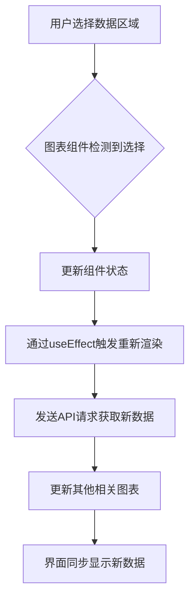
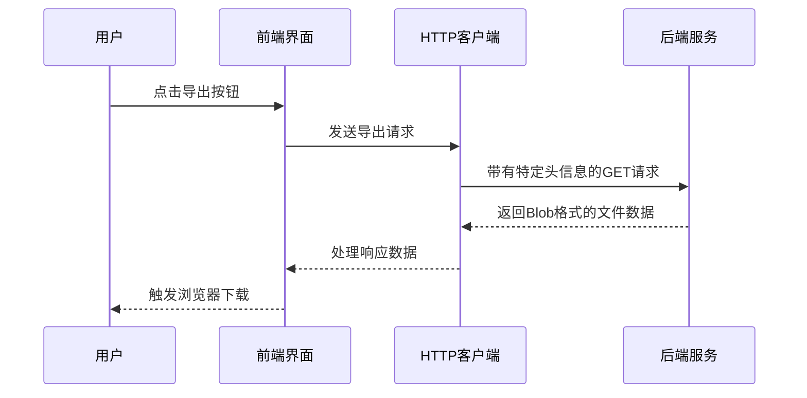

# 交互操作

<cite>
**本文档引用的文件**  
- [executionDashboard\index.tsx](file://datavines-ui\src\view\Main\HomeDetail\Dashboard\executionDashboard\index.tsx)
- [qualityReportDashboard\index.tsx](file://datavines-ui\src\view\Main\HomeDetail\Dashboard\qualityReportDashboard\index.tsx)
- [dashBoard.tsx](file://datavines-ui\Editor\components\Database\Detail\dashBoard.tsx)
- [SearchForm\index.tsx](file://datavines-ui\src\component\SearchForm\index.tsx)
- [request.interceptor.ts](file://datavines-ui\Editor\http\request.interceptor.ts)
- [response.interceptor.ts](file://datavines-ui\Editor\http\response.interceptor.ts)
- [create.ts](file://datavines-ui\Editor\http\create.ts)
</cite>

## 目录
1. [时间范围选择器](#时间范围选择器)
2. [指标筛选器](#指标筛选器)
3. [图表联动功能](#图表联动功能)
4. [导出功能](#导出功能)
5. [键盘快捷键](#键盘快捷键)
6. [无障碍访问支持](#无障碍访问支持)

## 时间范围选择器

在数据画像界面中，用户可以通过时间范围选择器来筛选特定时间段内的数据。该选择器位于执行仪表板和质量报告仪表板的查询条件区域，允许用户选择开始时间和结束时间。

用户可以通过点击日期选择框，从弹出的日期时间选择器中选择具体的日期和时间。选择器支持精确到秒的时间选择，用户可以自由选择任意时间段的数据进行分析。选择完成后，点击"查询"按钮即可更新所有相关图表和数据表格。

**Section sources**
- [executionDashboard\index.tsx](file://datavines-ui\src\view\Main\HomeDetail\Dashboard\executionDashboard\index.tsx#L512-L513)
- [qualityReportDashboard\index.tsx](file://datavines-ui\src\view\Main\HomeDetail\Dashboard\qualityReportDashboard\index.tsx#L461)

## 指标筛选器

指标筛选器允许用户根据不同的数据质量指标来过滤和查看数据。在执行仪表板中，用户可以通过下拉选择框选择特定的指标类型，系统会根据选择的指标类型更新所有相关图表和数据。

指标筛选器支持多选和条件过滤功能。用户可以选择一个或多个指标类型，系统会同时显示这些指标的数据。筛选器的选项是动态加载的，根据系统中配置的数据质量指标自动生成。

当用户选择或取消选择某个指标时，系统会自动发送请求到后端服务，获取相应的数据并更新界面。这种实时的筛选功能使用户能够快速探索不同指标下的数据质量情况。

**Section sources**
- [executionDashboard\index.tsx](file://datavines-ui\src\view\Main\HomeDetail\Dashboard\executionDashboard\index.tsx#L506-L511)

## 图表联动功能

数据画像界面实现了强大的图表联动功能。当用户在一个图表中选择特定的数据区域时，其他相关的图表会自动同步更新，显示与所选区域相关的数据。

这种联动功能基于ECharts图表库实现。在`dashBoard.tsx`组件中，每个图表都有一个唯一的ID，并且通过React的useEffect钩子监听数据变化。当某个图表的数据发生变化时，它会触发重新渲染，同时通过状态管理机制通知其他相关图表更新。

例如，在执行仪表板中，当用户选择特定的数据库、表或列时，饼图、趋势图和数据表格都会同步更新，显示与所选实体相关的数据质量信息。这种联动效果为用户提供了无缝的数据探索体验。

**Diagram sources**
- [dashBoard.tsx](file://datavines-ui\Editor\components\Database\Detail\dashBoard.tsx#L36-L62)
- [executionDashboard\index.tsx](file://datavines-ui\src\view\Main\HomeDetail\Dashboard\executionDashboard\index.tsx)

## 导出功能

系统提供了多种数据导出选项，包括图片和数据文件的导出。在图表的工具栏中，用户可以找到"保存为图片"的功能，点击后可以将当前图表导出为PNG格式的图片文件。

对于数据表格，系统支持导出为多种格式的数据文件。虽然在当前代码中没有直接看到导出功能的实现，但通过HTTP请求配置可以看出系统具备文件导出的能力。在`response.interceptor.ts`中，系统能够处理Blob类型的响应数据，这通常是文件下载的实现方式。

导出功能的实现基于axios HTTP客户端，通过设置适当的请求头和响应类型，系统可以从后端服务获取导出的数据并触发浏览器的下载行为。

**Diagram sources**
- [response.interceptor.ts](file://datavines-ui\Editor\http\response.interceptor.ts#L7-L11)
- [create.ts](file://datavines-ui\Editor\http\create.ts)

## 键盘快捷键

系统支持多种键盘快捷键操作，提高用户的操作效率。虽然在代码中没有明确列出所有快捷键，但通过搜索表单组件的实现可以看出系统支持回车键触发搜索功能。

在`SearchForm\index.tsx`组件中，`onPressEnter`事件监听器被绑定到搜索输入框，当用户在输入框中按下回车键时，会自动触发搜索操作。这种设计避免了用户必须用鼠标点击搜索按钮的繁琐操作。

此外，系统可能还支持其他常见的快捷键操作，如Tab键在表单字段间切换，Esc键关闭弹出窗口等，这些是基于Ant Design组件库的默认行为。

**Section sources**
- [SearchForm\index.tsx](file://datavines-ui\src\component\SearchForm\index.tsx#L31-L33)

## 无障碍访问支持

系统在设计时考虑了无障碍访问的需求，确保所有用户都能方便地使用各项功能。通过使用语义化的HTML元素和ARIA属性，系统为屏幕阅读器等辅助技术提供了良好的支持。

在图表组件中，系统使用了适当的标题和描述信息，帮助视障用户理解图表的内容。在表单和控件中，每个输入元素都有对应的标签，确保键盘导航的流畅性。

HTTP请求拦截器和响应拦截器的设计也考虑了错误处理的可访问性，当请求失败时，系统会返回清晰的错误信息，帮助用户理解问题所在并采取相应措施。

**Section sources**
- [request.interceptor.ts](file://datavines-ui\Editor\http\request.interceptor.ts)
- [response.interceptor.ts](file://datavines-ui\Editor\http\response.interceptor.ts)