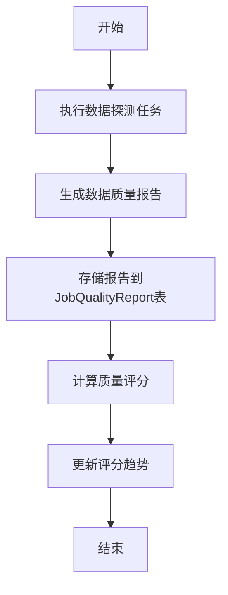
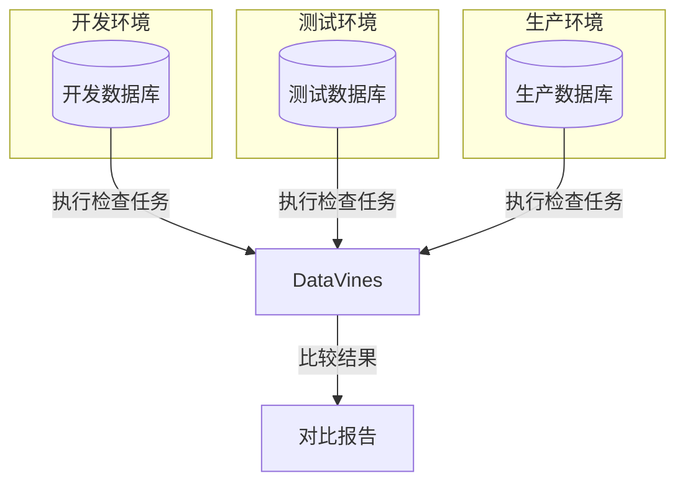
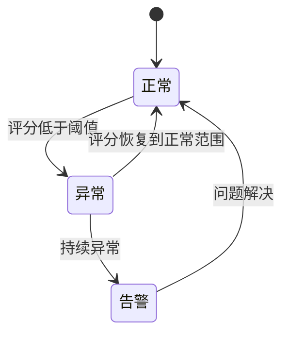
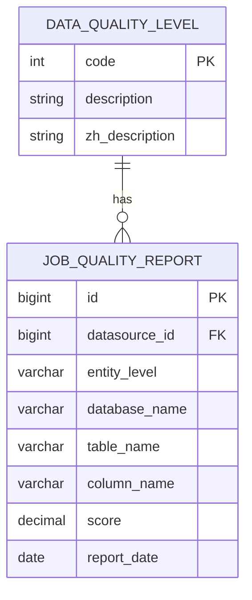
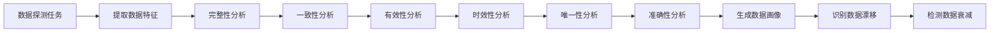

# 分析场景

<cite>
**本文档引用的文件**
- [MetricDimension.java](file://datavines-metric/datavines-metric-api/src/main/java/io/datavines/metric/api/MetricDimension.java)
- [MetricType.java](file://datavines-metric/datavines-metric-api/src/main/java/io/datavines/metric/api/MetricType.java)
- [MetricConstants.java](file://datavines-metric/datavines-metric-api/src/main/java/io/datavines/metric/api/MetricConstants.java)
- [JobQualityReportServiceImpl.java](file://datavines-server/src/main/java/io/datavines/server/repository/service/impl/JobQualityReportServiceImpl.java)
- [DataQualityLevel.java](file://datavines-server/src/main/java/io/datavines/server/enums/DataQualityLevel.java)
- [JobQualityReportScoreTrend.java](file://datavines-server/src/main/java/io/datavines/server/api/dto/vo/JobQualityReportScoreTrend.java)
- [datavines-mysql.sql](file://scripts/sql/datavines-mysql.sql)
- [FlinkDataProfileMetricBuilder.java](file://datavines-engine/datavines-engine-plugins/datavines-engine-flink/datavines-engine-flink-config/src/main/java/io/datavines/engine/flink/config/FlinkDataProfileMetricBuilder.java)
- [SinkSqlBuilder.java](file://datavines-engine/datavines-engine-plugins/datavines-engine-local/datavines-engine-local-config/src/main/java/io/datavines/engine/local/config/SinkSqlBuilder.java)
- [LocalDataProfileMetricBuilder.java](file://datavines-engine/datavines-engine-plugins/datavines-engine-local/datavines-engine-local-config/src/main/java/io/datavines/engine/local/config/LocalDataProfileMetricBuilder.java)
- [README.md](file://README.md)
- [README.zh-CN.md](file://README.zh-CN.md)
</cite>

## 目录
1. [引言](#引言)
2. [时间维度分析数据质量趋势](#时间维度分析数据质量趋势)
3. [多环境对比分析](#多环境对比分析)
4. [异常检测机制](#异常检测机制)
5. [数据治理场景](#数据治理场景)
6. [可视化分析案例](#可视化分析案例)
7. [结论](#结论)

## 引言
DataVines 是一个易于使用的数据质量服务平台，支持多种数据质量度量和分析场景。该平台通过插件化设计，支持多种数据源、检查规则、执行引擎和告警通道。本文档重点描述 DataVines 在实际业务中的分析场景，包括时间维度分析、多环境对比、异常检测、数据治理和可视化分析。

**Section sources**
- [README.md](file://README.md#L24-L76)
- [README.zh-CN.md](file://README.zh-CN.md#L47-L85)

## 时间维度分析数据质量趋势
DataVines 支持基于时间维度的数据质量趋势分析。系统通过定时执行数据探测任务，生成数据质量报告，并记录历史数据质量评分。`JobQualityReport` 表用于存储数据质量报告，包含数据源ID、实体级别、数据库名称、表名称、列名称、质量评分和报告日期等字段。

系统提供 `JobQualityReportScoreTrend` 类，用于表示数据质量评分趋势，包含日期列表和评分列表。通过分析历史评分数据，用户可以监控数据质量的变化趋势，识别潜在的数据质量问题。

**Diagram sources**
- [datavines-mysql.sql](file://scripts/sql/datavines-mysql.sql#L610-L626)
- [JobQualityReportScoreTrend.java](file://datavines-server/src/main/java/io/datavines/server/api/dto/vo/JobQualityReportScoreTrend.java#L1-L30)

**Section sources**
- [JobQualityReportScoreTrend.java](file://datavines-server/src/main/java/io/datavines/server/api/dto/vo/JobQualityReportScoreTrend.java#L1-L30)
- [datavines-mysql.sql](file://scripts/sql/datavines-mysql.sql#L610-L626)

## 多环境对比分析
DataVines 支持开发、测试、生产环境间的数据特征比较。通过配置不同的数据源连接信息，用户可以在不同环境中执行相同的数据质量检查任务，并比较结果。

系统支持多种数据源，包括 MySQL、Impala、StarRocks、Doris、Presto、Trino、ClickHouse 和 PostgreSQL。用户可以为每个环境配置相应的数据源，并使用相同的检查规则进行数据质量评估。

**Diagram sources**
- [README.md](file://README.md#L71-L73)
- [README.zh-CN.md](file://README.zh-CN.md#L73-L74)

**Section sources**
- [README.md](file://README.md#L71-L73)
- [README.zh-CN.md](file://README.zh-CN.md#L73-L74)

## 异常检测机制
DataVines 基于历史数据自动识别异常值。系统通过分析历史数据质量评分，建立正常范围模型。当新的数据质量评分超出正常范围时，系统会标记为异常。

`DataQualityLevel` 枚举定义了数据质量等级，包括不合格、合格、中等、良好和优秀。系统根据评分范围自动确定数据质量等级。当数据质量等级显著下降时，系统会触发异常检测。

**Diagram sources**
- [DataQualityLevel.java](file://datavines-server/src/main/java/io/datavines/server/enums/DataQualityLevel.java#L26-L30)

**Section sources**
- [DataQualityLevel.java](file://datavines-server/src/main/java/io/datavines/server/enums/DataQualityLevel.java#L57-L73)

## 数据治理场景
### 数据标准符合性检查
DataVines 支持数据标准符合性检查，确保数据符合预定义的标准。系统提供多种检查规则类型，包括单表单列检查、单表自定义SQL检查、跨表准确性检查和两表值比对检查。

`MetricType` 枚举定义了四种检查规则类型：单表检查、单表自定义SQL检查、跨表准确性检查和两表值比对检查。用户可以根据需要选择合适的检查类型。

### 数据资产价值评估
DataVines 通过数据质量评分评估数据资产价值。高质量的数据资产具有更高的价值。系统根据数据质量等级（不合格、合格、中等、良好、优秀）对数据资产进行分类和评估。

**Diagram sources**
- [DataQualityLevel.java](file://datavines-server/src/main/java/io/datavines/server/enums/DataQualityLevel.java#L26-L30)
- [datavines-mysql.sql](file://scripts/sql/datavines-mysql.sql#L610-L626)

**Section sources**
- [DataQualityLevel.java](file://datavines-server/src/main/java/io/datavines/server/enums/DataQualityLevel.java#L1-L74)
- [MetricType.java](file://datavines-metric/datavines-metric-api/src/main/java/io/datavines/metric/api/MetricType.java#L24-L34)

## 可视化分析案例
### 数据漂移检测
DataVines 通过数据分布视图检测数据漂移。系统支持自动识别列类型，并匹配合适的数据概况指标。当数据分布发生显著变化时，系统会标记为数据漂移。

`MetricDimension` 枚举定义了数据质量维度，包括完整性、一致性、有效性、时效性、唯一性和准确性。系统根据这些维度分析数据特征，识别数据漂移。

### 数据衰减分析
DataVines 监控表行数趋势，检测数据衰减。系统通过定时执行数据探测任务，记录表行数变化。当表行数持续减少时，系统会标记为数据衰减。

**Diagram sources**
- [MetricDimension.java](file://datavines-metric/datavines-metric-api/src/main/java/io/datavines/metric/api/MetricDimension.java#L24-L38)
- [FlinkDataProfileMetricBuilder.java](file://datavines-engine/datavines-engine-plugins/datavines-engine-flink/datavines-engine-flink-config/src/main/java/io/datavines/engine/flink/config/FlinkDataProfileMetricBuilder.java#L31-L57)
- [SinkSqlBuilder.java](file://datavines-engine/datavines-engine-plugins/datavines-engine-local/datavines-engine-local-config/src/main/java/io/datavines/engine/local/config/SinkSqlBuilder.java#L70-L90)

**Section sources**
- [MetricDimension.java](file://datavines-metric/datavines-metric-api/src/main/java/io/datavines/metric/api/MetricDimension.java#L24-L38)
- [FlinkDataProfileMetricBuilder.java](file://datavines-engine/datavines-engine-plugins/datavines-engine-flink/datavines-engine-flink-config/src/main/java/io/datavines/engine/flink/config/FlinkDataProfileMetricBuilder.java#L31-L57)
- [SinkSqlBuilder.java](file://datavines-engine/datavines-engine-plugins/datavines-engine-local/datavines-engine-local-config/src/main/java/io/datavines/engine/local/config/SinkSqlBuilder.java#L70-L90)

## 结论
DataVines 提供了全面的数据分析能力，支持时间维度分析、多环境对比、异常检测、数据治理和可视化分析。通过这些功能，用户可以有效监控数据质量，识别潜在问题，确保数据资产的可靠性和价值。平台的插件化设计使其具有良好的扩展性，能够适应不同的业务需求和技术环境。