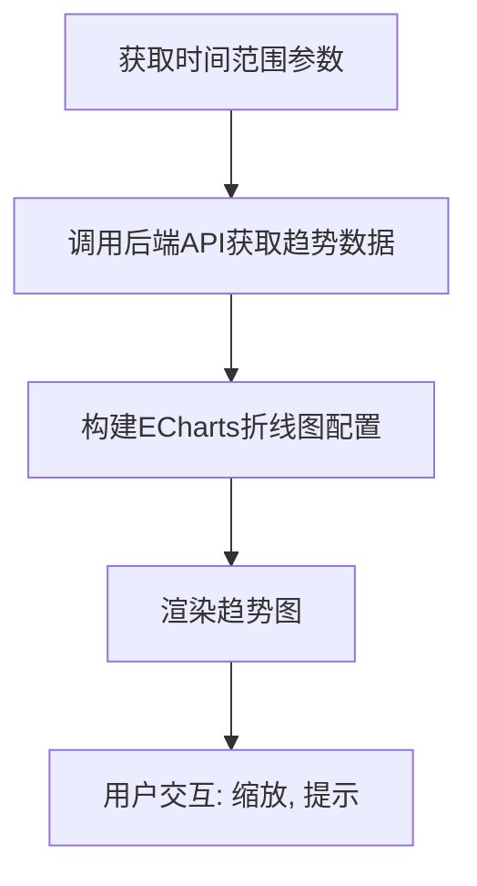
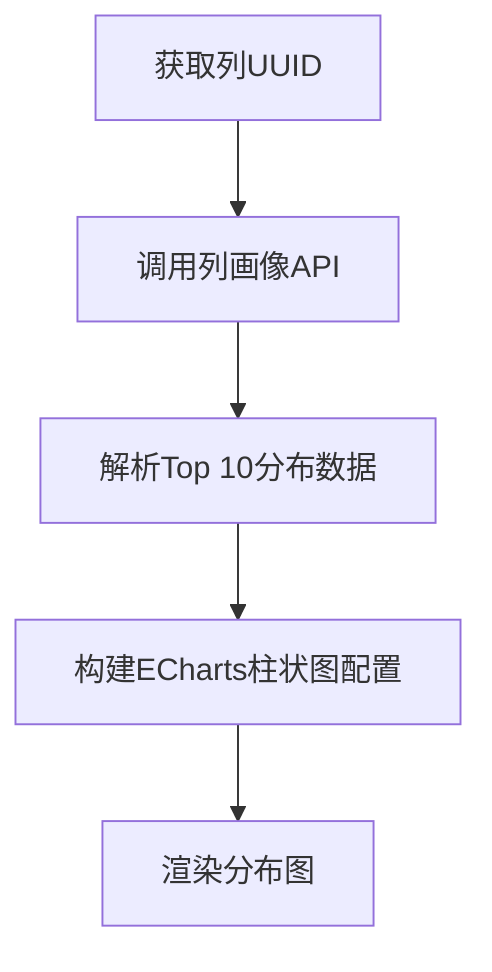
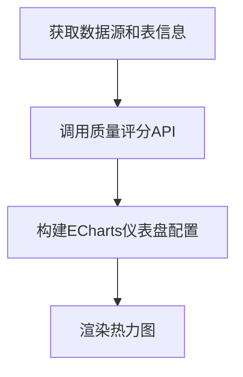
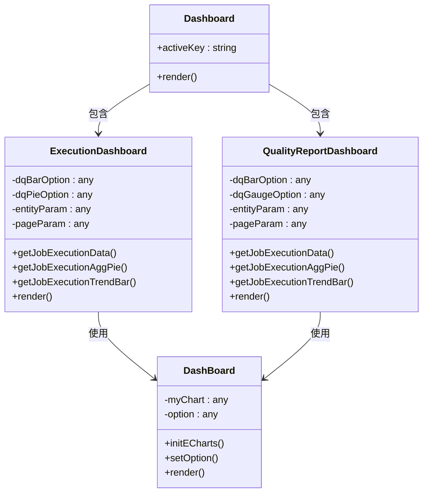

# 可视化展示

<cite>
**本文档引用的文件**   
- [index.tsx](file://datavines-ui\src\view\Main\HomeDetail\Dashboard\index.tsx)
- [executionDashboard/index.tsx](file://datavines-ui\src\view\Main\HomeDetail\Dashboard\executionDashboard\index.tsx)
- [qualityReportDashboard/index.tsx](file://datavines-ui\src\view\Main\HomeDetail\Dashboard\qualityReportDashboard\index.tsx)
- [dashBoard.tsx](file://datavines-ui\Editor\components\Database\Detail\dashBoard.tsx)
- [profileContent.tsx](file://datavines-ui\Editor\components\Database\profileContent.tsx)
- [package.json](file://datavines-ui\package.json)
- [CatalogEntityInstanceServiceImpl.java](file://datavines-server\src\main\java\io\datavines\server\repository\service\impl\CatalogEntityInstanceServiceImpl.java)
- [DataTime2ValueItem.java](file://datavines-server\src\main\java\io\datavines\server\api\dto\vo\DataTime2ValueItem.java)
</cite>

## 目录
1. [数据画像可视化概览](#数据画像可视化概览)
2. [核心可视化组件](#核心可视化组件)
3. [时间维度趋势分析](#时间维度趋势分析)
4. [多维度数据对比分析](#多维度数据对比分析)
5. [可视化配置选项](#可视化配置选项)
6. [用户体验最佳实践](#用户体验最佳实践)
7. [前端技术实现](#前端技术实现)

## 数据画像可视化概览

数据画像可视化展示模块是数据质量平台的核心功能之一，通过丰富的图表组件直观呈现数据特征和质量状况。系统提供了执行仪表板和质量报告仪表板两大核心视图，分别从任务执行情况和数据质量评分两个维度进行展示。执行仪表板主要展示数据质量检查任务的执行统计、趋势分析和失败任务详情，而质量报告仪表板则聚焦于数据质量评分、趋势变化和详细报告。这些可视化组件基于ECharts图表库构建，结合Ant Design UI框架，实现了响应式布局和交互式体验。

**Section sources**
- [index.tsx](file://datavines-ui\src\view\Main\HomeDetail\Dashboard\index.tsx)

## 核心可视化组件

### 趋势图
趋势图采用折线图形式展示数据质量指标随时间的变化趋势。在执行仪表板中，趋势图展示了所有、成功和失败任务数量的时间序列变化，帮助用户快速识别执行异常。在质量报告仪表板中，趋势图则展示了数据质量评分的历史变化，便于评估数据质量的改进情况。图表配置了平滑曲线、标记点和平均线等视觉元素，增强了数据趋势的可读性。

**Diagram sources**
- [executionDashboard/index.tsx](file://datavines-ui\src\view\Main\HomeDetail\Dashboard\executionDashboard\index.tsx)
- [qualityReportDashboard/index.tsx](file://datavines-ui\src\view\Main\HomeDetail\Dashboard\qualityReportDashboard\index.tsx)

### 分布图
分布图以柱状图形式展示数据值的分布情况，主要用于数据画像中的Top 10值分布分析。该图表通过调用`/catalog/profile/column/{uuid}`接口获取特定列的值分布数据，将出现频率最高的10个值及其占比可视化展示。柱状图配置了最大宽度限制和数据标签，确保在值较多时仍能清晰展示。

**Diagram sources**
- [profileContent.tsx](file://datavines-ui\Editor\components\Database\profileContent.tsx)
- [CatalogEntityInstanceServiceImpl.java](file://datavines-server\src\main\java\io\datavines\server\repository\service\impl\CatalogEntityInstanceServiceImpl.java)

### 热力图
热力图在本系统中以仪表盘（Gauge Chart）形式实现，用于直观展示数据质量评分。仪表盘采用半圆形设计，将评分范围划分为多个颜色区域，从红色（低分）到绿色（高分）渐变，使用户能够一目了然地判断数据质量水平。仪表盘还显示了具体的评分值和质量等级，提供了详细的评估信息。

**Diagram sources**
- [qualityReportDashboard/index.tsx](file://datavines-ui\src\view\Main\HomeDetail\Dashboard\qualityReportDashboard\index.tsx)

## 时间维度趋势分析

系统支持通过时间维度查看数据特征的变化趋势，用户可以通过日期选择器设置自定义的时间范围。在执行仪表板中，用户可以设置开始时间和结束时间来查询特定时间段内的任务执行情况。系统通过`/job/execution/trend-bar`接口获取趋势数据，该接口返回日期列表、总任务数、成功任务数和失败任务数等信息，用于构建趋势图。

时间维度分析不仅限于任务执行情况，还包括数据质量评分的趋势分析。用户可以通过报告时间选择器查看历史质量评分的变化趋势，系统通过`/job/quality-report/score-trend`接口获取评分趋势数据，帮助用户评估数据质量的长期变化。

**Section sources**
- [executionDashboard/index.tsx](file://datavines-ui\src\view\Main\HomeDetail\Dashboard\executionDashboard\index.tsx)
- [qualityReportDashboard/index.tsx](file://datavines-ui\src\view\Main\HomeDetail\Dashboard\qualityReportDashboard\index.tsx)
- [DataTime2ValueItem.java](file://datavines-server\src\main\java\io\datavines\server\api\dto\vo\DataTime2ValueItem.java)

## 多维度数据对比分析

系统支持多维度数据对比分析功能，用户可以通过级联选择器选择不同的数据源、数据库、表和列进行对比分析。在执行仪表板中，用户可以选择特定的实体（数据库、表或列）和指标类型进行过滤，系统会返回相应的执行统计数据。这种多维度过滤机制使用户能够深入分析特定数据对象的质量状况。

此外，系统还支持不同环境间的数据特征比较，虽然当前代码中未直接体现，但通过选择不同的数据源ID，用户可以间接实现跨环境的数据对比。未来可以通过增强数据源管理功能，提供更直观的环境对比视图。

**Section sources**
- [executionDashboard/index.tsx](file://datavines-ui\src\view\Main\HomeDetail\Dashboard\executionDashboard\index.tsx)
- [qualityReportDashboard/index.tsx](file://datavines-ui\src\view\Main\HomeDetail\Dashboard\qualityReportDashboard\index.tsx)

## 可视化配置选项

系统提供了丰富的可视化配置选项，用户可以根据需要自定义展示内容。主要配置选项包括：

- **图表类型选择**: 系统根据数据类型自动选择合适的图表类型，如趋势数据使用折线图，分布数据使用柱状图，评分数据使用仪表盘。
- **时间范围设置**: 用户可以通过日期选择器设置查询的时间范围，支持精确到秒的时间选择。
- **指标筛选**: 用户可以通过下拉选择器筛选特定的指标类型，如完整性、一致性、有效性等。
- **实体选择**: 通过级联选择器，用户可以选择特定的数据库、表和列进行分析。

这些配置选项通过React组件的状态管理实现，用户操作会触发状态更新，进而重新获取数据并刷新图表。

**Section sources**
- [executionDashboard/index.tsx](file://datavines-ui\src\view\Main\HomeDetail\Dashboard\executionDashboard\index.tsx)
- [qualityReportDashboard/index.tsx](file://datavines-ui\src\view\Main\HomeDetail\Dashboard\qualityReportDashboard\index.tsx)

## 用户体验最佳实践

为了提供最佳的用户体验，系统实现了多项优化措施：

- **空状态处理**: 当图表数据为空时，系统会显示友好的空状态提示，避免用户面对空白图表感到困惑。
- **数据提示**: 所有图表都配置了工具提示（Tooltip），当用户悬停在数据点上时，会显示详细的数据信息。
- **响应式布局**: 图表组件采用响应式设计，能够适应不同屏幕尺寸，确保在移动设备上也能正常显示。
- **加载状态**: 在数据加载过程中，系统会显示加载动画，提升用户体验。
- **异常识别**: 通过颜色编码（如红色表示失败任务），用户可以快速识别数据异常。

这些最佳实践确保了用户能够高效、直观地理解和分析数据质量状况。

**Section sources**
- [dashBoard.tsx](file://datavines-ui\Editor\components\Database\Detail\dashBoard.tsx)
- [executionDashboard/index.tsx](file://datavines-ui\src\view\Main\HomeDetail\Dashboard\executionDashboard\index.tsx)

## 前端技术实现

### React组件结构
可视化展示功能基于React函数组件实现，采用Hooks进行状态管理和副作用处理。核心组件包括：
- `Dashboard`: 主容器组件，包含选项卡用于切换执行仪表板和质量报告仪表板。
- `ExecutionDashboard`: 执行仪表板组件，包含趋势图、饼图和任务列表。
- `QualityReportDashboard`: 质量报告仪表板组件，包含评分仪表盘、趋势图和报告列表。
- `DashBoard`: 通用图表组件，封装了ECharts的初始化和渲染逻辑。

### 数据绑定机制
系统采用Axios进行HTTP请求，通过自定义Hook `useRequest`封装API调用。数据绑定流程如下：
1. 组件初始化时调用API获取数据
2. 将API返回的数据转换为ECharts配置对象
3. 通过React状态管理更新图表配置
4. ECharts组件监听配置变化并重新渲染

系统依赖ECharts 5.4.0作为图表库，Ant Design 5.0.5作为UI框架，确保了高性能和现代化的用户界面。

**Diagram sources**
- [index.tsx](file://datavines-ui\src\view\Main\HomeDetail\Dashboard\index.tsx)
- [executionDashboard/index.tsx](file://datavines-ui\src\view\Main\HomeDetail\Dashboard\executionDashboard\index.tsx)
- [qualityReportDashboard/index.tsx](file://datavines-ui\src\view\Main\HomeDetail\Dashboard\qualityReportDashboard\index.tsx)
- [dashBoard.tsx](file://datavines-ui\Editor\components\Database\Detail\dashBoard.tsx)
- [package.json](file://datavines-ui\package.json)

**Section sources**
- [index.tsx](file://datavines-ui\src\view\Main\HomeDetail\Dashboard\index.tsx)
- [executionDashboard/index.tsx](file://datavines-ui\src\view\Main\HomeDetail\Dashboard\executionDashboard\index.tsx)
- [qualityReportDashboard/index.tsx](file://datavines-ui\src\view\Main\HomeDetail\Dashboard\qualityReportDashboard\index.tsx)
- [dashBoard.tsx](file://datavines-ui\Editor\components\Database\Detail\dashBoard.tsx)
- [package.json](file://datavines-ui\package.json)