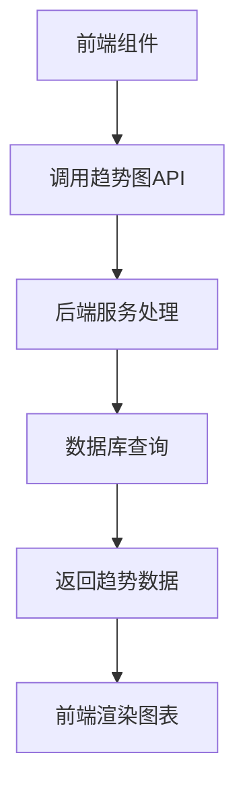
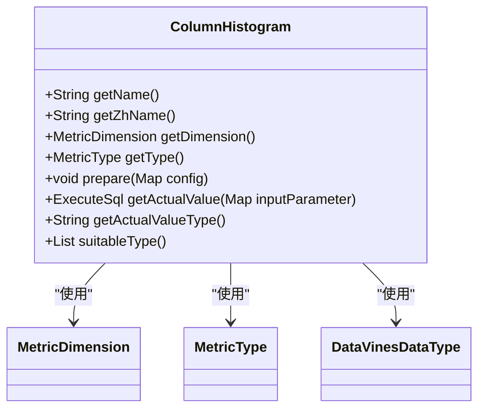
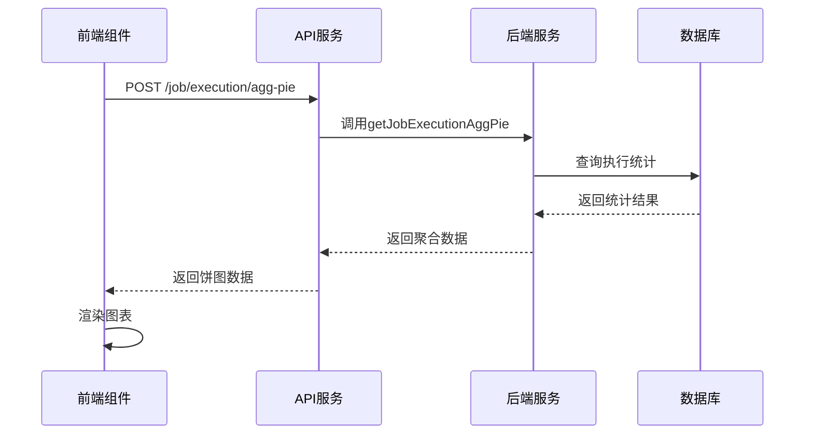
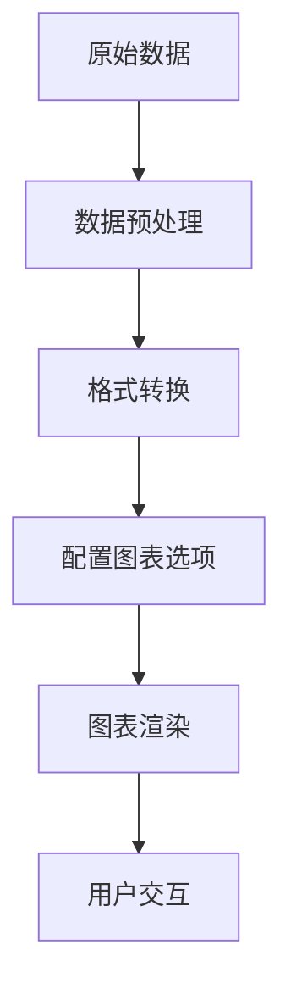
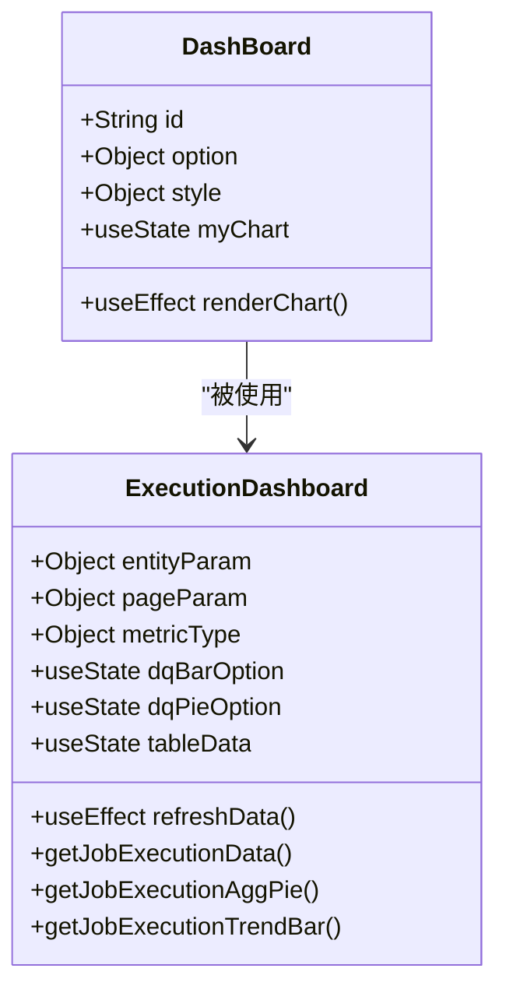

# 图表类型

<cite>
**本文档中引用的文件**   
- [executionDashboard/index.tsx](file://datavines-ui/src/view/Main/HomeDetail/Dashboard/executionDashboard/index.tsx)
- [dashBoard.tsx](file://datavines-ui/Editor/components/Database/Detail/dashBoard.tsx)
- [ColumnHistogram.java](file://datavines-metric/datavines-metric-plugins/datavines-metric-column-histogram/src/main/java/io/datavines/metric/plugin/ColumnHistogram.java)
- [JobExecutionController.java](file://datavines-server/src/main/java/io/datavines/server/api/controller/JobExecutionController.java)
- [JobExecutionDashboardParam.java](file://datavines-server/src/main/java/io/datavines/server/api/dto/bo/job/JobExecutionDashboardParam.java)
</cite>

## 目录
1. [引言](#引言)
2. [趋势图](#趋势图)
3. [分布图](#分布图)
4. [热力图](#热力图)
5. [柱状图](#柱状图)
6. [图表数据映射逻辑](#图表数据映射逻辑)
7. [配置参数说明](#配置参数说明)
8. [最佳实践建议](#最佳实践建议)
9. [前端组件实现](#前端组件实现)

## 引言
数据画像是大数据质量监控平台中的核心功能，通过可视化图表展示数据质量指标的变化趋势和分布情况。本文档详细描述了平台中使用的各种图表类型，包括趋势图、分布图、热力图和柱状图，以及它们在数据特征分析中的应用场景。

## 趋势图
趋势图用于展示数据行数随时间的变化情况，帮助用户识别数据质量指标的趋势和周期性模式。在平台中，趋势图通过`/job/execution/trend-bar` API端点获取数据，展示作业执行的成功、失败和总数趋势。

**图表应用场景**：
- 监控数据质量指标随时间的变化
- 识别数据质量问题的周期性模式
- 跟踪数据质量改进措施的效果

**图表来源**
- [executionDashboard/index.tsx](file://datavines-ui/src/view/Main/HomeDetail/Dashboard/executionDashboard/index.tsx#L259-L318)
- [JobExecutionController.java](file://datavines-server/src/main/java/io/datavines/server/api/controller/JobExecutionController.java#L118-L122)

## 分布图
分布图用于显示数值型数据的分布情况，帮助用户理解数据的集中趋势和离散程度。平台中的分布图主要通过柱状图和直方图实现，展示数据在不同区间内的分布频率。

**图表应用场景**：
- 分析数值型数据的分布特征
- 识别数据异常值和离群点
- 评估数据的正态性

**图表来源**
- [ColumnHistogram.java](file://datavines-metric/datavines-metric-plugins/datavines-metric-column-histogram/src/main/java/io/datavines/metric/plugin/ColumnHistogram.java)
- [dashBoard.tsx](file://datavines-ui/Editor/components/Database/Detail/dashBoard.tsx#L1-L83)

## 热力图
热力图用于展示多维数据的密度和强度分布，通过颜色深浅表示数值大小。在数据画像中，热力图可以用于展示不同数据源、表或列之间的质量关联性。

**图表应用场景**：
- 展示多维数据的关联性
- 识别数据质量问题的热点区域
- 可视化数据质量评分矩阵

**图表来源**
- [dashBoard.tsx](file://datavines-ui/Editor/components/Database/Detail/dashBoard.tsx#L2-L35)
- [executionDashboard/index.tsx](file://datavines-ui/src/view/Main/HomeDetail/Dashboard/executionDashboard/index.tsx#L213-L249)

## 柱状图
柱状图用于比较不同类别或时间段的数据值，通过柱子的高度表示数值大小。在平台中，柱状图主要用于展示作业执行的聚合统计信息。

**图表应用场景**：
- 比较不同数据源的质量指标
- 展示作业执行状态的分布
- 对比不同时间段的数据质量

**图表来源**
- [executionDashboard/index.tsx](file://datavines-ui/src/view/Main/HomeDetail/Dashboard/executionDashboard/index.tsx#L198-L255)
- [JobExecutionController.java](file://datavines-server/src/main/java/io/datavines/server/api/controller/JobExecutionController.java#L112-L116)

## 图表数据映射逻辑
图表的数据映射逻辑定义了如何将原始数据转换为可视化元素。平台使用ECharts作为可视化库，通过配置option对象来定义图表的外观和行为。

**数据映射流程**：
1. 前端组件调用API获取原始数据
2. 将API返回的数据转换为ECharts所需的格式
3. 配置图表的option对象
4. 使用ECharts初始化并渲染图表

**图表来源**
- [dashBoard.tsx](file://datavines-ui/Editor/components/Database/Detail/dashBoard.tsx#L36-L62)
- [executionDashboard/index.tsx](file://datavines-ui/src/view/Main/HomeDetail/Dashboard/executionDashboard/index.tsx#L273-L317)

## 配置参数说明
图表的配置参数定义了图表的外观和行为特性。主要配置参数包括：

**通用配置参数**：
- `tooltip`: 工具提示配置
- `legend`: 图例配置
- `grid`: 网格布局配置
- `xAxis`: X轴配置
- `yAxis`: Y轴配置
- `series`: 数据系列配置

**特定图表配置**：
- 趋势图：`boundaryGap`, `smooth`
- 分布图：`radius`, `avoidLabelOverlap`
- 热力图：`color`, `min`, `max`
- 柱状图：`barWidth`, `barGap`

**图表来源**
- [executionDashboard/index.tsx](file://datavines-ui/src/view/Main/HomeDetail/Dashboard/executionDashboard/index.tsx#L273-L317)
- [dashBoard.tsx](file://datavines-ui/Editor/components/Database/Detail/dashBoard.tsx#L20-L35)

## 最佳实践建议
为了有效使用图表进行数据特征分析，建议遵循以下最佳实践：

**图表选择原则**：
- 时间序列数据使用趋势图
- 分布特征分析使用分布图
- 多维关联分析使用热力图
- 类别比较使用柱状图

**可视化设计建议**：
- 保持图表简洁，避免信息过载
- 使用一致的颜色方案
- 提供交互功能，如缩放和筛选
- 添加适当的标签和说明

**性能优化建议**：
- 对大数据集进行采样
- 使用增量更新
- 优化数据查询

**图表来源**
- [dashBoard.tsx](file://datavines-ui/Editor/components/Database/Detail/dashBoard.tsx)
- [executionDashboard/index.tsx](file://datavines-ui/src/view/Main/HomeDetail/Dashboard/executionDashboard/index.tsx)

## 前端组件实现
前端组件负责接收后端数据并渲染图表。平台使用React和ECharts实现图表组件，通过HTTP请求获取数据。

**组件实现要点**：
- 使用useEffect监听数据变化
- 调用ECharts API初始化图表
- 处理数据加载状态
- 实现图表更新逻辑

**图表来源**
- [dashBoard.tsx](file://datavines-ui/Editor/components/Database/Detail/dashBoard.tsx)
- [executionDashboard/index.tsx](file://datavines-ui/src/view/Main/HomeDetail/Dashboard/executionDashboard/index.tsx)