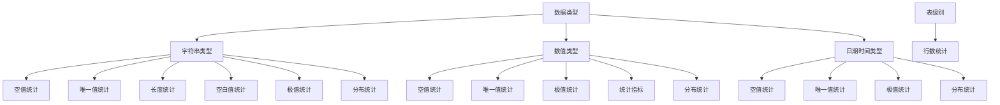
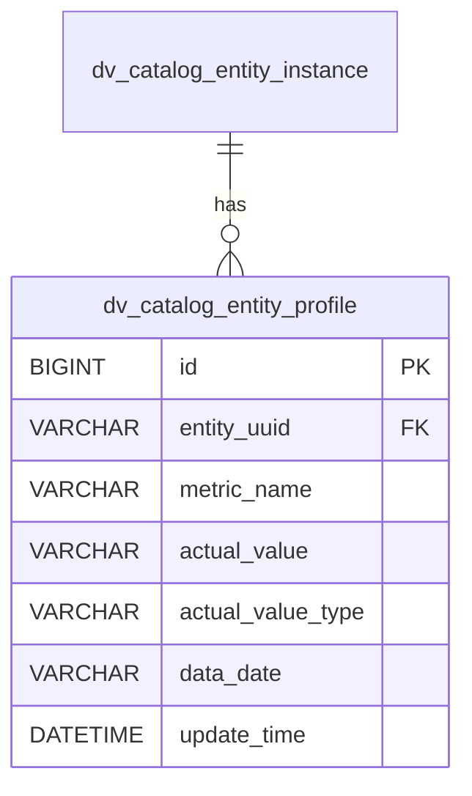
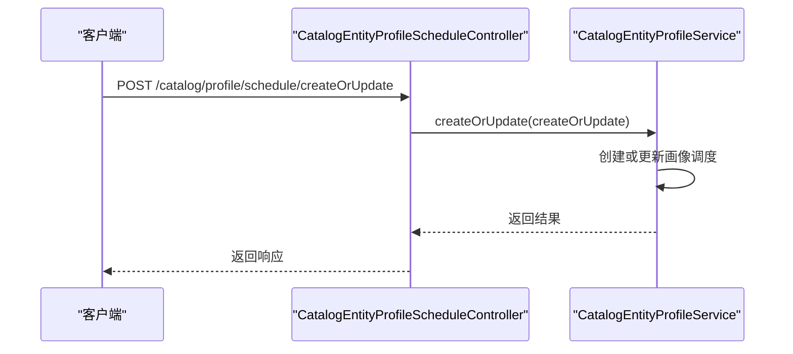
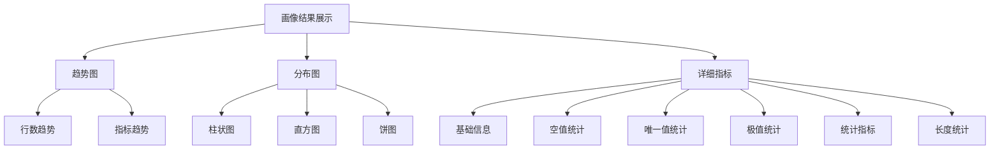
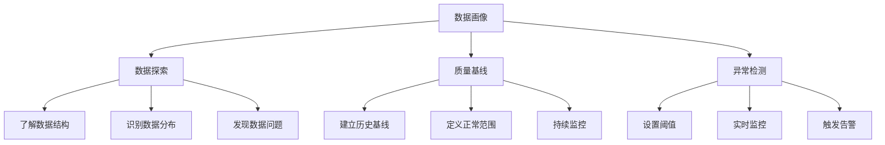
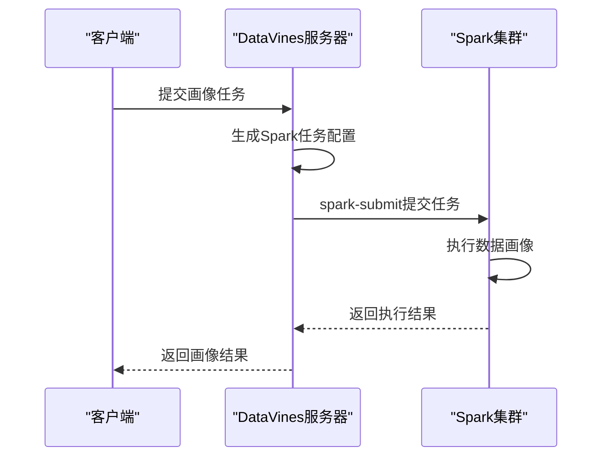

# 数据画像

<cite>
**本文档引用的文件**   
- [CatalogEntityInstanceServiceImpl.java](file://datavines-server/src/main/java/io/datavines/server/repository/service/impl/CatalogEntityInstanceServiceImpl.java)
- [DataVinesDataType.java](file://datavines-common/src/main/java/io/datavines/common/enums/DataVinesDataType.java)
- [MetricConstants.java](file://datavines-metric/datavines-metric-api/src/main/java/io/datavines/metric/api/MetricConstants.java)
- [CatalogEntityProfile.java](file://datavines-server/src/main/java/io/datavines/server/repository/entity/catalog/CatalogEntityProfile.java)
- [CatalogProfileScheduleCreateOrUpdate.java](file://datavines-server/src/main/java/io/datavines/server/api/dto/bo/catalog/profile/CatalogProfileScheduleCreateOrUpdate.java)
- [RunProfileRequest.java](file://datavines-server/src/main/java/io/datavines/server/api/dto/bo/catalog/profile/RunProfileRequest.java)
- [profileContent.tsx](file://datavines-ui/Editor/components/Database/profileContent.tsx)
- [SparkEngineExecutor.java](file://datavines-engine/datavines-engine-plugins/datavines-engine-spark/datavines-engine-spark-executor/src/main/java/io/datavines/engine/spark/executor/SparkEngineExecutor.java)
- [LocalEngineExecutor.java](file://datavines-engine/datavines-engine-plugins/datavines-engine-local/datavines-engine-local-executor/src/main/java/io/datavines/engine/local/executor/LocalEngineExecutor.java)
- [README.md](file://README.md)
</cite>

## 目录
1. [简介](#简介)
2. [数据画像采集内容](#数据画像采集内容)
3. [画像数据存储结构](#画像数据存储结构)
4. [画像任务配置与触发](#画像任务配置与触发)
5. [画像结果展示](#画像结果展示)
6. [使用场景](#使用场景)
7. [执行引擎支持](#执行引擎支持)
8. [使用示例](#使用示例)
9. [常见问题](#常见问题)

## 简介

DataVines的数据画像功能提供全面的数据特征分析能力，能够自动识别数据表的结构特征并生成详细的画像报告。该功能支持定时执行数据检测，输出数据画像报告，并支持自动识别列类型以匹配适当的数据画像指标。通过数据画像，用户可以深入了解数据的分布特征、质量状况和变化趋势，为数据探索、质量基线建立和异常检测提供支持。

**Section sources**
- [README.md](file://README.md#L58-L65)

## 数据画像采集内容

DataVines的数据画像功能采集多种数据特征指标，根据数据类型的不同，采集的指标也有所差异。系统通过`DataVinesDataType`枚举类定义了不同类型数据的画像指标集合。

### 字符串类型数据画像指标

对于字符串类型的数据，系统采集以下指标：
- **空值统计**：包括空值数量(`column_null`)和非空值数量(`column_not_null`)
- **唯一值统计**：包括唯一值数量(`column_unique`)和不同值数量(`column_distinct`)
- **长度统计**：包括平均长度(`column_avg_length`)、最大长度(`column_max_length`)和最小长度(`column_min_length`)
- **空白值统计**：空白值数量(`column_blank`)
- **极值统计**：最大值(`column_max`)和最小值(`column_min`)
- **分布统计**：数据分布直方图(`column_histogram`)

### 数值类型数据画像指标

对于数值类型的数据，系统采集以下指标：
- **空值统计**：包括空值数量(`column_null`)和非空值数量(`column_not_null`)
- **唯一值统计**：包括唯一值数量(`column_unique`)和不同值数量(`column_distinct`)
- **极值统计**：最大值(`column_max`)和最小值(`column_min`)
- **统计指标**：平均值(`column_avg`)、总和(`column_sum`)、标准差(`column_std_dev`)和方差(`column_variance`)
- **分布统计**：数据分布直方图(`column_histogram`)

### 日期时间类型数据画像指标

对于日期时间类型的数据，系统采集以下指标：
- **空值统计**：包括空值数量(`column_null`)和非空值数量(`column_not_null`)
- **唯一值统计**：包括唯一值数量(`column_unique`)和不同值数量(`column_distinct`)
- **极值统计**：最大值(`column_max`)和最小值(`column_min`)
- **分布统计**：数据分布直方图(`column_histogram`)

此外，系统还支持表级别的行数统计(`table_row_count`)，用于监控表数据量的变化趋势。



**Diagram sources**
- [DataVinesDataType.java](file://datavines-common/src/main/java/io/datavines/common/enums/DataVinesDataType.java#L30-L110)

**Section sources**
- [DataVinesDataType.java](file://datavines-common/src/main/java/io/datavines/common/enums/DataVinesDataType.java#L30-L110)
- [CatalogEntityInstanceServiceImpl.java](file://datavines-server/src/main/java/io/datavines/server/repository/service/impl/CatalogEntityInstanceServiceImpl.java#L456-L733)

## 画像数据存储结构

DataVines使用专门的数据库表来存储数据画像结果，确保画像数据的持久化和可追溯性。系统通过`CatalogEntityProfile`实体类定义了画像数据的存储结构。

### 数据库表结构

画像数据存储在`dv_catalog_entity_profile`表中，该表的主要字段包括：

| 字段名 | 数据类型 | 描述 |
|-------|--------|------|
| id | BIGINT | 主键，自增 |
| entity_uuid | VARCHAR | 实体UUID，关联到数据目录中的表或列 |
| metric_name | VARCHAR | 指标名称，如"column_null"、"column_unique"等 |
| actual_value | VARCHAR | 实际值，存储指标的计算结果 |
| actual_value_type | VARCHAR | 实际值类型，如"count"、"percentage"等 |
| data_date | VARCHAR | 数据日期，用于标识画像数据的时间点 |
| update_time | DATETIME | 更新时间，记录数据更新的时间戳 |

### Java实体类

`CatalogEntityProfile`类定义了画像数据的Java实体模型，与数据库表结构对应：

```java
@Data
@TableName("dv_catalog_entity_profile")
public class CatalogEntityProfile implements Serializable {
    private Long id;
    private String entityUuid;
    private String metricName;
    private String actualValue;
    private String actualValueType;
    private String dataDate;
    private LocalDateTime updateTime;
}
```

### 存储配置

系统通过`MetricConstants`类定义了画像数据的列配置，包括`PROFILE_COLUMN_LIST`常量，用于指定画像数据的列信息：

```java
public static final List<ColumnInfo> PROFILE_COLUMN_LIST = new ArrayList<>();

static {
    PROFILE_COLUMN_LIST.add(new ColumnInfo("entity_uuid",true, false));
    PROFILE_COLUMN_LIST.add(new ColumnInfo("metric_name",false, false));
    PROFILE_COLUMN_LIST.add(new ColumnInfo("actual_value",true, false));
    PROFILE_COLUMN_LIST.add(new ColumnInfo("actual_value_type",true, false));
    PROFILE_COLUMN_LIST.add(new ColumnInfo("data_date",false, false));
    PROFILE_COLUMN_LIST.add(new ColumnInfo("update_time",false, false));
}
```



**Diagram sources**
- [CatalogEntityProfile.java](file://datavines-server/src/main/java/io/datavines/server/repository/entity/catalog/CatalogEntityProfile.java#L1-L57)
- [MetricConstants.java](file://datavines-metric/datavines-metric-api/src/main/java/io/datavines/metric/api/MetricConstants.java#L1-L64)

**Section sources**
- [CatalogEntityProfile.java](file://datavines-server/src/main/java/io/datavines/server/repository/entity/catalog/CatalogEntityProfile.java#L1-L57)
- [MetricConstants.java](file://datavines-metric/datavines-metric-api/src/main/java/io/datavines/metric/api/MetricConstants.java#L1-L64)

## 画像任务配置与触发

DataVines提供了灵活的配置方式来触发数据画像任务，支持通过API接口和配置文件两种方式。

### API接口触发

系统提供了RESTful API接口来创建和更新数据画像调度任务。主要接口包括：

- **创建或更新画像调度任务**：`POST /api/v1/catalog/profile/schedule/createOrUpdate`
- **根据实体UUID获取画像调度**：`GET /api/v1/catalog/profile/schedule/{uuid}`
- **获取周期执行的Cron表达式**：`POST /api/v1/catalog/profile/schedule/cron`

请求参数`CatalogProfileScheduleCreateOrUpdate`包含以下字段：
- `id`：调度任务ID（可选）
- `entityUUID`：实体UUID，标识要进行画像的表
- `type`：调度类型，定义任务的执行周期



**Diagram sources**
- [CatalogProfileScheduleCreateOrUpdate.java](file://datavines-server/src/main/java/io/datavines/server/api/dto/bo/catalog/profile/CatalogProfileScheduleCreateOrUpdate.java#L1-L37)
- [CatalogEntityProfileScheduleController.java](file://datavines-server/src/main/java/io/datavines/server/api/controller/CatalogEntityProfileScheduleController.java#L19-L65)

### 任务执行参数

数据画像任务支持配置执行参数，包括选择要分析的列和过滤条件。`RunProfileRequest`类定义了任务执行的请求参数：

```java
@Data
public class RunProfileRequest {
    private String uuid; // 实体UUID
    private boolean selectAll; // 是否选择所有列
    private List<String> selectedColumnList; // 选择的列列表
    private String filter; // 过滤条件
}
```

当`selectAll`为`true`时，系统将对所有列执行画像分析；当为`false`时，仅对`selectedColumnList`中指定的列执行分析。`filter`参数可用于指定数据过滤条件，只对满足条件的数据进行分析。

**Section sources**
- [RunProfileRequest.java](file://datavines-server/src/main/java/io/datavines/server/api/dto/bo/catalog/profile/RunProfileRequest.java#L1-L36)
- [CatalogEntityInstanceServiceImpl.java](file://datavines-server/src/main/java/io/datavines/server/repository/service/impl/CatalogEntityInstanceServiceImpl.java#L829-L888)

## 画像结果展示

DataVines在数据目录中提供了丰富的可视化展示方式，帮助用户直观地理解数据画像结果。

### 趋势图展示

系统支持展示表行数的趋势图，帮助用户监控数据量的变化趋势。趋势图显示了历史数据量的变化情况，可以识别数据增长或减少的模式。

### 分布图展示

对于分类数据和数值数据，系统提供分布图展示，包括：
- **柱状图**：显示不同值的出现频次
- **直方图**：显示数值数据的分布情况
- **饼图**：显示各类别数据的占比

### 详细指标展示

在数据目录的列详情页面，系统展示详细的画像指标，包括：
- **基础信息**：列名、数据类型
- **空值统计**：空值数量和百分比
- **唯一值统计**：唯一值数量和百分比
- **极值统计**：最大值和最小值
- **统计指标**：平均值、总和、标准差、方差（数值类型）
- **长度统计**：平均长度、最大长度、最小长度（字符串类型）



**Section sources**
- [profileContent.tsx](file://datavines-ui/Editor/components/Database/profileContent.tsx#L1-L195)

## 使用场景

DataVines的数据画像功能在多种场景下都有重要应用价值。

### 数据探索

数据画像为数据探索提供了全面的起点。通过查看数据的基本统计特征，数据分析师可以快速了解数据的结构、分布和质量状况，为后续的分析工作奠定基础。例如，通过查看空值率，可以识别数据质量问题；通过查看唯一值率，可以判断列是否适合作为主键。

### 数据质量基线建立

数据画像可以帮助建立数据质量基线。通过定期执行数据画像任务，可以收集历史数据特征，建立正常范围的基线。当后续的数据特征偏离基线时，可以及时发现数据质量问题。例如，如果某列的空值率突然显著增加，可能表明数据采集或处理过程中出现了问题。

### 数据异常检测

基于数据画像结果，可以实现数据异常检测。系统可以配置异常检测规则，当某些指标超出预设阈值时触发告警。例如：
- 表行数突然减少超过50%
- 某列的空值率超过10%
- 数值列的标准差显著增加

这些异常检测可以帮助数据团队及时发现和响应数据问题，保障数据的可靠性和一致性。



## 执行引擎支持

DataVines支持多种执行引擎来运行数据画像任务，提供了灵活性和可扩展性。

### Spark引擎

Spark引擎适用于大规模数据处理场景。系统通过`SparkEngineExecutor`类实现Spark引擎的执行逻辑，使用`spark-submit`命令提交任务到Spark集群。Spark引擎支持以下配置参数：
- 部署模式（deploy mode）
- Driver核心数和内存
- Executor数量、核心数和内存
- 其他Spark配置



**Diagram sources**
- [SparkEngineExecutor.java](file://datavines-engine/datavines-engine-plugins/datavines-engine-spark/datavines-engine-spark-executor/src/main/java/io/datavines/engine/spark/executor/SparkEngineExecutor.java#L1-L153)

### Local引擎

Local引擎是基于JDBC的本地执行引擎，不依赖外部执行环境。它适用于小规模数据处理和开发测试场景。Local引擎直接通过JDBC连接数据源执行SQL查询，获取画像结果。

### Flink引擎

系统也支持Flink引擎，通过`FlinkEngineExecutor`实现。Flink引擎适用于流式数据处理场景，可以实时监控数据特征的变化。

不同执行引擎的选择应根据数据规模、性能要求和基础设施条件来决定。对于大规模数据处理，推荐使用Spark引擎；对于小规模数据或开发测试，可以使用Local引擎。

**Section sources**
- [SparkEngineExecutor.java](file://datavines-engine/datavines-engine-plugins/datavines-engine-spark/datavines-engine-spark-executor/src/main/java/io/datavines/engine/spark/executor/SparkEngineExecutor.java#L1-L153)
- [LocalEngineExecutor.java](file://datavines-engine/datavines-engine-plugins/datavines-engine-local/datavines-engine-local-executor/src/main/java/io/datavines/engine/local/executor/LocalEngineExecutor.java#L27-L57)
- [README.md](file://README.md#L73-L74)

## 使用示例

### 为特定表配置画像任务

要为特定表配置数据画像任务，可以通过API接口发送请求：

```json
{
  "entityUUID": "table-uuid-123",
  "type": "DAILY"
}
```

此请求将为指定UUID的表创建每日执行的数据画像调度任务。

### 查询历史画像数据

可以通过以下API查询特定实体的历史画像数据：

```http
GET /api/v1/catalog/profile/table/{uuid}
```

或查询特定列的画像数据：

```http
GET /api/v1/catalog/profile/column/{uuid}
```

### 执行即时画像任务

要立即执行一次数据画像任务，可以使用`RunProfileRequest`：

```json
{
  "uuid": "table-uuid-123",
  "selectAll": true,
  "filter": "date > '2023-01-01'"
}
```

此请求将立即对指定表的所有列执行画像分析，但仅分析日期大于2023年1月1日的数据。

**Section sources**
- [CatalogEntityInstanceServiceImpl.java](file://datavines-server/src/main/java/io/datavines/server/repository/service/impl/CatalogEntityInstanceServiceImpl.java#L829-L888)
- [CatalogProfileScheduleCreateOrUpdate.java](file://datavines-server/src/main/java/io/datavines/server/api/dto/bo/catalog/profile/CatalogProfileScheduleCreateOrUpdate.java#L1-L37)

## 常见问题

### 画像任务性能优化

对于大规模数据的画像任务，性能可能成为瓶颈。以下是一些性能优化建议：
- **采样分析**：对于超大规模数据，可以考虑使用采样数据进行分析，以提高执行速度
- **增量分析**：只分析新增或变化的数据，而不是全量分析
- **合理配置资源**：根据数据规模合理配置Spark引擎的资源参数，如Executor数量和内存
- **索引优化**：确保被分析的列有适当的数据库索引，以加快查询速度

### 大规模数据处理

处理大规模数据时，需要注意以下几点：
- **内存管理**：避免一次性加载过多数据到内存，使用流式处理或分页查询
- **超时设置**：适当增加任务超时时间，避免因执行时间过长而导致任务失败
- **分布式处理**：利用Spark等分布式计算引擎的并行处理能力，提高处理效率
- **数据分区**：如果数据有自然的时间或业务分区，可以按分区进行分析，降低单次处理的数据量

通过合理配置和优化，DataVines可以有效处理大规模数据的画像任务，满足不同场景下的性能要求。

**Section sources**
- [CatalogEntityInstanceServiceImpl.java](file://datavines-server/src/main/java/io/datavines/server/repository/service/impl/CatalogEntityInstanceServiceImpl.java#L974-L991)
- [SparkEngineExecutor.java](file://datavines-engine/datavines-engine-plugins/datavines-engine-spark/datavines-engine-spark-executor/src/main/java/io/datavines/engine/spark/executor/SparkEngineExecutor.java#L1-L153)