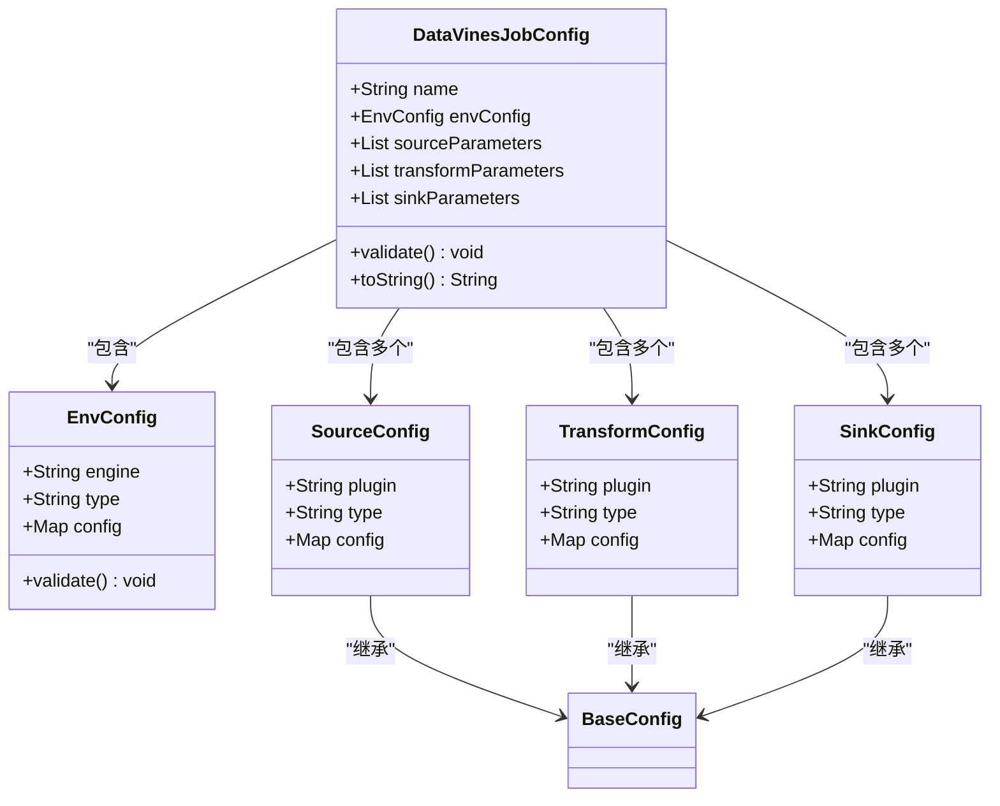
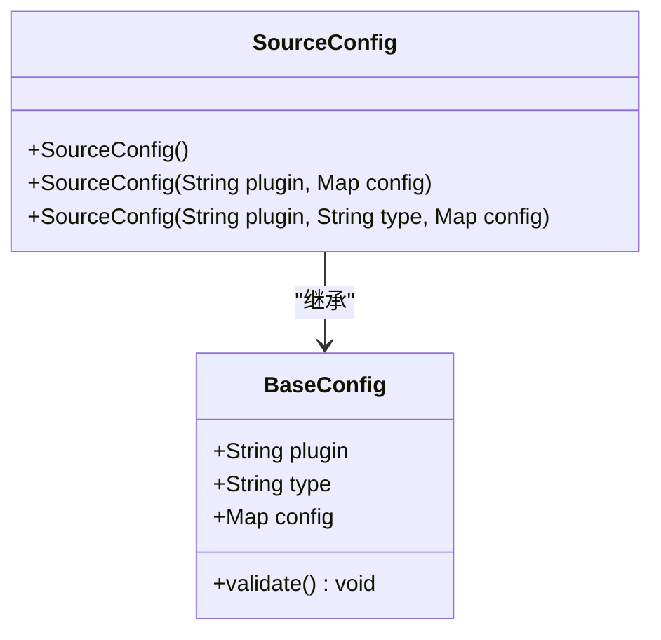
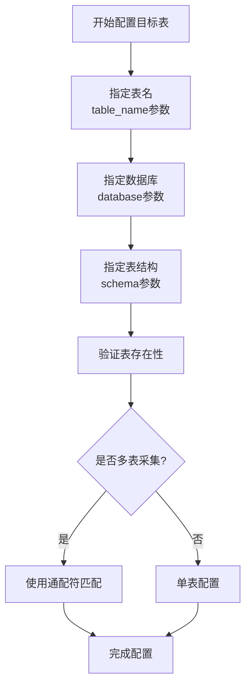
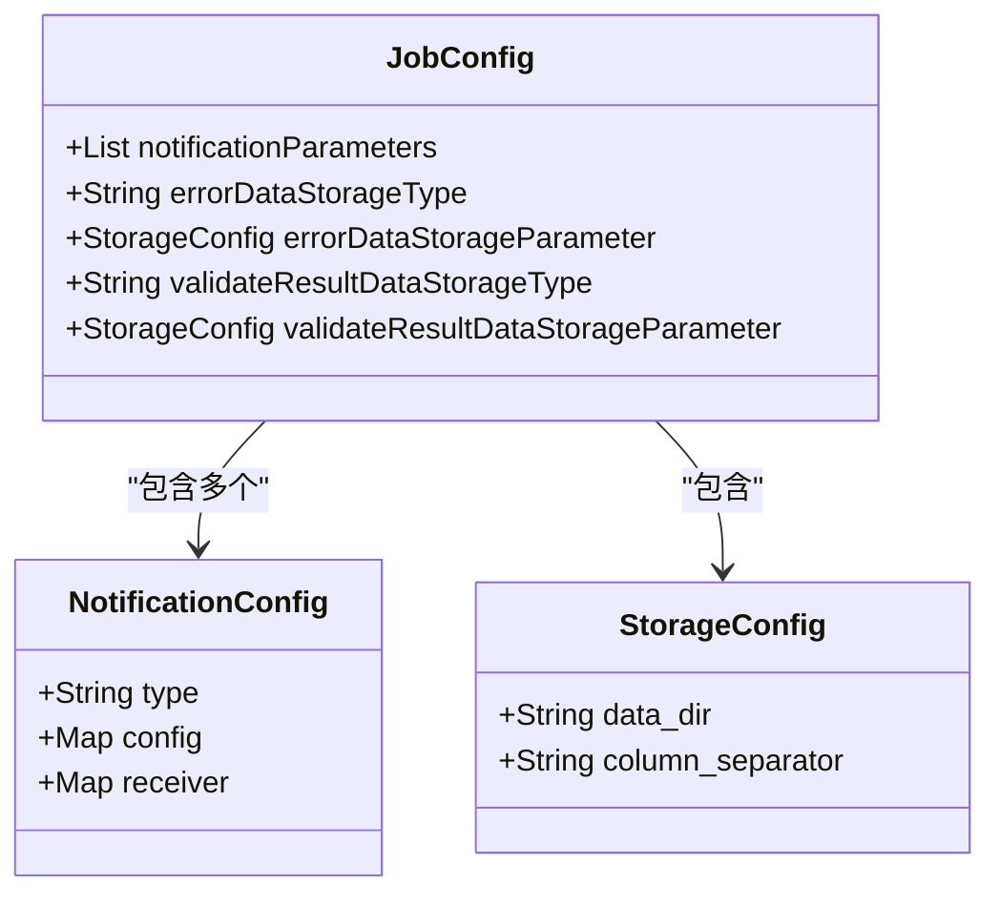
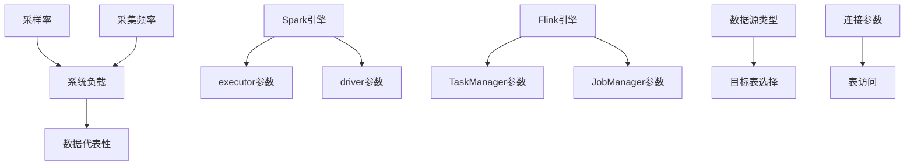

# 参数说明

<cite>
**本文档引用的文件**  
- [DataVinesJobConfig.java](file://datavines-common/src/main/java/io/datavines/common/config/DataVinesJobConfig.java)
- [SourceConfig.java](file://datavines-common/src/main/java/io/datavines/common/config/SourceConfig.java)
- [SinkConfig.java](file://datavines-common/src/main/java/io/datavines/common/config/SinkConfig.java)
- [TransformConfig.java](file://datavines-common/src/main/java/io/datavines/common/config/TransformConfig.java)
- [BaseConfig.java](file://datavines-common/src/main/java/io/datavines/common/config/BaseConfig.java)
- [EnvConfig.java](file://datavines-common/src/main/java/io/datavines/common/config/EnvConfig.java)
- [CoreConfig.java](file://datavines-common/src/main/java/io/datavines/common/config/CoreConfig.java)
- [submit_job_file_source.json](file://datavines-runner/src/main/resources/submit_job_file_source.json)
- [submit_job_file_storage.json](file://datavines-runner/src/main/resources/submit_job_file_storage.json)
- [SparkEngineParameter.java](file://datavines-common/src/main/java/io/datavines/common/entity/SparkEngineParameter.java)
- [FlinkParameters.java](file://datavines-engine/datavines-engine-plugins/datavines-engine-flink/datavines-engine-flink-executor/src/main/java/io/datavines/engine/flink/executor/parameter/FlinkParameters.java)
- [MetricConstants.java](file://datavines-metric/datavines-metric-api/src/main/java/io/datavines/metric/api/MetricConstants.java)
- [TimeoutStrategy.java](file://datavines-common/src/main/java/io/datavines/common/enums/TimeoutStrategy.java)
</cite>

## 目录
1. [引言](#引言)
2. [核心配置参数](#核心配置参数)
3. [数据源配置](#数据源配置)
4. [采集模式与频率](#采集模式与频率)
5. [采样率配置](#采样率配置)
6. [目标表选择](#目标表选择)
7. [高级参数配置](#高级参数配置)
8. [资源限制与超时设置](#资源限制与超时设置)
9. [重试策略](#重试策略)
10. [JSON配置模板](#json配置模板)
11. [参数依赖关系与约束](#参数依赖关系与约束)
12. [最佳实践与推荐值](#最佳实践与推荐值)

## 引言

数据画像采集系统提供了一套完整的配置参数体系，用于控制数据质量检查、数据画像生成和数据验证的各个方面。本参数说明文档全面解释了所有配置参数的含义和用法，详细描述了采集频率、采样率、目标表选择、采集模式（增量/全量）等核心参数的配置方法和取值范围。

系统采用分层配置结构，主要由作业配置（DataVinesJobConfig）、环境配置（EnvConfig）、数据源配置（SourceConfig）、转换配置（TransformConfig）和接收器配置（SinkConfig）组成。每个配置参数都经过严格验证，确保配置的正确性和完整性。

**本节内容未分析具体源文件，因此不提供来源信息**

## 核心配置参数

核心配置参数构成了数据画像采集任务的基础结构，定义了任务的基本属性和执行环境。`DataVinesJobConfig`类是核心配置的载体，包含任务名称、环境配置、数据源、转换和接收器等关键组件。



**图示来源**  
- [DataVinesJobConfig.java](file://datavines-common/src/main/java/io/datavines/common/config/DataVinesJobConfig.java#L26-L130)
- [EnvConfig.java](file://datavines-common/src/main/java/io/datavines/common/config/EnvConfig.java#L29-L80)
- [SourceConfig.java](file://datavines-common/src/main/java/io/datavines/common/config/SourceConfig.java#L24-L36)
- [TransformConfig.java](file://datavines-common/src/main/java/io/datavines/common/config/TransformConfig.java#L24-L36)
- [SinkConfig.java](file://datavines-common/src/main/java/io/datavines/common/config/SinkConfig.java#L24-L36)

**本节来源**  
- [DataVinesJobConfig.java](file://datavines-common/src/main/java/io/datavines/common/config/DataVinesJobConfig.java#L26-L130)
- [BaseConfig.java](file://datavines-common/src/main/java/io/datavines/common/config/BaseConfig.java#L29-L85)

## 数据源配置

数据源配置通过`SourceConfig`类实现，该类继承自`BaseConfig`，提供了统一的插件化配置接口。数据源配置的核心参数包括插件类型、数据源类型和具体配置参数。

`SourceConfig`的主要参数如下：
- **plugin**: 指定数据源插件类型，如"mysql"、"postgresql"、"oracle"等
- **type**: 指定数据源的具体类型
- **config**: 包含具体的数据源连接参数，如主机地址、端口、用户名、密码等

数据源配置支持多种数据库类型，包括关系型数据库（MySQL、PostgreSQL、Oracle等）和文件系统。配置参数通过Map结构存储，提供了良好的扩展性和灵活性。



**图示来源**  
- [SourceConfig.java](file://datavines-common/src/main/java/io/datavines/common/config/SourceConfig.java#L24-L36)
- [BaseConfig.java](file://datavines-common/src/main/java/io/datavines/common/config/BaseConfig.java#L29-L85)

**本节来源**  
- [SourceConfig.java](file://datavines-common/src/main/java/io/datavines/common/config/SourceConfig.java#L24-L36)
- [BaseConfig.java](file://datavines-common/src/main/java/io/datavines/common/config/BaseConfig.java#L29-L85)

## 采集模式与频率

采集模式和频率通过环境配置（EnvConfig）进行控制，是影响数据采集行为的关键参数。`EnvConfig`类定义了执行引擎、执行类型和相关配置参数。

### 采集模式

采集模式由`type`参数控制，支持以下两种模式：
- **batch**: 批处理模式，适用于全量数据采集和周期性数据质量检查
- **stream**: 流式处理模式，适用于实时数据监控和增量数据采集

批处理模式适合对历史数据进行全面分析，而流式处理模式适合对实时数据进行持续监控。选择合适的采集模式对系统性能和数据时效性有重要影响。

### 采集频率

采集频率通过调度系统配置，通常与作业的调度周期相关。虽然采集频率参数不直接在`EnvConfig`中定义，但通过`config`参数可以传递与频率相关的配置信息。

```mermaid
classDiagram
class EnvConfig {
+String engine
+String type
+Map<String,Object> config
+validate() void
}
note right of EnvConfig
type参数控制采集模式：
- batch : 批处理模式
- stream : 流式处理模式
end note
```

**图示来源**  
- [EnvConfig.java](file://datavines-common/src/main/java/io/datavines/common/config/EnvConfig.java#L29-L80)

**本节来源**  
- [EnvConfig.java](file://datavines-common/src/main/java/io/datavines/common/config/EnvConfig.java#L29-L80)

## 采样率配置

采样率配置是控制数据采集量的重要参数，直接影响采集性能和结果的代表性。虽然在核心配置类中没有直接的采样率参数，但可以通过`config`参数在数据源或转换配置中传递采样率设置。

采样率通常以百分比形式表示，取值范围为0-100。0表示不采集任何数据，100表示全量采集。合理的采样率设置可以在保证数据代表性的同时，显著降低系统资源消耗。

在实际应用中，采样率配置通常与采集频率和数据量大小相权衡。对于数据量较大的表，可以适当降低采样率以提高采集效率；对于关键业务表，则应提高采样率以确保数据质量。

**本节内容未分析具体源文件，因此不提供来源信息**

## 目标表选择

目标表选择通过数据源配置中的具体参数实现，通常在`config`参数中指定。在示例配置文件`submit_job_file_source.json`中，可以看到目标表选择的具体实现方式。

目标表选择参数包括：
- **table_name**: 指定要采集的目标表名称
- **database**: 指定目标数据库名称
- **schema**: 指定数据表的结构信息

目标表选择支持单表和多表配置。对于多表采集，可以在数据源配置中指定多个表，或通过通配符匹配多个表。选择合适的目标表对数据画像的准确性和完整性至关重要。



**图示来源**  
- [submit_job_file_source.json](file://datavines-runner/src/main/resources/submit_job_file_source.json#L9-L12)

**本节来源**  
- [submit_job_file_source.json](file://datavines-runner/src/main/resources/submit_job_file_source.json#L9-L12)

## 高级参数配置

高级参数配置涵盖了数据采集过程中的各种精细化控制选项，包括通知配置、错误数据存储和验证结果存储等。这些参数在示例配置文件`submit_job_file_storage.json`中有详细体现。

### 通知参数

通知参数用于配置数据质量检查结果的通知方式，支持多种通知渠道：
- **email**: 邮件通知
- **dingtalk**: 钉钉通知
- **lark**: 飞书通知
- **wecombot**: 企业微信通知

每种通知方式都有相应的配置参数，如邮件服务器地址、端口、发件人、收件人等。

### 存储参数

存储参数用于配置错误数据和验证结果的存储位置：
- **errorDataStorageType**: 错误数据存储类型
- **errorDataStorageParameter**: 错误数据存储参数
- **validateResultDataStorageType**: 验证结果存储类型
- **validateResultDataStorageParameter**: 验证结果存储参数



**图示来源**  
- [submit_job_file_storage.json](file://datavines-runner/src/main/resources/submit_job_file_storage.json#L46-L64)

**本节来源**  
- [submit_job_file_storage.json](file://datavines-runner/src/main/resources/submit_job_file_storage.json#L36-L64)

## 资源限制与超时设置

资源限制与超时设置是保障系统稳定运行的重要参数，通过执行引擎的配置参数进行控制。不同执行引擎有不同的资源限制参数。

### Spark引擎资源限制

对于Spark引擎，资源限制参数包括：
- **numExecutors**: 执行器数量
- **executorCores**: 每个执行器的核心数
- **executorMemory**: 每个执行器的内存
- **driverCores**: 驱动程序核心数
- **driverMemory**: 驱动程序内存

这些参数在`SparkEngineParameter`类中定义，用于控制Spark作业的资源分配。

### Flink引擎资源限制

对于Flink引擎，资源限制参数包括：
- **taskManagerCount**: TaskManager数量
- **taskManagerMemory**: TaskManager内存
- **jobManagerMemory**: JobManager内存
- **parallelism**: 并行度

这些参数在`FlinkParameters`类中定义，用于控制Flink作业的资源分配。

```mermaid
classDiagram
class SparkEngineParameter {
+String programType
+String deployMode
+int driverCores
+String driverMemory
+int numExecutors
+int executorCores
+String executorMemory
+String others
}
class FlinkParameters {
+String taskManagerCount
+String taskManagerMemory
+String jobManagerMemory
+int parallelism
+String flinkOthers
}
note right of SparkEngineParameter
Spark引擎资源参数
end note
note right of FlinkParameters
Flink引擎资源参数
end note
```

**图示来源**  
- [SparkEngineParameter.java](file://datavines-common/src/main/java/io/datavines/common/entity/SparkEngineParameter.java#L26-L68)
- [FlinkParameters.java](file://datavines-engine/datavines-engine-plugins/datavines-engine-flink/datavines-engine-flink-executor/src/main/java/io/datavines/engine/flink/executor/parameter/FlinkParameters.java#L22-L49)

**本节来源**  
- [SparkEngineParameter.java](file://datavines-common/src/main/java/io/datavines/common/entity/SparkEngineParameter.java#L26-L68)
- [FlinkParameters.java](file://datavines-engine/datavines-engine-plugins/datavines-engine-flink/datavines-engine-flink-executor/src/main/java/io/datavines/engine/flink/executor/parameter/FlinkParameters.java#L22-L49)

## 重试策略

重试策略通过`TimeoutStrategy`枚举类定义，用于控制任务执行失败时的处理方式。系统提供了两种重试策略：

- **RETRY (0)**: 重试策略，当任务失败时尝试重新执行
- **WARN (1)**: 警告策略，当任务失败时记录警告但继续执行后续任务

重试策略的选择应根据任务的重要性和失败影响来决定。对于关键业务任务，建议使用RETRY策略以确保任务最终成功；对于非关键任务，可以使用WARN策略以避免阻塞整个作业流程。

```mermaid
stateDiagram-v2
[*] --> RETRY
[*] --> WARN
RETRY --> "任务失败" : 发生
"任务失败" --> "尝试重试" : RETRY策略
"尝试重试" --> "任务成功" : 重试成功
"尝试重试" --> "任务失败" : 重试失败
"任务成功" --> [*]
WARN --> "任务失败" : 发生
"任务失败" --> "记录警告" : WARN策略
"记录警告" --> "继续执行"
"继续执行" --> [*]
```

**图示来源**  
- [TimeoutStrategy.java](file://datavines-common/src/main/java/io/datavines/common/enums/TimeoutStrategy.java#L24-L50)

**本节来源**  
- [TimeoutStrategy.java](file://datavines-common/src/main/java/io/datavines/common/enums/TimeoutStrategy.java#L24-L50)

## JSON配置模板

以下是一个完整的JSON配置模板，包含所有可配置项的示例和注释：

```json
{
  "name": "数据画像采集任务",
  "env": {
    "engine": "spark",
    "type": "batch",
    "config": {
      "spark.engine.parameter.num.executors": 2,
      "spark.engine.parameter.executor.cores": 2,
      "spark.engine.parameter.executor.memory": "1g"
    }
  },
  "sources": [
    {
      "plugin": "mysql",
      "type": "database",
      "config": {
        "host": "localhost",
        "port": "3306",
        "user": "root",
        "password": "password",
        "database": "test",
        "table_name": "user_info",
        "schema": "id,name,age,email"
      }
    }
  ],
  "transforms": [
    {
      "plugin": "data_profile",
      "type": "profile",
      "config": {
        "sampling_rate": 100,
        "metrics": ["row_count", "column_null", "column_duplicate"]
      }
    }
  ],
  "sinks": [
    {
      "plugin": "file",
      "type": "storage",
      "config": {
        "data_dir": "/tmp/datavines/results",
        "column_separator": ","
      }
    }
  ],
  "errorDataStorageType": "file",
  "errorDataStorageParameter": {
    "data_dir": "/tmp/datavines/errors",
    "column_separator": ","
  },
  "validateResultDataStorageType": "file",
  "validateResultDataStorageParameter": {
    "data_dir": "/tmp/datavines/validate_results",
    "column_separator": ","
  },
  "notificationParameters": [
    {
      "type": "email",
      "config": {
        "serverHost": "smtp.gmail.com",
        "serverPort": "587",
        "sender": "sender@gmail.com",
        "user": "sender@gmail.com",
        "passwd": "password",
        "starttlsEnable": "true"
      },
      "receiver": {
        "to": "receiver@gmail.com"
      }
    }
  ]
}
```

**本节来源**  
- [submit_job_file_source.json](file://datavines-runner/src/main/resources/submit_job_file_source.json)
- [submit_job_file_storage.json](file://datavines-runner/src/main/resources/submit_job_file_storage.json)

## 参数依赖关系与约束

参数之间存在复杂的依赖关系和约束条件，正确理解这些关系对配置的正确性至关重要。

### 采样率与采集频率的权衡

采样率和采集频率之间存在明显的权衡关系：
- 高采样率+高采集频率：数据代表性好，但系统负载高
- 低采样率+低采集频率：系统负载低，但数据代表性差
- 高采样率+低采集频率：适合关键业务表的定期全面检查
- 低采样率+高采集频率：适合非关键业务表的持续监控

### 引擎与资源参数的约束

执行引擎与资源参数之间存在严格的约束关系：
- Spark引擎需要配置executor和driver相关参数
- Flink引擎需要配置TaskManager和JobManager相关参数
- 不同引擎的参数不能混用

### 数据源与目标表的约束

数据源配置与目标表选择之间存在依赖关系：
- 数据源类型决定了可用的目标表选择方式
- 数据库连接参数必须正确才能访问目标表
- 表结构信息必须与实际表结构匹配



**本节内容未分析具体源文件，因此不提供来源信息**

## 最佳实践与推荐值

基于系统特性和实际应用经验，以下是数据画像采集参数的最佳实践和推荐值：

### 一般性推荐

- **任务命名**: 使用有意义的名称，便于识别和管理
- **配置验证**: 在提交任务前进行配置验证，确保所有必填参数都已设置
- **参数注释**: 对复杂配置添加注释，便于后续维护

### 采集模式推荐

- **批处理模式**: 适用于每日/每周的数据质量检查
- **流式处理模式**: 适用于实时数据监控和告警

### 采样率推荐

- **关键业务表**: 采样率100%，确保数据完整性
- **大表**: 采样率10-50%，平衡性能和代表性
- **非关键表**: 采样率5-10%，降低系统负载

### 资源配置推荐

- **Spark作业**: 
  - executor数量: 2-4
  - 每个executor核心数: 2-4
  - executor内存: 2-4g
- **Flink作业**:
  - TaskManager数量: 2-4
  - 并行度: 4-8

### 超时与重试策略

- **关键任务**: 使用RETRY策略，设置合理的重试次数
- **非关键任务**: 使用WARN策略，避免阻塞作业流程
- **超时时间**: 根据数据量和复杂度设置，一般为5-30分钟

**本节内容未分析具体源文件，因此不提供来源信息**