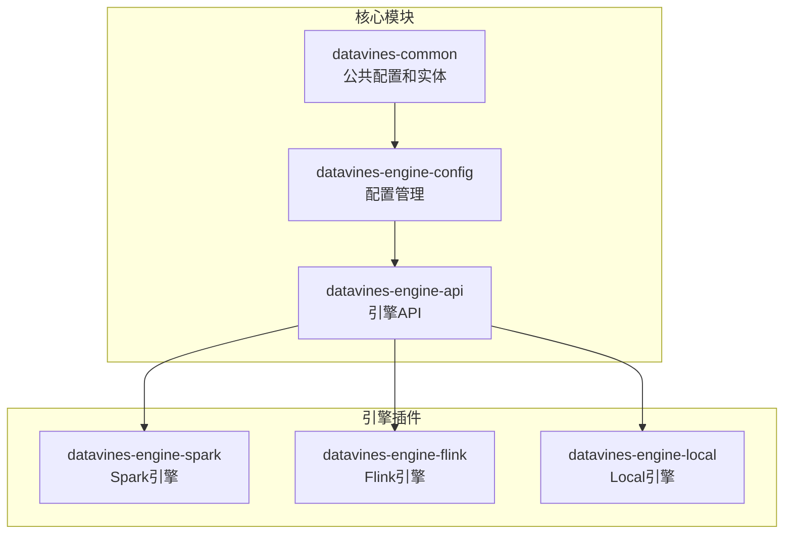
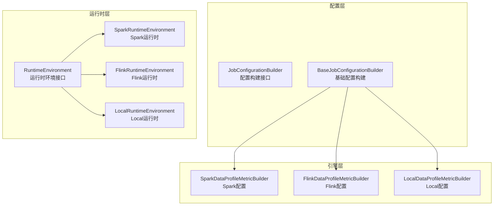
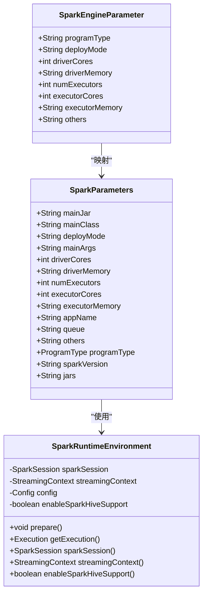
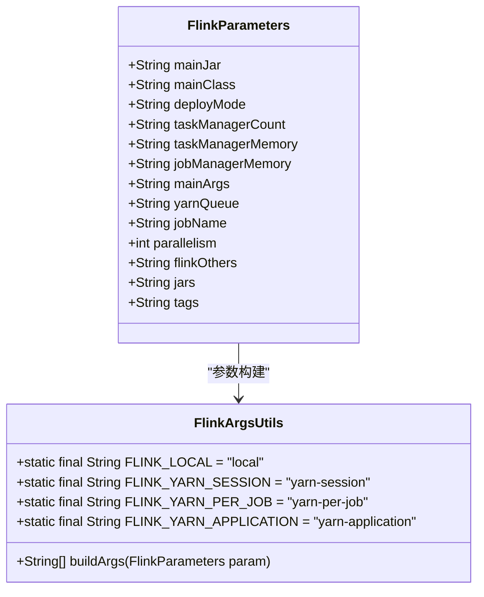
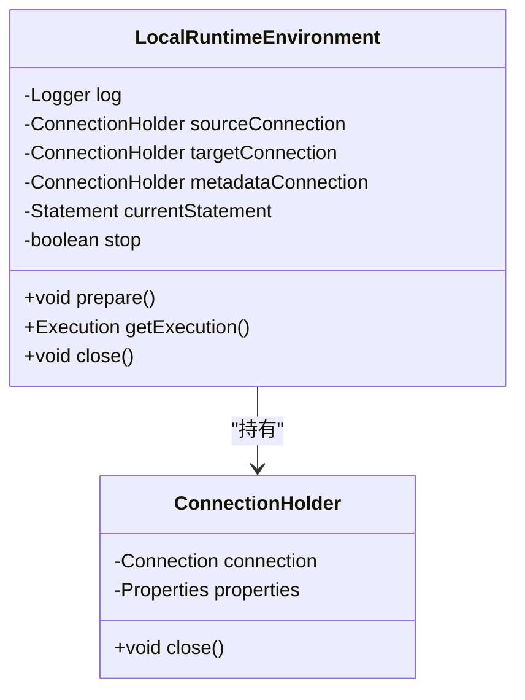
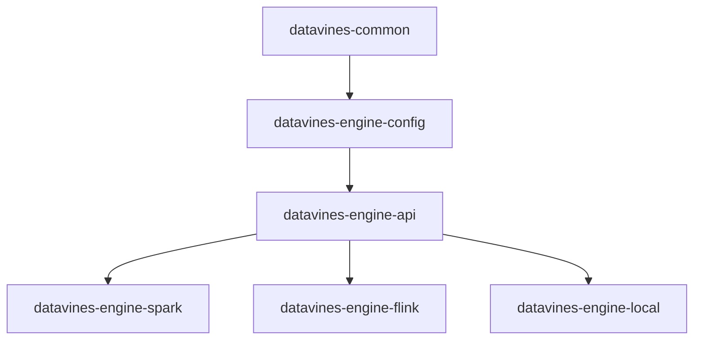

# 执行引擎配置

<cite>
**本文档引用的文件**   
- [SparkEngineParameter.java](file://datavines-common/src/main/java/io/datavines/common/entity/SparkEngineParameter.java)
- [SparkParameters.java](file://datavines-engine-plugins/datavines-engine-spark/datavines-engine-spark-executor/src/main/java/io/datavines/engine/spark/executor/parameter/SparkParameters.java)
- [SparkRuntimeEnvironment.java](file://datavines-engine-plugins/datavines-engine-spark/datavines-engine-spark-api/src/main/java/io/datavines/engine/spark/api/SparkRuntimeEnvironment.java)
- [FlinkParameters.java](file://datavines-engine-plugins/datavines-engine-flink/datavines-engine-flink-executor/src/main/java/io/datavines/engine/flink/executor/parameter/FlinkParameters.java)
- [FlinkArgsUtils.java](file://datavines-engine-plugins/datavines-engine-flink/datavines-engine-flink-executor/src/main/java/io/datavines/engine/flink/executor/parameter/FlinkArgsUtils.java)
- [LocalRuntimeEnvironment.java](file://datavines-engine-plugins/datavines-engine-local/datavines-engine-local-api/src/main/java/io/datavines/engine/local/api/LocalRuntimeEnvironment.java)
- [BaseJobConfigurationBuilder.java](file://datavines-engine-config/src/main/java/io/datavines/engine/config/BaseJobConfigurationBuilder.java)
- [DataVinesJobConfig.java](file://datavines-common/src/main/java/io/datavines/common/config/DataVinesJobConfig.java)
- [EnvConfig.java](file://datavines-common/src/main/java/io/datavines/common/config/EnvConfig.java)
- [common.properties](file://datavines-common/src/main/resources/common.properties)
</cite>

## 目录
1. [简介](#简介)
2. [项目结构](#项目结构)
3. [核心组件](#核心组件)
4. [架构概述](#架构概述)
5. [详细组件分析](#详细组件分析)
6. [依赖分析](#依赖分析)
7. [性能考虑](#性能考虑)
8. [故障排除指南](#故障排除指南)
9. [结论](#结论)

## 简介
本文档详细说明了Datavines平台中Spark、Flink和Local三种执行引擎的特定配置要求。文档涵盖了每种引擎的配置文件结构差异、特有的配置参数和优化选项，提供了资源配置建议，包括内存、CPU、并行度等设置。同时，文档还说明了不同引擎在处理大规模数据时的性能特点和适用场景，并提供了针对每种引擎的最佳实践和错误处理技巧。

## 项目结构
Datavines项目的结构清晰地组织了不同执行引擎的实现和配置。核心引擎实现位于`datavines-engine-plugins`目录下，每个引擎都有独立的模块，如`datavines-engine-spark`、`datavines-engine-flink`和`datavines-engine-local`。这些模块包含了引擎特定的配置、执行器和API实现。公共配置和实体定义位于`datavines-common`模块中，而配置管理逻辑则在`datavines-engine-config`模块中实现。

**图表来源**
- [SparkEngineParameter.java](file://datavines-common/src/main/java/io/datavines/common/entity/SparkEngineParameter.java)
- [BaseJobConfigurationBuilder.java](file://datavines-engine-config/src/main/java/io/datavines/engine/config/BaseJobConfigurationBuilder.java)
- [datavines-engine-plugins](file://datavines-engine/datavines-engine-plugins)

## 核心组件
本节分析Datavines平台中与执行引擎配置相关的核心组件。`SparkEngineParameter`类定义了Spark引擎的所有配置参数，包括程序类型、部署模式、驱动程序和执行器的资源分配等。`FlinkParameters`类为Flink引擎定义了类似的配置，包括任务管理器和作业管理器的内存设置。`LocalRuntimeEnvironment`类为本地执行模式提供了运行时环境，而`BaseJobConfigurationBuilder`则负责构建和管理所有引擎的配置。

**章节来源**
- [SparkEngineParameter.java](file://datavines-common/src/main/java/io/datavines/common/entity/SparkEngineParameter.java#L1-L69)
- [FlinkParameters.java](file://datavines-engine-plugins/datavines-engine-flink/datavines-engine-flink-executor/src/main/java/io/datavines/engine/flink/executor/parameter/FlinkParameters.java#L1-L50)
- [LocalRuntimeEnvironment.java](file://datavines-engine-plugins/datavines-engine-local/datavines-engine-local-api/src/main/java/io/datavines/engine/local/api/LocalRuntimeEnvironment.java#L1-L99)

## 架构概述
Datavines平台的执行引擎架构采用插件化设计，允许灵活地支持多种计算引擎。核心配置管理模块`datavines-engine-config`定义了统一的配置构建接口，而各个引擎插件则实现了具体的配置逻辑。运行时环境由`RuntimeEnvironment`接口定义，每个引擎提供自己的实现。这种设计使得平台能够轻松扩展以支持新的执行引擎，同时保持配置管理的一致性。

**图表来源**
- [JobConfigurationBuilder.java](file://datavines-engine-config/src/main/java/io/datavines/engine/config/JobConfigurationBuilder.java#L1-L42)
- [BaseJobConfigurationBuilder.java](file://datavines-engine-config/src/main/java/io/datavines/engine/config/BaseJobConfigurationBuilder.java#L1-L322)
- [SparkRuntimeEnvironment.java](file://datavines-engine-plugins/datavines-engine-spark/datavines-engine-spark-api/src/main/java/io/datavines/engine/spark/api/SparkRuntimeEnvironment.java#L1-L118)

## 详细组件分析

### Spark执行引擎分析
Spark执行引擎的配置主要通过`SparkEngineParameter`和`SparkParameters`类来管理。`SparkEngineParameter`定义了Spark作业的核心配置参数，包括程序类型、部署模式、驱动程序和执行器的资源分配。`SparkParameters`类则提供了更详细的参数设置，如主JAR文件、主类、应用程序名称和YARN队列等。

**图表来源**
- [SparkEngineParameter.java](file://datavines-common/src/main/java/io/datavines/common/entity/SparkEngineParameter.java#L1-L69)
- [SparkParameters.java](file://datavines-engine-plugins/datavines-engine-spark/datavines-engine-spark-executor/src/main/java/io/datavines/engine/spark/executor/parameter/SparkParameters.java#L1-L220)
- [SparkRuntimeEnvironment.java](file://datavines-engine-plugins/datavines-engine-spark/datavines-engine-spark-api/src/main/java/io/datavines/engine/spark/api/SparkRuntimeEnvironment.java#L1-L118)

### Flink执行引擎分析
Flink执行引擎的配置通过`FlinkParameters`类进行管理，该类定义了Flink作业的关键参数，包括部署模式、任务管理器数量和内存、作业管理器内存、并行度等。`FlinkArgsUtils`工具类负责将这些参数转换为Flink命令行参数。

**图表来源**
- [FlinkParameters.java](file://datavines-engine-plugins/datavines-engine-flink/datavines-engine-flink-executor/src/main/java/io/datavines/engine/flink/executor/parameter/FlinkParameters.java#L1-L50)
- [FlinkArgsUtils.java](file://datavines-engine-plugins/datavines-engine-flink/datavines-engine-flink-executor/src/main/java/io/datavines/engine/flink/executor/parameter/FlinkArgsUtils.java#L1-L72)

### Local执行引擎分析
Local执行引擎的配置相对简单，主要通过`LocalRuntimeEnvironment`类提供运行时环境。该类负责管理数据库连接和执行状态，适用于小规模数据处理和测试场景。

**图表来源**
- [LocalRuntimeEnvironment.java](file://datavines-engine-plugins/datavines-engine-local/datavines-engine-local-api/src/main/java/io/datavines/engine/local/api/LocalRuntimeEnvironment.java#L1-L99)

## 依赖分析
Datavines平台的执行引擎配置依赖于多个核心模块。`datavines-common`模块提供了基础的配置实体和常量，`datavines-engine-config`模块定义了配置构建的通用接口和基类，而各个引擎插件则实现了具体的配置逻辑。这种分层设计确保了配置管理的一致性和可扩展性。

**图表来源**
- [datavines-common](file://datavines-common)
- [datavines-engine-config](file://datavines-engine/datavines-engine-config)
- [datavines-engine-api](file://datavines-engine/datavines-engine-api)

## 性能考虑
在配置执行引擎时，需要根据数据规模和处理需求进行合理的资源配置。对于Spark引擎，建议根据数据量调整执行器数量和内存分配，避免内存溢出。Flink引擎的并行度设置应与集群资源相匹配，以充分利用计算能力。Local模式适用于小规模数据处理，不适合大规模生产环境。

## 故障排除指南
在配置和使用执行引擎时，可能会遇到各种问题。对于Spark引擎，常见的问题包括内存不足和依赖冲突，建议通过调整`driverMemory`和`executorMemory`参数来解决。Flink引擎的常见问题包括任务管理器内存不足和网络超时，可以通过增加`taskManagerMemory`和调整检查点间隔来优化。Local模式的主要限制是资源有限，不适合处理大规模数据。

**章节来源**
- [SparkEngineParameter.java](file://datavines-common/src/main/java/io/datavines/common/entity/SparkEngineParameter.java#L1-L69)
- [FlinkParameters.java](file://datavines-engine-plugins/datavines-engine-flink/datavines-engine-flink-executor/src/main/java/io/datavines/engine/flink/executor/parameter/FlinkParameters.java#L1-L50)
- [LocalRuntimeEnvironment.java](file://datavines-engine-plugins/datavines-engine-local/datavines-engine-local-api/src/main/java/io/datavines/engine/local/api/LocalRuntimeEnvironment.java#L1-L99)

## 结论
Datavines平台通过插件化设计支持多种执行引擎，提供了灵活的配置选项。Spark引擎适合批处理和大规模数据处理，Flink引擎适合流处理和实时计算，而Local模式则适合开发和测试。通过合理配置资源和优化参数，可以充分发挥各引擎的优势，满足不同的数据处理需求。