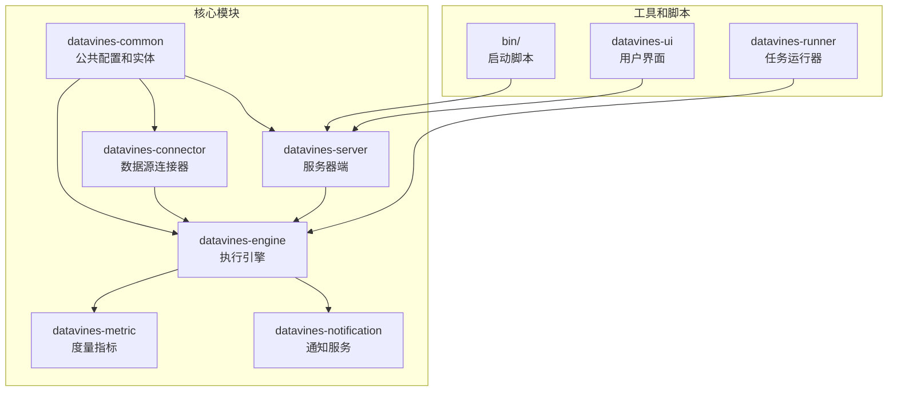
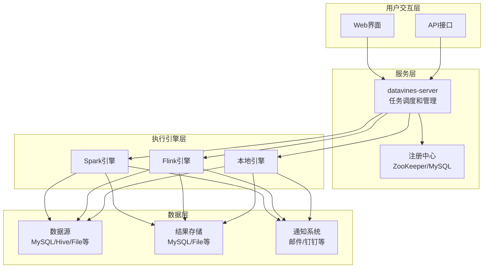
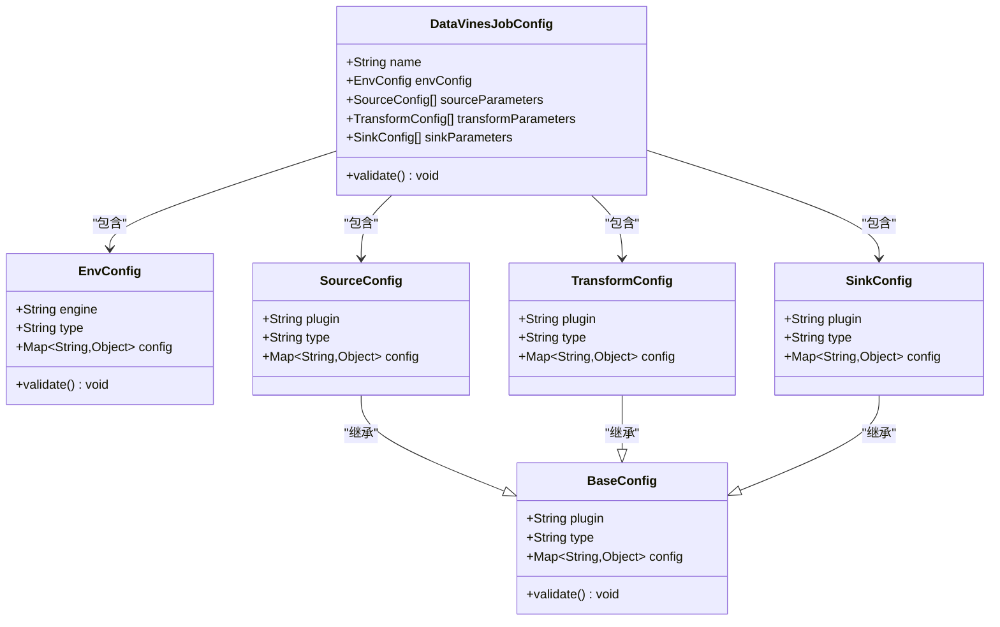
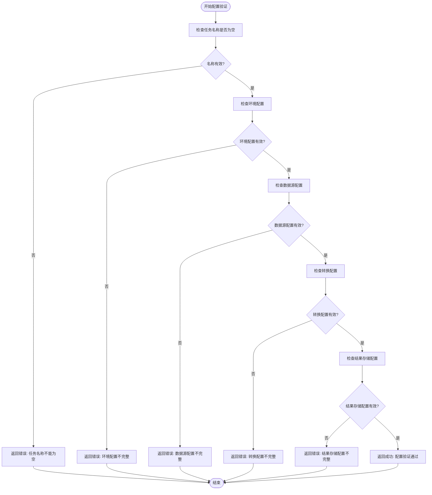
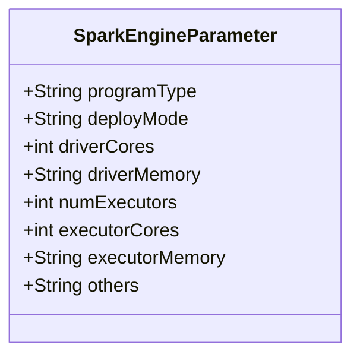
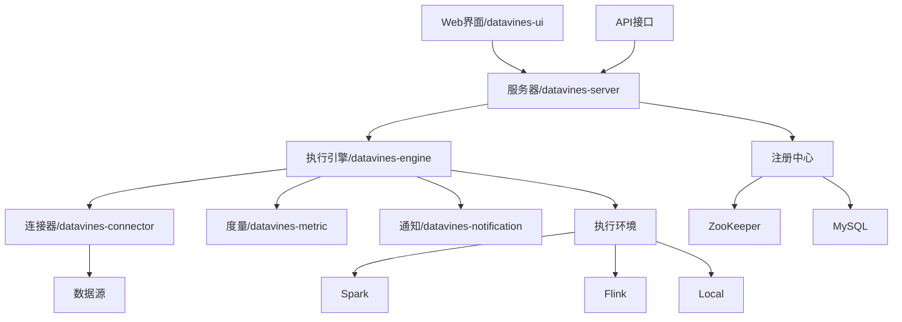

# 采集配置

<cite>
**本文档引用的文件**
- [DataVinesJobConfig.java](file://datavines-common/src/main/java/io/datavines/common/config/DataVinesJobConfig.java)
- [SourceConfig.java](file://datavines-common/src/main/java/io/datavines/common/config/SourceConfig.java)
- [SinkConfig.java](file://datavines-common/src/main/java/io/datavines/common/config/SinkConfig.java)
- [TransformConfig.java](file://datavines-common/src/main/java/io/datavines/common/config/TransformConfig.java)
- [EnvConfig.java](file://datavines-common/src/main/java/io/datavines/common/config/EnvConfig.java)
- [BaseConfig.java](file://datavines-common/src/main/java/io/datavines/common/config/BaseConfig.java)
- [ConfigChecker.java](file://datavines-common/src/main/java/io/datavines/common/config/ConfigChecker.java)
- [SparkEngineParameter.java](file://datavines-common/src/main/java/io/datavines/common/entity/SparkEngineParameter.java)
- [submit_job_file_source.json](file://datavines-runner/src/main/resources/submit_job_file_source.json)
- [submit_job_mysql_storage.json](file://datavines-runner/src/main/resources/submit_job_mysql_storage.json)
- [config.ts](file://datavines-ui/src/type/config.ts)
</cite>

## 目录
1. [简介](#简介)
2. [项目结构](#项目结构)
3. [核心组件](#核心组件)
4. [架构概述](#架构概述)
5. [详细组件分析](#详细组件分析)
6. [依赖分析](#依赖分析)
7. [性能考虑](#性能考虑)
8. [故障排除指南](#故障排除指南)
9. [结论](#结论)

## 简介
本文档详细说明了如何配置和启动数据画像采集任务。文档涵盖了通过Web界面和API两种方式配置画像任务的步骤，解释了配置参数的含义，包括采集频率、采样率、目标表选择等。同时说明了如何设置增量采集和全量采集模式，提供了配置文件的结构和示例，包括JSON格式的配置模板。文档还解释了配置验证机制和错误处理，并涵盖了不同执行引擎（Spark、Flink、Local）的特定配置要求，最后提供了最佳实践建议。

## 项目结构
数据画像采集系统采用模块化设计，主要包含以下几个核心模块：公共配置模块、连接器模块、引擎模块、度量模块、通知模块和服务器模块。系统通过配置驱动的方式实现数据采集任务的灵活配置和执行。



**图示来源**
- [DataVinesJobConfig.java](file://datavines-common/src/main/java/io/datavines/common/config/DataVinesJobConfig.java)
- [submit_job_file_source.json](file://datavines-runner/src/main/resources/submit_job_file_source.json)

## 核心组件

数据画像采集系统的核心组件包括配置管理、数据源连接、执行引擎、度量计算和结果存储。系统通过统一的配置模型来描述采集任务，支持多种数据源和执行引擎，实现了配置与执行的解耦。

**组件来源**
- [DataVinesJobConfig.java](file://datavines-common/src/main/java/io/datavines/common/config/DataVinesJobConfig.java)
- [SourceConfig.java](file://datavines-common/src/main/java/io/datavines/common/config/SourceConfig.java)
- [SinkConfig.java](file://datavines-common/src/main/java/io/datavines/common/config/SinkConfig.java)

## 架构概述

系统采用分层架构设计，从上到下分为用户界面层、服务层、引擎层和数据层。用户通过Web界面或API提交采集任务配置，服务器端接收配置并进行验证，然后将任务提交给相应的执行引擎进行处理，最终将结果存储到指定的目标系统中。



**图示来源**
- [DataVinesJobConfig.java](file://datavines-common/src/main/java/io/datavines/common/config/DataVinesJobConfig.java)
- [EnvConfig.java](file://datavines-common/src/main/java/io/datavines/common/config/EnvConfig.java)

## 详细组件分析

### 配置模型分析
系统采用基于JSON的配置模型来描述数据画像采集任务。配置模型包含任务名称、环境配置、数据源配置、转换配置和结果存储配置等主要部分。

#### 配置类关系图


**图示来源**
- [DataVinesJobConfig.java](file://datavines-common/src/main/java/io/datavines/common/config/DataVinesJobConfig.java)
- [BaseConfig.java](file://datavines-common/src/main/java/io/datavines/common/config/BaseConfig.java)
- [EnvConfig.java](file://datavines-common/src/main/java/io/datavines/common/config/EnvConfig.java)

### 配置参数说明
数据画像采集任务的配置参数主要包括以下几个方面：

#### 任务基本信息
- **name**: 任务名称，用于标识和管理采集任务
- **engine**: 执行引擎，支持Spark、Flink和Local等
- **type**: 执行类型，支持批处理(batch)和流处理(stream)

#### 数据源配置
数据源配置通过SourceConfig类定义，包含以下主要参数：
- **plugin**: 连接器插件类型，如mysql、hive、file等
- **type**: 数据源类型
- **config**: 具体的连接参数，如数据库连接信息、文件路径等

#### 采集模式配置
系统支持全量采集和增量采集两种模式：
- **全量采集**: 每次采集都读取数据源中的全部数据
- **增量采集**: 只采集自上次采集以来新增或修改的数据，通常通过时间戳或自增ID来实现

#### 采集频率和采样率
- **采集频率**: 通过调度系统配置，支持固定间隔、cron表达式等方式
- **采样率**: 在配置中通过参数指定，用于控制采集数据的比例，适用于大数据量场景下的性能优化

**组件来源**
- [DataVinesJobConfig.java](file://datavines-common/src/main/java/io/datavines/common/config/DataVinesJobConfig.java)
- [SourceConfig.java](file://datavines-common/src/main/java/io/datavines/common/config/SourceConfig.java)

### 配置文件结构和示例
系统支持JSON格式的配置文件，以下是一个完整的配置示例：

```json
{
  "name": "用户数据画像采集",
  "env": {
    "engine": "spark",
    "type": "batch",
    "config": {
      "programType": "java",
      "deployMode": "cluster",
      "driverCores": 1,
      "driverMemory": "2g",
      "numExecutors": 2,
      "executorCores": 2,
      "executorMemory": "4g"
    }
  },
  "sources": [
    {
      "plugin": "mysql",
      "type": "database",
      "config": {
        "host": "localhost",
        "port": "3306",
        "database": "user_db",
        "user": "root",
        "password": "password",
        "table": "user_info",
        "where": "create_time >= '${start_time}' AND create_time < '${end_time}'"
      }
    }
  ],
  "transforms": [
    {
      "plugin": "data_profile",
      "type": "profile",
      "config": {
        "metrics": [
          "table_row_count",
          "column_null",
          "column_duplicate"
        ],
        "sampleRate": 0.1
      }
    }
  ],
  "sinks": [
    {
      "plugin": "mysql",
      "type": "database",
      "config": {
        "host": "localhost",
        "port": "3306",
        "database": "data_quality",
        "user": "root",
        "password": "password",
        "table": "profile_results"
      }
    }
  ]
}
```

**组件来源**
- [submit_job_mysql_storage.json](file://datavines-runner/src/main/resources/submit_job_mysql_storage.json)
- [DataVinesJobConfig.java](file://datavines-common/src/main/java/io/datavines/common/config/DataVinesJobConfig.java)

### 配置验证机制和错误处理
系统提供了完善的配置验证机制，确保配置的正确性和完整性。

#### 配置验证流程


**图示来源**
- [DataVinesJobConfig.java](file://datavines-common/src/main/java/io/datavines/common/config/DataVinesJobConfig.java)
- [ConfigChecker.java](file://datavines-common/src/main/java/io/datavines/common/config/ConfigChecker.java)

### 执行引擎特定配置
不同执行引擎有不同的配置要求，系统提供了相应的配置支持。

#### Spark引擎配置
Spark引擎配置通过SparkEngineParameter类定义，包含以下主要参数：
- **programType**: 程序类型，如Java、Scala、Python等
- **deployMode**: 部署模式，支持client和cluster模式
- **driverCores**: Driver核心数
- **driverMemory**: Driver内存
- **numExecutors**: Executor数量
- **executorCores**: 每个Executor的核心数
- **executorMemory**: 每个Executor的内存
- **others**: 其他参数



**图示来源**
- [SparkEngineParameter.java](file://datavines-common/src/main/java/io/datavines/common/entity/SparkEngineParameter.java)

#### Flink引擎配置
Flink引擎支持多种部署模式：
- **local**: 本地模式，用于开发和测试
- **yarn-session**: YARN会话模式
- **yarn-per-job**: YARN每个作业模式
- **yarn-application**: YARN应用模式

#### Local引擎配置
Local引擎适用于小规模数据处理和开发测试，配置相对简单，主要关注内存和CPU资源限制。

**组件来源**
- [SparkEngineParameter.java](file://datavines-common/src/main/java/io/datavines/common/entity/SparkEngineParameter.java)
- [FlinkArgsUtils.java](file://datavines-engine/datavines-engine-plugins/datavines-engine-flink/datavines-engine-flink-executor/src/main/java/io/datavines/engine/flink/executor/parameter/FlinkArgsUtils.java)

## 依赖分析

系统各组件之间的依赖关系如下图所示：



**图示来源**
- [DataVinesJobConfig.java](file://datavines-common/src/main/java/io/datavines/common/config/DataVinesJobConfig.java)
- [EnvConfig.java](file://datavines-common/src/main/java/io/datavines/common/config/EnvConfig.java)

## 性能考虑

在配置数据画像采集任务时，需要考虑以下性能因素：

1. **资源消耗控制**: 合理配置执行引擎的资源参数，避免资源浪费或不足
2. **大规模表采集策略**: 对于大规模表，建议使用分片采集、增量采集等方式
3. **采样率设置**: 在保证数据质量的前提下，适当降低采样率以提高采集效率
4. **并行度配置**: 根据数据量和系统资源合理设置并行度
5. **数据缓存**: 合理利用缓存机制减少重复计算

## 故障排除指南

当配置和执行数据画像采集任务时，可能遇到以下常见问题：

1. **配置验证失败**: 检查必填参数是否完整，参数值是否符合要求
2. **连接失败**: 检查数据源连接信息是否正确，网络是否通畅
3. **执行失败**: 检查执行引擎配置是否正确，资源是否充足
4. **性能问题**: 检查资源配置是否合理，考虑优化采集策略
5. **结果存储失败**: 检查目标存储系统是否可用，权限是否正确

**组件来源**
- [ConfigChecker.java](file://datavines-common/src/main/java/io/datavines/common/config/ConfigChecker.java)
- [DataVinesJobConfig.java](file://datavines-common/src/main/java/io/datavines/common/config/DataVinesJobConfig.java)

## 结论

本文档详细介绍了数据画像采集系统的配置方法，包括配置模型、参数说明、配置文件结构、验证机制和执行引擎配置等。通过合理的配置，可以实现高效、可靠的数据画像采集任务。建议在实际使用中根据具体场景选择合适的配置策略，并遵循最佳实践来优化系统性能。