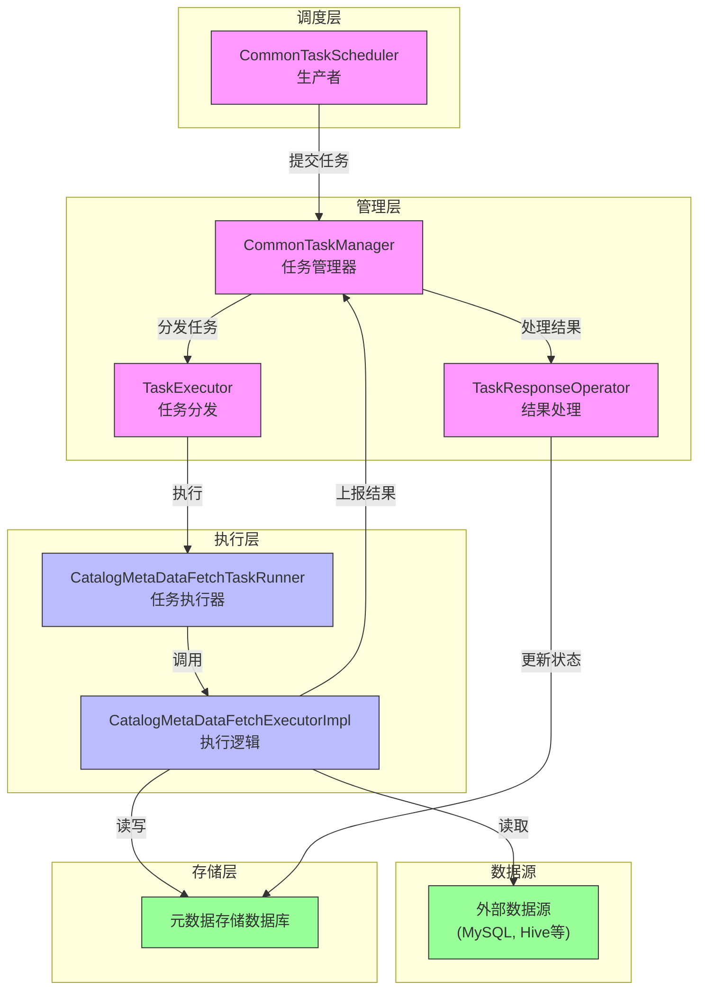
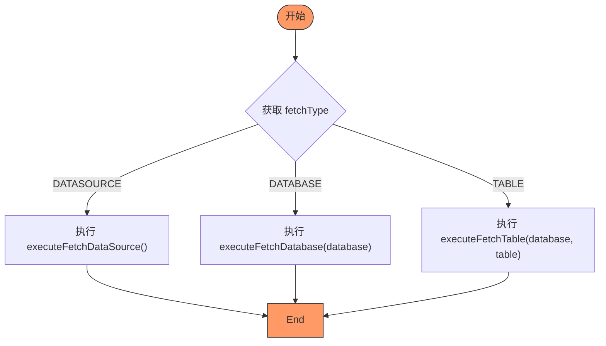
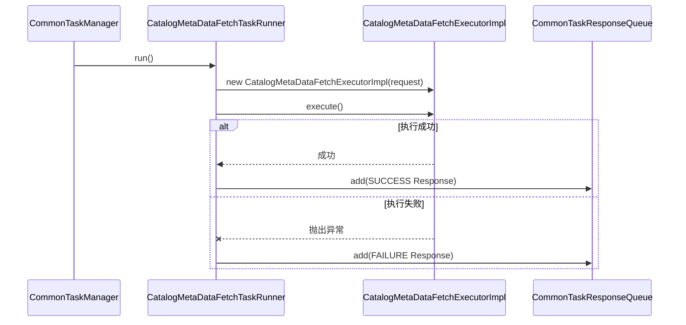

# 元数据同步

<cite>
**本文档引用的文件**   
- [CatalogMetaDataFetchExecutor.java](file://datavines-server/src/main/java/io/datavines/server/scheduler/metadata/task/CatalogMetaDataFetchExecutor.java)
- [CatalogMetaDataFetchTaskRunner.java](file://datavines-server/src/main/java/io/datavines/server/scheduler/metadata/CatalogMetaDataFetchTaskRunner.java)
- [CatalogMetaDataFetchExecutorImpl.java](file://datavines-server/src/main/java/io/datavines/server/scheduler/metadata/task/CatalogMetaDataFetchExecutorImpl.java)
- [CommonTaskManager.java](file://datavines-server/src/main/java/io/datavines/server/scheduler/CommonTaskManager.java)
- [CommonTaskScheduler.java](file://datavines-server/src/main/java/io/datavines/server/scheduler/CommonTaskScheduler.java)
- [CommonTaskContext.java](file://datavines-server/src/main/java/io/datavines/server/scheduler/CommonTaskContext.java)
- [CommonTaskRequest.java](file://datavines-server/src/main/java/io/datavines/server/scheduler/CommonTaskRequest.java)
- [CommonTaskResponse.java](file://datavines-server/src/main/java/io/datavines/server/scheduler/CommonTaskResponse.java)
- [CommonTaskResponseQueue.java](file://datavines-server/src/main/java/io/datavines/server/scheduler/CommonTaskResponseQueue.java)
- [SchemaChangeType.java](file://datavines-server/src/main/java/io/datavines/server/enums/SchemaChangeType.java)
- [FetchType.java](file://datavines-server/src/main/java/io/datavines/server/enums/FetchType.java)
- [CommonPropertyUtils.java](file://datavines-common/src/main/java/io/datavines/common/utils/CommonPropertyUtils.java)
- [application.yaml](file://datavines-server/src/main/resources/application.yaml)
- [metadata.ts](file://datavines-ui/src/type/metadata.ts)
- [CatalogController.java](file://datavines-server/src/main/java/io/datavines/server/api/controller/CatalogController.java)
</cite>

## 目录
1. [简介](#简介)
2. [核心组件](#核心组件)
3. [架构概述](#架构概述)
4. [详细组件分析](#详细组件分析)
5. [依赖分析](#依赖分析)
6. [性能考虑](#性能考虑)
7. [故障排除指南](#故障排除指南)
8. [结论](#结论)

## 简介
本文档详细阐述了大数据平台中元数据同步功能的实现机制。该功能通过CatalogMetaDataFetchExecutor和CatalogMetaDataFetchTaskRunner两个核心组件实现，负责从各种数据源（如MySQL、PostgreSQL、Hive等）同步数据库、表和列的元数据信息。系统支持全量同步和增量同步两种模式，能够自动检测元数据变更（如新增、删除数据库/表/列，以及注释和类型变更），并记录这些变更。同步任务通过调度系统进行管理，支持并发执行，并提供了完善的监控和告警机制。

## 核心组件
元数据同步功能的核心是`CatalogMetaDataFetchExecutor`接口及其具体实现`CatalogMetaDataFetchExecutorImpl`，以及负责执行任务的`CatalogMetaDataFetchTaskRunner`。`CatalogMetaDataFetchExecutorImpl`负责与数据源连接，获取元数据，并与数据库中已有的元数据进行对比，执行相应的增删改操作，并记录变更。`CatalogMetaDataFetchTaskRunner`则是一个可运行的任务，它创建`CatalogMetaDataFetchExecutorImpl`实例并执行同步操作，最后将执行结果通过响应队列上报。

**本文档引用的文件**   
- [CatalogMetaDataFetchExecutor.java](file://datavines-server/src/main/java/io/datavines/server/scheduler/metadata/task/CatalogMetaDataFetchExecutor.java)
- [CatalogMetaDataFetchTaskRunner.java](file://datavines-server/src/main/java/io/datavines/server/scheduler/metadata/CatalogMetaDataFetchTaskRunner.java)
- [CatalogMetaDataFetchExecutorImpl.java](file://datavines-server/src/main/java/io/datavines/server/scheduler/metadata/task/CatalogMetaDataFetchExecutorImpl.java)

## 架构概述
元数据同步功能的架构遵循生产者-消费者模式。`CommonTaskScheduler`作为生产者，从命令队列中获取元数据同步命令，并将其转换为`CommonTask`对象，然后提交给`CommonTaskManager`。`CommonTaskManager`作为任务管理器，维护一个任务队列和一个固定大小的线程池。它将任务包装成`CommonTaskContext`并放入内部队列。`CommonTaskManager`内部的`TaskExecutor`线程不断从队列中取出任务，并根据任务类型创建相应的`TaskRunner`（如`CatalogMetaDataFetchTaskRunner`）并提交给线程池执行。任务执行完毕后，结果通过`CommonTaskResponseQueue`上报，由`TaskResponseOperator`线程处理，更新任务状态。

**图表来源**  
- [CommonTaskScheduler.java](file://datavines-server/src/main/java/io/datavines/server/scheduler/CommonTaskScheduler.java)
- [CommonTaskManager.java](file://datavines-server/src/main/java/io/datavines/server/scheduler/CommonTaskManager.java)
- [CatalogMetaDataFetchTaskRunner.java](file://datavines-server/src/main/java/io/datavines/server/scheduler/metadata/CatalogMetaDataFetchTaskRunner.java)
- [CatalogMetaDataFetchExecutorImpl.java](file://datavines-server/src/main/java/io/datavines/server/scheduler/metadata/task/CatalogMetaDataFetchExecutorImpl.java)

## 详细组件分析

### CatalogMetaDataFetchExecutorImpl 分析
`CatalogMetaDataFetchExecutorImpl`是元数据同步的核心执行逻辑。它实现了`CatalogMetaDataFetchExecutor`接口，其`execute()`方法根据请求的`fetchType`（数据源、数据库、表）执行不同的同步流程。

#### 全量与增量同步策略
系统通过对比数据源当前的元数据与数据库中已存储的元数据来实现增量同步。以同步数据库为例：
1.  **获取数据源元数据**：通过`ConnectorFactory`获取对应数据源类型的`Connector`，调用`getDatabases()`方法获取所有数据库列表。
2.  **获取数据库元数据**：从`CatalogEntityInstance`和`CatalogEntityRel`表中查询与该数据源关联的所有数据库实例。
3.  **对比与操作**：
    *   **新增**：存在于数据源但不存在于数据库中的数据库，会被创建，并记录`DATABASE_ADDED`变更。
    *   **删除**：存在于数据库但不存在于数据源中的数据库，会被软删除，并记录`DATABASE_DELETED`变更。
    *   **更新**：对于已存在的数据库，会进一步同步其下的表和列，并检测注释等属性的变化。

**图表来源**  
- [CatalogMetaDataFetchExecutorImpl.java](file://datavines-server/src/main/java/io/datavines/server/scheduler/metadata/task/CatalogMetaDataFetchExecutorImpl.java#L91-L105)

#### 数据转换与映射规则
从数据源获取的元数据（如`DatabaseInfo`, `TableInfo`, `ColumnInfo`）需要转换为平台内部的`CatalogEntityInstance`对象进行存储。主要映射规则如下：
*   **类型映射**：`DatabaseInfo` -> `CatalogEntityInstance` (type="database"), `TableInfo` -> `CatalogEntityInstance` (type="table"), `ColumnInfo` -> `CatalogEntityInstance` (type="column")。
*   **属性映射**：`name` -> `displayName` 和 `fullyQualifiedName`，`comment` -> `description`，其他详细信息（如owner, createTime等）序列化为JSON字符串存储在`properties`字段中。
*   **关系映射**：通过`CatalogEntityRel`表建立父子关系，例如数据源与数据库、数据库与表、表与列。

#### 同步冲突处理与数据一致性
*   **幂等性**：系统的增删改操作设计为幂等的。例如，创建实体时会先检查是否已存在；更新时会基于UUID进行。
*   **软删除**：删除操作采用软删除（更新状态），而非物理删除，保证了数据的可追溯性。
*   **变更记录**：所有结构性变更（增、删、改注释、改类型）都会被记录在`CatalogSchemaChange`表中，确保了数据变更的可审计性。
*   **事务**：虽然代码中未显式展示，但`CatalogEntityInstanceService`和`CatalogEntityRelService`的`save`和`updateById`方法通常会在数据库事务中执行，保证了单个操作的原子性。

**本文档引用的文件**   
- [CatalogMetaDataFetchExecutorImpl.java](file://datavines-server/src/main/java/io/datavines/server/scheduler/metadata/task/CatalogMetaDataFetchExecutorImpl.java)
- [SchemaChangeType.java](file://datavines-server/src/main/java/io/datavines/server/enums/SchemaChangeType.java)

### CatalogMetaDataFetchTaskRunner 分析
`CatalogMetaDataFetchTaskRunner`实现了`Runnable`接口，是实际在工作线程中执行的单元。它接收一个`CommonTaskContext`，从中获取任务请求，创建`CatalogMetaDataFetchExecutorImpl`实例并调用其`execute()`方法。执行成功或失败后，它会创建一个`CommonTaskResponse`对象，并将其放入`CommonTaskResponseQueue`中，以便`TaskResponseOperator`后续处理。

**图表来源**  
- [CatalogMetaDataFetchTaskRunner.java](file://datavines-server/src/main/java/io/datavines/server/scheduler/metadata/CatalogMetaDataFetchTaskRunner.java)
- [CommonTaskResponseQueue.java](file://datavines-server/src/main/java/io/datavines/server/scheduler/CommonTaskResponseQueue.java)

## 依赖分析
元数据同步功能依赖于多个核心模块：
*   **Connector模块**：通过`ConnectorFactory` SPI机制，动态加载不同数据源（JDBC、Hive等）的连接器，用于获取元数据。
*   **Repository模块**：提供对`CatalogEntityInstance`、`CatalogEntityRel`、`CatalogSchemaChange`等实体的CRUD操作。
*   **Spring Context**：使用`SpringApplicationContext`的静态方法获取Spring容器中的Bean（如Service、ResponseQueue），实现依赖注入。
*   **Common模块**：提供通用的工具类（如`JSONUtils`、`StringUtils`）和配置项。

```mermaid
graph TD
CatalogMetaDataFetchExecutorImpl --> ConnectorFactory["ConnectorFactory<br/>(datavines-connector-api)"]
CatalogMetaDataFetchExecutorImpl --> CatalogEntityInstanceService["CatalogEntityInstanceService<br/>(datavines-server)"]
CatalogMetaDataFetchExecutorImpl --> CatalogEntityRelService["CatalogEntityRelService<br/>(datavines-server)"]
CatalogMetaDataFetchExecutorImpl --> CatalogSchemaChangeService["CatalogSchemaChangeService<br/>(datavines-server)"]
CatalogMetaDataFetchExecutorImpl --> SpringApplicationContext["SpringApplicationContext<br/>(datavines-server)"]
CatalogMetaDataFetchExecutorImpl --> JSONUtils["JSONUtils<br/>(datavines-common)"]
CatalogMetaDataFetchExecutorImpl --> StringUtils["StringUtils<br/>(datavines-common)"]
style ConnectorFactory fill:#cfc
style CatalogEntityInstanceService fill:#cfc
style CatalogEntityRelService fill:#cfc
style CatalogSchemaChangeService fill:#cfc
style SpringApplicationContext fill:#cfc
style JSONUtils fill:#cfc
style StringUtils fill:#cfc
```

**图表来源**  
- [CatalogMetaDataFetchExecutorImpl.java](file://datavines-server/src/main/java/io/datavines/server/scheduler/metadata/task/CatalogMetaDataFetchExecutorImpl.java)

## 性能考虑
系统在设计上考虑了性能和资源控制：
*   **并发控制**：`CommonTaskManager`使用`Executors.newFixedThreadPool()`创建了一个固定大小的线程池，其大小由配置项`metadata.fetch.exec.threads`决定（默认值为5）。这可以防止创建过多线程导致系统资源耗尽。
*   **批量处理**：虽然单个任务是原子的，但系统通过调度器批量拉取和提交任务，提高了整体吞吐量。
*   **资源检查**：`CommonTaskScheduler`在每次循环中会调用`OSUtils.checkResource()`检查CPU负载和内存使用率，如果超过阈值（由`max.cpu.load.avg`和`reserved.memory`配置），则会暂停调度，避免在系统繁忙时加重负担。
*   **配置化**：关键性能参数（如线程数、资源阈值）均通过配置文件（`application.yaml`）或配置中心管理，便于调整。

**本文档引用的文件**   
- [CommonTaskManager.java](file://datavines-server/src/main/java/io/datavines/server/scheduler/CommonTaskManager.java#L53-L57)
- [CommonPropertyUtils.java](file://datavines-common/src/main/java/io/datavines/common/utils/CommonPropertyUtils.java)
- [application.yaml](file://datavines-server/src/main/resources/application.yaml)

## 故障排除指南
### 任务状态查询
任务状态通过`CommonTask`表进行管理。前端UI通过`metadata.ts`中定义的`TMetaDataFetchTaskTableItem`模型展示任务列表，包含`id`, `type`, `status` (submitted, running, failure, success, kill), `startTime`, `endTime`等字段。后端API（如`CatalogController`）提供接口供前端查询任务状态。

**本文档引用的文件**   
- [metadata.ts](file://datavines-ui/src/type/metadata.ts)
- [CatalogController.java](file://datavines-server/src/main/java/io/datavines/server/api/controller/CatalogController.java)

### 常见问题处理
*   **同步失败**：检查`CatalogMetaDataFetchTaskRunner`的日志，通常会记录具体的异常信息。常见原因包括数据源连接失败、权限不足、SQL语法错误等。确保数据源配置正确且网络可达。
*   **数据丢失**：由于系统采用软删除和变更记录，理论上不会发生数据丢失。如果发现元数据不一致，可通过查询`CatalogSchemaChange`表来追溯历史变更。
*   **任务卡住**：检查`CommonTask`表中任务的`status`和`executeHost`。如果任务长时间处于`running`状态，可能是执行节点宕机。系统通过`CommonTaskFailover`机制，当检测到节点失效时，会将分配给该节点的未完成任务重新分配给其他可用节点，实现故障转移。

**本文档引用的文件**   
- [CatalogMetaDataFetchTaskRunner.java](file://datavines-server/src/main/java/io/datavines/server/scheduler/metadata/CatalogMetaDataFetchTaskRunner.java#L46-L49)
- [CommonTaskFailover.java](file://datavines-server/src/main/java/io/datavines/server/scheduler/CommonTaskFailover.java)

## 结论
Datavines平台的元数据同步功能设计精巧，通过`CatalogMetaDataFetchExecutor`和`CatalogMetaDataFetchTaskRunner`的分工协作，实现了高效、可靠的元数据采集。系统支持灵活的全量/增量同步策略，能够精确捕捉元数据变更，并通过变更记录保障了数据一致性。其基于生产者-消费者模式的架构和可配置的并发控制，确保了系统的稳定性和可扩展性。完善的监控和故障转移机制进一步提升了系统的健壮性，为数据治理提供了坚实的基础。