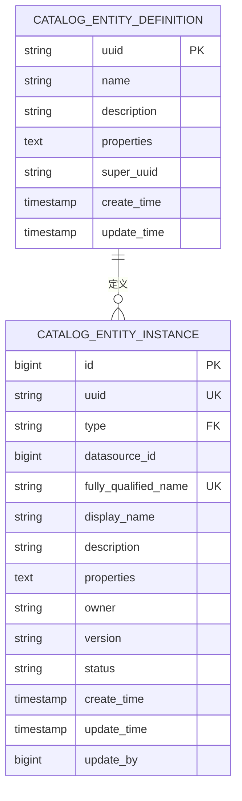
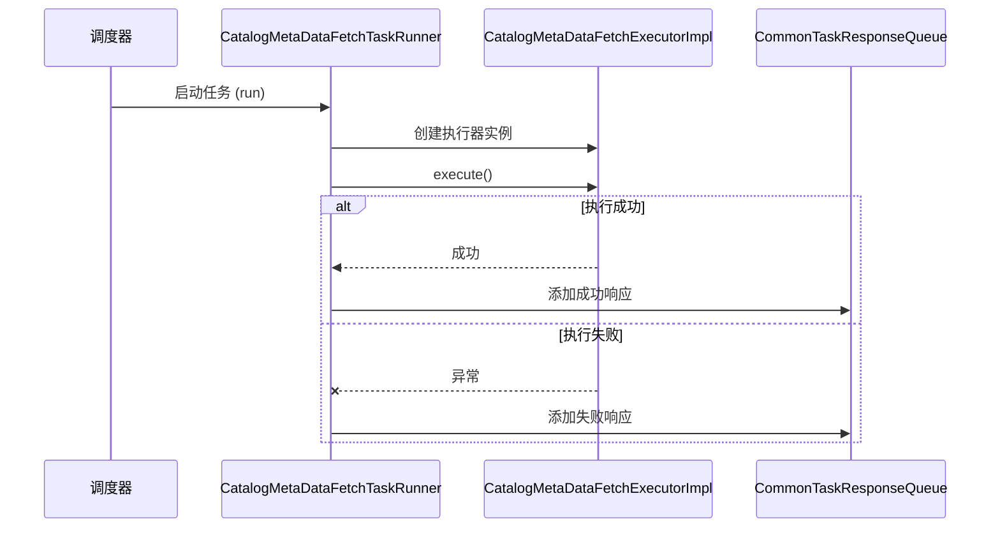
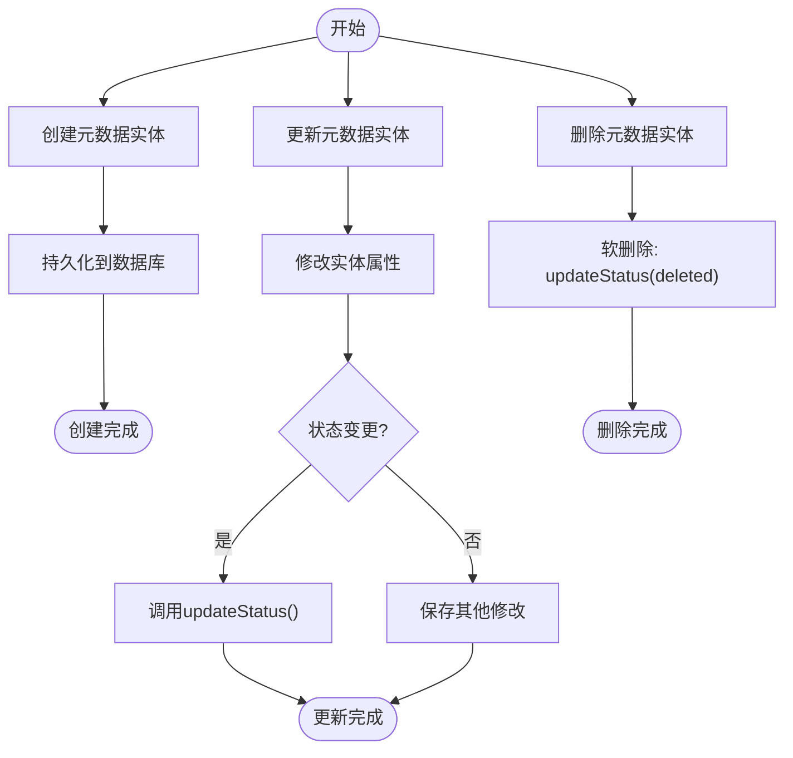
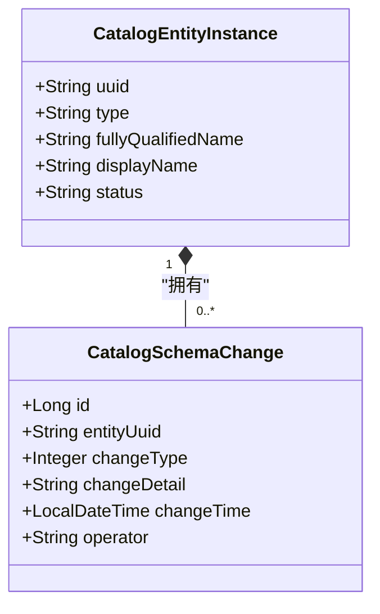

# 元数据管理

<cite>
**本文档引用的文件**   
- [CatalogEntityInstance.java](file://datavines-server/src/main/java/io/datavines/server/repository/entity/catalog/CatalogEntityInstance.java)
- [CatalogEntityDefinition.java](file://datavines-server/src/main/java/io/datavines/server/repository/entity/catalog/CatalogEntityDefinition.java)
- [CatalogEntityInstanceServiceImpl.java](file://datavines-server/src/main/java/io/datavines/server/repository/service/impl/CatalogEntityInstanceServiceImpl.java)
- [CatalogController.java](file://datavines-server/src/main/java/io/datavines/server/api/controller/CatalogController.java)
- [datavines-mysql.sql](file://scripts/sql/datavines-mysql.sql)
- [CatalogMetaDataFetchTaskRunner.java](file://datavines-server/src/main/java/io/datavines/server/scheduler/metadata/CatalogMetaDataFetchTaskRunner.java)
- [CatalogMetaDataFetchExecutorImpl.java](file://datavines-server/src/main/java/io/datavines/server/scheduler/metadata/task/CatalogMetaDataFetchExecutorImpl.java)
- [metadata.ts](file://datavines-ui/src/type/metadata.ts)
- [Card.tsx](file://datavines-ui/src/view/Main/Home/List/Card.tsx)
- [application.yaml](file://datavines-server/src/main/resources/application.yaml)
</cite>

## 目录
1. [引言](#引言)
2. [核心实体结构](#核心实体结构)
3. [元数据采集机制](#元数据采集机制)
4. [元数据生命周期管理](#元数据生命周期管理)
5. [元数据查询功能](#元数据查询功能)
6. [版本控制与变更历史](#版本控制与变更历史)
7. [元数据质量评估](#元数据质量评估)
8. [常见问题与解决方案](#常见问题与解决方案)
9. [结论](#结论)

## 引言

DataVines 是一个数据质量与元数据管理平台，其元数据管理功能是整个系统的核心组成部分。该功能旨在提供全面的数据资产管理能力，包括元数据的采集、存储、查询和生命周期管理。通过元数据管理，用户可以清晰地了解数据资产的结构、关系和使用情况，从而提高数据的可发现性、可理解性和可信度。本文档将详细阐述DataVines中元数据管理的各项功能，包括CatalogEntityDefinition和CatalogEntityInstance实体的结构与关系，元数据的采集、存储、查询、版本控制和质量评估机制。

**Section sources**
- [CatalogEntityInstance.java](file://datavines-server/src/main/java/io/datavines/server/repository/entity/catalog/CatalogEntityInstance.java#L1-L79)
- [CatalogEntityDefinition.java](file://datavines-server/src/main/java/io/datavines/server/repository/entity/catalog/CatalogEntityDefinition.java#L1-L64)

## 核心实体结构

DataVines的元数据管理基于两个核心实体：`CatalogEntityDefinition`（元数据实体定义）和`CatalogEntityInstance`（元数据实体实例）。这两个实体共同构成了元数据的模型基础。

### CatalogEntityDefinition 实体

`CatalogEntityDefinition` 实体用于定义元数据实体的类型和通用属性。它相当于一个元数据模板，描述了某一类数据资产（如数据库、表、列）的通用特征。

该实体的主要属性包括：
- **uuid**: 实体定义的唯一标识符
- **name**: 实体类型的名称（如"database"、"table"、"column"）
- **description**: 对实体类型的描述
- **properties**: 以JSON格式存储的其他扩展属性
- **superUuid**: 指向父级实体定义的UUID，用于构建实体定义的继承关系

### CatalogEntityInstance 实体

`CatalogEntityInstance` 实体是`CatalogEntityDefinition`的具体实例，代表了实际存在的数据资产。例如，一个名为"sales_db"的数据库或一个名为"orders"的表都是`CatalogEntityInstance`的实例。

该实体的主要属性包括：
- **id**: 数据库主键
- **uuid**: 实体实例的唯一标识符
- **type**: 实体类型，对应`CatalogEntityDefinition`的名称
- **datasourceId**: 关联的数据源ID
- **fullyQualifiedName**: 全限定名，用于唯一标识该实体
- **displayName**: 展示名称
- **description**: 实体描述
- **properties**: 以JSON格式存储的实体特定属性
- **owner**: 实体所有者
- **version**: 实体版本号
- **status**: 实体状态（active表示启用，deleted开头的随机数表示已删除）
- **createTime**: 创建时间
- **updateTime**: 更新时间
- **updateBy**: 更新用户ID

这两个实体通过`type`字段建立关联，`CatalogEntityInstance`的`type`值引用`CatalogEntityDefinition`的`name`值。这种设计实现了元数据模型的灵活性和可扩展性。



**Diagram sources **
- [CatalogEntityDefinition.java](file://datavines-server/src/main/java/io/datavines/server/repository/entity/catalog/CatalogEntityDefinition.java#L1-L64)
- [CatalogEntityInstance.java](file://datavines-server/src/main/java/io/datavines/server/repository/entity/catalog/CatalogEntityInstance.java#L1-L79)
- [datavines-mysql.sql](file://scripts/sql/datavines-mysql.sql#L198-L233)

**Section sources**
- [CatalogEntityDefinition.java](file://datavines-server/src/main/java/io/datavines/server/repository/entity/catalog/CatalogEntityDefinition.java#L1-L64)
- [CatalogEntityInstance.java](file://datavines-server/src/main/java/io/datavines/server/repository/entity/catalog/CatalogEntityInstance.java#L1-L79)

## 元数据采集机制

DataVines提供了两种元数据采集模式：手动录入和自动同步。自动同步是主要的采集方式，通过定时任务从各种数据源中提取元数据。

### 自动同步实现

元数据的自动同步由`CatalogMetaDataFetchTaskRunner`和`CatalogMetaDataFetchExecutorImpl`两个核心组件协同完成。`CatalogMetaDataFetchTaskRunner`实现了`Runnable`接口，作为任务执行器在独立线程中运行。它接收`CommonTaskContext`作为上下文，并通过`CommonTaskResponseQueue`上报任务执行结果。



**Diagram sources **
- [CatalogMetaDataFetchTaskRunner.java](file://datavines-server/src/main/java/io/datavines/server/scheduler/metadata/CatalogMetaDataFetchTaskRunner.java#L26-L51)
- [CatalogMetaDataFetchExecutorImpl.java](file://datavines-server/src/main/java/io/datavines/server/scheduler/metadata/task/CatalogMetaDataFetchExecutorImpl.java)

**Section sources**
- [CatalogMetaDataFetchTaskRunner.java](file://datavines-server/src/main/java/io/datavines/server/scheduler/metadata/CatalogMetaDataFetchTaskRunner.java#L26-L51)
- [CatalogMetaDataFetchExecutorImpl.java](file://datavines-server/src/main/java/io/datavines/server/scheduler/metadata/task/CatalogMetaDataFetchExecutorImpl.java)

### 采集配置与触发

元数据采集任务的配置和触发主要通过前端界面和后端API实现。在UI层面，用户可以通过"数据源"列表中的"元数据采集"按钮（`FundOutlined`图标）来触发采集任务。后端通过`CatalogController`中的`refreshCatalog`接口接收采集请求，并通过`CommonTaskService`调度具体的采集任务。

系统还支持配置采集相关的参数，如`metadata.fetch.exec.threads`（元数据采集执行线程数，默认5个）和`CATALOG_METADATA_TASK_LOCK_KEY`（元数据采集任务锁的注册中心键），这些参数可以在`application.yaml`配置文件中进行调整。

**Section sources**
- [Card.tsx](file://datavines-ui/src/view/Main/Home/List/Card.tsx#L97-L105)
- [CatalogController.java](file://datavines-server/src/main/java/io/datavines/server/api/controller/CatalogController.java#L69-L73)
- [CommonPropertyUtils.java](file://datavines-common/src/main/java/io/datavines/common/utils/CommonPropertyUtils.java#L34-L54)
- [application.yaml](file://datavines-server/src/main/resources/application.yaml)

## 元数据生命周期管理

DataVines提供了完整的元数据生命周期管理功能，包括创建、更新和删除操作，这些操作主要通过RESTful API接口实现。

### API接口与使用方法

`CatalogController`类定义了管理元数据生命周期的核心API接口：

- **创建**: 通过`catalogEntityInstanceService.create()`方法创建新的元数据实体实例。该方法接收一个`CatalogEntityInstance`对象作为参数，并将其持久化到数据库中。
- **更新**: 更新操作主要通过修改实体的`status`字段来实现。`CatalogEntityInstanceServiceImpl`中的`updateStatus`方法允许将实体状态从"active"更改为"deleted"前缀的状态，实现软删除。
- **删除**: 系统提供了多种删除方法，包括`deleteEntityByUUID`（通过UUID删除）、`deleteEntityByDataSourceAndFQN`（通过数据源ID和全限定名删除）和`softDeleteEntityByDataSourceAndFQN`（软删除）。软删除通过更改状态而非物理删除数据来实现。



**Diagram sources **
- [CatalogEntityInstanceServiceImpl.java](file://datavines-server/src/main/java/io/datavines/server/repository/service/impl/CatalogEntityInstanceServiceImpl.java#L87-L90)
- [CatalogEntityInstanceService.java](file://datavines-server/src/main/java/io/datavines/server/repository/service/CatalogEntityInstanceService.java#L41-L49)

**Section sources**
- [CatalogEntityInstanceServiceImpl.java](file://datavines-server/src/main/java/io/datavines/server/repository/service/impl/CatalogEntityInstanceServiceImpl.java#L87-L90)
- [CatalogEntityInstanceService.java](file://datavines-server/src/main/java/io/datavines/server/repository/service/CatalogEntityInstanceService.java#L41-L49)
- [CatalogController.java](file://datavines-server/src/main/java/io/datavines/server/api/controller/CatalogController.java)

## 元数据查询功能

DataVines提供了丰富的元数据查询功能，支持通过多种条件检索数据资产，包括实体类型、名称、标签等。

### 查询接口与示例

`CatalogController`提供了多个查询接口，支持分页和条件过滤：

- **按层级查询**: 通过`getDatabaseList`、`getTableList`和`getColumnList`接口，可以按数据源->数据库->表->列的层级结构查询元数据。这些接口接收`upstreamUuid`参数，返回指定上级实体下的所有子实体。
- **带详情查询**: `getCatalogTableWithDetailList`和`getCatalogColumnWithDetailList`接口返回包含详细信息的实体列表，而`getCatalogTableWithDetailPage`和`getCatalogColumnWithDetailPage`则支持分页查询。
- **实体详情查询**: `getDatabaseEntityDetail`、`getTableEntityDetail`和`getColumnEntityDetail`接口返回指定UUID的实体完整详情。

查询示例：
```http
GET /api/v1/catalog/list/table/{database_uuid}
返回: [{uuid: "tbl-1", displayName: "users", type: "table"}, ...]

GET /api/v1/catalog/page/table-with-detail?upstreamUuid={db_uuid}&name=order&pageNumber=1&pageSize=10
返回: 分页的表详情列表
```

**Section sources**
- [CatalogController.java](file://datavines-server/src/main/java/io/datavines/server/api/controller/CatalogController.java#L110-L156)
- [CatalogEntityInstanceService.java](file://datavines-server/src/main/java/io/datavines/server/repository/service/CatalogEntityInstanceService.java#L43-L57)
- [metadata.ts](file://datavines-ui/src/type/metadata.ts)

## 版本控制与变更历史

DataVines通过`CatalogSchemaChange`实体实现了元数据的版本控制和变更历史记录功能，这对于追踪数据结构的演变至关重要。

### 变更历史记录

每当元数据实体（如表结构）发生变更时，系统会创建一条`CatalogSchemaChange`记录。该实体包含以下关键信息：
- **id**: 主键
- **entityUuid**: 关联的元数据实体UUID
- **changeType**: 变更类型（如新增列、删除列、修改列类型等）
- **changeDetail**: 变更详情，以JSON格式存储具体的变更内容
- **changeTime**: 变更发生的时间
- **operator**: 操作者

用户可以通过`CatalogController`中的`getSchemaChangeList`和`getSchemaChangePage`接口查询特定实体的变更历史。这些接口返回按时间倒序排列的变更记录，使用户能够清晰地了解数据结构的演变过程。



**Diagram sources **
- [CatalogSchemaChange.java](file://datavines-server/src/main/java/io/datavines/server/repository/entity/catalog/CatalogSchemaChange.java)
- [CatalogEntityInstance.java](file://datavines-server/src/main/java/io/datavines/server/repository/entity/catalog/CatalogEntityInstance.java)

**Section sources**
- [CatalogSchemaChange.java](file://datavines-server/src/main/java/io/datavines/server/repository/entity/catalog/CatalogSchemaChange.java)
- [SchemaChangeType.java](file://datavines-server/src/main/java/io/datavines/server/enums/SchemaChangeType.java)
- [CatalogController.java](file://datavines-server/src/main/java/io/datavines/server/api/controller/CatalogController.java#L201-L213)

## 元数据质量评估

元数据质量评估是DataVines的核心功能之一，它允许用户为数据资产定义和执行质量检查规则。

### 配置与指标

元数据质量评估主要通过`CatalogEntityInstanceService`的`entityAddMetric`方法实现。该方法接收`JobCreateWithEntityUuid`对象，将质量检查任务（metric job）与特定的元数据实体关联起来。

质量评估的配置包括：
- **指标类型**: 如完整性、一致性、有效性、时效性、唯一性、准确性等
- **预期值**: 定义指标的预期结果
- **过滤条件**: 指定评估数据的范围
- **执行计划**: 定义任务的调度频率

用户可以通过`getEntityMetricList`接口查询与特定实体关联的所有质量评估任务，并通过`getEntityMetricParameter`接口获取任务的具体参数配置。

**Section sources**
- [CatalogController.java](file://datavines-server/src/main/java/io/datavines/server/api/controller/CatalogController.java#L215-L225)
- [CatalogEntityInstanceService.java](file://datavines-server/src/main/java/io/datavines/server/repository/service/CatalogEntityInstanceService.java#L69-L73)
- [MetricDimension.java](file://datavines-metric/datavines-metric-api/src/main/java/io/datavines/metric/api/MetricDimension.java)

## 常见问题与解决方案

在使用DataVines元数据管理功能时，可能会遇到一些常见问题，以下是针对这些问题的解决方案。

### 元数据同步失败

**问题**: 元数据采集任务执行失败，状态显示为"failure"。
**解决方案**: 
1. 检查数据源连接是否正常，确保网络可达且认证信息正确。
2. 查看系统日志，定位具体的错误信息。
3. 检查`metadata.fetch.exec.threads`配置，确保有足够的线程资源。
4. 确认数据源的元数据查询权限是否足够。

### 数据不一致

**问题**: UI显示的元数据与实际数据源不一致。
**解决方案**:
1. 手动触发元数据采集任务，强制刷新元数据。
2. 检查`CatalogEntityInstance`表中的`status`字段，确认是否有被软删除的实体。
3. 验证`fully_qualified_name`的唯一性约束，避免因命名冲突导致的数据覆盖。

**Section sources**
- [CatalogMetaDataFetchTaskRunner.java](file://datavines-server/src/main/java/io/datavines/server/scheduler/metadata/CatalogMetaDataFetchTaskRunner.java#L46-L48)
- [CatalogEntityInstance.java](file://datavines-server/src/main/java/io/datavines/server/repository/entity/catalog/CatalogEntityInstance.java#L225)
- [datavines-mysql.sql](file://scripts/sql/datavines-mysql.sql#L231)

## 结论

DataVines的元数据管理功能提供了一个全面、灵活且可扩展的解决方案，用于管理现代数据环境中的数据资产。通过`CatalogEntityDefinition`和`CatalogEntityInstance`两个核心实体，系统实现了元数据模型的定义与实例化。自动化的元数据采集机制确保了数据目录的实时性和准确性。丰富的查询接口和分页支持使得大规模元数据的检索变得高效。版本控制和变更历史功能为数据治理提供了重要的审计能力。最后，与数据质量评估的深度集成，使得元数据不仅是描述性的信息，更成为主动管理数据健康度的基础。这些功能共同构成了一个强大的元数据管理平台，为数据驱动的决策提供了坚实的基础。