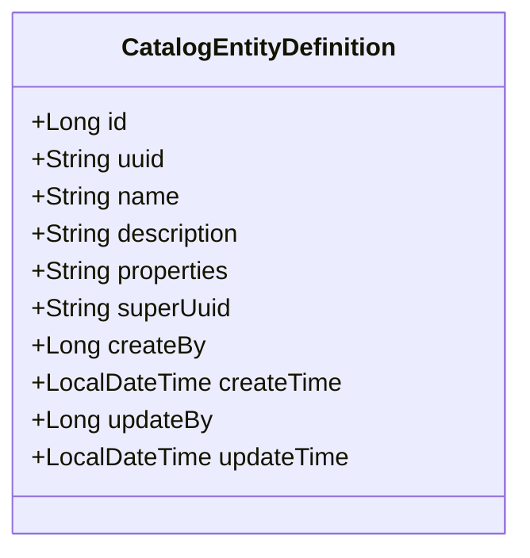
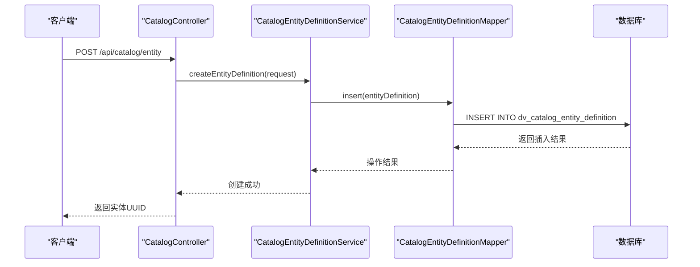
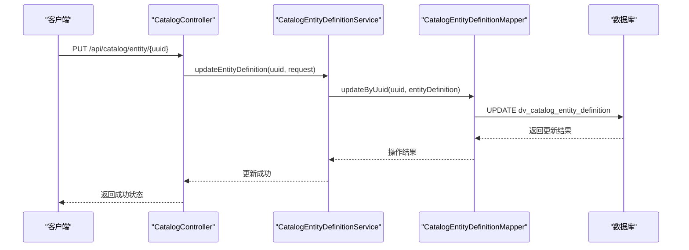
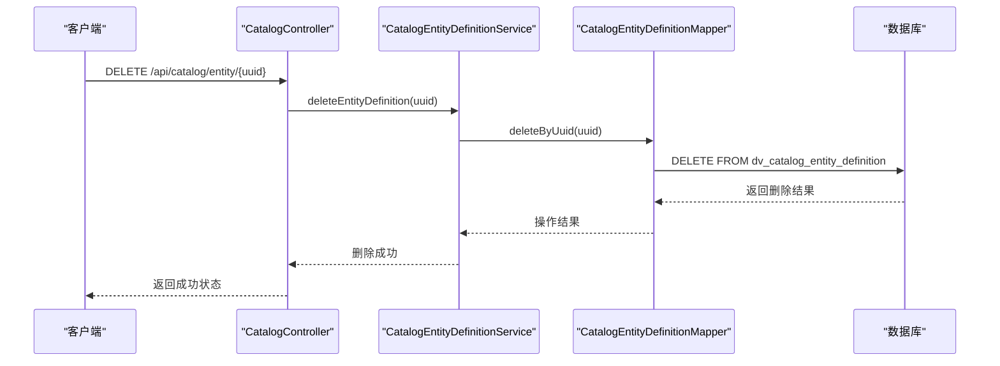
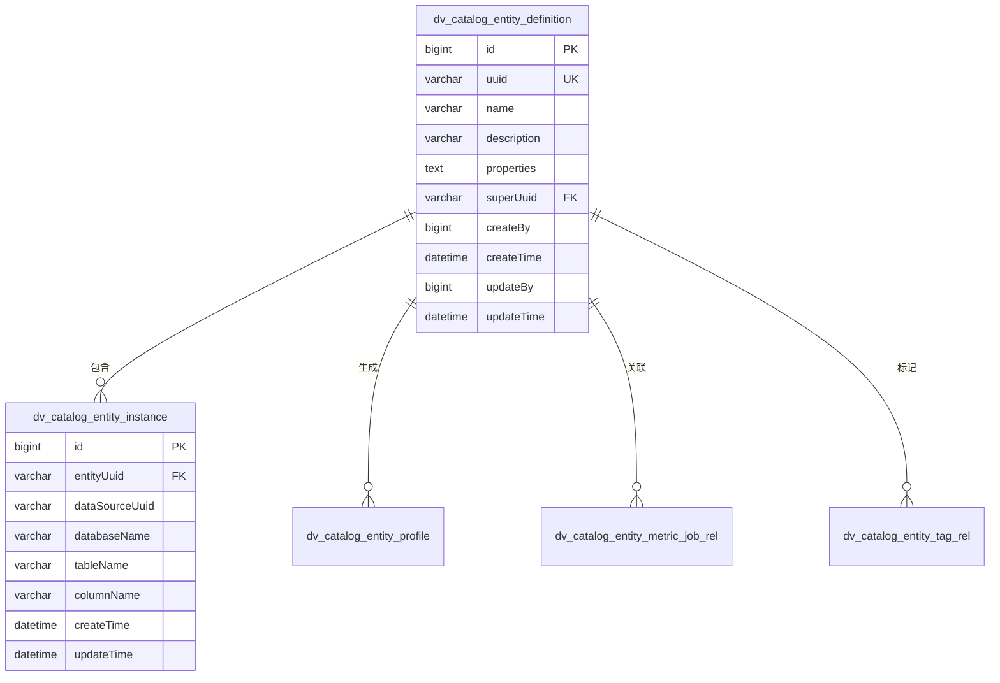
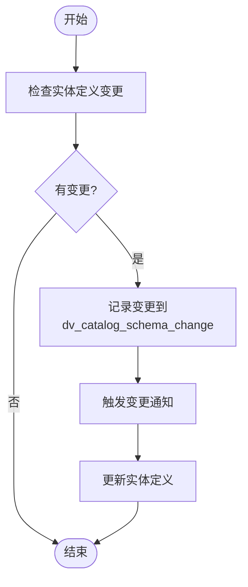
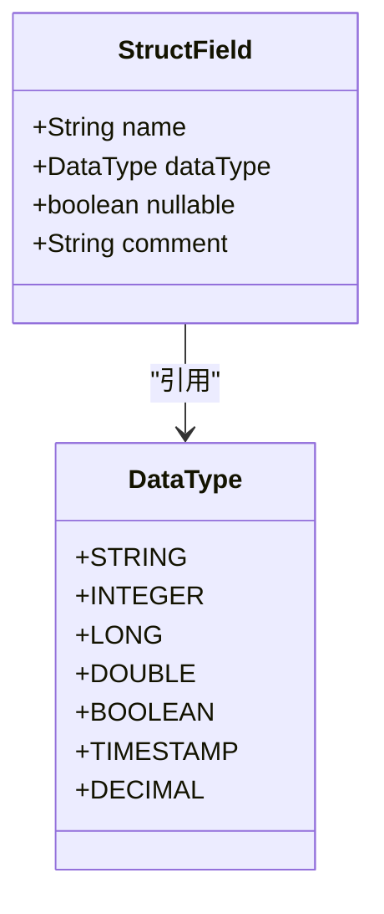

# 实体定义

<cite>
**本文档中引用的文件**  
- [CatalogEntityDefinition.java](file://datavines-server/src/main/java/io/datavines/server/repository/entity/catalog/CatalogEntityDefinition.java)
- [CatalogController.java](file://datavines-server/src/main/java/io/datavines/server/api/controller/CatalogController.java)
- [CatalogEntityDefinitionMapper.java](file://datavines-server/src/main/java/io/datavines/server/repository/mapper/CatalogEntityDefinitionMapper.java)
- [datavines-mysql.sql](file://scripts/sql/datavines-mysql.sql)
- [StructField.java](file://datavines-connector/ datavines-connector-api/src/main/java/io/datavines/connector/api/entity/StructField.java)
- [CatalogEntityBaseDetailVO.java](file://datavines-server/src/main/java/io/datavines/server/api/dto/vo/catalog/CatalogEntityBaseDetailVO.java)
- [CatalogColumnDetailVO.java](file://datavines-server/src/main/java/io/datavines/server/api/dto/vo/catalog/CatalogColumnDetailVO.java)
</cite>

## 目录
1. [简介](#简介)
2. [实体定义结构](#实体定义结构)
3. [API操作](#api操作)
4. [验证规则与约束](#验证规则与约束)
5. [与数据源和表结构的映射关系](#与数据源和表结构的映射关系)
6. [版本管理与变更审计](#版本管理与变更审计)
7. [最佳实践](#最佳实践)
8. [常见问题解决](#常见问题解决)

## 简介
实体定义是DataVines系统中用于描述数据实体（如数据库、表、列等）元数据的核心组件。它提供了对数据资产的统一描述方式，支持数据目录、数据质量监控、数据血缘分析等功能。通过实体定义，用户可以对数据进行分类、标记、监控和分析。

**Section sources**
- [CatalogEntityDefinition.java](file://datavines-server/src/main/java/io/datavines/server/repository/entity/catalog/CatalogEntityDefinition.java#L1-L64)

## 实体定义结构
`CatalogEntityDefinition`类定义了实体的基本属性，包括名称、描述、类型等。该类映射到数据库表`dv_catalog_entity_definition`，存储所有实体定义的元数据。

### 核心字段
- **id**: 主键，自增
- **uuid**: 实体唯一标识符
- **name**: 实体名称
- **description**: 实体描述
- **properties**: 实体属性，以JSON格式存储
- **superUuid**: 父实体UUID，用于建立实体层级关系
- **createBy**: 创建者ID
- **createTime**: 创建时间
- **updateBy**: 更新者ID
- **updateTime**: 更新时间



**Diagram sources**
- [CatalogEntityDefinition.java](file://datavines-server/src/main/java/io/datavines/server/repository/entity/catalog/CatalogEntityDefinition.java#L26-L63)

**Section sources**
- [CatalogEntityDefinition.java](file://datavines-server/src/main/java/io/datavines/server/repository/entity/catalog/CatalogEntityDefinition.java#L26-L63)

## API操作
系统提供了RESTful API来管理实体定义的生命周期，包括创建、更新和删除操作。

### 创建实体定义
通过POST请求创建新的实体定义。



**Diagram sources**
- [CatalogController.java](file://datavines-server/src/main/java/io/datavines/server/api/controller/CatalogController.java#L70-L73)
- [CatalogEntityDefinitionMapper.java](file://datavines-server/src/main/java/io/datavines/server/repository/mapper/CatalogEntityDefinitionMapper.java#L23-L26)

### 更新实体定义
通过PUT请求更新现有实体定义。



**Diagram sources**
- [CatalogController.java](file://datavines-server/src/main/java/io/datavines/server/api/controller/CatalogController.java#L75-L82)
- [CatalogEntityDefinitionMapper.java](file://datavines-server/src/main/java/io/datavines/server/repository/mapper/CatalogEntityDefinitionMapper.java#L23-L26)

### 删除实体定义
通过DELETE请求删除实体定义。



**Diagram sources**
- [CatalogController.java](file://datavines-server/src/main/java/io/datavines/server/api/controller/CatalogController.java#L83-L90)
- [CatalogEntityDefinitionMapper.java](file://datavines-server/src/main/java/io/datavines/server/repository/mapper/CatalogEntityDefinitionMapper.java#L23-L26)

## 验证规则与约束
实体定义遵循严格的验证规则，确保数据的一致性和完整性。

### 命名规范
- 名称不能为空，长度限制为255个字符
- UUID必须唯一，长度为64个字符
- 名称和UUID不能包含特殊字符

### 必填字段
- `uuid`: 必填，唯一标识
- `name`: 必填，实体名称
- `createBy`: 必填，创建者ID

### 数据库约束
```sql
CREATE TABLE `dv_catalog_entity_definition` (
  `id` bigint(20) NOT NULL AUTO_INCREMENT,
  `uuid` varchar(64) NOT NULL COMMENT '实体定义UUID',
  `name` varchar(255) NOT NULL COMMENT '实体定义的名字',
  `description` varchar(255) DEFAULT NULL COMMENT '描述',
  `properties` text COMMENT '实体参数',
  `superUuid` varchar(64) DEFAULT NULL COMMENT '父实体UUID',
  `create_by` bigint(20) NOT NULL COMMENT '创建者ID',
  `create_time` datetime NOT NULL DEFAULT CURRENT_TIMESTAMP COMMENT '创建时间',
  `update_by` bigint(20) DEFAULT NULL COMMENT '更新者ID',
  `update_time` datetime NOT NULL DEFAULT CURRENT_TIMESTAMP ON UPDATE CURRENT_TIMESTAMP COMMENT '更新时间',
  PRIMARY KEY (`id`),
  UNIQUE KEY `uk_uuid` (`uuid`),
  KEY `idx_name` (`name`),
  KEY `idx_super_uuid` (`superUuid`)
) ENGINE=InnoDB DEFAULT CHARSET=utf8mb4 COMMENT='实体定义表';
```

**Section sources**
- [datavines-mysql.sql](file://scripts/sql/datavines-mysql.sql#L191-L200)
- [CatalogEntityDefinition.java](file://datavines-server/src/main/java/io/datavines/server/repository/entity/catalog/CatalogEntityDefinition.java#L35-L39)

## 与数据源和表结构的映射关系
实体定义与数据源和表结构之间存在明确的映射关系，支持元数据的同步和管理。

### 映射模型


**Diagram sources**
- [datavines-mysql.sql](file://scripts/sql/datavines-mysql.sql#L191-L200)
- [CatalogEntityDefinition.java](file://datavines-server/src/main/java/io/datavines/server/repository/entity/catalog/CatalogEntityDefinition.java)

## 版本管理与变更审计
系统提供了实体定义的版本管理和变更审计功能，确保数据变更的可追溯性。

### 变更审计流程


**Section sources**
- [CatalogController.java](file://datavines-server/src/main/java/io/datavines/server/api/controller/CatalogController.java#L201-L213)
- [datavines-mysql.sql](file://scripts/sql/datavines-mysql.sql#L201-L210)

## 最佳实践
### 实体分类体系设计
1. **分层设计**: 建立清晰的实体层级结构，如：数据源 -> 数据库 -> 表 -> 列
2. **命名规范**: 采用统一的命名约定，便于搜索和管理
3. **属性标准化**: 定义标准的属性模板，确保一致性
4. **权限控制**: 根据业务需求设置适当的访问权限

### 性能优化建议
- 为常用查询字段创建索引
- 定期清理过期的实体定义
- 使用缓存减少数据库查询

## 常见问题解决
### 定义冲突
当出现实体定义冲突时，系统会通过UUID进行唯一性校验，拒绝重复的定义创建。

### 字段类型不匹配
系统通过`StructField`类定义字段类型，确保与数据源的实际类型一致：


**Diagram sources**
- [StructField.java](file://datavines-connector/ datavines-connector-api/src/main/java/io/datavines/connector/api/entity/StructField.java#L23-L32)
- [DataType.java](file://datavines-common/src/main/java/io/datavines/common/enums/DataType.java)

**Section sources**
- [StructField.java](file://datavines-connector/ datavines-connector-api/src/main/java/io/datavines/connector/api/entity/StructField.java#L23-L32)