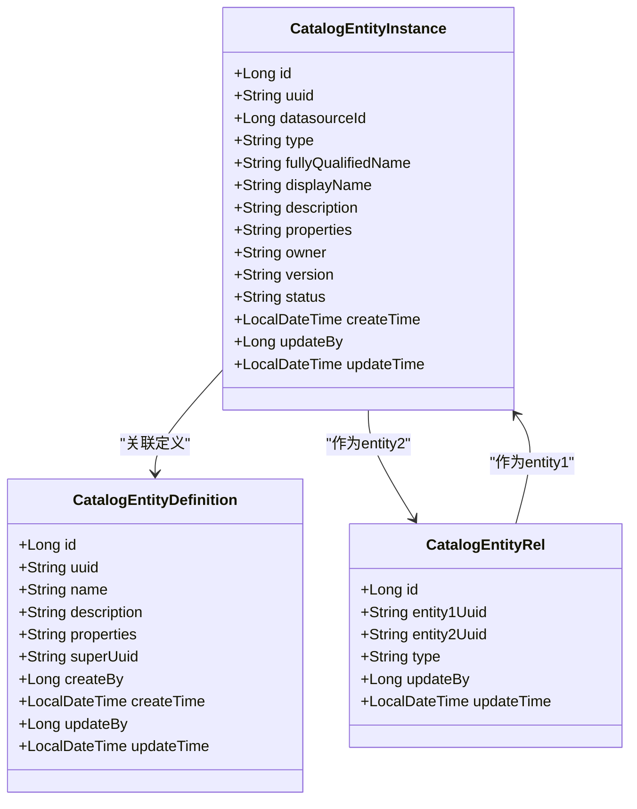
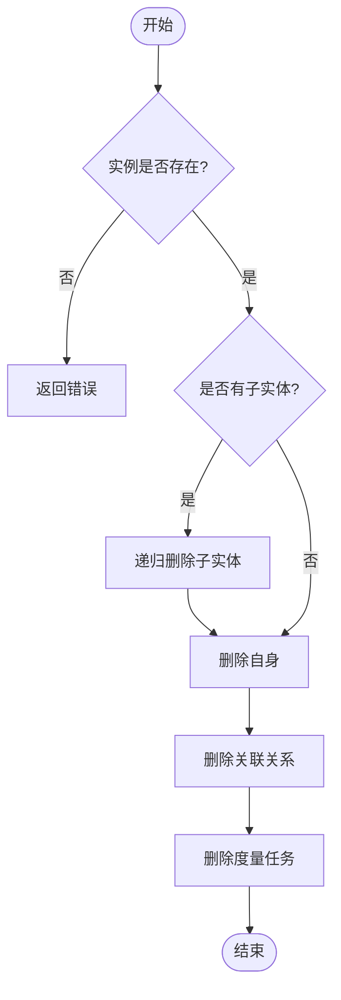

# 实体实例

<cite>
**本文档中引用的文件**   
- [CatalogEntityInstance.java](file://datavines-server\src\main\java\io\datavines\server\repository\entity\catalog\CatalogEntityInstance.java)
- [CatalogEntityInstanceService.java](file://datavines-server\src\main\java\io\datavines\server\repository\service\CatalogEntityInstanceService.java)
- [CatalogEntityInstanceServiceImpl.java](file://datavines-server\src\main\java\io\datavines\server\repository\service\impl\CatalogEntityInstanceServiceImpl.java)
- [CatalogEntityDefinition.java](file://datavines-server\src\main\java\io\datavines\server\repository\entity\catalog\CatalogEntityDefinition.java)
- [CatalogEntityRel.java](file://datavines-server\src\main\java\io\datavines\server\repository\entity\catalog\CatalogEntityRel.java)
- [CatalogEntityProfile.java](file://datavines-server\src\main\java\io\datavines\server\repository\entity\catalog\CatalogEntityProfile.java)
- [CatalogController.java](file://datavines-server\src\main\java\io\datavines\server\api\controller\CatalogController.java)
- [CatalogMetaDataFetchExecutorImpl.java](file://datavines-server\src\main\java\io\datavines\server\scheduler\metadata\task\CatalogMetaDataFetchExecutorImpl.java)
</cite>

## 目录
1. [实体实例结构与字段说明](#实体实例结构与字段说明)
2. [实例与定义的关系模型](#实例与定义的关系模型)
3. [创建与管理实体实例](#创建与管理实体实例)
4. [实例数据验证与清洗流程](#实例数据验证与清洗流程)
5. [实例生命周期管理](#实例生命周期管理)
6. [批量操作与数据导入导出](#批量操作与数据导入导出)
7. [常见问题处理](#常见问题处理)

## 实体实例结构与字段说明

`CatalogEntityInstance` 类是数据目录中实体实例的核心数据结构，用于表示数据库、表、列等元数据对象的具体实例。该类定义在 `CatalogEntityInstance.java` 文件中，其主要字段含义如下：

- **id**: 实体实例的自增主键，类型为 `Long`，由数据库自动生成。
- **uuid**: 实体实例的唯一标识符，类型为 `String`，用于跨系统引用和关联。
- **datasourceId**: 关联的数据源ID，类型为 `Long`，表示该实例所属的数据源。
- **type**: 实体类型，类型为 `String`，常见的值包括 "database"（数据库）、"table"（表）、"column"（列）等。
- **fullyQualifiedName**: 完全限定名，类型为 `String`，表示该实体的完整路径名称，如 "database.table.column"。
- **displayName**: 显示名称，类型为 `String`，用于在用户界面中展示的名称。
- **description**: 描述信息，类型为 `String`，提供关于该实体的详细说明。
- **properties**: 属性信息，类型为 `String`，以JSON格式存储实体的额外属性，如列的数据类型、是否为主键等。
- **owner**: 所有者，类型为 `String`，标识该实体的负责人或拥有者。
- **version**: 版本号，类型为 `String`，用于跟踪实体的版本变化。
- **status**: 状态，类型为 `String`，表示实体的当前状态，如激活、已删除等。
- **createTime**: 创建时间，类型为 `LocalDateTime`，记录实体的创建时间。
- **updateBy**: 更新人ID，类型为 `Long`，记录最后更新该实体的用户ID。
- **updateTime**: 更新时间，类型为 `LocalDateTime`，记录实体的最后更新时间。

这些字段共同构成了实体实例的完整信息模型，支持对数据资产的全面管理和查询。

**Section sources**
- [CatalogEntityInstance.java](file://datavines-server\src\main\java\io\datavines\server\repository\entity\catalog\CatalogEntityInstance.java)

## 实例与定义的关系模型

实体实例与实体定义之间通过 `CatalogEntityDefinition` 类建立关联。`CatalogEntityDefinition` 表示实体的元数据定义，包含名称、描述、属性等信息，而 `CatalogEntityInstance` 则是这些定义的具体实现。两者通过 `uuid` 字段进行关联，确保每个实例都有对应的定义。

此外，实体之间的层级关系通过 `CatalogEntityRel` 类来维护。该类定义了实体间的关联关系，主要字段包括：
- **entity1Uuid**: 关系中的上游实体UUID。
- **entity2Uuid**: 关系中的下游实体UUID。
- **type**: 关系类型，如 "CHILD" 表示父子关系。

例如，一个数据库实例（entity1）与其包含的表实例（entity2）之间通过 `CatalogEntityRel` 建立 "CHILD" 类型的关系。这种设计支持灵活的元数据层级结构，便于实现目录浏览、影响分析等功能。



**Diagram sources **
- [CatalogEntityInstance.java](file://datavines-server\src\main\java\io\datavines\server\repository\entity\catalog\CatalogEntityInstance.java)
- [CatalogEntityDefinition.java](file://datavines-server\src\main\java\io\datavines\server\repository\entity\catalog\CatalogEntityDefinition.java)
- [CatalogEntityRel.java](file://datavines-server\src\main\java\io\datavines\server\repository\entity\catalog\CatalogEntityRel.java)

## 创建与管理实体实例

### 创建实体实例

通过 `CatalogEntityInstanceService` 接口的 `create` 方法可以创建新的实体实例。该方法接收一个 `CatalogEntityInstance` 对象作为参数，并将其插入数据库。创建成功后返回实例的 `uuid`。

```java
String create(CatalogEntityInstance entityInstance);
```

### API调用示例

以下是一个创建表实体实例的API调用示例：

```http
POST /api/v1/catalog/entity
Content-Type: application/json

{
  "datasourceId": 1,
  "type": "table",
  "fullyQualifiedName": "mydb.mytable",
  "displayName": "My Table",
  "description": "This is a sample table",
  "properties": "{\"columns\":[{\"name\":\"id\",\"type\":\"INT\",\"primaryKey\":true},{\"name\":\"name\",\"type\":\"VARCHAR\"}]}"
}
```

### 管理实体实例

`CatalogEntityInstanceService` 提供了多种方法来管理实体实例：
- `getByTypeAndFQN`: 根据类型和完全限定名获取实体实例。
- `getEntityList`: 获取指定上游实体下的所有子实体列表。
- `getDatabaseEntityDetail`, `getTableEntityDetail`, `getColumnEntityDetail`: 分别获取数据库、表、列的详细信息。
- `deleteEntityByUUID`: 根据UUID删除实体实例及其所有子实体。

这些方法支持对实体实例的全生命周期管理，包括查询、更新和删除操作。

**Section sources**
- [CatalogEntityInstanceService.java](file://datavines-server\src\main\java\io\datavines\server\repository\service\CatalogEntityInstanceService.java)
- [CatalogController.java](file://datavines-server\src\main\java\io\datavines\server\api\controller\CatalogController.java)

## 实例数据验证与清洗流程

实体实例的数据验证和清洗主要在元数据抓取过程中完成。`CatalogMetaDataFetchExecutorImpl` 类负责从数据源中提取元数据并创建或更新实体实例。

当从数据源获取到新的元数据时，系统会执行以下步骤：
1. 查询数据库中是否存在具有相同 `uuid` 的现有实例。
2. 如果存在，则更新其 `properties` 和 `description` 字段，并设置 `updateTime`。
3. 如果不存在，则创建新的实例，生成新的 `uuid`。

```java
private String createOrUpdateCatalogEntityInstance(CatalogEntityInstance entityInstance, CatalogEntityInstance entityInstanceOld) {
    String entityUUID;
    if (entityInstanceOld != null) {
        entityInstanceOld.setProperties(entityInstance.getProperties());
        entityInstanceOld.setDescription(entityInstance.getDescription());
        entityInstanceOld.setUpdateTime(LocalDateTime.now());
        instanceService.updateById(entityInstanceOld);
        entityUUID = entityInstanceOld.getUuid();
    } else {
        entityInstance.setUuid(UUID.randomUUID().toString());
        instanceService.create(entityInstance);
        entityUUID = entityInstance.getUuid();
    }
    return entityUUID;
}
```

此流程确保了元数据的准确性和一致性，同时保留了历史变更记录。对于属性字段中的JSON数据，系统会在解析时进行基本的格式验证，确保其为有效的JSON字符串。

**Section sources**
- [CatalogMetaDataFetchExecutorImpl.java](file://datavines-server\src\main\java\io\datavines\server\scheduler\metadata\task\CatalogMetaDataFetchExecutorImpl.java)

## 实例生命周期管理

### 状态变更

实体实例的状态通过 `status` 字段进行管理。系统支持以下状态：
- **ACTIVE**: 激活状态，表示实体正常可用。
- **DELETED**: 已删除状态，表示实体已被软删除。

状态变更通过 `updateStatus` 方法实现，该方法接收实例的 `uuid` 和目标状态作为参数。

### 归档与删除策略

系统采用软删除策略来管理实体实例的删除操作。`softDeleteEntityByDataSourceAndFQN` 方法会将实例的状态设置为 `"DELETED_<随机UUID>"`，而不是直接从数据库中物理删除记录。这有助于保留历史数据和审计信息。

对于需要彻底删除的场景，`deleteEntityByUUID` 方法会递归删除指定实例及其所有子实体，并清理相关的关联关系和度量任务。



**Diagram sources **
- [CatalogEntityInstanceServiceImpl.java](file://datavines-server\src\main\java\io\datavines\server\repository\service\impl\CatalogEntityInstanceServiceImpl.java)

## 批量操作与数据导入导出

虽然当前代码库中未直接提供批量导入导出功能的实现，但可以通过以下方式实现：

### 批量创建

通过循环调用 `create` 方法，可以批量创建多个实体实例。建议在事务中执行以确保数据一致性。

### 数据导出

利用 `getEntityList` 和 `getEntityPage` 方法，可以分页获取实体实例列表，并将其导出为JSON、CSV等格式。

### 数据导入

编写脚本解析导入文件，将每条记录转换为 `CatalogEntityInstance` 对象，然后调用 `create` 方法进行批量插入。

未来可扩展 `CatalogController` 添加专门的批量导入导出API端点，以提供更友好的用户接口。

**Section sources**
- [CatalogEntityInstanceService.java](file://datavines-server\src\main\java\io\datavines\server\repository\service\CatalogEntityInstanceService.java)

## 常见问题处理

### 实例数据不一致

当发现实体实例数据与数据源实际状态不一致时，可通过触发元数据刷新任务来同步数据。调用 `/catalog/refresh` API 可启动刷新流程，系统将重新抓取元数据并更新所有相关实例。

### 关联丢失

如果发现实体间的关联关系丢失，首先检查 `CatalogEntityRel` 表中是否存在正确的记录。若记录缺失，可通过重新执行元数据抓取任务来重建关联。确保在抓取过程中正确维护 `entity1Uuid` 和 `entity2Uuid` 的对应关系。

### 性能优化建议

对于大规模元数据管理，建议：
1. 对 `uuid`、`fullyQualifiedName` 等常用查询字段建立索引。
2. 使用分页查询避免一次性加载过多数据。
3. 定期清理已删除的实体实例，减少数据库负担。

通过以上措施，可有效解决常见问题并提升系统性能。

**Section sources**
- [CatalogController.java](file://datavines-server\src\main\java\io\datavines\server\api\controller\CatalogController.java)
- [CatalogEntityInstanceServiceImpl.java](file://datavines-server\src\main\java\io\datavines\server\repository\service\impl\CatalogEntityInstanceServiceImpl.java)