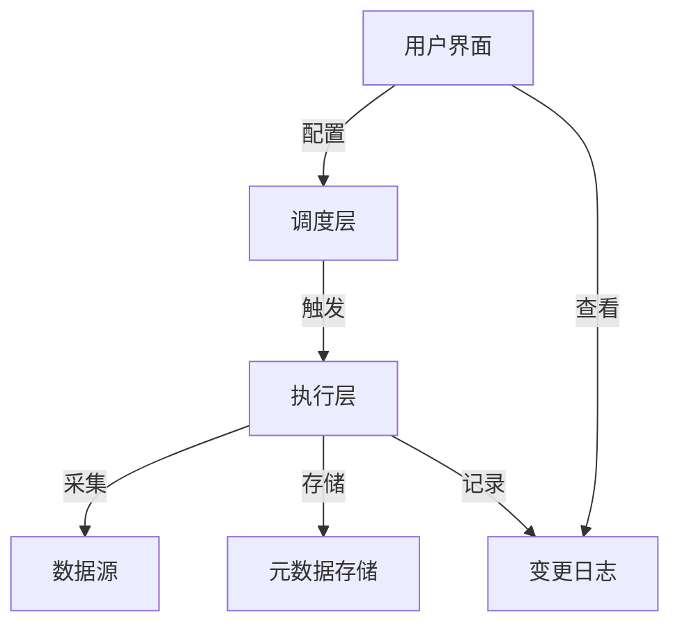
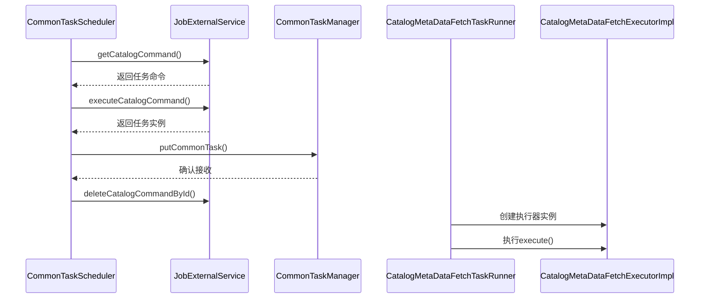
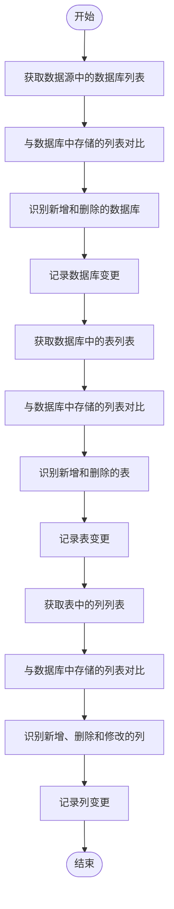

# 变更检测

<cite>
**本文档引用的文件**
- [CatalogMetaDataFetchExecutorImpl.java](file://datavines-server/src/main/java/io/datavines/server/scheduler/metadata/task/CatalogMetaDataFetchExecutorImpl.java)
- [CommonTaskScheduler.java](file://datavines-server/src/main/java/io/datavines/server/scheduler/CommonTaskScheduler.java)
- [QuartzExecutors.java](file://datavines-server/src/main/java/io/datavines/server/dqc/coordinator/quartz/QuartzExecutors.java)
- [SchemaChangeType.java](file://datavines-server/src/main/java/io/datavines/server/enums/SchemaChangeType.java)
- [CatalogSchemaChangeService.java](file://datavines-server/src/main/java/io/datavines/server/repository/service/CatalogSchemaChangeService.java)
- [common.properties](file://datavines-common/src/main/resources/common.properties)
</cite>

## 目录
1. [引言](#引言)
2. [元数据变更检测架构](#元数据变更检测架构)
3. [调度架构与Quartz配置](#调度架构与quartz配置)
4. [CatalogMetaDataFetchExecutor实现机制](#catalogmetadatafetchexecutor实现机制)
5. [变更检测算法工作原理](#变更检测算法工作原理)
6. [性能优化建议](#性能优化建议)
7. [常见问题与解决方案](#常见问题与解决方案)
8. [结论](#结论)

## 引言

DataVines是一个数据质量平台，其核心功能之一是元数据变更检测。该功能能够自动发现数据源中数据库、表和列的结构变化，包括新增、删除和修改等操作。通过定期采集元数据并与历史快照进行对比，系统可以及时识别出数据结构的变化，从而帮助用户监控数据资产的演化过程。本文档将深入解析DataVines中元数据变更检测的实现机制，涵盖从调度架构到具体执行流程的各个方面。

## 元数据变更检测架构

DataVines的元数据变更检测功能采用分层架构设计，主要包括调度层、执行层和存储层。调度层负责管理任务的触发时机，执行层负责具体的元数据采集和对比逻辑，存储层则用于保存元数据快照和变更记录。



**图示来源**
- [CommonTaskScheduler.java](file://datavines-server/src/main/java/io/datavines/server/scheduler/CommonTaskScheduler.java#L31-L91)
- [CatalogMetaDataFetchExecutorImpl.java](file://datavines-server/src/main/java/io/datavines/server/scheduler/metadata/task/CatalogMetaDataFetchExecutorImpl.java#L59-L716)

## 调度架构与Quartz配置

DataVines使用Quartz作为任务调度框架，实现了灵活的定时任务管理。调度架构的核心组件是`QuartzExecutors`类，它封装了Quartz Scheduler的所有操作，提供了添加、删除和查询任务的功能。

### 调度流程

调度流程始于`CommonTaskScheduler`线程，该线程持续轮询任务队列，当检测到新的元数据采集任务时，将其提交给任务管理器执行。整个流程如下：



**图示来源**
- [CommonTaskScheduler.java](file://datavines-server/src/main/java/io/datavines/server/scheduler/CommonTaskScheduler.java#L47-L89)
- [CatalogMetaDataFetchTaskRunner.java](file://datavines-server/src/main/java/io/datavines/server/scheduler/metadata/CatalogMetaDataFetchTaskRunner.java#L39-L51)

### Quartz配置

Quartz的配置主要通过`QuartzExecutors`类实现，关键配置包括：

- **Cron表达式**：定义任务的执行频率
- **起始时间**：任务开始执行的时间点
- **结束时间**：任务停止执行的时间点
- **时区处理**：确保任务在正确的时区下执行

配置参数通过`ScheduleJobInfo`对象传递，其中包含了任务类型、数据源ID、Cron表达式等信息。系统还提供了验证Cron表达式有效性的功能，确保配置的正确性。

**变更来源**
- [QuartzExecutors.java](file://datavines-server/src/main/java/io/datavines/server/dqc/coordinator/quartz/QuartzExecutors.java#L58-L264)
- [ScheduleJobInfo.java](file://datavines-server/src/main/java/io/datavines/server/dqc/coordinator/quartz/ScheduleJobInfo.java#L1-L42)

## CatalogMetaDataFetchExecutor实现机制

`CatalogMetaDataFetchExecutor`是元数据采集的核心接口，其具体实现为`CatalogMetaDataFetchExecutorImpl`类。该类负责连接不同的数据源并获取最新的元数据信息。

### 数据源连接

执行器通过`ConnectorFactory`插件机制连接不同类型的数据库。系统支持多种数据源类型，包括MySQL、PostgreSQL、Oracle等。连接过程如下：

1. 根据数据源类型获取对应的连接器工厂
2. 使用数据源参数创建连接
3. 执行元数据查询操作

```java
this.connectorFactory = PluginLoader
    .getPluginLoader(ConnectorFactory.class)
    .getOrCreatePlugin(dataSource.getType());
```

### 采集流程

采集流程分为三个层次：数据源级、数据库级和表级。每个层次都遵循相同的模式：获取当前状态、与历史状态对比、识别变更、记录结果。



**变更来源**
- [CatalogMetaDataFetchExecutorImpl.java](file://datavines-server/src/main/java/io/datavines/server/scheduler/metadata/task/CatalogMetaDataFetchExecutorImpl.java#L59-L716)

## 变更检测算法工作原理

变更检测算法的核心是比较当前采集的元数据与存储在数据库中的历史快照，识别出各种类型的变更。算法支持多种变更类型，每种类型都有对应的处理逻辑。

### 变更类型

系统定义了多种变更类型，通过`SchemaChangeType`枚举类进行管理：

| 变更类型 | 描述 | 代码 |
|---------|------|------|
| DATABASE_ADDED | 数据库新增 | 0 |
| DATABASE_DELETED | 数据库删除 | 1 |
| TABLE_ADDED | 表新增 | 2 |
| TABLE_DELETED | 表删除 | 3 |
| TABLE_COMMENT_CHANGE | 表注释变更 | 4 |
| COLUMN_ADDED | 列新增 | 5 |
| COLUMN_DELETED | 列删除 | 6 |
| COLUMN_TYPE_CHANGE | 列类型变更 | 7 |
| COLUMN_COMMENT_CHANGE | 列注释变更 | 8 |

**变更来源**
- [SchemaChangeType.java](file://datavines-server/src/main/java/io/datavines/server/enums/SchemaChangeType.java#L24-L38)

### 对比逻辑

对比逻辑采用三路比较方法，分别处理新增、删除和修改三种情况：

1. **新增检测**：遍历当前列表，查找在历史列表中不存在的项
2. **删除检测**：遍历历史列表，查找在当前列表中不存在的项
3. **修改检测**：对同时存在于两个列表中的项，比较其属性是否发生变化

对于列级别的变更检测，系统特别关注类型和注释的变化：

```java
private boolean isTypeChange(String oldType, String newType) {
    if (StringUtils.isEmpty(oldType) && StringUtils.isNotEmpty(newType)) {
        return true;
    }
    if (StringUtils.isEmpty(newType) && StringUtils.isNotEmpty(oldType)) {
        return true;
    }
    return StringUtils.isNotEmpty(newType) && StringUtils.isNotEmpty(oldType) && !oldType.equals(newType);
}
```

检测到的变更会被记录到`CatalogSchemaChange`表中，供后续查询和分析使用。

**变更来源**
- [CatalogMetaDataFetchExecutorImpl.java](file://datavines-server/src/main/java/io/datavines/server/scheduler/metadata/task/CatalogMetaDataFetchExecutorImpl.java#L692-L714)
- [CatalogSchemaChangeService.java](file://datavines-server/src/main/java/io/datavines/server/repository/service/CatalogSchemaChangeService.java#L1-L30)

## 性能优化建议

为了提高元数据变更检测的效率和稳定性，系统提供了多种性能优化策略。

### 增量采集策略

系统默认采用增量采集策略，只采集发生变化的部分。对于首次采集，会获取完整的元数据；后续采集则只关注变更。这种策略大大减少了网络传输和处理时间。

### 采样频率配置

采样频率通过Cron表达式进行配置，可以根据实际需求调整。建议遵循以下原则：

- **高变更频率的数据源**：每小时采集一次（`0 * * * * ?`）
- **中等变更频率的数据源**：每天采集一次（`0 0 2 * * ?`）
- **低变更频率的数据源**：每周采集一次（`0 0 2 ? * MON`）

配置参数可以在`common.properties`文件中进行全局设置：

```properties
# 全局配置示例
registry.type=default
registry.failover.key=1024
```

### 资源限制

系统内置了资源检查机制，确保在系统负载过高时不执行采集任务：

```java
boolean runCheckFlag = OSUtils.checkResource(
    CommonPropertyUtils.getDouble(MAX_CPU_LOAD_AVG, MAX_CPU_LOAD_AVG_DEFAULT),
    CommonPropertyUtils.getDouble(RESERVED_MEMORY, RESERVED_MEMORY_DEFAULT));
```

**变更来源**
- [common.properties](file://datavines-common/src/main/resources/common.properties#L1-L25)
- [CommonTaskScheduler.java](file://datavines-server/src/main/java/io/datavines/server/scheduler/CommonTaskScheduler.java#L55-L58)

## 常见问题与解决方案

### 变更检测延迟

**问题描述**：变更检测结果出现延迟，不能及时反映数据源的实际变化。

**解决方案**：
1. 检查Cron表达式配置是否正确
2. 确认调度服务是否正常运行
3. 检查系统资源是否充足
4. 查看任务执行日志是否有错误信息

### 数据源连接超时

**问题描述**：在采集过程中出现连接超时错误。

**解决方案**：
1. 检查网络连接是否稳定
2. 确认数据库服务是否正常运行
3. 调整连接超时参数
4. 检查防火墙设置是否阻止了连接

### 变更记录不完整

**问题描述**：某些变更没有被正确记录。

**解决方案**：
1. 检查`SchemaChangeType`枚举是否包含所有需要的变更类型
2. 确认对比逻辑是否覆盖了所有属性
3. 查看数据库存储是否正常
4. 检查权限设置是否允许读取所有元数据

**变更来源**
- [CatalogMetaDataFetchExecutorImpl.java](file://datavines-server/src/main/java/io/datavines/server/scheduler/metadata/task/CatalogMetaDataFetchExecutorImpl.java#L308-L311)
- [CommonTaskScheduler.java](file://datavines-server/src/main/java/io/datavines/server/scheduler/CommonTaskScheduler.java#L82-L87)

## 结论

DataVines的元数据变更检测功能通过精心设计的架构和高效的算法，实现了对数据源结构变化的全面监控。系统采用Quartz作为调度框架，确保了任务的可靠执行；通过`CatalogMetaDataFetchExecutor`接口和实现类，支持多种数据源的连接和元数据采集；利用精细的对比算法，能够准确识别各种类型的变更。此外，系统还提供了丰富的性能优化选项和故障排查指南，确保在各种生产环境中都能稳定运行。未来可以考虑增加更多类型的变更检测，如索引变更、约束变更等，进一步完善元数据管理能力。