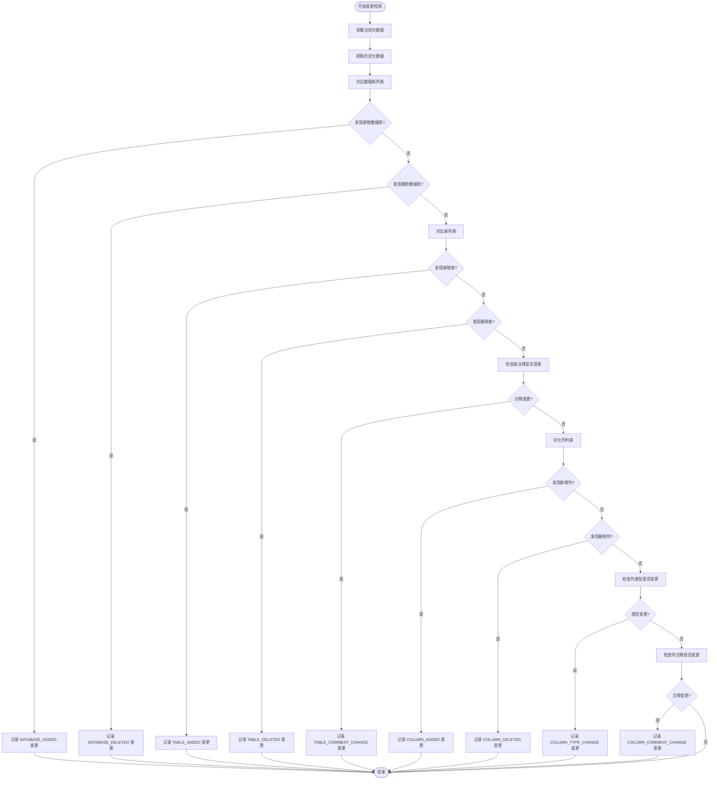
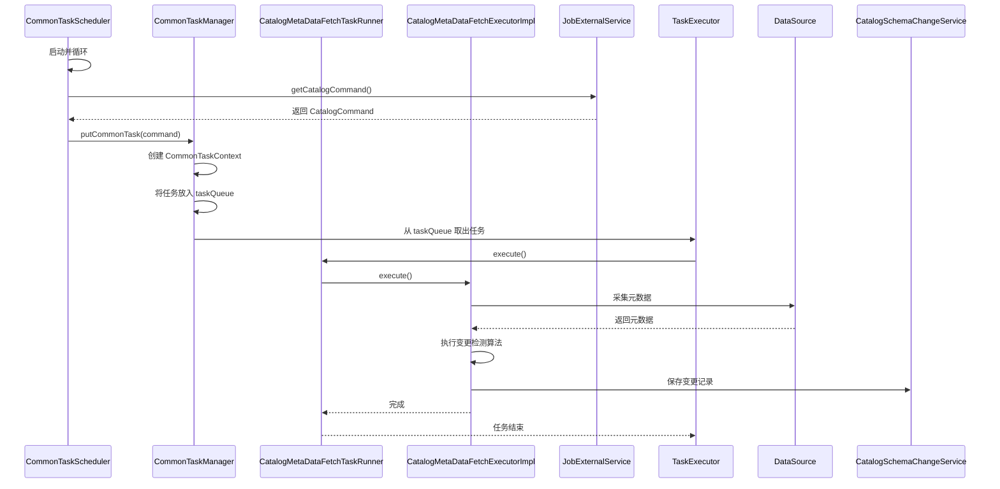

# 变更监控

<cite>
**本文档引用的文件**   
- [CatalogSchemaChange.java](file://datavines-server/src/main/java/io/datavines/server/repository/entity/catalog/CatalogSchemaChange.java)
- [SchemaChangeType.java](file://datavines-server/src/main/java/io/datavines/server/enums/SchemaChangeType.java)
- [CatalogMetaDataFetchExecutorImpl.java](file://datavines-server/src/main/java/io/datavines/server/scheduler/metadata/task/CatalogMetaDataFetchExecutorImpl.java)
- [CatalogSchemaChangeServiceImpl.java](file://datavines-server/src/main/java/io/datavines/server/repository/service/impl/CatalogSchemaChangeServiceImpl.java)
- [CommonTaskScheduler.java](file://datavines-server/src/main/java/io/datavines/server/scheduler/CommonTaskScheduler.java)
- [CommonTaskManager.java](file://datavines-server/src/main/java/io/datavines/server/scheduler/CommonTaskManager.java)
- [SlaNotificationMessage.java](file://datavines-notification/datavines-notification-api/src/main/java/io/datavines/notification/api/entity/SlaNotificationMessage.java)
- [DingTalkSlasHandlerPlugin.java](file://datavines-notification/datavines-notification-plugins/datavines-notification-plugin-dingtalk/src/main/java/io/datavines/notification/plugin/dingtalk/DingTalkSlasHandlerPlugin.java)
</cite>

## 目录
1. [引言](#引言)
2. [核心实体结构](#核心实体结构)
3. [变更检测算法](#变更检测算法)
4. [元数据采集调度机制](#元数据采集调度机制)
5. [变更通知配置](#变更通知配置)
6. [变更影响分析](#变更影响分析)
7. [变更审批流程](#变更审批流程)
8. [常见问题与解决方案](#常见问题与解决方案)
9. [总结](#总结)

## 引言
DataVines 是一个数据质量管理平台，其变更监控功能用于跟踪和记录数据目录中元数据的结构变化。该功能通过定期采集元数据并与历史记录进行对比，识别出新增、修改或删除的数据表和列等变更，并将这些变更记录下来，支持通知、影响分析和审批等后续处理。本文档详细解释了 DataVines 中变更监控功能的实现机制。

## 核心实体结构
变更监控功能的核心是 `CatalogSchemaChange` 实体，它用于记录每一次元数据结构的变更。

### CatalogSchemaChange 实体
`CatalogSchemaChange` 实体定义了变更记录的数据结构，其主要字段包括：
- **id**: 主键，自增。
- **parentUuid**: 父级实体的唯一标识符（UUID），例如数据库实例的 UUID。
- **entityUuid**: 发生变更的实体的唯一标识符（UUID），例如数据表或列的 UUID。
- **changeType**: 变更类型，使用 `SchemaChangeType` 枚举定义，如新增数据库、删除表、修改列类型等。
- **databaseName**: 数据库名称。
- **tableName**: 表名称。
- **columnName**: 列名称。
- **changeBefore**: 变更前的值（如旧的列类型或注释）。
- **changeAfter**: 变更后的值（如新的列类型或注释）。
- **updateTime**: 变更发生的时间。

该实体映射到数据库表 `dv_catalog_schema_change`，用于持久化存储所有的变更历史。

**Section sources**
- [CatalogSchemaChange.java](file://datavines-server/src/main/java/io/datavines/server/repository/entity/catalog/CatalogSchemaChange.java#L30-L70)

### SchemaChangeType 枚举
`SchemaChangeType` 枚举定义了所有可能的变更类型，为变更记录提供了标准化的分类。其主要类型包括：
- `DATABASE_ADDED`: 数据库新增
- `DATABASE_DELETED`: 数据库删除
- `TABLE_ADDED`: 数据表新增
- `TABLE_DELETED`: 数据表删除
- `TABLE_COMMENT_CHANGE`: 数据表注释变更
- `COLUMN_ADDED`: 列新增
- `COLUMN_DELETED`: 列删除
- `COLUMN_TYPE_CHANGE`: 列类型变更
- `COLUMN_COMMENT_CHANGE`: 列注释变更

该枚举通过 `code` 和 `description` 两个字段来标识每种变更类型，并提供了一个静态的 `SCHEMA_CHANGE_TYPE_MAP` 来实现高效的类型查找。

**Section sources**
- [SchemaChangeType.java](file://datavines-server/src/main/java/io/datavines/server/enums/SchemaChangeType.java#L24-L74)

## 变更检测算法
变更检测算法是变更监控功能的核心，它负责识别元数据中的具体变化。

### 算法工作原理
变更检测算法采用“全量对比”的策略。其工作流程如下：
1.  **采集当前元数据**：通过 `Connector` 插件连接到数据源，获取当前所有数据库、表和列的元数据信息。
2.  **获取历史元数据**：从 DataVines 的元数据存储中查询出该数据源对应的历史元数据记录。
3.  **逐级对比**：
    *   **数据库级对比**：将当前数据库列表与历史数据库列表进行对比，找出新增和删除的数据库。
    *   **表级对比**：对每个数据库，将当前表列表与历史表列表进行对比，找出新增和删除的表。
    *   **列级对比**：对每个表，将当前列列表与历史列列表进行对比，找出新增和删除的列。
4.  **属性变更检测**：对于在历史记录中存在但在当前也存在的表或列，进一步对比其关键属性（如注释、类型）是否发生变化。
    *   `isCommentChange` 方法用于判断注释是否变更。
    *   `isTypeChange` 方法用于判断类型是否变更。

### 识别变更类型
通过上述对比过程，系统可以精确地识别出不同类型的变更：
- **新增**：在当前元数据中存在，但在历史元数据中不存在的实体（数据库、表、列）。
- **删除**：在历史元数据中存在，但在当前元数据中不存在的实体。
- **修改**：在当前和历史元数据中都存在的实体，但其属性（如注释、类型）发生了变化。

当检测到任何变更时，系统会创建一个 `CatalogSchemaChange` 实体实例，并将其保存到数据库中。

**Diagram sources**
- [CatalogMetaDataFetchExecutorImpl.java](file://datavines-server/src/main/java/io/datavines/server/scheduler/metadata/task/CatalogMetaDataFetchExecutorImpl.java#L108-L715)

**Section sources**
- [CatalogMetaDataFetchExecutorImpl.java](file://datavines-server/src/main/java/io/datavines/server/scheduler/metadata/task/CatalogMetaDataFetchExecutorImpl.java#L91-L715)

## 元数据采集调度机制
元数据的自动采集由一个独立的调度系统驱动，确保变更能够被及时发现。

### 调度流程
1.  **调度器启动**：`CommonTaskScheduler` 作为一个后台线程运行，它会周期性地检查是否有新的采集任务需要执行。
2.  **任务获取**：调度器通过 `JobExternalService` 从任务队列中获取 `CatalogCommand`（元数据采集命令）。
3.  **任务提交**：当获取到命令后，调度器会调用 `CommonTaskManager` 的 `putCommonTask` 方法，将命令包装成一个 `CommonTask` 并放入内部的任务队列 `taskQueue` 中。
4.  **任务执行**：`CommonTaskManager` 内部有一个 `TaskExecutor` 线程，它会持续从 `taskQueue` 中取出任务。对于元数据采集任务，它会创建一个 `CatalogMetaDataFetchTaskRunner` 实例并在线程池中执行。
5.  **执行器处理**：`CatalogMetaDataFetchTaskRunner` 会调用 `CatalogMetaDataFetchExecutorImpl` 的 `execute` 方法，开始执行具体的元数据采集和变更检测逻辑。

### 定时任务配置
定时任务的触发通常由外部系统（如调度平台）通过 API 向 DataVines 提交 `CatalogCommand` 来实现。具体的执行频率（如每小时一次）是在外部调度系统中配置的，DataVines 的 `CommonTaskScheduler` 负责响应这些定时触发的命令。

**Diagram sources**
- [CommonTaskScheduler.java](file://datavines-server/src/main/java/io/datavines/server/scheduler/CommonTaskScheduler.java#L31-L91)
- [CommonTaskManager.java](file://datavines-server/src/main/java/io/datavines/server/scheduler/CommonTaskManager.java#L38-L159)

**Section sources**
- [CommonTaskScheduler.java](file://datavines-server/src/main/java/io/datavines/server/scheduler/CommonTaskScheduler.java#L31-L91)
- [CommonTaskManager.java](file://datavines-server/src/main/java/io/datavines/server/scheduler/CommonTaskManager.java#L38-L159)

## 变更通知配置
当检测到元数据变更时，系统可以配置多种通知渠道来提醒相关人员。

### 支持的通知渠道
根据代码分析，系统支持通过插件化的方式集成多种通知渠道，目前已实现的包括：
- **邮件 (Email)**
- **钉钉 (DingTalk)**
- **飞书 (Lark)**
- **企业微信 (WeComBot)**

### 配置方法
通知的配置通常在变更事件的处理逻辑中完成。以钉钉通知为例：
1.  系统会创建一个 `SlaNotificationMessage` 对象，包含通知的主题和内容。
2.  配置一个 `DingTalkSlasHandlerPlugin` 实例，该插件实现了 `SlasHandlerPlugin` 接口。
3.  在插件配置中，指定钉钉机器人的 Webhook 地址、消息类型（文本或 Markdown）等参数。
4.  调用插件的 `notify` 方法，将 `SlaNotificationMessage` 和配置信息传递给它，由插件负责将消息发送到钉钉群。

**Section sources**
- [SlaNotificationMessage.java](file://datavines-notification/datavines-notification-api/src/main/java/io/datavines/notification/api/entity/SlaNotificationMessage.java#L28-L36)
- [DingTalkSlasHandlerPlugin.java](file://datavines-notification/datavines-notification-plugins/datavines-notification-plugin-dingtalk/src/main/java/io/datavines/notification/plugin/dingtalk/DingTalkSlasHandlerPlugin.java#L39-L52)

## 变更影响分析
文档中未找到关于变更影响分析功能的具体实现代码。该功能可能依赖于数据血缘（Data Lineage）分析，通过追踪变更的表或列在下游任务中的使用情况，来评估变更的影响范围。此功能的详细实现需要进一步查阅 `datavines-connector` 模块中的血缘解析相关代码。

## 变更审批流程
文档中未找到关于变更审批流程的具体实现代码。变更审批可能是一个独立的工作流功能，允许用户在变更被应用到生产环境前进行审核和批准。该功能可能涉及创建审批任务、分配审批人、处理审批结果等逻辑，其具体实现需要查阅与工作流或任务审批相关的模块。

## 常见问题与解决方案
### 变更检测延迟
**问题**：变更发生后，系统未能立即检测到。
**原因**：元数据采集是定时任务，存在执行间隔。例如，如果任务配置为每小时执行一次，那么变更最多可能需要等待一小时才能被发现。
**解决方案**：缩短定时任务的执行周期，但这会增加系统负载。或者，实现基于事件的实时采集机制（如监听数据库的 DDL 事件），但这需要数据源的支持。

### 误报
**问题**：系统报告了实际上并未发生的变更。
**原因**：可能是由于元数据采集过程中出现网络抖动或临时错误，导致某次采集的结果不完整或不准确，从而与历史记录产生差异。
**解决方案**：在变更检测逻辑中增加重试机制，对疑似变更进行二次确认。同时，确保 `Connector` 插件的稳定性和健壮性。

## 总结
DataVines 的变更监控功能通过 `CatalogSchemaChange` 实体记录变更历史，利用 `CatalogMetaDataFetchExecutorImpl` 中的对比算法检测新增、删除和修改等变更类型，并由 `CommonTaskScheduler` 驱动的调度机制实现元数据的自动采集。系统支持通过邮件、钉钉等多种渠道进行变更通知。对于变更影响分析和审批流程，当前代码库中未提供足够的信息，可能需要进一步的功能开发或配置。