# 变更通知

<cite>
**本文档引用的文件**   
- [CatalogSchemaChange.java](file://datavines-server/src/main/java/io/datavines/server/repository/entity/catalog/CatalogSchemaChange.java)
- [CatalogSchemaChangeService.java](file://datavines-server/src/main/java/io/datavines/server/repository/service/CatalogSchemaChangeService.java)
- [SchemaChangeType.java](file://datavines-server/src/main/java/io/datavines/server/enums/SchemaChangeType.java)
- [NotificationManager.java](file://datavines-notification/datavines-notification-core/src/main/java/io/datavines/notification/core/NotificationManager.java)
- [SlaNotificationMessage.java](file://datavines-notification/datavines-notification-api/src/main/java/io/datavines/notification/api/entity/SlaNotificationMessage.java)
- [SlasHandlerPlugin.java](file://datavines-notification/datavines-notification-api/src/main/java/io/datavines/notification/api/spi/SlasHandlerPlugin.java)
- [DingTalkSlasHandlerPlugin.java](file://datavines-notification/datavines-notification-plugins/datavines-notification-plugin-dingtalk/src/main/java/io/datavines/notification/plugin/dingtalk/DingTalkSlasHandlerPlugin.java)
- [LarkSlasHandlerPlugin.java](file://datavines-notification/datavines-notification-plugins/datavines-notification-plugin-lark/src/main/java/io/datavines/notification/plugin/lark/LarkSlasHandlerPlugin.java)
- [EmailSlasHandlerPlugin.java](file://datavines-notification/datavines-notification-plugins/datavines-notification-plugin-email/src/main/java/io/datavines/notification/plugin/email/EmailSlasHandlerPlugin.java)
- [WecomBotSlasHandlerPlugin.java](file://datavines-notification/datavines-notification-plugins/datavines-notification-plugin-wecombot/src/main/java/io/datavines/notification/plugin/wecombot/WecomBotSlasHandlerPlugin.java)
</cite>

## 目录
1. [简介](#简介)
2. [变更通知系统架构](#变更通知系统架构)
3. [CatalogSchemaChange实体与变更事件](#catalogschemachange实体与变更事件)
4. [通知渠道配置](#通知渠道配置)
5. [通知模板与变量替换](#通知模板与变量替换)
6. [通知策略配置](#通知策略配置)
7. [通知状态跟踪与重试机制](#通知状态跟踪与重试机制)
8. [常见问题解决](#常见问题解决)
9. [总结](#总结)

## 简介

DataVines的变更通知功能旨在为数据目录中的模式变更提供实时、可靠的告警机制。当数据源的表结构发生变更时，系统能够自动检测并触发通知事件，通过多种渠道将变更信息推送给相关人员。本文档详细说明了该功能的配置和使用方法，包括如何基于CatalogSchemaChange实体触发通知事件，支持邮件、钉钉、飞书、企业微信等多种通知渠道的配置方式，通知模板的自定义方法，以及通知策略的配置等。

**变更通知系统**的核心目标是确保数据治理团队能够及时了解数据资产的变化，从而快速响应潜在的数据质量问题或合规风险。该系统通过监听CatalogSchemaChange实体的创建和更新，实现了对数据模式变更的自动化监控。

## 变更通知系统架构

DataVines的变更通知系统采用插件化架构设计，通过SPI（Service Provider Interface）机制实现通知渠道的灵活扩展。系统核心由NotificationManager、SlasHandlerPlugin接口和具体的渠道插件组成。

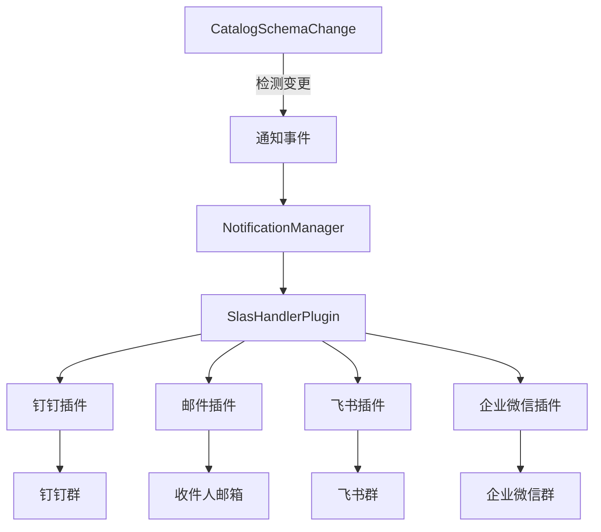

**架构说明**：
- **CatalogSchemaChange**：数据目录中的模式变更实体，是通知事件的触发源。
- **NotificationManager**：通知管理器，负责协调和分发通知请求。
- **SlasHandlerPlugin**：通知处理插件接口，定义了通知发送的标准方法。
- **具体渠道插件**：实现了SlasHandlerPlugin接口，负责与特定通知渠道的API进行交互。

**架构来源**
- [NotificationManager.java](file://datavines-notification/datavines-notification-core/src/main/java/io/datavines/notification/core/NotificationManager.java)
- [SlasHandlerPlugin.java](file://datavines-notification/datavines-notification-api/src/main/java/io/datavines/notification/api/spi/SlasHandlerPlugin.java)

**变更通知流程**
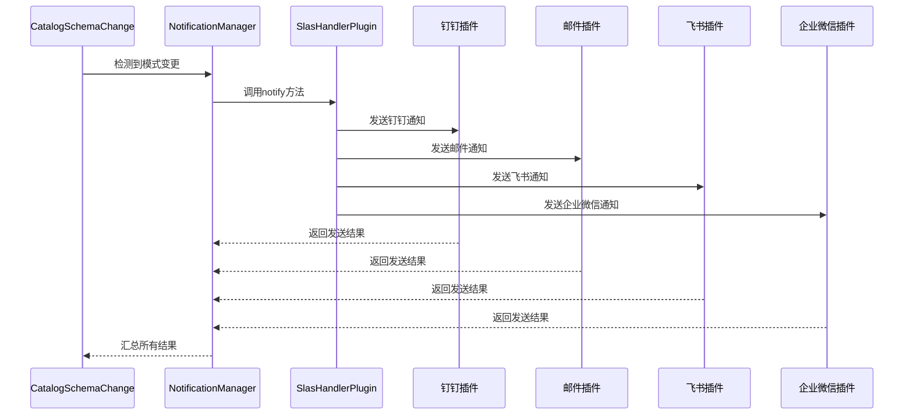

**流程说明**：
1. 系统检测到CatalogSchemaChange实体的创建或更新。
2. NotificationManager接收到通知请求。
3. 根据配置的渠道类型，调用相应的SlasHandlerPlugin实现。
4. 各插件通过API向对应的通知渠道发送消息。
5. 插件返回发送结果，NotificationManager汇总后返回最终状态。

**流程来源**
- [NotificationManager.java](file://datavines-notification/datavines-notification-core/src/main/java/io/datavines/notification/core/NotificationManager.java)
- [SlasHandlerPlugin.java](file://datavines-notification/datavines-notification-api/src/main/java/io/datavines/notification/api/spi/SlasHandlerPlugin.java)

## CatalogSchemaChange实体与变更事件

CatalogSchemaChange实体是DataVines中用于记录数据目录模式变更的核心数据结构。当数据源的表结构发生变更时，系统会创建或更新该实体，从而触发变更通知事件。

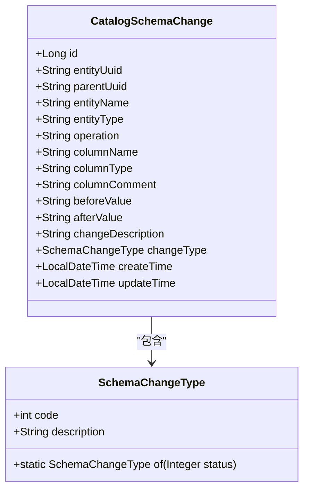

**实体属性说明**：
- **id**：主键，自增。
- **entityUuid**：变更实体的唯一标识。
- **parentUuid**：父实体的唯一标识。
- **entityName**：变更实体的名称。
- **entityType**：变更实体的类型（如表、视图等）。
- **operation**：操作类型（如ADD、DROP、ALTER等）。
- **columnName**：涉及的列名。
- **columnType**：列的数据类型。
- **columnComment**：列的注释。
- **beforeValue**：变更前的值。
- **afterValue**：变更后的值。
- **changeDescription**：变更描述。
- **changeType**：变更类型，枚举值。
- **createTime**：创建时间。
- **updateTime**：更新时间。

**变更类型枚举**：
- **ADD_COLUMN**：添加列
- **DROP_COLUMN**：删除列
- **ALTER_COLUMN_TYPE**：修改列类型
- **ALTER_COLUMN_COMMENT**：修改列注释
- **ADD_INDEX**：添加索引
- **DROP_INDEX**：删除索引

**实体来源**
- [CatalogSchemaChange.java](file://datavines-server/src/main/java/io/datavines/server/repository/entity/catalog/CatalogSchemaChange.java)
- [SchemaChangeType.java](file://datavines-server/src/main/java/io/datavines/server/enums/SchemaChangeType.java)

## 通知渠道配置

DataVines支持多种通知渠道的配置，包括邮件、钉钉、飞书和企业微信。每种渠道都有其特定的配置参数，通过SlasHandlerPlugin接口的实现来完成。

### 邮件通知配置

邮件通知通过EmailSlasHandlerPlugin实现，需要配置SMTP服务器和发件人信息。

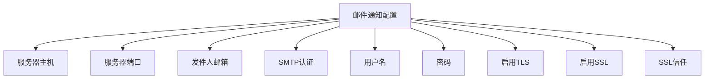

**配置参数说明**：
- **serverHost**：SMTP服务器主机地址。
- **serverPort**：SMTP服务器端口，默认25。
- **sender**：发件人邮箱地址。
- **enableSmtpAuth**：是否启用SMTP认证。
- **user**：SMTP认证用户名。
- **passwd**：SMTP认证密码。
- **starttlsEnable**：是否启用STARTTLS。
- **sslEnable**：是否启用SSL。
- **smtpSslTrust**：是否信任SSL证书。

**配置来源**
- [EmailSlasHandlerPlugin.java](file://datavines-notification/datavines-notification-plugins/datavines-notification-plugin-email/src/main/java/io/datavines/notification/plugin/email/EmailSlasHandlerPlugin.java)

### 钉钉通知配置

钉钉通知通过DingTalkSlasHandlerPlugin实现，需要配置Webhook和安全设置。

```mermaid
flowchart TD
A[钉钉通知配置] --> B[Webhook]
A --> C[密钥]
A --> D[关键词]
A --> E[@手机号]
A --> F[@钉钉ID]
A --> G[@所有人]
```

**配置参数说明**：
- **webhook**：钉钉群机器人的Webhook地址。
- **secret**：钉钉群机器人的密钥。
- **keyWord**：消息关键词，用于安全验证。
- **atMobiles**：需要@的手机号列表。
- **atDingtalkIds**：需要@的钉钉ID列表。
- **isAtAll**：是否@所有人。

**配置来源**
- [DingTalkSlasHandlerPlugin.java](file://datavines-notification/datavines-notification-plugins/datavines-notification-plugin-dingtalk/src/main/java/io/datavines/notification/plugin/dingtalk/DingTalkSlasHandlerPlugin.java)

### 飞书通知配置

飞书通知通过LarkSlasHandlerPlugin实现，需要配置Webhook和通知范围。

```mermaid
flowchart TD
A[飞书通知配置] --> B[Webhook]
A --> C[@所有人]
```

**配置参数说明**：
- **webhook**：飞书群机器人的Webhook地址。
- **atAll**：是否@所有人。

**配置来源**
- [LarkSlasHandlerPlugin.java](file://datavines-notification/datavines-notification-plugins/datavines-notification-plugin-lark/src/main/java/io/datavines/notification/plugin/lark/LarkSlasHandlerPlugin.java)

### 企业微信通知配置

企业微信通知通过WecomBotSlasHandlerPlugin实现，需要配置Webhook。

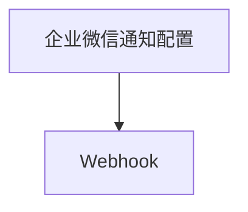

**配置参数说明**：
- **webhook**：企业微信群机器人的Webhook地址。

**配置来源**
- [WecomBotSlasHandlerPlugin.java](file://datavines-notification/datavines-notification-plugins/datavines-notification-plugin-wecombot/src/main/java/io/datavines/notification/plugin/wecombot/WecomBotSlasHandlerPlugin.java)

## 通知模板与变量替换

DataVines的变更通知系统支持灵活的通知模板配置，允许用户自定义消息内容，并通过变量替换实现动态信息的插入。

### 通知模板结构

通知模板由固定文本和变量占位符组成，系统在发送通知时会自动替换占位符为实际值。

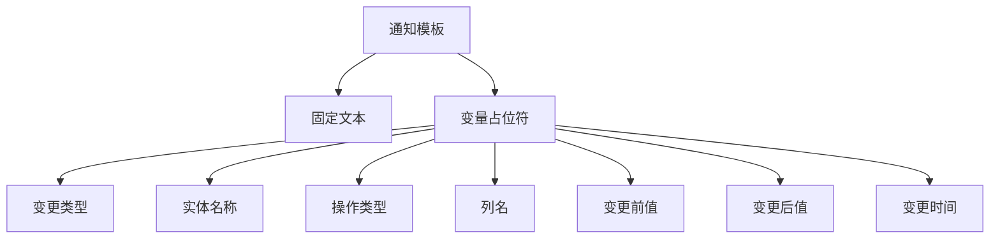

**变量占位符说明**：
- **{changeType}**：变更类型，如"添加列"、"删除列"等。
- **{entityName}**：变更实体的名称。
- **{operation}**：操作类型，如"ADD"、"DROP"等。
- **{columnName}**：涉及的列名。
- **{beforeValue}**：变更前的值。
- **{afterValue}**：变更后的值。
- **{changeTime}**：变更发生的时间。

### 模板格式化选项

系统支持多种格式化选项，以适应不同通知渠道的显示需求。

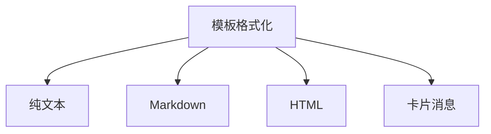

**格式化选项说明**：
- **纯文本**：适用于所有渠道，显示为普通文本。
- **Markdown**：适用于支持Markdown的渠道，如钉钉、飞书。
- **HTML**：适用于邮件等支持HTML的渠道。
- **卡片消息**：适用于支持卡片消息的渠道，如飞书、企业微信。

**模板来源**
- [SlaNotificationMessage.java](file://datavines-notification/datavines-notification-api/src/main/java/io/datavines/notification/api/entity/SlaNotificationMessage.java)

## 通知策略配置

DataVines提供了灵活的通知策略配置，允许用户根据业务需求选择不同的通知模式。

### 立即通知模式

立即通知模式在检测到变更后立即发送通知，适用于需要实时响应的场景。

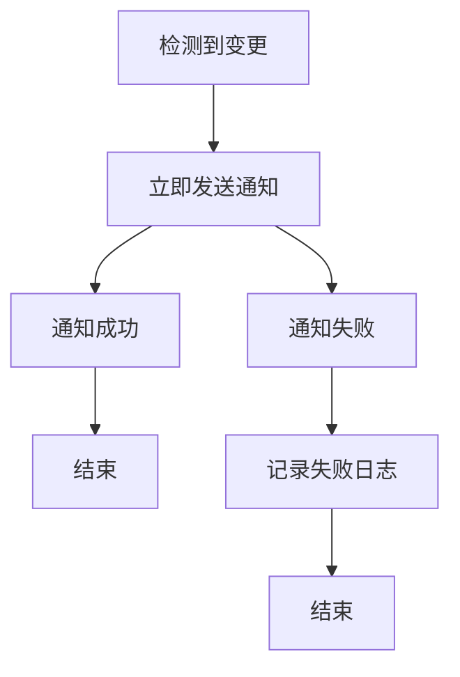

**立即通知特点**：
- 实时性强，变更发生后立即通知。
- 适用于关键数据资产的变更监控。
- 可能产生较多通知，需谨慎配置。

### 汇总通知模式

汇总通知模式将一段时间内的变更进行汇总，定期发送通知，适用于变更频繁但不需要实时响应的场景。

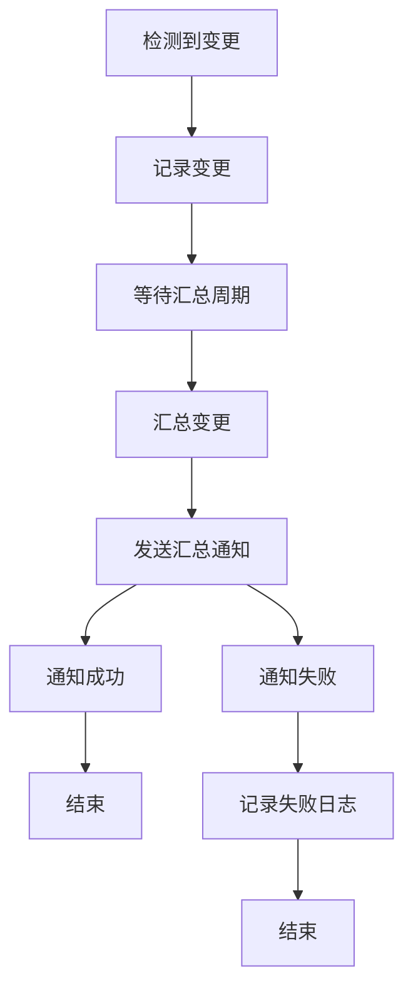

**汇总通知特点**：
- 减少通知频率，避免信息过载。
- 适用于非关键数据资产的变更监控。
- 可配置汇总周期，如每小时、每天等。

**策略来源**
- [NotificationManager.java](file://datavines-notification/datavines-notification-core/src/main/java/io/datavines/notification/core/NotificationManager.java)

## 通知状态跟踪与重试机制

DataVines的变更通知系统提供了完善的通知状态跟踪和重试机制，确保通知的可靠送达。

### 通知状态跟踪

系统会记录每条通知的发送状态，包括成功、失败和重试情况。

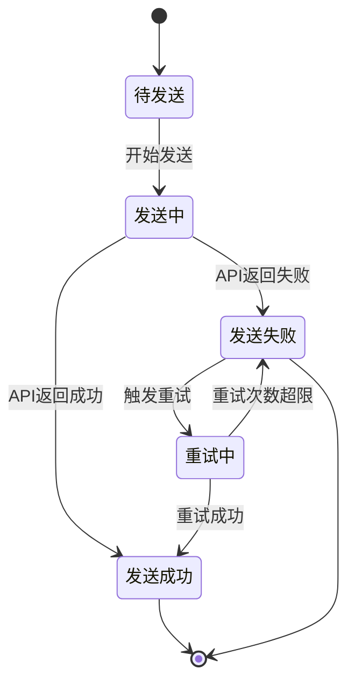

**状态说明**：
- **待发送**：通知已创建，等待发送。
- **发送中**：正在调用通知渠道API。
- **发送成功**：API返回成功，通知已送达。
- **发送失败**：API返回失败，通知未送达。
- **重试中**：正在尝试重新发送。

### 重试机制

系统在通知失败时会自动触发重试机制，确保通知的最终送达。

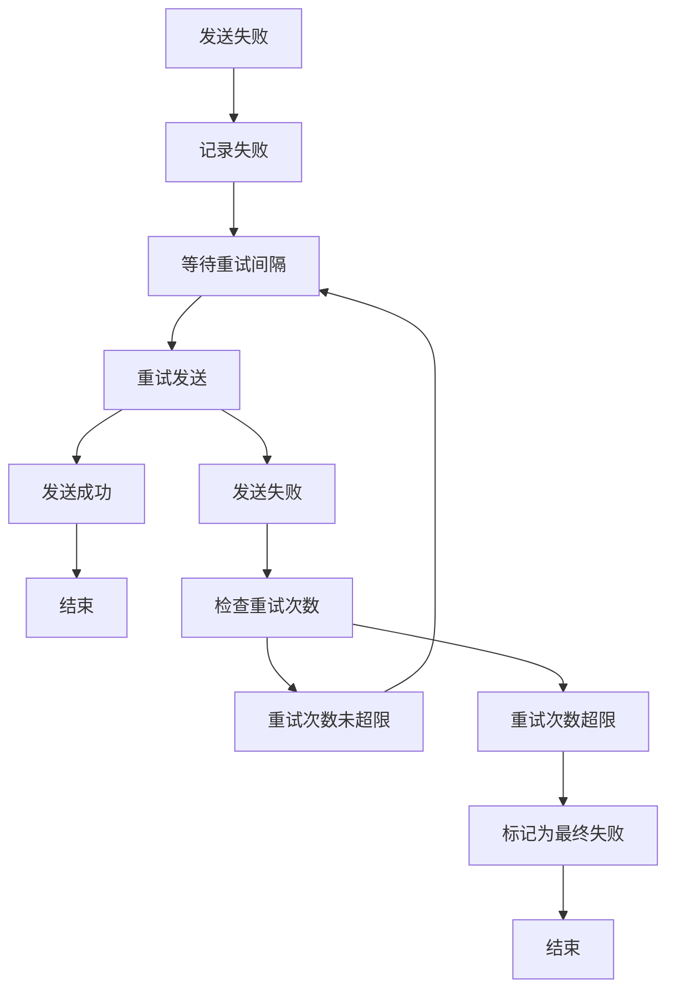

**重试策略**：
- 可配置最大重试次数。
- 可配置重试间隔时间。
- 支持指数退避算法，避免对通知渠道造成过大压力。

**跟踪来源**
- [NotificationManager.java](file://datavines-notification/datavines-notification-core/src/main/java/io/datavines/notification/core/NotificationManager.java)
- [SlaNotificationResult.java](file://datavines-notification/datavines-notification-api/src/main/java/io/datavines/notification/api/entity/SlaNotificationResult.java)

## 常见问题解决

### 通知延迟

**问题描述**：变更发生后，通知未能及时送达。

**可能原因**：
1. 系统负载过高，导致通知处理延迟。
2. 通知渠道API响应缓慢。
3. 网络问题导致请求超时。

**解决方案**：
1. 检查系统资源使用情况，优化性能。
2. 联系通知渠道服务商，确认API状态。
3. 检查网络连接，确保网络畅通。

### 消息丢失

**问题描述**：变更发生后，未收到任何通知。

**可能原因**：
1. 通知配置错误，导致消息无法发送。
2. 通知渠道API返回成功，但实际未送达。
3. 接收方设置问题，如邮箱过滤规则。

**解决方案**：
1. 检查通知配置，确保所有参数正确。
2. 查看系统日志，确认通知发送状态。
3. 检查接收方设置，确保消息未被过滤。

**问题来源**
- [NotificationManager.java](file://datavines-notification/datavines-notification-core/src/main/java/io/datavines/notification/core/NotificationManager.java)

## 总结

DataVines的变更通知功能通过CatalogSchemaChange实体实现了对数据目录模式变更的自动化监控。系统采用插件化架构，支持邮件、钉钉、飞书、企业微信等多种通知渠道，提供了灵活的通知模板和策略配置。通过完善的通知状态跟踪和重试机制，确保了通知的可靠送达。该功能为数据治理团队提供了及时、准确的变更信息，有助于快速响应数据质量问题和合规风险。