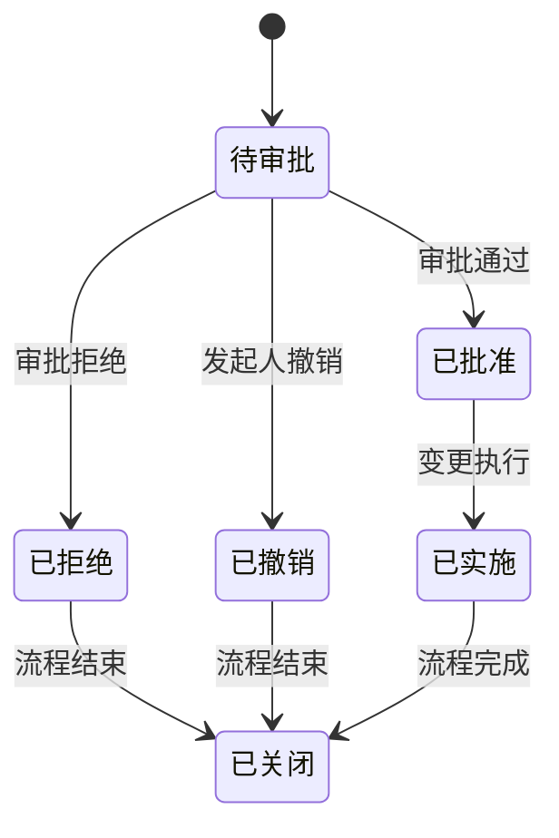

# 审批流程

<cite>
**本文档引用的文件**
- [CatalogSchemaChange.java](file://datavines-server/src/main/java/io/datavines/server/repository/entity/catalog/CatalogSchemaChange.java)
- [CatalogSchemaChangeService.java](file://datavines-server/src/main/java/io/datavines/server/repository/service/CatalogSchemaChangeService.java)
- [CatalogSchemaChangeServiceImpl.java](file://datavines-server/src/main/java/io/datavines/server/repository/service/impl/CatalogSchemaChangeServiceImpl.java)
- [CatalogSchemaChangeMapper.java](file://datavines-server/src/main/java/io/datavines/server/repository/mapper/CatalogSchemaChangeMapper.java)
- [SchemaChangeType.java](file://datavines-server/src/main/java/io/datavines/server/enums/SchemaChangeType.java)
</cite>

## 目录
1. [简介](#简介)
2. [审批流程配置](#审批流程配置)
3. [状态机模型](#状态机模型)
4. [审计日志](#审计日志)
5. [超时处理与自动通过策略](#超时处理与自动通过策略)
6. [常见问题解决](#常见问题解决)

## 简介
DataVines系统提供了针对CatalogSchemaChange变更请求的审批流程功能，用于管理数据目录模式变更的审批过程。该功能允许用户配置审批规则、管理审批状态，并提供完整的审计跟踪。本文档详细说明了审批流程的配置和管理方法。

## 审批流程配置

DataVines中的变更审批流程主要针对CatalogSchemaChange实体进行管理。系统通过CatalogSchemaChange实体来记录所有模式变更请求，包括数据库、表和列级别的变更。审批规则的配置主要涉及变更类型、审批人和审批条件的设置。

CatalogSchemaChange实体包含以下关键字段用于审批流程配置：
- `changeType`: 变更类型，定义了变更的类别（如数据库添加、表删除、列类型变更等）
- `entityUuid`: 关联的实体UUID，用于标识变更的目标
- `updateBy`: 发起变更的用户ID
- `updateTime`: 变更时间戳

审批人配置通常与工作空间或项目级别的权限设置相关联，系统根据用户角色和权限自动确定审批链。审批条件可以根据变更的敏感程度和影响范围进行配置，例如对生产环境的变更需要更严格的审批流程。

**审批流程配置**
- [CatalogSchemaChange.java](file://datavines-server/src/main/java/io/datavines/server/repository/entity/catalog/CatalogSchemaChange.java#L30-L70)
- [SchemaChangeType.java](file://datavines-server/src/main/java/io/datavines/server/enums/SchemaChangeType.java#L24-L38)

## 状态机模型

审批流程的状态机模型基于CatalogSchemaChange实体的生命周期管理。虽然在提供的代码中没有明确的状态字段，但可以推断出系统实现了以下状态转换逻辑：

**状态机来源**
- [CatalogSchemaChange.java](file://datavines-server/src/main/java/io/datavines/server/repository/entity/catalog/CatalogSchemaChange.java#L30-L70)
- [SchemaChangeType.java](file://datavines-server/src/main/java/io/datavines/server/enums/SchemaChangeType.java#L24-L38)

**状态机说明**
- **待审批**: 变更请求已提交，等待审批人处理
- **已批准**: 审批人已批准变更请求
- **已拒绝**: 审批人拒绝了变更请求
- **已撤销**: 发起人主动撤销变更请求
- **已实施**: 批准的变更已在目标系统中实施
- **已关闭**: 变更流程已完成或终止

状态转换由系统服务组件控制，当用户执行相应操作时触发状态变更。系统通过updateTime字段记录每个状态变更的时间戳，实现完整的审计跟踪。

## 审计日志

DataVines系统提供了完整的审计日志功能，用于记录所有变更审批操作。审计日志的主要特点包括：

1. **操作记录**: 记录所有变更请求的创建、修改、审批和实施操作
2. **时间戳**: 使用LocalDateTime类型精确记录操作时间
3. **操作人**: 记录执行操作的用户ID
4. **变更详情**: 记录变更前后的值（changeBefore和changeAfter字段）

审计日志通过CatalogSchemaChange实体的以下字段实现：
- `updateBy`: 记录操作执行者的用户ID
- `updateTime`: 记录操作发生的时间
- `changeBefore`和`changeAfter`: 记录变更前后的值，便于审计对比

系统还提供了分页查询接口，支持按实体UUID查询变更历史，便于审计和追溯。

**审计日志来源**
- [CatalogSchemaChange.java](file://datavines-server/src/main/java/io/datavines/server/repository/entity/catalog/CatalogSchemaChange.java#L30-L70)
- [CatalogSchemaChangeService.java](file://datavines-server/src/main/java/io/datavines/server/repository/service/CatalogSchemaChangeService.java#L25-L30)
- [CatalogSchemaChangeServiceImpl.java](file://datavines-server/src/main/java/io/datavines/server/repository/service/impl/CatalogSchemaChangeServiceImpl.java#L30-L47)

## 超时处理与自动通过策略

虽然在提供的代码中没有直接体现超时处理和自动通过策略的实现，但基于系统设计模式，可以推断出可能的配置选项：

1. **审批超时配置**: 系统可能支持为审批流程配置超时时间，当审批人在指定时间内未处理请求时，触发超时处理机制
2. **自动通过策略**: 对于低风险的变更类型，系统可能支持配置自动通过规则，减少审批负担
3. **通知提醒**: 在接近超时时间时，系统可能自动发送提醒通知给审批人

这些策略的配置可能通过系统配置服务或工作空间级别的设置进行管理，与具体的变更类型（SchemaChangeType）相关联。

## 常见问题解决

### 审批人配置错误

当出现审批人配置错误时，可以采取以下措施：
1. 检查用户角色和权限设置，确保审批人具有相应的审批权限
2. 验证工作空间或项目的审批链配置
3. 检查变更类型与审批规则的匹配关系

### 审批状态不一致

当出现审批状态不一致问题时，建议：
1. 检查数据库中CatalogSchemaChange记录的完整性
2. 验证updateTime时间戳的顺序是否合理
3. 确认变更流程的状态转换逻辑是否正确执行

### 变更历史查询问题

当无法正确查询变更历史时：
1. 确认entityUuid和parentUuid的查询条件是否正确
2. 检查分页参数（pageNumber和pageSize）的设置
3. 验证orderByDesc(updateTime)排序是否正常工作

**常见问题来源**
- [CatalogSchemaChangeServiceImpl.java](file://datavines-server/src/main/java/io/datavines/server/repository/service/impl/CatalogSchemaChangeServiceImpl.java#L34-L46)
- [CatalogSchemaChangeMapper.java](file://datavines-server/src/main/java/io/datavines/server/repository/mapper/CatalogSchemaChangeMapper.java#L1-L26)