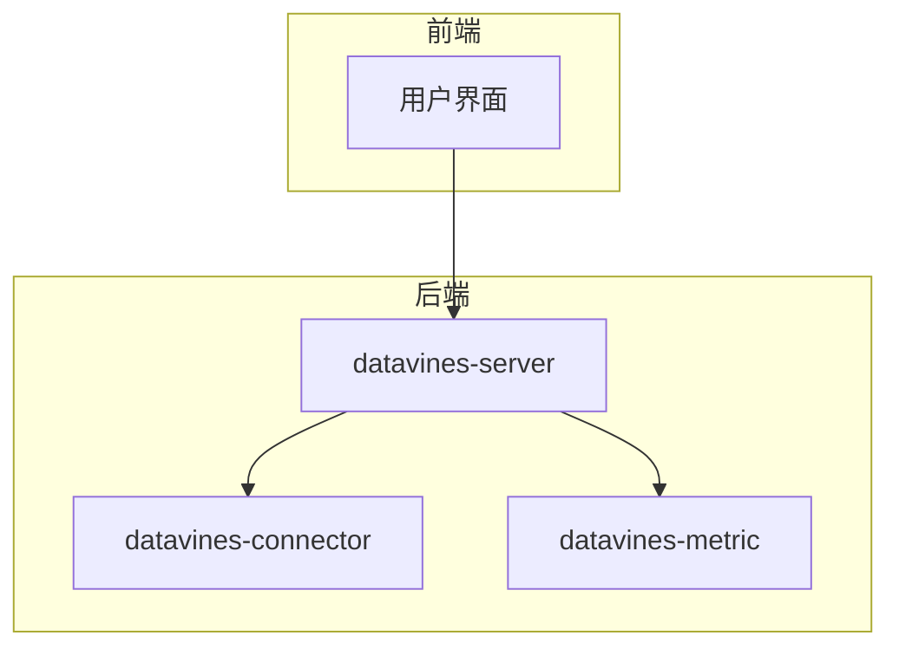
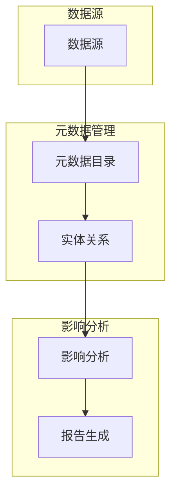
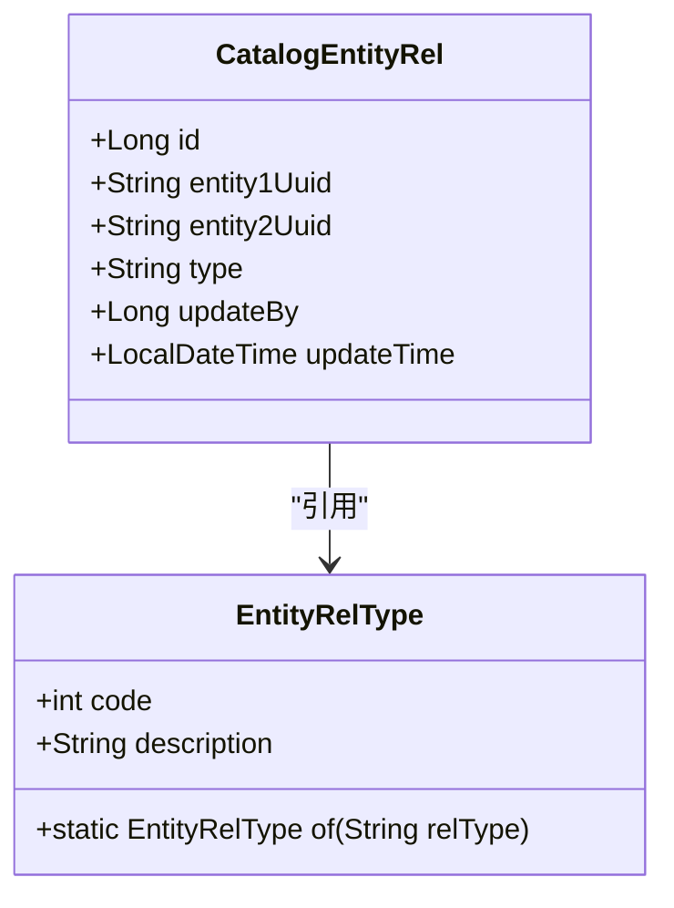
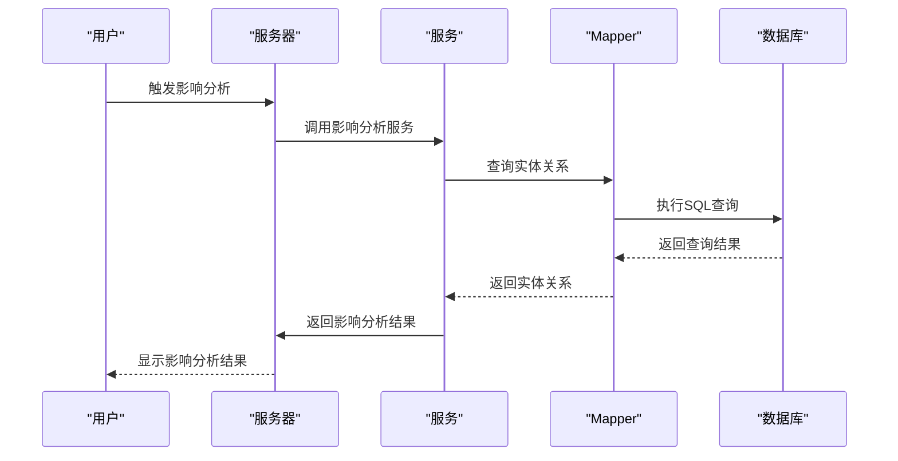
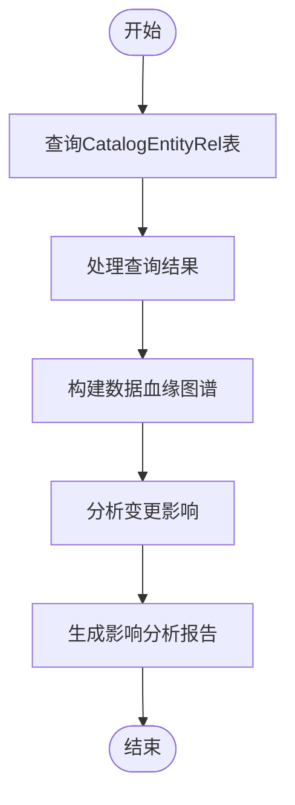
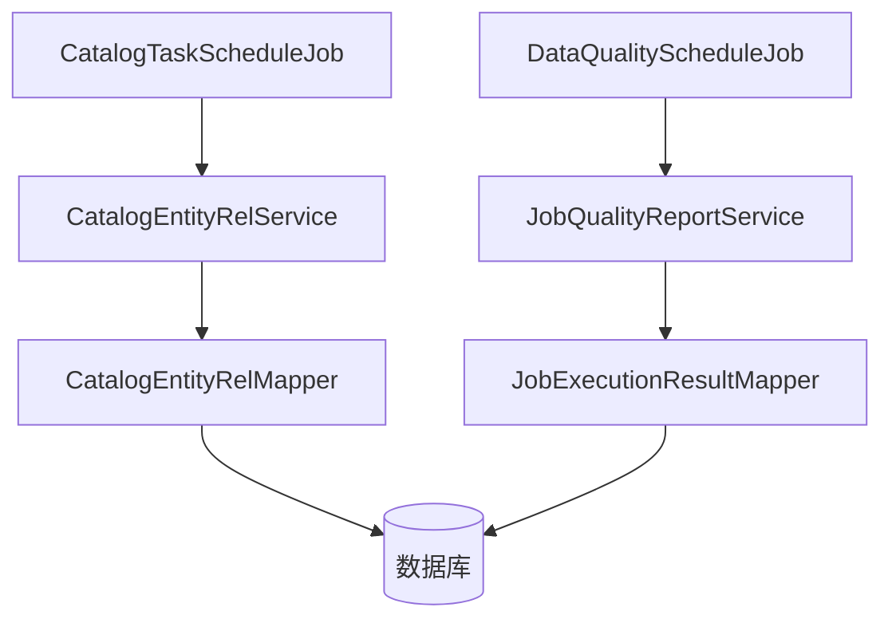

# 影响分析

<cite>
**本文档引用的文件**  
- [CatalogEntityRel.java](file://datavines-server/src/main/java/io/datavines/server/repository/entity/catalog/CatalogEntityRel.java)
- [EntityRelType.java](file://datavines-common/src/main/java/io/datavines/common/enums/EntityRelType.java)
- [datavines-mysql.sql](file://scripts/sql/datavines-mysql.sql)
- [CatalogEntityRelService.java](file://datavines-server/src/main/java/io/datavines/server/repository/service/CatalogEntityRelService.java)
- [CatalogEntityRelServiceImpl.java](file://datavines-server/src/main/java/io/datavines/server/repository/service/impl/CatalogEntityRelServiceImpl.java)
- [CatalogEntityRelMapper.java](file://datavines-server/src/main/java/io/datavines/server/repository/mapper/CatalogEntityRelMapper.java)
- [JobQualityReportService.java](file://datavines-server/src/main/java/io/datavines/server/repository/service/JobQualityReportService.java)
- [JobQualityReportServiceImpl.java](file://datavines-server/src/main/java/io/datavines/server/repository/service/impl/JobQualityReportServiceImpl.java)
- [DataQualityScheduleJob.java](file://datavines-server/src/main/java/io/datavines/server/dqc/coordinator/quartz/DataQualityScheduleJob.java)
- [CatalogTaskScheduleJob.java](file://datavines-server/src/main/java/io/datavines/server/dqc/coordinator/quartz/CatalogTaskScheduleJob.java)
</cite>

## 目录
1. [引言](#引言)
2. [项目结构](#项目结构)
3. [核心组件](#核心组件)
4. [架构概述](#架构概述)
5. [详细组件分析](#详细组件分析)
6. [依赖分析](#依赖分析)
7. [性能考虑](#性能考虑)
8. [故障排除指南](#故障排除指南)
9. [结论](#结论)

## 引言
本文档详细阐述了DataVines中变更影响分析的实现机制。通过分析CatalogEntityRel关系表构建数据血缘图谱，说明变更对下游数据表、数据质量任务等的影响范围。文档涵盖影响分析的触发时机和执行流程，包括实时分析和批量分析两种模式。同时，阐述影响严重程度的评估标准和可视化展示方式，提供影响分析结果的导出和报告功能说明，并解决常见问题如血缘关系不完整、影响范围误判等。

## 项目结构
DataVines项目结构清晰，主要模块包括datavines-server、datavines-connector、datavines-metric等。影响分析功能主要集中在datavines-server模块的catalog相关实体和服务中，通过CatalogEntityRel表存储实体间的上下游关系，构建数据血缘图谱。

**图表来源**  
- [CatalogEntityRel.java](file://datavines-server/src/main/java/io/datavines/server/repository/entity/catalog/CatalogEntityRel.java)
- [EntityRelType.java](file://datavines-common/src/main/java/io/datavines/common/enums/EntityRelType.java)

**章节来源**
- [datavines-server](file://datavines-server)
- [datavines-connector](file://datavines-connector)
- [datavines-metric](file://datavines-metric)

## 核心组件
影响分析的核心组件包括CatalogEntityRel实体、CatalogEntityRelService服务以及相关的Mapper组件。这些组件共同协作，实现数据血缘关系的存储、查询和分析功能。

**章节来源**
- [CatalogEntityRel.java](file://datavines-server/src/main/java/io/datavines/server/repository/entity/catalog/CatalogEntityRel.java)
- [CatalogEntityRelService.java](file://datavines-server/src/main/java/io/datavines/server/repository/service/CatalogEntityRelService.java)
- [CatalogEntityRelMapper.java](file://datavines-server/src/main/java/io/datavines/server/repository/mapper/CatalogEntityRelMapper.java)

## 架构概述
DataVines的影响分析功能基于数据血缘图谱实现。通过CatalogEntityRel表存储实体间的上下游关系，系统能够分析变更对下游数据表、数据质量任务等的影响范围。影响分析的触发时机包括实时分析和批量分析两种模式。

**图表来源**  
- [CatalogEntityRel.java](file://datavines-server/src/main/java/io/datavines/server/repository/entity/catalog/CatalogEntityRel.java)
- [JobQualityReportService.java](file://datavines-server/src/main/java/io/datavines/server/repository/service/JobQualityReportService.java)

## 详细组件分析

### CatalogEntityRel 分析
CatalogEntityRel组件负责存储和管理实体间的上下游关系。通过entity1_uuid和entity2_uuid字段标识两个实体，type字段表示关系类型（上游、下游、父子等）。

#### 类图

**图表来源**  
- [CatalogEntityRel.java](file://datavines-server/src/main/java/io/datavines/server/repository/entity/catalog/CatalogEntityRel.java)
- [EntityRelType.java](file://datavines-common/src/main/java/io/datavines/common/enums/EntityRelType.java)

**章节来源**
- [CatalogEntityRel.java](file://datavines-server/src/main/java/io/datavines/server/repository/entity/catalog/CatalogEntityRel.java)
- [EntityRelType.java](file://datavines-common/src/main/java/io/datavines/common/enums/EntityRelType.java)

### 影响分析执行流程
影响分析的执行流程包括实时分析和批量分析两种模式。实时分析在数据变更时立即触发，批量分析则按预定时间调度执行。

#### 序列图

**图表来源**  
- [CatalogEntityRelService.java](file://datavines-server/src/main/java/io/datavines/server/repository/service/CatalogEntityRelService.java)
- [CatalogEntityRelMapper.java](file://datavines-server/src/main/java/io/datavines/server/repository/mapper/CatalogEntityRelMapper.java)

**章节来源**
- [CatalogEntityRelService.java](file://datavines-server/src/main/java/io/datavines/server/repository/service/CatalogEntityRelService.java)
- [CatalogEntityRelMapper.java](file://datavines-server/src/main/java/io/datavines/server/repository/mapper/CatalogEntityRelMapper.java)

### 数据血缘图谱构建
数据血缘图谱的构建基于CatalogEntityRel表，通过递归查询上下游关系，形成完整的数据血缘网络。

#### 流程图

**图表来源**  
- [CatalogEntityRel.java](file://datavines-server/src/main/java/io/datavines/server/repository/entity/catalog/CatalogEntityRel.java)
- [JobQualityReportService.java](file://datavines-server/src/main/java/io/datavines/server/repository/service/JobQualityReportService.java)

**章节来源**
- [CatalogEntityRel.java](file://datavines-server/src/main/java/io/datavines/server/repository/entity/catalog/CatalogEntityRel.java)
- [JobQualityReportService.java](file://datavines-server/src/main/java/io/datavines/server/repository/service/JobQualityReportService.java)

## 依赖分析
影响分析功能依赖于多个组件和服务，包括CatalogEntityRelService、JobQualityReportService等。这些组件通过Spring框架进行依赖注入，确保系统的松耦合和高内聚。

**图表来源**  
- [CatalogEntityRelService.java](file://datavines-server/src/main/java/io/datavines/server/repository/service/CatalogEntityRelService.java)
- [JobQualityReportService.java](file://datavines-server/src/main/java/io/datavines/server/repository/service/JobQualityReportService.java)
- [CatalogTaskScheduleJob.java](file://datavines-server/src/main/java/io/datavines/server/dqc/coordinator/quartz/CatalogTaskScheduleJob.java)
- [DataQualityScheduleJob.java](file://datavines-server/src/main/java/io/datavines/server/dqc/coordinator/quartz/DataQualityScheduleJob.java)

**章节来源**
- [CatalogEntityRelService.java](file://datavines-server/src/main/java/io/datavines/server/repository/service/CatalogEntityRelService.java)
- [JobQualityReportService.java](file://datavines-server/src/main/java/io/datavines/server/repository/service/JobQualityReportService.java)
- [CatalogTaskScheduleJob.java](file://datavines-server/src/main/java/io/datavines/server/dqc/coordinator/quartz/CatalogTaskScheduleJob.java)
- [DataQualityScheduleJob.java](file://datavines-server/src/main/java/io/datavines/server/dqc/coordinator/quartz/DataQualityScheduleJob.java)

## 性能考虑
影响分析功能在处理大规模数据血缘关系时，需要考虑查询性能和内存占用。建议对CatalogEntityRel表的常用查询字段建立索引，并合理设置查询缓存。

## 故障排除指南
### 血缘关系不完整
当发现血缘关系不完整时，应检查数据源连接配置和元数据抓取任务是否正常执行。

**章节来源**
- [CatalogTaskScheduleJob.java](file://datavines-server/src/main/java/io/datavines/server/dqc/coordinator/quartz/CatalogTaskScheduleJob.java)

### 影响范围误判
影响范围误判可能由于实体关系数据不准确导致，应核对CatalogEntityRel表中的关系数据。

**章节来源**
- [CatalogEntityRel.java](file://datavines-server/src/main/java/io/datavines/server/repository/entity/catalog/CatalogEntityRel.java)

## 结论
DataVines的影响分析功能通过CatalogEntityRel关系表构建数据血缘图谱，能够有效分析变更对下游数据表、数据质量任务等的影响范围。系统支持实时分析和批量分析两种模式，提供完整的影响分析报告和可视化展示。通过合理的性能优化和故障排除，确保影响分析功能的准确性和高效性。