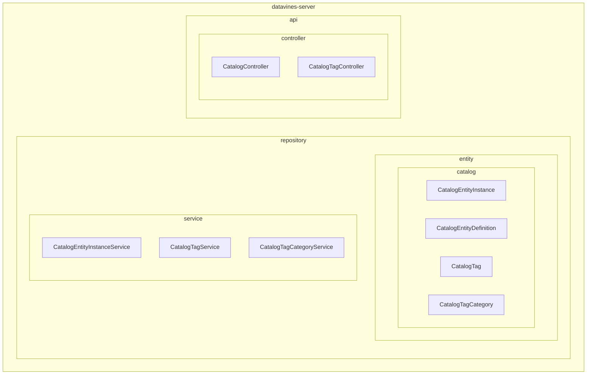
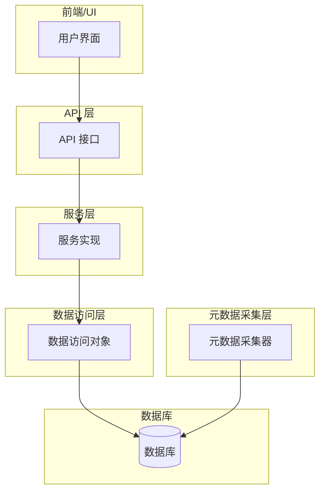
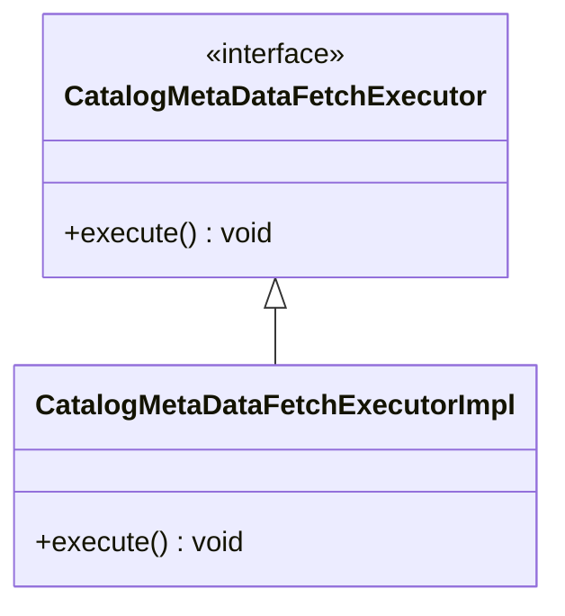
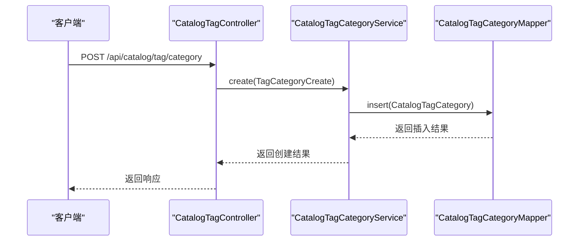
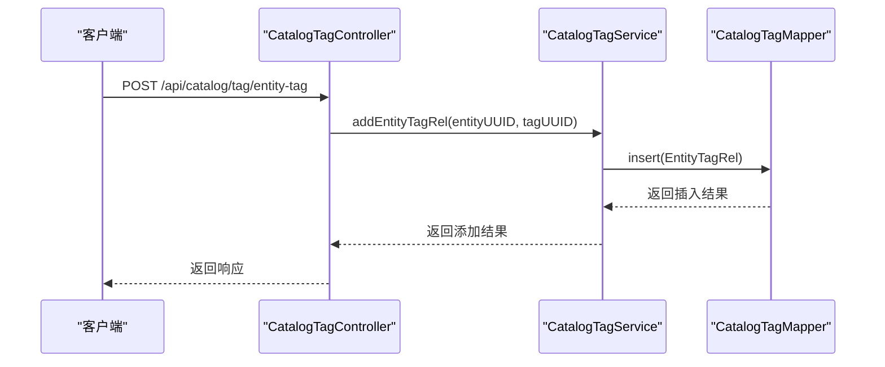
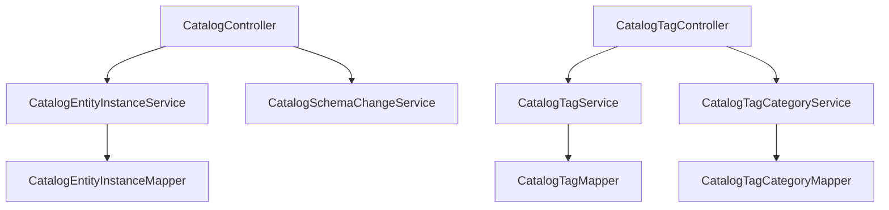

# 数据目录

<cite>
**本文档引用的文件**  
- [CatalogEntityInstance.java](file://datavines-server/src/main/java/io/datavines/server/repository/entity/catalog/CatalogEntityInstance.java)
- [CatalogEntityDefinition.java](file://datavines-server/src/main/java/io/datavines/server/repository/entity/catalog/CatalogEntityDefinition.java)
- [CatalogTag.java](file://datavines-server/src/main/java/io/datavines/server/repository/entity/catalog/CatalogTag.java)
- [CatalogTagCategory.java](file://datavines-server/src/main/java/io/datavines/server/repository/entity/catalog/CatalogTagCategory.java)
- [CatalogController.java](file://datavines-server/src/main/java/io/datavines/server/api/controller/CatalogController.java)
- [CatalogTagController.java](file://datavines-server/src/main/java/io/datavines/server/api/controller/CatalogTagController.java)
- [CatalogEntityInstanceService.java](file://datavines-server/src/main/java/io/datavines/server/repository/service/CatalogEntityInstanceService.java)
- [CatalogTagService.java](file://datavines-server/src/main/java/io/datavines/server/repository/service/CatalogTagService.java)
- [CatalogTagCategoryService.java](file://datavines-server/src/main/java/io/datavines/server/repository/service/CatalogTagCategoryService.java)
- [CatalogMetaDataFetchExecutor.java](file://datavines-server/src/main/java/io/datavines/server/scheduler/metadata/task/CatalogMetaDataFetchExecutor.java)
- [CatalogMetaDataFetchTaskRunner.java](file://datavines-server/src/main/java/io/datavines/server/scheduler/metadata/CatalogMetaDataFetchTaskRunner.java)
- [README.zh-CN.md](file://README.zh-CN.md)
</cite>

## 目录
1. [引言](#引言)
2. [项目结构](#项目结构)
3. [核心组件](#核心组件)
4. [架构概述](#架构概述)
5. [详细组件分析](#详细组件分析)
6. [依赖分析](#依赖分析)
7. [性能考虑](#性能考虑)
8. [故障排除指南](#故障排除指南)
9. [结论](#结论)

## 引言

DataVines 是一个一站式开源数据可观测性平台，提供元数据管理、数据概览报告、数据质量管理、数据分布查询、数据趋势洞察等核心能力。数据目录是 DataVines 的核心功能之一，旨在帮助用户全面了解和管理其数据资产。通过定时获取数据源元数据、监听元数据变更以及支持元数据的标签管理，数据目录为数据发现、数据血缘和数据治理提供了坚实的基础。

## 项目结构

DataVines 的项目结构清晰地划分了不同的模块，每个模块负责特定的功能。数据目录相关的代码主要位于 `datavines-server` 模块中，特别是 `repository/entity/catalog` 和 `api/controller` 目录下。这些目录包含了数据目录的核心实体定义、服务接口和控制器。

**图表来源**
- [CatalogEntityInstance.java](file://datavines-server/src/main/java/io/datavines/server/repository/entity/catalog/CatalogEntityInstance.java)
- [CatalogEntityDefinition.java](file://datavines-server/src/main/java/io/datavines/server/repository/entity/catalog/CatalogEntityDefinition.java)
- [CatalogTag.java](file://datavines-server/src/main/java/io/datavines/server/repository/entity/catalog/CatalogTag.java)
- [CatalogTagCategory.java](file://datavines-server/src/main/java/io/datavines/server/repository/entity/catalog/CatalogTagCategory.java)
- [CatalogEntityInstanceService.java](file://datavines-server/src/main/java/io/datavines/server/repository/service/CatalogEntityInstanceService.java)
- [CatalogTagService.java](file://datavines-server/src/main/java/io/datavines/server/repository/service/CatalogTagService.java)
- [CatalogTagCategoryService.java](file://datavines-server/src/main/java/io/datavines/server/repository/service/CatalogTagCategoryService.java)
- [CatalogController.java](file://datavines-server/src/main/java/io/datavines/server/api/controller/CatalogController.java)
- [CatalogTagController.java](file://datavines-server/src/main/java/io/datavines/server/api/controller/CatalogTagController.java)

## 核心组件

### CatalogEntityInstance

`CatalogEntityInstance` 类表示数据目录中的具体实例，如数据库、表或列。它包含了实例的基本信息，如 UUID、数据源 ID、类型、完全限定名称、显示名称、描述、属性、所有者、版本、状态、创建时间和更新时间。

**部分来源**
- [CatalogEntityInstance.java](file://datavines-server/src/main/java/io/datavines/server/repository/entity/catalog/CatalogEntityInstance.java#L35-L78)

### CatalogEntityDefinition

`CatalogEntityDefinition` 类表示数据目录中的实体定义，用于描述实体的元数据。它包含了定义的基本信息，如 UUID、名称、描述、属性、父级 UUID、创建者、创建时间、更新者和更新时间。

**部分来源**
- [CatalogEntityDefinition.java](file://datavines-server/src/main/java/io/datavines/server/repository/entity/catalog/CatalogEntityDefinition.java#L35-L63)

### CatalogTag

`CatalogTag` 类表示数据目录中的标签，用于对数据资产进行分类和标记。它包含了标签的基本信息，如 UUID、类别 UUID、名称、创建者、创建时间、更新者和更新时间。

**部分来源**
- [CatalogTag.java](file://datavines-server/src/main/java/io/datavines/server/repository/entity/catalog/CatalogTag.java#L38-L59)

### CatalogTagCategory

`CatalogTagCategory` 类表示数据目录中的标签类别，用于组织和管理标签。它包含了类别的基本信息，如 UUID、名称、工作空间 ID、创建者、创建时间、更新者和更新时间。

**部分来源**
- [CatalogTagCategory.java](file://datavines-server/src/main/java/io/datavines/server/repository/entity/catalog/CatalogTagCategory.java#L38-L59)

## 架构概述

DataVines 的数据目录系统采用分层架构设计，主要包括以下几个层次：

1. **API 层**：提供 RESTful API 接口，供前端 UI 和外部系统调用。
2. **服务层**：实现业务逻辑，处理来自 API 层的请求，并调用数据访问层进行数据操作。
3. **数据访问层**：负责与数据库交互，执行 CRUD 操作。
4. **元数据采集层**：定时从数据源获取元数据，并更新到数据目录中。

**图表来源**
- [CatalogController.java](file://datavines-server/src/main/java/io/datavines/server/api/controller/CatalogController.java)
- [CatalogTagController.java](file://datavines-server/src/main/java/io/datavines/server/api/controller/CatalogTagController.java)
- [CatalogEntityInstanceService.java](file://datavines-server/src/main/java/io/datavines/server/repository/service/CatalogEntityInstanceService.java)
- [CatalogTagService.java](file://datavines-server/src/main/java/io/datavines/server/repository/service/CatalogTagService.java)
- [CatalogTagCategoryService.java](file://datavines-server/src/main/java/io/datavines/server/repository/service/CatalogTagCategoryService.java)
- [CatalogEntityInstance.java](file://datavines-server/src/main/java/io/datavines/server/repository/entity/catalog/CatalogEntityInstance.java)
- [CatalogEntityDefinition.java](file://datavines-server/src/main/java/io/datavines/server/repository/entity/catalog/CatalogEntityDefinition.java)
- [CatalogTag.java](file://datavines-server/src/main/java/io/datavines/server/repository/entity/catalog/CatalogTag.java)
- [CatalogTagCategory.java](file://datavines-server/src/main/java/io/datavines/server/repository/entity/catalog/CatalogTagCategory.java)

## 详细组件分析

### 元数据采集

元数据采集是数据目录的核心功能之一，通过定时任务从数据源获取最新的元数据信息。`CatalogMetaDataFetchExecutor` 接口定义了元数据采集的执行方法，具体的实现类 `CatalogMetaDataFetchExecutorImpl` 负责执行实际的采集任务。

**图表来源**
- [CatalogMetaDataFetchExecutor.java](file://datavines-server/src/main/java/io/datavines/server/scheduler/metadata/task/CatalogMetaDataFetchExecutor.java)
- [CatalogMetaDataFetchExecutorImpl.java](file://datavines-server/src/main/java/io/datavines/server/scheduler/metadata/task/CatalogMetaDataFetchExecutorImpl.java)

### 标签管理

标签管理功能允许用户为数据资产添加标签，以便更好地组织和分类。`CatalogTagController` 提供了创建、删除、查询标签及其类别的 API 接口。`CatalogTagService` 和 `CatalogTagCategoryService` 分别实现了标签和标签类别的业务逻辑。

#### 创建标签类别

**图表来源**
- [CatalogTagController.java](file://datavines-server/src/main/java/io/datavines/server/api/controller/CatalogTagController.java#L47-L51)
- [CatalogTagCategoryService.java](file://datavines-server/src/main/java/io/datavines/server/repository/service/CatalogTagCategoryService.java#L27-L31)
- [CatalogTagCategoryMapper.java](file://datavines-server/src/main/java/io/datavines/server/repository/mapper/CatalogTagCategoryMapper.java)

#### 为实体添加标签

**图表来源**
- [CatalogTagController.java](file://datavines-server/src/main/java/io/datavines/server/api/controller/CatalogTagController.java#L95-L99)
- [CatalogTagService.java](file://datavines-server/src/main/java/io/datavines/server/repository/service/CatalogTagService.java#L37-L39)
- [CatalogTagMapper.java](file://datavines-server/src/main/java/io/datavines/server/repository/mapper/CatalogTagMapper.java)

## 依赖分析

数据目录系统的各个组件之间存在紧密的依赖关系。`CatalogController` 依赖于 `CatalogEntityInstanceService` 和 `CatalogSchemaChangeService` 等服务来处理业务逻辑。`CatalogTagController` 依赖于 `CatalogTagService` 和 `CatalogTagCategoryService` 来管理标签和标签类别。

**图表来源**
- [CatalogController.java](file://datavines-server/src/main/java/io/datavines/server/api/controller/CatalogController.java#L51-L58)
- [CatalogTagController.java](file://datavines-server/src/main/java/io/datavines/server/api/controller/CatalogTagController.java#L41-L45)
- [CatalogEntityInstanceService.java](file://datavines-server/src/main/java/io/datavines/server/repository/service/CatalogEntityInstanceService.java)
- [CatalogTagService.java](file://datavines-server/src/main/java/io/datavines/server/repository/service/CatalogTagService.java)
- [CatalogTagCategoryService.java](file://datavines-server/src/main/java/io/datavines/server/repository/service/CatalogTagCategoryService.java)

## 性能考虑

为了确保数据目录系统的高性能，建议采取以下措施：

1. **优化数据库查询**：使用索引和缓存来加速频繁的查询操作。
2. **异步处理**：将耗时的操作（如元数据采集）放入后台任务中异步执行，避免阻塞主线程。
3. **分页查询**：对于大量数据的查询，使用分页机制减少单次请求的数据量。
4. **定期清理**：定期清理不再使用的元数据和标签，保持数据库的整洁。

## 故障排除指南

### 元数据同步延迟

如果发现元数据同步有延迟，可以检查以下几点：

1. **任务调度**：确认元数据采集任务是否正常调度和执行。
2. **网络连接**：检查数据源的网络连接是否稳定。
3. **资源限制**：查看服务器资源（CPU、内存）是否充足。

### 标签冲突

如果遇到标签冲突问题，可以采取以下措施：

1. **唯一性校验**：在创建标签时增加唯一性校验，防止重复创建。
2. **事务管理**：使用数据库事务确保标签创建和关联操作的原子性。

**部分来源**
- [CatalogTagCategoryServiceImpl.java](file://datavines-server/src/main/java/io/datavines/server/repository/service/impl/CatalogTagCategoryServiceImpl.java#L48-L50)
- [CatalogTagServiceImpl.java](file://datavines-server/src/main/java/io/datavines/server/repository/service/impl/CatalogTagServiceImpl.java)

## 结论

DataVines 的数据目录系统通过元数据采集、实体定义、实例管理、标签分类和变更监控等功能，为用户提供了一个全面的数据资产管理平台。通过合理的架构设计和高效的性能优化，该系统能够满足大规模数据环境下的需求。希望本文档能帮助您更好地理解和使用 DataVines 的数据目录功能。