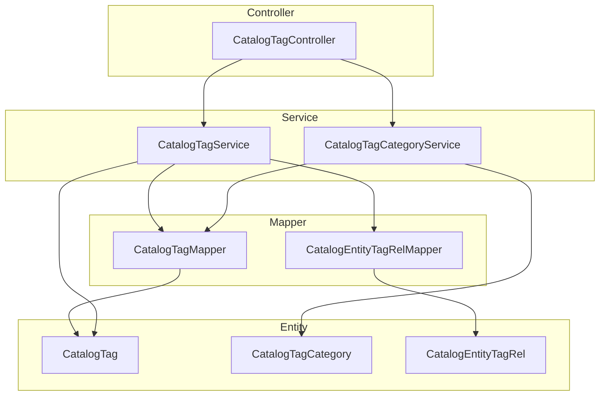
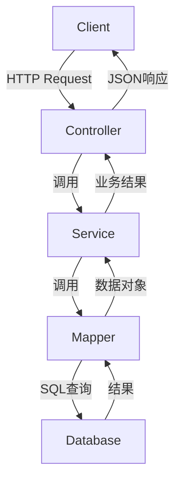
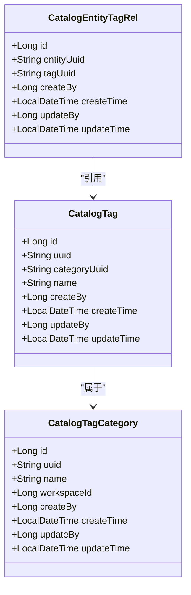
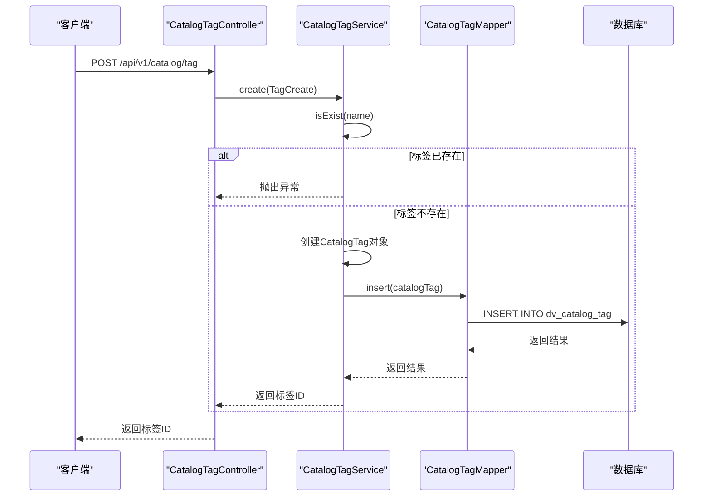
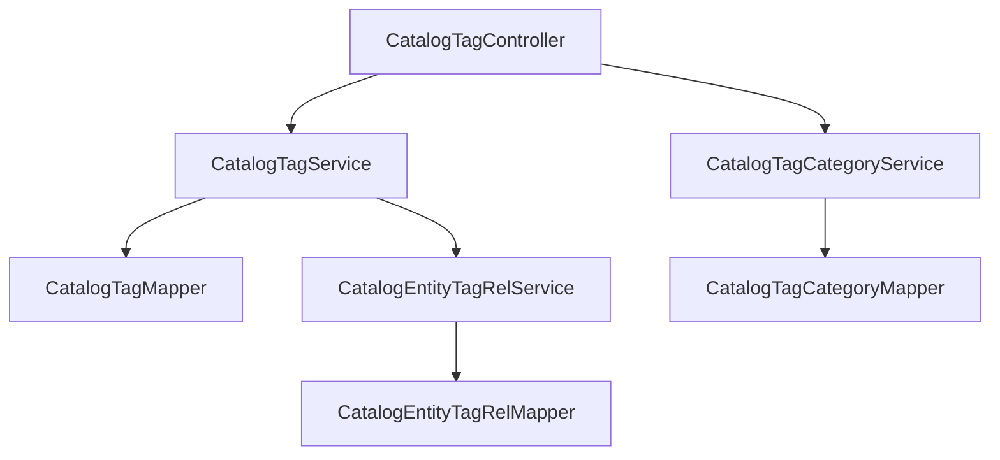

# 标签管理

<cite>
**本文档中引用的文件**  
- [CatalogTag.java](file://datavines-server/src/main/java/io/datavines/server/repository/entity/catalog/CatalogTag.java)
- [CatalogTagCategory.java](file://datavines-server/src/main/java/io/datavines/server/repository/entity/catalog/CatalogTagCategory.java)
- [CatalogEntityTagRel.java](file://datavines-server/src/main/java/io/datavines/server/repository/entity/catalog/CatalogEntityTagRel.java)
- [CatalogTagServiceImpl.java](file://datavines-server/src/main/java/io/datavines/server/repository/service/impl/CatalogTagServiceImpl.java)
- [CatalogTagCategoryServiceImpl.java](file://datavines-server/src/main/java/io/datavines/server/repository/service/impl/CatalogTagCategoryServiceImpl.java)
- [CatalogTagController.java](file://datavines-server/src/main/java/io/datavines/server/api/controller/CatalogTagController.java)
- [TagCreate.java](file://datavines-server/src/main/java/io/datavines/server/api/dto/bo/catalog/tag/TagCreate.java)
- [TagCategoryCreate.java](file://datavines-server/src/main/java/io/datavines/server/api/dto/bo/catalog/tag/TagCategoryCreate.java)
- [CatalogTagVO.java](file://datavines-server/src/main/java/io/datavines/server/api/dto/vo/catalog/CatalogTagVO.java)
- [CatalogTagMapper.java](file://datavines-server/src/main/java/io/datavines/server/repository/mapper/CatalogTagMapper.java)
- [CatalogEntityTagRelMapper.java](file://datavines-server/src/main/java/io/datavines/server/repository/mapper/CatalogEntityTagRelMapper.java)
</cite>

## 目录
1. [引言](#引言)
2. [项目结构](#项目结构)
3. [核心组件](#核心组件)
4. [架构概述](#架构概述)
5. [详细组件分析](#详细组件分析)
6. [依赖分析](#依赖分析)
7. [性能考虑](#性能考虑)
8. [故障排除指南](#故障排除指南)
9. [结论](#结论)

## 引言
DataVines中的标签管理功能为数据资产提供了灵活的分类和组织机制。通过标签系统，用户可以对数据实体进行分类、打标签，并基于标签进行搜索和过滤。本文档详细阐述了标签系统的架构设计、核心实体、操作接口以及使用方法。

## 项目结构
标签管理功能主要位于`datavines-server`模块中，涉及实体定义、服务实现、控制器接口和数据库映射等多个层次。整体结构遵循典型的分层架构模式，包括控制器层、服务层、数据访问层和实体层。

**图示来源**  
- [CatalogTagController.java](file://datavines-server/src/main/java/io/datavines/server/api/controller/CatalogTagController.java)
- [CatalogTagService.java](file://datavines-server/src/main/java/io/datavines/server/repository/service/CatalogTagService.java)
- [CatalogTagMapper.java](file://datavines-server/src/main/java/io/datavines/server/repository/mapper/CatalogTagMapper.java)
- [CatalogTag.java](file://datavines-server/src/main/java/io/datavines/server/repository/entity/catalog/CatalogTag.java)

**节来源**  
- [CatalogTagController.java](file://datavines-server/src/main/java/io/datavines/server/api/controller/CatalogTagController.java)
- [CatalogTagService.java](file://datavines-server/src/main/java/io/datavines/server/repository/service/CatalogTagService.java)

## 核心组件
标签管理系统的核心组件包括标签实体（CatalogTag）、标签分类实体（CatalogTagCategory）和标签与实体的关联关系（CatalogEntityTagRel）。这些组件共同构成了标签系统的数据模型。

**节来源**  
- [CatalogTag.java](file://datavines-server/src/main/java/io/datavines/server/repository/entity/catalog/CatalogTag.java)
- [CatalogTagCategory.java](file://datavines-server/src/main/java/io/datavines/server/repository/entity/catalog/CatalogTagCategory.java)
- [CatalogEntityTagRel.java](file://datavines-server/src/main/java/io/datavines/server/repository/entity/catalog/CatalogEntityTagRel.java)

## 架构概述
标签系统的架构采用典型的三层模式：表现层（Controller）、业务逻辑层（Service）和数据访问层（Mapper）。表现层负责接收HTTP请求并返回响应；业务逻辑层处理具体的业务规则和流程；数据访问层负责与数据库交互。

**图示来源**  
- [CatalogTagController.java](file://datavines-server/src/main/java/io/datavines/server/api/controller/CatalogTagController.java)
- [CatalogTagServiceImpl.java](file://datavines-server/src/main/java/io/datavines/server/repository/service/impl/CatalogTagServiceImpl.java)
- [CatalogTagMapper.java](file://datavines-server/src/main/java/io/datavines/server/repository/mapper/CatalogTagMapper.java)

## 详细组件分析

### 标签实体分析
`CatalogTag`实体表示一个具体的标签，包含标签名称、所属分类、创建和更新信息等属性。每个标签通过UUID唯一标识，并与特定的标签分类关联。

**图示来源**  
- [CatalogTag.java](file://datavines-server/src/main/java/io/datavines/server/repository/entity/catalog/CatalogTag.java)
- [CatalogTagCategory.java](file://datavines-server/src/main/java/io/datavines/server/repository/entity/catalog/CatalogTagCategory.java)
- [CatalogEntityTagRel.java](file://datavines-server/src/main/java/io/datavines/server/repository/entity/catalog/CatalogEntityTagRel.java)

**节来源**  
- [CatalogTag.java](file://datavines-server/src/main/java/io/datavines/server/repository/entity/catalog/CatalogTag.java)
- [CatalogTagCategory.java](file://datavines-server/src/main/java/io/datavines/server/repository/entity/catalog/CatalogTagCategory.java)

### 标签操作流程分析
标签的创建、删除和关联操作通过REST API暴露，客户端可以通过HTTP请求执行这些操作。以下序列图展示了创建标签的完整流程。

**图示来源**  
- [CatalogTagController.java](file://datavines-server/src/main/java/io/datavines/server/api/controller/CatalogTagController.java)
- [CatalogTagServiceImpl.java](file://datavines-server/src/main/java/io/datavines/server/repository/service/impl/CatalogTagServiceImpl.java)
- [CatalogTagMapper.java](file://datavines-server/src/main/java/io/datavines/server/repository/mapper/CatalogTagMapper.java)

**节来源**  
- [CatalogTagController.java](file://datavines-server/src/main/java/io/datavines/server/api/controller/CatalogTagController.java)
- [CatalogTagServiceImpl.java](file://datavines-server/src/main/java/io/datavines/server/repository/service/impl/CatalogTagServiceImpl.java)

## 依赖分析
标签系统依赖于MyBatis Plus框架进行数据库操作，使用Lombok简化实体类代码，并通过Spring框架管理组件生命周期。系统内部各组件之间存在明确的依赖关系，控制器依赖服务，服务依赖映射器。

**图示来源**  
- [CatalogTagController.java](file://datavines-server/src/main/java/io/datavines/server/api/controller/CatalogTagController.java)
- [CatalogTagServiceImpl.java](file://datavines-server/src/main/java/io/datavines/server/repository/service/impl/CatalogTagServiceImpl.java)
- [CatalogTagCategoryServiceImpl.java](file://datavines-server/src/main/java/io/datavines/server/repository/service/impl/CatalogTagCategoryServiceImpl.java)

**节来源**  
- [CatalogTagController.java](file://datavines-server/src/main/java/io/datavines/server/api/controller/CatalogTagController.java)
- [CatalogTagServiceImpl.java](file://datavines-server/src/main/java/io/datavines/server/repository/service/impl/CatalogTagServiceImpl.java)

## 性能考虑
标签系统的性能主要受数据库查询效率影响。为提高查询性能，建议在`dv_catalog_tag`表的`category_uuid`字段和`dv_catalog_entity_tag_rel`表的`entity_uuid`字段上建立索引。此外，对于频繁访问的标签数据，可以考虑引入缓存机制。

## 故障排除指南
常见问题包括标签创建失败（名称重复）、标签关联失败（权限不足）等。当遇到问题时，首先检查请求参数是否符合规范，然后查看服务日志以获取详细的错误信息。对于数据库相关的问题，需要检查表结构和索引是否正确。

**节来源**  
- [CatalogTagServiceImpl.java](file://datavines-server/src/main/java/io/datavines/server/repository/service/impl/CatalogTagServiceImpl.java)
- [CatalogTagController.java](file://datavines-server/src/main/java/io/datavines/server/api/controller/CatalogTagController.java)

## 结论
DataVines的标签管理系统提供了一套完整的标签管理功能，支持标签分类、标签创建、标签关联和标签查询等操作。系统架构清晰，组件职责明确，便于维护和扩展。通过合理使用标签，用户可以更高效地组织和管理数据资产。