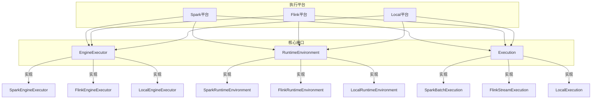
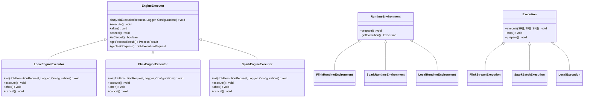
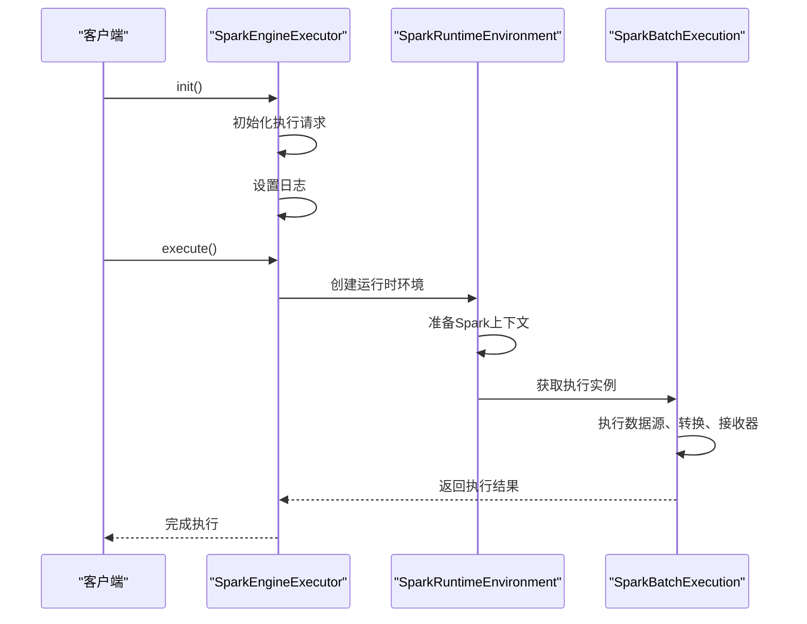
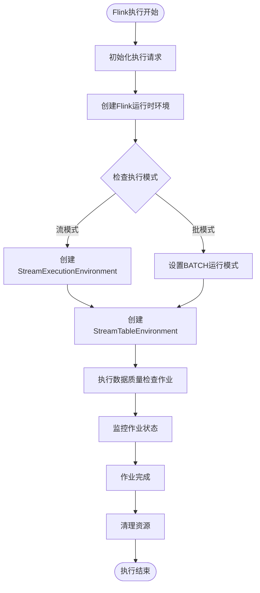
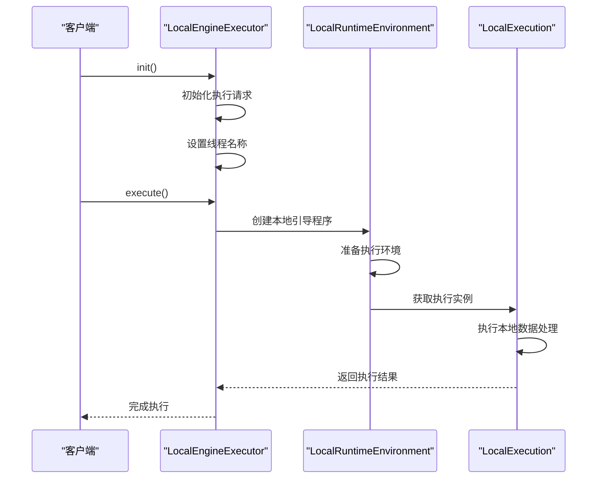
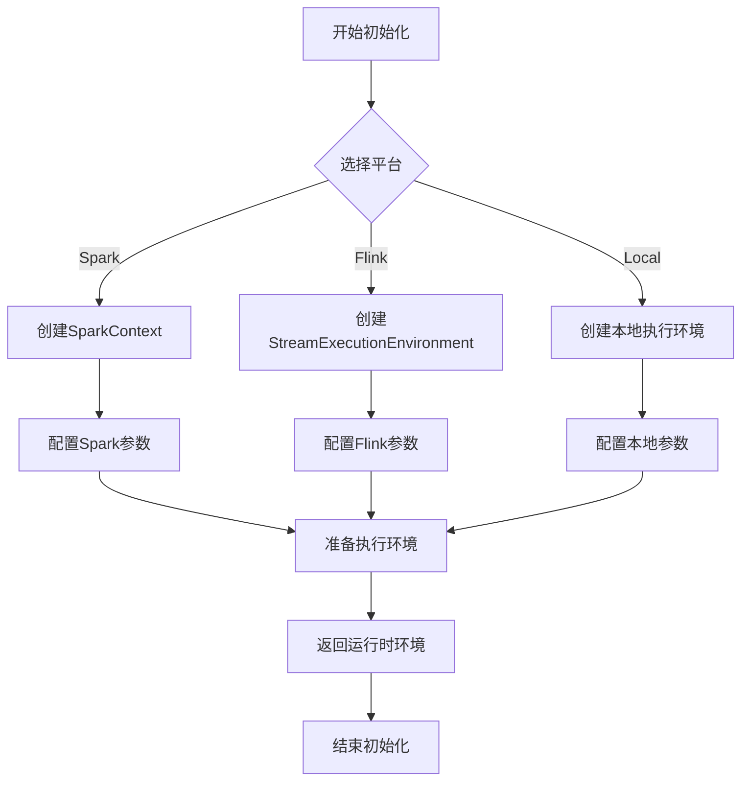
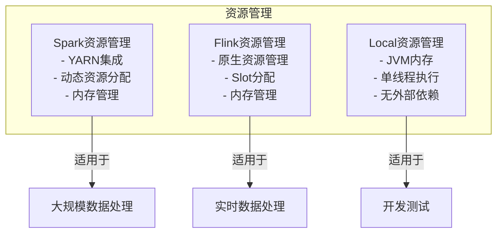
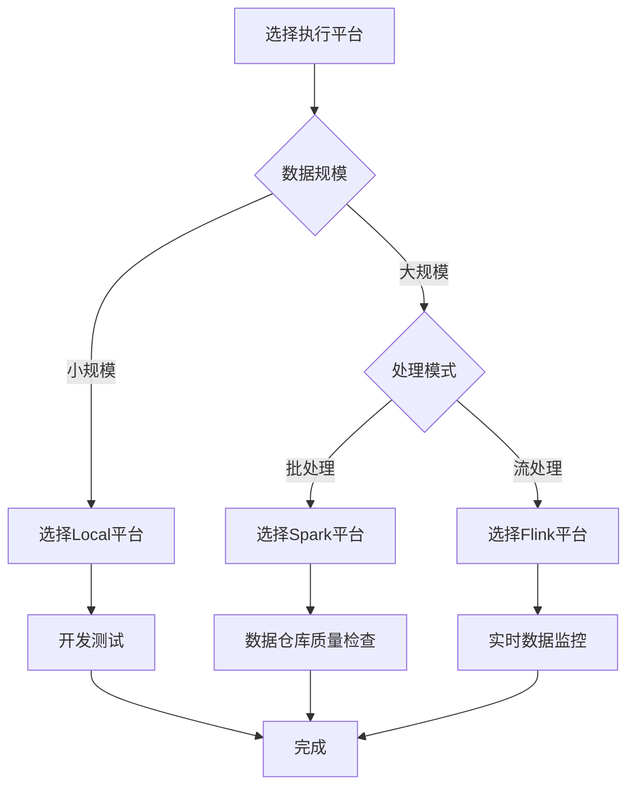

# 执行平台

<cite>
**本文档中引用的文件**  
- [EngineExecutor.java](file://datavines-engine/datavines-engine-api/src/main/java/io/datavines/engine/api/engine/EngineExecutor.java)
- [RuntimeEnvironment.java](file://datavines-engine/datavines-engine-api/src/main/java/io/datavines/engine/api/env/RuntimeEnvironment.java)
- [Execution.java](file://datavines-engine/datavines-engine-api/src/main/java/io/datavines/engine/api/env/Execution.java)
- [LocalEngineExecutor.java](file://datavines-engine/datavines-engine-plugins/datavines-engine-local/datavines-engine-local-executor/src/main/java/io/datavines/engine/local/executor/LocalEngineExecutor.java)
- [FlinkEngineExecutor.java](file://datavines-engine/datavines-engine-plugins/datavines-engine-flink/datavines-engine-flink-executor/src/main/java/io/datavines/engine/flink/executor/FlinkEngineExecutor.java)
- [FlinkRuntimeEnvironment.java](file://datavines-engine/datavines-engine-plugins/datavines-engine-flink/datavines-engine-flink-api/src/main/java/io/datavines/engine/flink/api/FlinkRuntimeEnvironment.java)
- [SparkEngineExecutor.java](file://datavines-engine/datavines-engine-plugins/datavines-engine-spark/datavines-engine-spark-executor/src/main/java/io/datavines/engine/spark/executor/SparkEngineExecutor.java)
- [FlinkArgsUtils.java](file://datavines-engine/datavines-engine-plugins/datavines-engine-flink/datavines-engine-flink-executor/src/main/java/io/datavines/engine/flink/executor/parameter/FlinkArgsUtils.java)
- [io.datavines.engine.api.engine.EngineExecutor](file://datavines-engine/datavines-engine-plugins/datavines-engine-flink/datavines-engine-flink-executor/src/main/resources/META-INF/plugins/io.datavines.engine.api.engine.EngineExecutor)
- [io.datavines.engine.api.env.RuntimeEnvironment](file://datavines-engine/datavines-engine-plugins/datavines-engine-flink/datavines-engine-flink-api/src/main/resources/META-INF/plugins/io.datavines.engine.api.env.RuntimeEnvironment)
</cite>

## 目录
1. [简介](#简介)
2. [执行平台架构](#执行平台架构)
3. [核心组件分析](#核心组件分析)
4. [平台技术对比](#平台技术对比)
5. [平台选择与配置](#平台选择与配置)

## 简介
DataVines支持三种执行平台：Spark、Flink和Local，每种平台针对不同的数据处理场景进行了优化。本文档详细说明各平台的技术架构、适用场景和性能特点，帮助用户根据业务需求选择合适的执行平台。

## 执行平台架构



**图源**
- [EngineExecutor.java](file://datavines-engine/datavines-engine-api/src/main/java/io/datavines/engine/api/engine/EngineExecutor.java)
- [RuntimeEnvironment.java](file://datavines-engine/datavines-engine-api/src/main/java/io/datavines/engine/api/env/RuntimeEnvironment.java)
- [Execution.java](file://datavines-engine/datavines-engine-api/src/main/java/io/datavines/engine/api/env/Execution.java)

## 核心组件分析

### 执行引擎接口

DataVines的执行平台基于统一的接口设计，通过SPI机制实现插件化扩展。核心接口包括`EngineExecutor`、`RuntimeEnvironment`和`Execution`。



**图源**
- [EngineExecutor.java](file://datavines-engine/datavines-engine-api/src/main/java/io/datavines/engine/api/engine/EngineExecutor.java)
- [RuntimeEnvironment.java](file://datavines-engine/datavines-engine-api/src/main/java/io/datavines/engine/api/env/RuntimeEnvironment.java)
- [Execution.java](file://datavines-engine/datavines-engine-api/src/main/java/io/datavines/engine/api/env/Execution.java)

**本节源码**
- [EngineExecutor.java](file://datavines-engine/datavines-engine-api/src/main/java/io/datavines/engine/api/engine/EngineExecutor.java#L27-L42)
- [RuntimeEnvironment.java](file://datavines-engine/datavines-engine-api/src/main/java/io/datavines/engine/api/env/RuntimeEnvironment.java#L23-L28)
- [Execution.java](file://datavines-engine/datavines-engine-api/src/main/java/io/datavines/engine/api/env/Execution.java#L23-L30)

### Spark平台

Spark平台提供强大的分布式计算能力，适用于大规模数据处理场景。通过`SparkEngineExecutor`实现`EngineExecutor`接口，利用Spark的批处理能力执行数据质量检查任务。



**图源**
- [SparkEngineExecutor.java](file://datavines-engine/datavines-engine-plugins/datavines-engine-spark/datavines-engine-spark-executor/src/main/java/io/datavines/engine/spark/executor/SparkEngineExecutor.java)
- [SparkRuntimeEnvironment.java](file://datavines-engine/datavines-engine-plugins/datavines-engine-spark/datavines-engine-spark-api/src/main/java/io/datavines/engine/spark/api/SparkRuntimeEnvironment.java)
- [SparkBatchExecution.java](file://datavines-engine/datavines-engine-plugins/datavines-engine-spark/datavines-engine-spark-api/src/main/java/io/datavines/engine/spark/api/batch/SparkBatchExecution.java)

### Flink平台

Flink平台具有流批一体的特性，适用于实时数据质量检查。通过`FlinkEngineExecutor`实现`EngineExecutor`接口，支持流式和批处理模式。



**图源**
- [FlinkEngineExecutor.java](file://datavines-engine/datavines-engine-plugins/datavines-engine-flink/datavines-engine-flink-executor/src/main/java/io/datavines/engine/flink/executor/FlinkEngineExecutor.java)
- [FlinkRuntimeEnvironment.java](file://datavines-engine/datavines-engine-plugins/datavines-engine-flink/datavines-engine-flink-api/src/main/java/io/datavines/engine/flink/api/FlinkRuntimeEnvironment.java#L64-L78)
- [FlinkStreamExecution.java](file://datavines-engine/datavines-engine-plugins/datavines-engine-flink/datavines-engine-flink-api/src/main/java/io/datavines/engine/flink/api/stream/FlinkStreamExecution.java)

### Local平台

Local平台具有轻量级特性，适用于开发测试和小规模数据验证。通过`LocalEngineExecutor`实现`EngineExecutor`接口，在本地JVM中执行任务。



**图源**
- [LocalEngineExecutor.java](file://datavines-engine/datavines-engine-plugins/datavines-engine-local/datavines-engine-local-executor/src/main/java/io/datavines/engine/local/executor/LocalEngineExecutor.java#L27-L57)
- [LocalRuntimeEnvironment.java](file://datavines-engine/datavines-engine-plugins/datavines-engine-local/datavines-engine-local-api/src/main/java/io/datavines/engine/local/api/LocalRuntimeEnvironment.java)
- [LocalExecution.java](file://datavines-engine/datavines-engine-plugins/datavines-engine-local/datavines-engine-local-api/src/main/java/io/datavines/engine/local/api/LocalExecution.java)

## 平台技术对比

```mermaid
erDiagram
PLATFORM ||--o{ PERFORMANCE : has
PLATFORM {
string name PK
string description
string use_case
}
PERFORMANCE }|--|| PLATFORM : belongs_to
PERFORMANCE {
string platform PK
float throughput
float latency
float resource_utilization
string scalability
}
PLATFORM ||--o{ CONFIGURATION : has
CONFIGURATION }|--|| PLATFORM : belongs_to
CONFIGURATION {
string platform PK
string initialization_process
string runtime_config
string resource_management
}
PLATFORM {
"Spark" "分布式计算，大规模数据处理"
"Flink" "流批一体，实时数据质量检查"
"Local" "轻量级，开发测试"
}
PERFORMANCE {
"Spark" 10000 100 0.8 "高"
"Flink" 5000 10 0.6 "中"
"Local" 100 1 0.1 "低"
}
CONFIGURATION {
"Spark" "初始化Spark上下文" "配置Spark参数" "YARN资源管理"
"Flink" "初始化Flink环境" "配置流/批模式" "Flink原生资源管理"
"Local" "本地JVM初始化" "简单配置" "JVM内存管理"
}
```

**图源**
- [FlinkArgsUtils.java](file://datavines-engine/datavines-engine-plugins/datavines-engine-flink/datavines-engine-flink-executor/src/main/java/io/datavines/engine/flink/executor/parameter/FlinkArgsUtils.java#L24-L72)
- [FlinkRuntimeEnvironment.java](file://datavines-engine/datavines-engine-plugins/datavines-engine-flink/datavines-engine-flink-api/src/main/java/io/datavines/engine/flink/api/FlinkRuntimeEnvironment.java)
- [LocalEngineExecutor.java](file://datavines-engine/datavines-engine-plugins/datavines-engine-local/datavines-engine-local-executor/src/main/java/io/datavines/engine/local/executor/LocalEngineExecutor.java)

## 平台选择与配置

### 平台初始化过程

各平台的初始化过程遵循统一的接口规范，但具体实现有所不同：



**图源**
- [FlinkRuntimeEnvironment.java](file://datavines-engine/datavines-engine-plugins/datavines-engine-flink/datavines-engine-flink-api/src/main/java/io/datavines/engine/flink/api/FlinkRuntimeEnvironment.java#L70-L78)
- [LocalEngineExecutor.java](file://datavines-engine/datavines-engine-plugins/datavines-engine-local/datavines-engine-local-executor/src/main/java/io/datavines/engine/local/executor/LocalEngineExecutor.java#L31-L38)

### 运行时环境配置

运行时环境配置是各平台的关键差异点，决定了平台的性能和资源利用方式。

```mermaid
classDiagram
class SparkRuntimeEnvironment {
-SparkConf conf
-JavaSparkContext context
+prepare() void
+getExecution() Execution
}
class FlinkRuntimeEnvironment {
-StreamExecutionEnvironment env
-StreamTableEnvironment tableEnv
+prepare() void
+getExecution() Execution
}
class LocalRuntimeEnvironment {
+prepare() void
+getExecution() Execution
}
SparkRuntimeEnvironment -->|使用| SparkConf
SparkRuntimeEnvironment -->|使用| JavaSparkContext
FlinkRuntimeEnvironment -->|使用| StreamExecutionEnvironment
FlinkRuntimeEnvironment -->|使用| StreamTableEnvironment
```

**图源**
- [FlinkRuntimeEnvironment.java](file://datavines-engine/datavines-engine-plugins/datavines-engine-flink/datavines-engine-flink-api/src/main/java/io/datavines/engine/flink/api/FlinkRuntimeEnvironment.java)
- [SparkRuntimeEnvironment.java](file://datavines-engine/datavines-engine-plugins/datavines-engine-spark/datavines-engine-spark-api/src/main/java/io/datavines/engine/spark/api/SparkRuntimeEnvironment.java)
- [LocalRuntimeEnvironment.java](file://datavines-engine/datavines-engine-plugins/datavines-engine-local/datavines-engine-local-api/src/main/java/io/datavines/engine/local/api/LocalRuntimeEnvironment.java)

### 资源管理机制

各平台的资源管理机制反映了其设计哲学和适用场景：



**图源**
- [FlinkArgsUtils.java](file://datavines-engine/datavines-engine-plugins/datavines-engine-flink/datavines-engine-flink-executor/src/main/java/io/datavines/engine/flink/executor/parameter/FlinkArgsUtils.java)
- [FlinkRuntimeEnvironment.java](file://datavines-engine/datavines-engine-plugins/datavines-engine-flink/datavines-engine-flink-api/src/main/java/io/datavines/engine/flink/api/FlinkRuntimeEnvironment.java)
- [LocalEngineExecutor.java](file://datavines-engine/datavines-engine-plugins/datavines-engine-local/datavines-engine-local-executor/src/main/java/io/datavines/engine/local/executor/LocalEngineExecutor.java)

### 平台选择指南

根据业务需求选择合适的执行平台是确保数据质量检查效率和成本效益的关键：



**本节源码**
- [FlinkArgsUtils.java](file://datavines-engine/datavines-engine-plugins/datavines-engine-flink/datavines-engine-flink-executor/src/main/java/io/datavines/engine/flink/executor/parameter/FlinkArgsUtils.java)
- [FlinkRuntimeEnvironment.java](file://datavines-engine/datavines-engine-plugins/datavines-engine-flink/datavines-engine-flink-api/src/main/java/io/datavines/engine/flink/api/FlinkRuntimeEnvironment.java)
- [LocalEngineExecutor.java](file://datavines-engine/datavines-engine-plugins/datavines-engine-local/datavines-engine-local-executor/src/main/java/io/datavines/engine/local/executor/LocalEngineExecutor.java)
- [SparkEngineExecutor.java](file://datavines-engine/datavines-engine-plugins/datavines-engine-spark/datavines-engine-spark-executor/src/main/java/io/datavines/engine/spark/executor/SparkEngineExecutor.java)