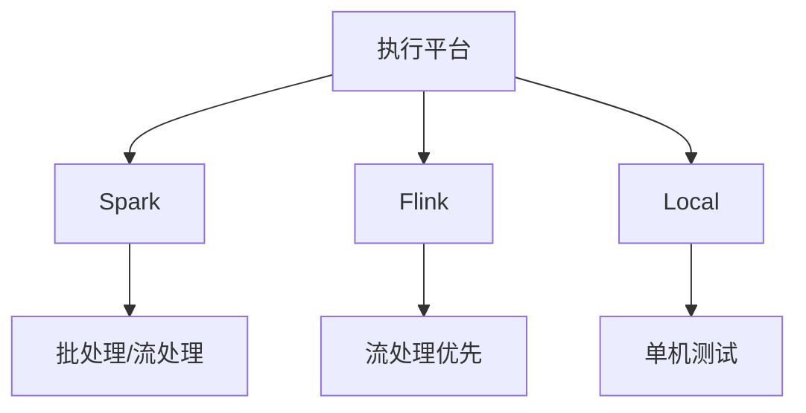
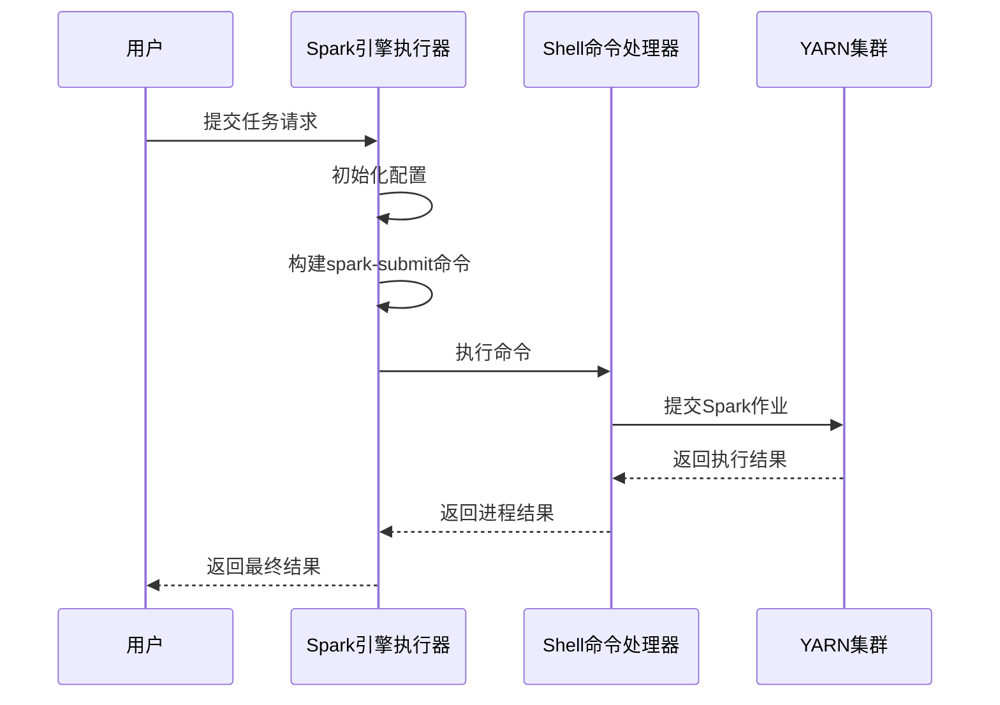
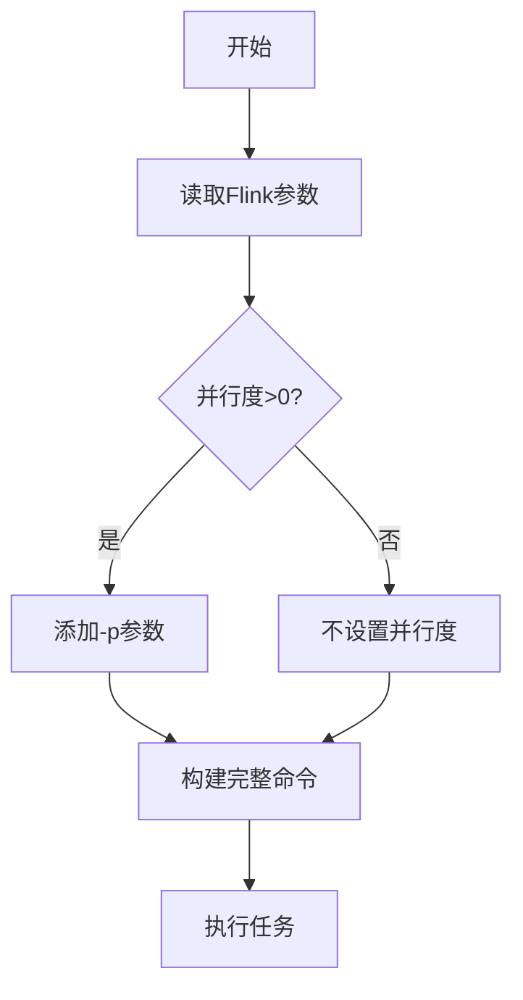
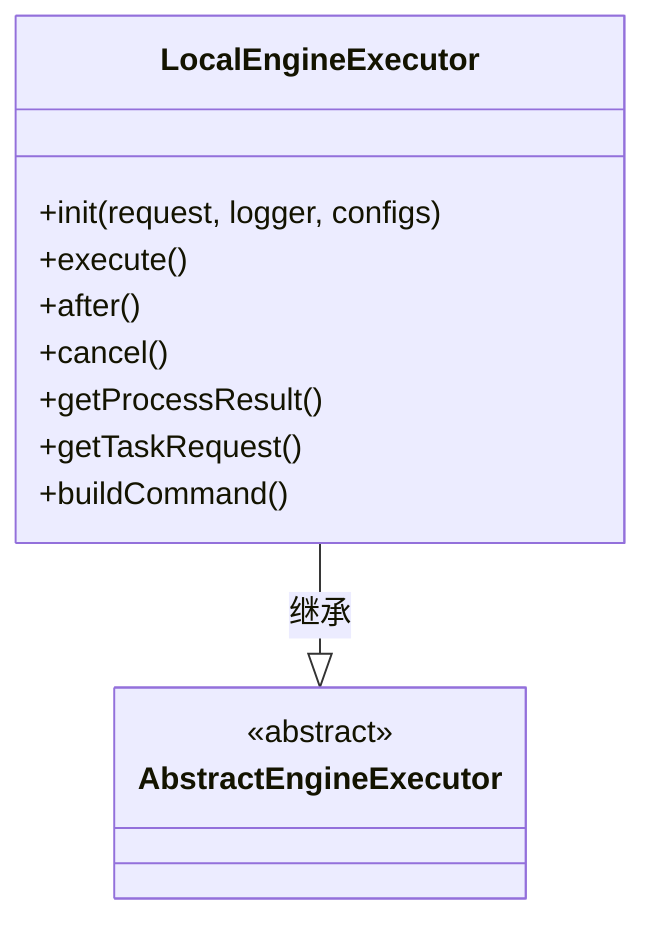
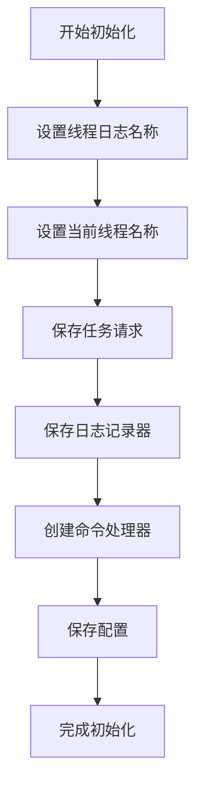
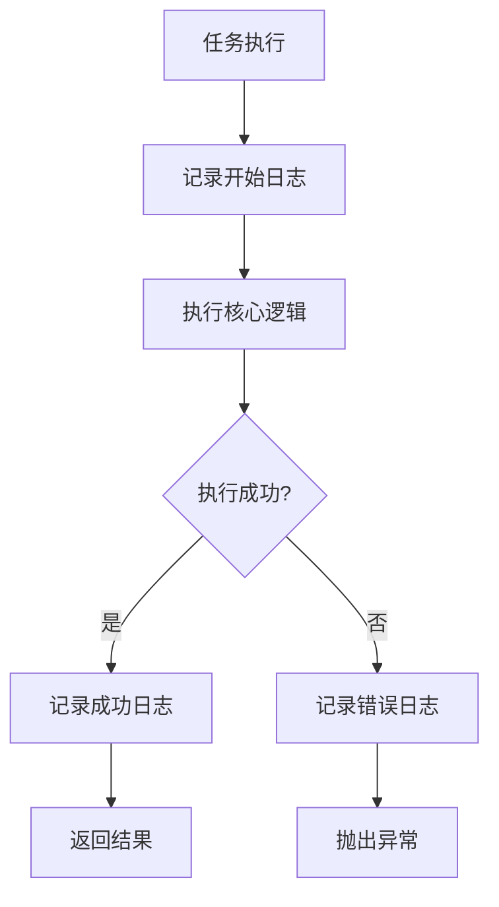
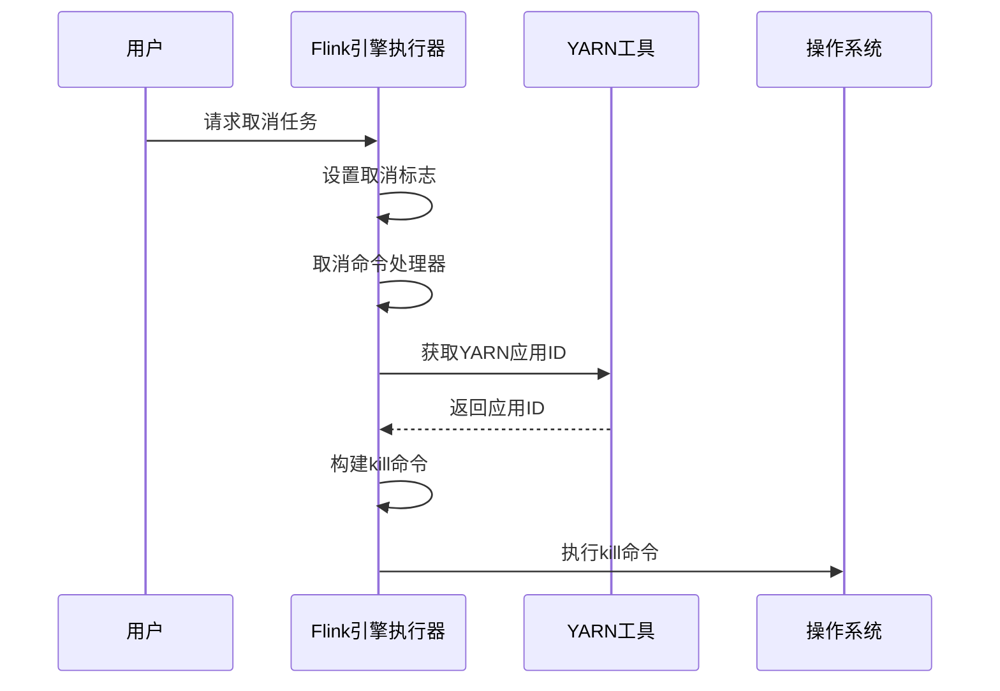

# 执行配置

<cite>
**本文档中引用的文件**  
- [SparkEngineParameter.java](file://datavines-common/src/main/java/io/datavines/common/entity/SparkEngineParameter.java)
- [FlinkArgsUtils.java](file://datavines-engine-plugins/datavines-engine-flink/datavines-engine-flink-executor/src/main/java/io/datavines/engine/flink/executor/parameter/FlinkArgsUtils.java)
- [SparkEngineExecutor.java](file://datavines-engine-plugins/datavines-engine-spark/datavines-engine-spark-executor/src/main/java/io/datavines/engine/spark/executor/SparkEngineExecutor.java)
- [FlinkEngineExecutor.java](file://datavines-engine-plugins/datavines-engine-flink/datavines-engine-flink-executor/src/main/java/io/datavines/engine/flink/executor/FlinkEngineExecutor.java)
- [LocalEngineExecutor.java](file://datavines-engine-plugins/datavines-engine-local/datavines-engine-local-executor/src/main/java/io/datavines/engine/local/executor/LocalEngineExecutor.java)
- [DataQualityJobParameter.java](file://datavines-common/src/main/java/io/datavines/common/entity/job/DataQualityJobParameter.java)
- [BaseJobParameter.java](file://datavines-common/src/main/java/io/datavines/common/entity/job/BaseJobParameter.java)
- [EngineConstants.java](file://datavines-engine-api/src/main/java/io/datavines/engine/api/EngineConstants.java)
- [AbstractYarnEngineExecutor.java](file://datavines-engine-executor/src/main/java/io/datavines/engine/executor/core/base/AbstractYarnEngineExecutor.java)
- [README.md](file://datavines-engine/README.md)
</cite>

## 目录
1. [引言](#引言)
2. [执行平台概述](#执行平台概述)
3. [Spark执行平台配置](#spark执行平台配置)
4. [Flink执行平台配置](#flink执行平台配置)
5. [Local执行平台配置](#local执行平台配置)
6. [执行环境初始化与运行时上下文管理](#执行环境初始化与运行时上下文管理)
7. [性能优化配置](#性能优化配置)
8. [执行平台选型建议](#执行平台选型建议)
9. [监控与日志配置](#监控与日志配置)
10. [故障转移与高可用性配置](#故障转移与高可用性配置)

## 引言
本文档全面介绍DataVines数据质量检查任务的执行环境配置。详细说明了Spark、Flink和Local三种执行平台的特点、适用场景和配置要求，为用户选择合适的执行平台提供指导。文档涵盖了资源分配、并行度设置、超时策略、重试机制等关键配置参数，并提供了性能优化建议和监控配置方案。

## 执行平台概述
DataVines支持三种主要的执行平台：Spark、Flink和Local。每种平台都有其独特的特点和适用场景，用户可以根据数据量、实时性要求和资源可用性进行选择。

**图源**  
- [README.md](file://datavines-engine/README.md#L3-L14)

## Spark执行平台配置
Spark执行平台适用于大规模数据批处理场景，支持YARN集群部署模式。通过SparkEngineParameter类定义了详细的资源配置参数。

### 资源配置参数
Spark执行平台的资源配置包括驱动程序和执行器的CPU核心数、内存大小以及执行器数量等关键参数。

**执行平台参数说明**
| 参数名称 | 描述 | 默认值 |
|---------|------|-------|
| programType | 程序类型 | 无 |
| deployMode | 部署模式 | 无 |
| driverCores | 驱动程序核心数 | 0 |
| driverMemory | 驱动程序内存 | 无 |
| numExecutors | 执行器数量 | 0 |
| executorCores | 每个执行器的核心数 | 0 |
| executorMemory | 每个执行器的内存 | 无 |
| others | 其他参数 | 无 |

**节源**  
- [SparkEngineParameter.java](file://datavines-common/src/main/java/io/datavines/common/entity/SparkEngineParameter.java#L26-L68)

### 执行流程
Spark引擎通过SparkEngineExecutor实现任务执行，构建spark-submit命令并提交到集群执行。

**图源**  
- [SparkEngineExecutor.java](file://datavines-engine-plugins/datavines-engine-spark/datavines-engine-spark-executor/src/main/java/io/datavines/engine/spark/executor/SparkEngineExecutor.java#L41-L153)

## Flink执行平台配置
Flink执行平台专为流式数据处理设计，支持多种部署模式，包括yarn-session、yarn-per-job和yarn-application。

### 部署模式配置
Flink支持多种部署模式，每种模式对应不同的命令行参数和执行方式。

**Flink部署模式**
| 模式 | 命令 | 特点 |
|------|------|------|
| yarn-session | run -t yarn-session | 会话模式，资源共享 |
| yarn-per-job | run -t yarn-per-job --detached | 每作业模式，资源隔离 |
| yarn-application | run-application -t yarn-application | 应用模式，完全独立 |
| local | run | 本地模式，单机执行 |

**节源**  
- [FlinkArgsUtils.java](file://datavines-engine-plugins/datavines-engine-flink/datavines-engine-flink-executor/src/main/java/io/datavines/engine/flink/executor/parameter/FlinkArgsUtils.java#L26-L30)

### 并行度配置
Flink执行平台支持通过-p参数设置任务并行度，优化资源利用率和处理性能。

**图源**  
- [FlinkArgsUtils.java](file://datavines-engine-plugins/datavines-engine-flink/datavines-engine-flink-executor/src/main/java/io/datavines/engine/flink/executor/parameter/FlinkArgsUtils.java#L67-L71)

## Local执行平台配置
Local执行平台适用于开发测试和小规模数据验证场景，直接在本地JVM中执行任务。

### 本地执行特点
Local执行平台具有启动快速、配置简单的特点，适合调试和验证数据质量规则。

**图源**  
- [LocalEngineExecutor.java](file://datavines-engine-plugins/datavines-engine-local/datavines-engine-local-executor/src/main/java/io/datavines/engine/local/executor/LocalEngineExecutor.java#L27-L78)

### 执行流程
Local引擎直接调用LocalDataVinesBootstrap执行任务，无需外部集群支持。

**节源**  
- [LocalEngineExecutor.java](file://datavines-engine-plugins/datavines-engine-local/datavines-engine-local-executor/src/main/java/io/datavines/engine/local/executor/LocalEngineExecutor.java#L40-L47)

## 执行环境初始化与运行时上下文管理
执行环境的初始化过程包括配置加载、日志设置和执行器初始化等关键步骤。

### 初始化流程
每种执行平台在执行任务前都需要进行初始化，设置线程名称、日志记录器和相关配置。

**节源**  
- [SparkEngineExecutor.java](file://datavines-engine-plugins/datavines-engine-spark/datavines-engine-spark-executor/src/main/java/io/datavines/engine/spark/executor/SparkEngineExecutor.java#L51-L61)
- [FlinkEngineExecutor.java](file://datavines-engine-plugins/datavines-engine-flink/datavines-engine-flink-executor/src/main/java/io/datavines/engine/flink/executor/FlinkEngineExecutor.java#L55-L68)
- [LocalEngineExecutor.java](file://datavines-engine-plugins/datavines-engine-local/datavines-engine-local-executor/src/main/java/io/datavines/engine/local/executor/LocalEngineExecutor.java#L32-L38)

## 性能优化配置
通过合理的配置可以显著提升数据质量检查任务的执行性能。

### 数据分片策略
根据数据源的特性配置合适的分片策略，提高并行处理能力。

### 缓存配置
合理配置内存缓存，减少重复计算和I/O操作。

### 序列化方式
选择高效的序列化方式，减少网络传输和内存占用。

**节源**  
- [SparkEngineExecutor.java](file://datavines-engine-plugins/datavines-engine-spark/datavines-engine-spark-executor/src/main/java/io/datavines/engine/spark/executor/SparkEngineExecutor.java#L126-L128)
- [FlinkEngineExecutor.java](file://datavines-engine-plugins/datavines-engine-flink/datavines-engine-flink-executor/src/main/java/io/datavines/engine/flink/executor/FlinkEngineExecutor.java#L109-L111)

## 执行平台选型建议
根据不同的业务场景和需求选择合适的执行平台。

### 选择因素
| 因素 | Spark | Flink | Local |
|------|-------|-------|-------|
| 数据量 | 大规模 | 中到大规模 | 小规模 |
| 实时性 | 批处理 | 流处理 | 即时 |
| 资源要求 | 高 | 中高 | 低 |
| 复杂度 | 中 | 高 | 低 |

### 适用场景
- **Spark**: 适合大规模批处理任务，数据量大且对实时性要求不高的场景
- **Flink**: 适合流式数据处理，需要低延迟和高吞吐量的场景
- **Local**: 适合开发测试、规则验证和小规模数据检查

## 监控与日志配置
完善的监控和日志配置有助于及时发现和解决问题。

### 日志记录
所有执行平台都集成了统一的日志记录机制，便于问题排查和性能分析。

**节源**  
- [SparkEngineExecutor.java](file://datavines-engine-plugins/datavines-engine-spark/datavines-engine-spark-executor/src/main/java/io/datavines/engine/spark/executor/SparkEngineExecutor.java#L66-L71)
- [FlinkEngineExecutor.java](file://datavines-engine-plugins/datavines-engine-flink/datavines-engine-flink-executor/src/main/java/io/datavines/engine/flink/executor/FlinkEngineExecutor.java#L74-L81)

## 故障转移与高可用性配置
通过合理的配置实现任务的故障转移和高可用性。

### 重试机制
配置适当的重试次数和间隔，提高任务的容错能力。

### 超时策略
设置合理的超时时间，避免任务长时间占用资源。

### 故障恢复
Flink平台支持通过cancel方法终止任务并清理YARN应用。

**节源**  
- [FlinkEngineExecutor.java](file://datavines-engine-plugins/datavines-engine-flink/datavines-engine-flink-executor/src/main/java/io/datavines/engine/flink/executor/FlinkEngineExecutor.java#L143-L167)