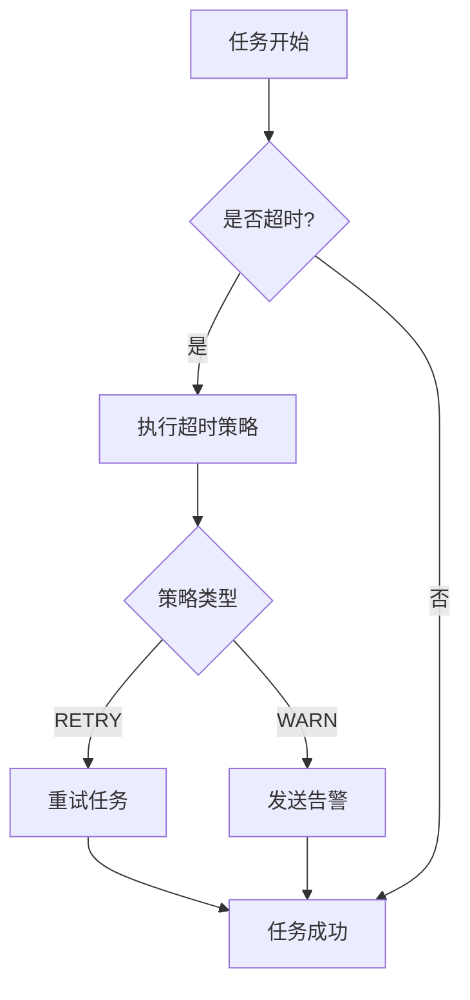
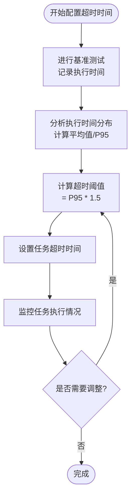
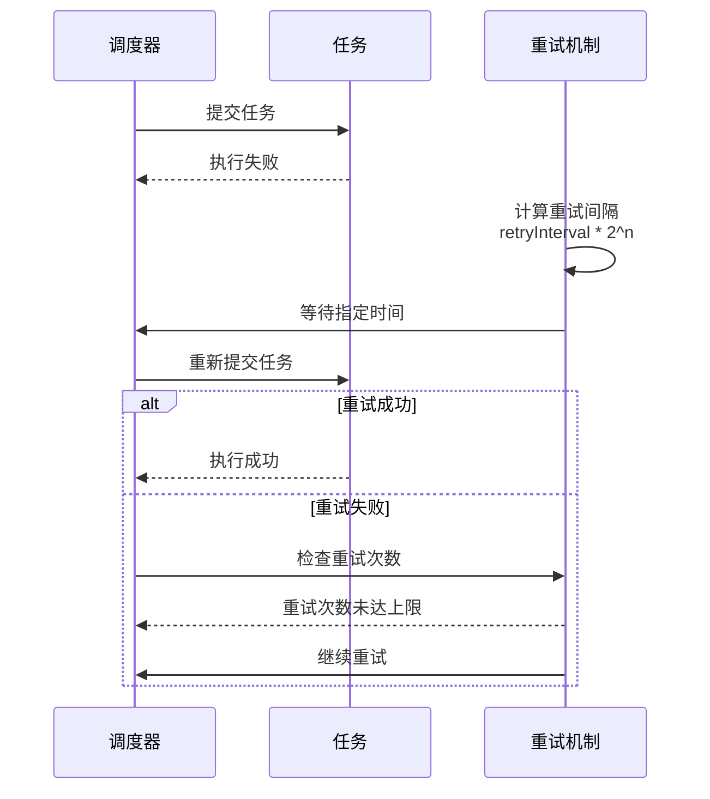
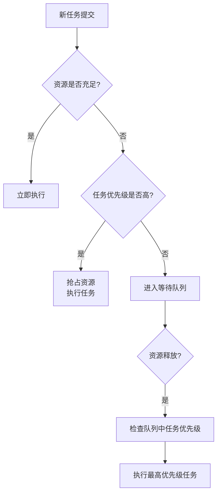
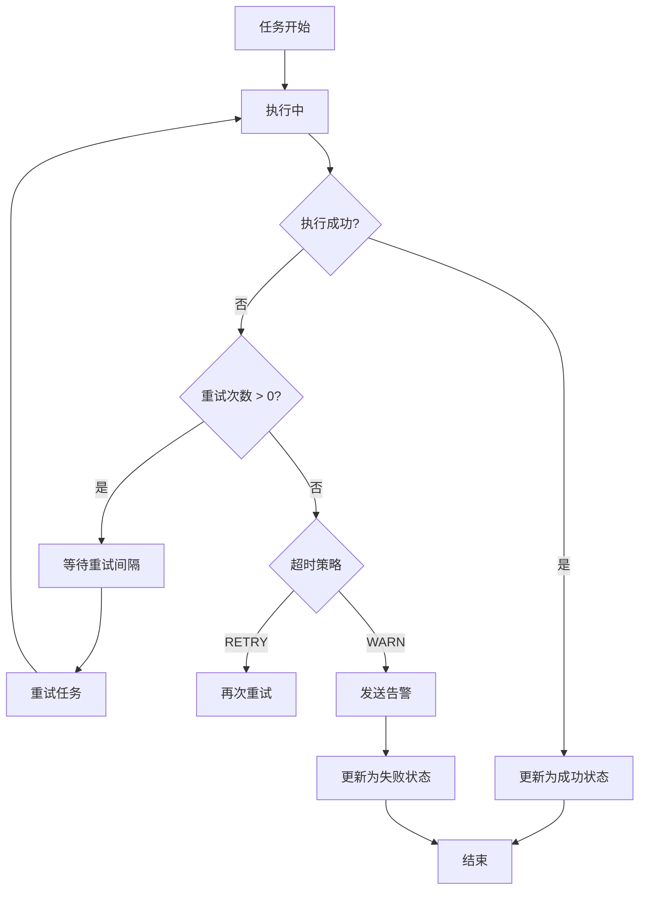

# 调度策略

<cite>
**本文档引用的文件**   
- [TimeoutStrategy.java](file://datavines-common\src\main\java\io\datavines\common\enums\TimeoutStrategy.java)
- [JobExecuteManager.java](file://datavines-server\src\main\java\io\datavines\server\dqc\coordinator\cache\JobExecuteManager.java)
- [JobScheduler.java](file://datavines-server\src\main\java\io\datavines\server\dqc\coordinator\runner\JobScheduler.java)
- [JobRunner.java](file://datavines-runner\src\main\java\io\datavines\runner\JobRunner.java)
- [CommonPropertyUtils.java](file://datavines-common\src\main\java\io\datavines\common\utils\CommonPropertyUtils.java)
- [Prioritized.java](file://datavines-spi\src\main\java\io\datavines\spi\Prioritized.java)
</cite>

## 目录
1. [引言](#引言)
2. [超时策略配置](#超时策略配置)
3. [任务执行超时时间设置](#任务执行超时时间设置)
4. [重试机制配置](#重试机制配置)
5. [任务优先级与资源抢占](#任务优先级与资源抢占)
6. [状态管理与监控配置](#状态管理与监控配置)
7. [业务场景配置示例](#业务场景配置示例)
8. [结论](#结论)

## 引言

数据质量任务调度系统是确保数据可靠性与完整性的核心组件。本系统通过精细化的调度策略，实现了对数据质量检查任务的高效管理与执行。调度策略涵盖了超时处理、重试机制、优先级控制、资源管理等多个方面，能够根据任务的复杂度和数据量进行灵活配置。系统采用分布式架构，支持多种执行引擎（如Spark、Flink等），并提供了完善的监控和告警功能。通过合理的调度配置，可以确保关键业务数据得到及时、准确的检查，同时避免系统资源的过度消耗。

**本文档引用的文件**   
- [TimeoutStrategy.java](file://datavines-common\src\main\java\io\datavines\common\enums\TimeoutStrategy.java)
- [JobExecuteManager.java](file://datavines-server\src\main\java\io\datavines\server\dqc\coordinator\cache\JobExecuteManager.java)

## 超时策略配置

超时策略定义了当数据质量检查任务执行超时时的处理方式。系统提供了两种主要的超时处理策略：重试（RETRY）和告警（WARN）。

- **重试策略 (RETRY)**：当任务执行超时时，系统会自动进行重试。该策略适用于那些可能因临时性问题（如网络波动、资源短暂不足）而失败的任务。通过重试机制，可以提高任务的最终成功率，确保数据检查的完整性。
- **告警策略 (WARN)**：当任务执行超时时，系统不会自动重试，而是记录告警信息并通知相关人员。该策略适用于那些对实时性要求不高，或者重试成本较高的任务。通过告警，运维人员可以及时介入，分析问题原因并采取相应措施。

在系统中，`TimeoutStrategy` 枚举类定义了这两种策略。用户在创建数据质量检查任务时，可以根据业务需求选择合适的超时处理策略。例如，对于关键业务数据的检查，建议采用重试策略以确保检查成功；而对于非关键数据的检查，可以采用告警策略以节省系统资源。



**图源**
- [TimeoutStrategy.java](file://datavines-common\src\main\java\io\datavines\common\enums\TimeoutStrategy.java)

**本节源**
- [TimeoutStrategy.java](file://datavines-common\src\main\java\io\datavines\common\enums\TimeoutStrategy.java)

## 任务执行超时时间设置

任务执行超时时间是调度策略中的关键参数，它定义了任务允许执行的最长时间。合理设置超时阈值对于平衡任务成功率和系统资源利用率至关重要。

### 超时时间配置

系统允许为每个数据质量检查任务单独配置超时时间。超时时间的设置应基于以下因素：
- **任务复杂度**：复杂的SQL查询或涉及大量数据聚合的任务需要更长的执行时间。
- **数据量**：待检查的数据量越大，所需的处理时间越长。
- **执行引擎性能**：不同的执行引擎（如Spark、Flink）和集群配置会影响任务的执行效率。

在 `JobExecutionRequest` 类中，`timeout` 字段用于存储任务的超时时间（单位：秒）。当任务的实际执行时间超过此阈值时，系统将触发超时处理流程。

### 超时阈值的合理配置

配置超时阈值时，建议遵循以下原则：
1. **基准测试**：在生产环境部署前，对典型任务进行多次执行，记录其执行时间的分布情况。
2. **安全边际**：基于基准测试的平均或P95执行时间，增加20%-50%的安全边际作为超时阈值。
3. **动态调整**：根据任务的历史执行情况，定期回顾和调整超时阈值。

例如，一个检查表行数的任务，如果历史平均执行时间为30秒，P95时间为45秒，则可以将超时阈值设置为60-70秒。



**图源**
- [JobExecuteManager.java](file://datavines-server\src\main\java\io\datavines\server\dqc\coordinator\cache\JobExecuteManager.java)

**本节源**
- [JobExecuteManager.java](file://datavines-server\src\main\java\io\datavines\server\dqc\coordinator\cache\JobExecuteManager.java)

## 重试机制配置

重试机制是提高任务执行成功率的重要手段。系统提供了灵活的重试参数配置，包括重试次数、重试间隔和指数退避策略。

### 重试次数

重试次数定义了任务在失败后最多可以重试的次数。在 `JobExecutionRequest` 类中，`retryTimes` 字段用于配置此参数。用户应根据任务的性质和失败原因来设置重试次数：
- **临时性故障**：对于网络抖动、资源争用等临时性问题，可以设置较高的重试次数（如3-5次）。
- **永久性故障**：对于数据源连接失败、SQL语法错误等永久性问题，重试通常无效，应设置较低的重试次数（如1-2次）或直接告警。

### 重试间隔与指数退避

重试间隔定义了两次重试之间的等待时间。为了避免对系统造成过大压力，系统支持指数退避策略。在 `JobScheduler` 类中，`RETRY_BACKOFF` 数组定义了重试的退避时间序列（单位：毫秒）。

指数退避策略的工作原理是：每次重试的等待时间按指数增长。例如，第一次重试等待1秒，第二次等待2秒，第三次等待4秒，以此类推。这种策略可以有效避免在系统故障期间产生大量的重试请求，给系统恢复留出时间。



**图源**
- [JobScheduler.java](file://datavines-server\src\main\java\io\datavines\server\dqc\coordinator\runner\JobScheduler.java)
- [JobRunner.java](file://datavines-runner\src\main\java\io\datavines\runner\JobRunner.java)

**本节源**
- [JobScheduler.java](file://datavines-server\src\main\java\io\datavines\server\dqc\coordinator\runner\JobScheduler.java)
- [JobRunner.java](file://datavines-runner\src\main\java\io\datavines\runner\JobRunner.java)

## 任务优先级与资源抢占

任务优先级机制确保了关键任务能够优先获得系统资源。系统通过优先级设置和资源抢占机制来实现这一目标。

### 优先级设置

系统中的 `Prioritized` 接口定义了优先级机制。所有可优先化的组件都实现了此接口，并通过 `getPriority()` 方法返回其优先级值。优先级值越小，优先级越高。

在数据质量检查任务中，用户可以根据业务重要性为任务设置不同的优先级：
- **高优先级**：用于关键业务数据的检查，如核心交易数据、财务数据等。
- **中优先级**：用于一般业务数据的检查。
- **低优先级**：用于非关键数据或历史数据的检查。

### 资源抢占机制

资源抢占机制确保了高优先级任务能够及时执行。当系统资源紧张时，调度器会优先为高优先级任务分配资源。如果必要，系统甚至可以抢占低优先级任务的资源。

在 `JobScheduler` 类中，通过 `executionOutOfThreshold` 方法实现了资源使用阈值的控制。当某种执行引擎（如Spark）的并发任务数超过预设阈值时，新的任务将被延迟执行，从而避免系统过载。



**图源**
- [Prioritized.java](file://datavines-spi\src\main\java\io\datavines\spi\Prioritized.java)
- [JobScheduler.java](file://datavines-server\src\main\java\io\datavines\server\dqc\coordinator\runner\JobScheduler.java)

**本节源**
- [Prioritized.java](file://datavines-spi\src\main\java\io\datavines\spi\Prioritized.java)
- [JobScheduler.java](file://datavines-server\src\main\java\io\datavines\server\dqc\coordinator\runner\JobScheduler.java)

## 状态管理与监控配置

有效的状态管理和监控是确保调度系统稳定运行的基础。系统提供了全面的任务状态跟踪、日志记录和异常处理机制。

### 任务状态跟踪

系统定义了完整的任务状态机，包括：等待执行、正在执行、执行成功、执行失败、已取消、已终止等状态。`ExecutionStatus` 枚举类管理了这些状态及其转换逻辑。

`JobExecuteManager` 类负责维护任务的执行状态。它使用 `unFinishedJobExecutionMap` 来跟踪所有未完成的任务，并通过 `HashedWheelTimer` 定时器来监控任务的执行时间，及时发现超时任务。

### 日志记录

系统采用分层的日志记录机制：
- **任务日志**：每个任务都有独立的日志文件，记录任务执行的详细过程。
- **操作日志**：记录任务的调度、重试、超时等关键操作。
- **错误日志**：专门收集和记录任务执行中的错误信息。

日志路径由 `JobExecutionLogDiscriminator` 类动态生成，确保日志文件的组织清晰有序。

### 异常处理

系统的异常处理流程如下：
1. 任务执行失败后，首先检查重试次数。
2. 如果重试次数未耗尽，则按重试策略进行重试。
3. 如果重试次数耗尽，则根据超时策略进行处理（重试或告警）。
4. 最终，将任务状态更新为失败，并触发告警通知。



**图源**
- [JobExecuteManager.java](file://datavines-server\src\main\java\io\datavines\server\dqc\coordinator\cache\JobExecuteManager.java)

**本节源**
- [JobExecuteManager.java](file://datavines-server\src\main\java\io\datavines\server\dqc\coordinator\cache\JobExecuteManager.java)

## 业务场景配置示例

以下是针对不同业务场景的调度策略配置示例：

### 关键业务数据的严格检查

对于关键业务数据（如订单、支付等），应采用严格的检查策略：
- **超时策略**：RETRY，确保检查成功。
- **超时时间**：设置较长的超时时间（如300秒），以应对大数据量的检查。
- **重试机制**：重试次数设置为3次，采用指数退避策略。
- **优先级**：设置为高优先级，确保及时执行。
- **监控**：配置详细的日志记录和实时告警。

```json
{
  "taskName": "订单数据完整性检查",
  "timeoutStrategy": "RETRY",
  "timeout": 300,
  "retryTimes": 3,
  "retryInterval": 10,
  "priority": "HIGH",
  "notification": ["email", "dingtalk"]
}
```

### 非关键数据的宽松检查

对于非关键数据（如日志、埋点等），可以采用宽松的检查策略以节省资源：
- **超时策略**：WARN，避免无限重试消耗资源。
- **超时时间**：设置较短的超时时间（如60秒）。
- **重试机制**：重试次数设置为1次。
- **优先级**：设置为低优先级。
- **监控**：仅记录关键操作日志。

```json
{
  "taskName": "用户行为日志检查",
  "timeoutStrategy": "WARN",
  "timeout": 60,
  "retryTimes": 1,
  "retryInterval": 5,
  "priority": "LOW",
  "notification": ["email"]
}
```

**本节源**
- [JobExecuteManager.java](file://datavines-server\src\main\java\io\datavines\server\dqc\coordinator\cache\JobExecuteManager.java)
- [CommonPropertyUtils.java](file://datavines-common\src\main\java\io\datavines\common\utils\CommonPropertyUtils.java)

## 结论

本文档详细阐述了数据质量任务调度系统的各项策略配置。通过合理的超时策略、重试机制、优先级设置和监控配置，可以构建一个高效、可靠的调度系统。在实际应用中，应根据具体的业务需求和系统环境，灵活调整各项参数，以达到最佳的平衡。未来，系统可以进一步引入动态调度、智能预测等高级功能，以适应更复杂的业务场景。