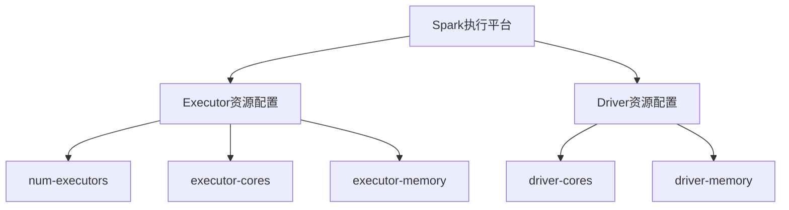
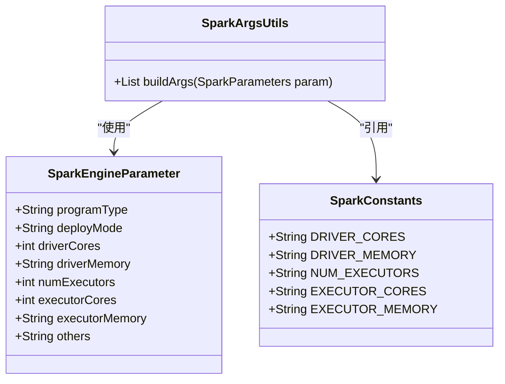
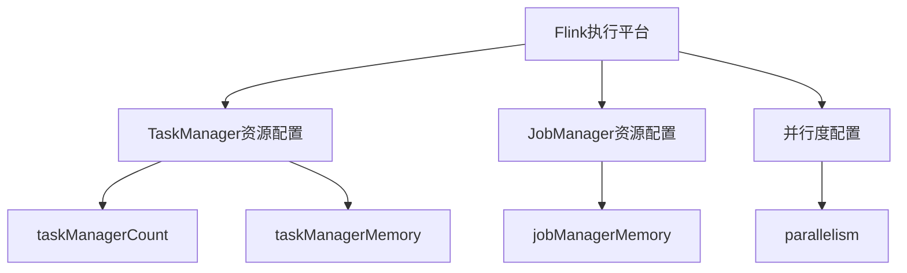
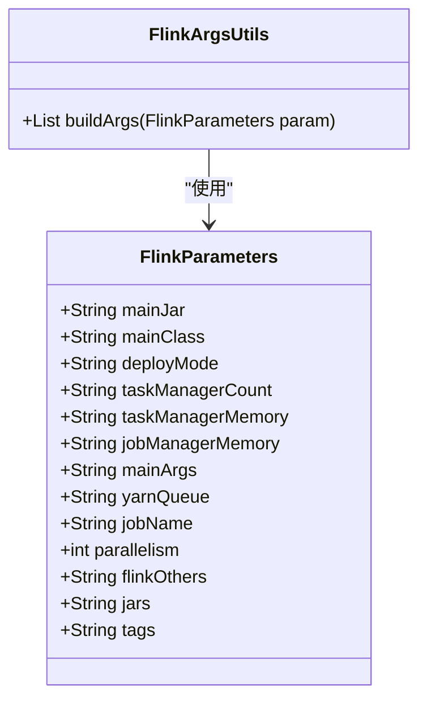
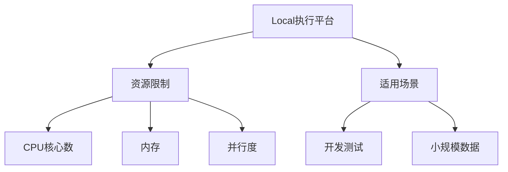
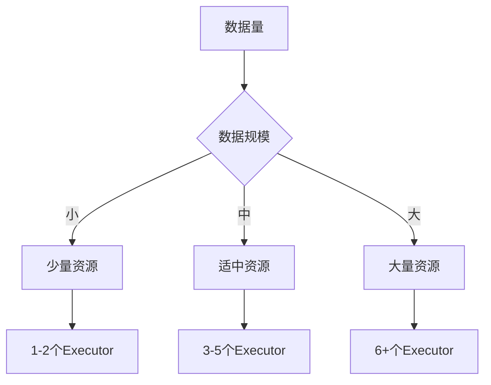
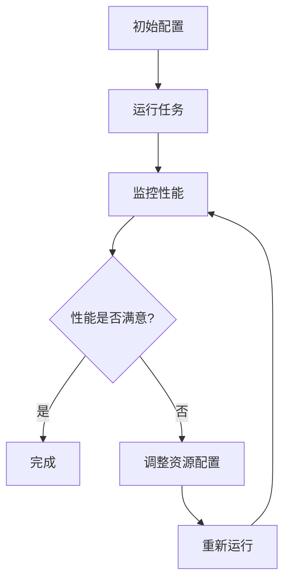

# 资源配置

<cite>
**本文档引用的文件**
- [SparkEngineParameter.java](file://datavines-common/src/main/java/io/datavines/common/entity/SparkEngineParameter.java)
- [FlinkParameters.java](file://datavines-engine-plugins/datavines-engine-flink/datavines-engine-flink-executor/src/main/java/io/datavines/engine/flink/executor/parameter/FlinkParameters.java)
- [SparkArgsUtils.java](file://datavines-engine-plugins/datavines-engine-spark/datavines-engine-spark-executor/src/main/java/io/datavines/engine/spark/executor/parameter/SparkArgsUtils.java)
- [FlinkArgsUtils.java](file://datavines-engine-plugins/datavines-engine-flink/datavines-engine-flink-executor/src/main/java/io/datavines/engine/flink/executor/parameter/FlinkArgsUtils.java)
- [SparkConstants.java](file://datavines-engine-plugins/datavines-engine-spark/datavines-engine-spark-executor/src/main/java/io/datavines/engine/spark/executor/parameter/SparkConstants.java)
- [CatalogEntityInstanceServiceImpl.java](file://datavines-server/src/main/java/io/datavines/server/repository/service/impl/CatalogEntityInstanceServiceImpl.java)
- [EnvConfig.java](file://datavines-common/src/main/java/io/datavines/common/config/EnvConfig.java)
- [FlinkConfiguration.tsx](file://datavines-ui/src/view/Main/Config/FlinkConfiguration.tsx)
- [FlinkConfig/index.tsx](file://datavines-ui/Editor/components/FlinkConfig/index.tsx)
- [ActuatorConfigure/index.tsx](file://datavines-ui/Editor/components/MetricModal/ActuatorConfigure/index.tsx)
</cite>

## 目录
1. [引言](#引言)
2. [核心资源配置参数](#核心资源配置参数)
3. [Spark执行平台资源配置](#spark执行平台资源配置)
4. [Flink执行平台资源配置](#flink执行平台资源配置)
5. [Local执行平台资源配置](#local执行平台资源配置)
6. [资源配置最佳实践](#资源配置最佳实践)
7. [性能影响分析与调优建议](#性能影响分析与调优建议)

## 引言
本文档全面介绍数据质量任务的资源配置参数，详细说明CPU、内存、并行度等核心资源的配置方法和优化策略。针对不同的执行平台（Spark、Flink和Local），解释相应的资源配置方式，并提供资源配置的最佳实践和性能调优建议。

## 核心资源配置参数

数据质量任务的资源配置主要涉及CPU、内存和并行度等核心参数。这些参数在不同执行平台上有不同的配置方式和优化策略。

**核心资源配置参数包括：**
- **CPU核心数**：控制任务执行的并行度
- **内存分配**：为执行器和驱动器分配适当的内存
- **并行度**：控制任务的并发执行程度
- **堆外内存**：用于特定场景的内存配置

这些参数的合理配置对于任务的性能和稳定性至关重要。

**本节来源**
- [SparkEngineParameter.java](file://datavines-common/src/main/java/io/datavines/common/entity/SparkEngineParameter.java#L26-L68)
- [FlinkParameters.java](file://datavines-engine-plugins/datavines-engine-flink/datavines-engine-flink-executor/src/main/java/io/datavines/engine/flink/executor/parameter/FlinkParameters.java#L22-L49)

## Spark执行平台资源配置

在Spark执行平台上，资源配置主要涉及Executor和Driver的配置。这些配置通过`SparkEngineParameter`类进行管理。

### Executor资源配置
Executor是Spark中执行任务的工作进程，其资源配置包括：

- **num-executors**：启动的Executor数量
- **executor-cores**：每个Executor的CPU核心数
- **executor-memory**：每个Executor的内存大小

### Driver资源配置
Driver是Spark应用程序的主控进程，其资源配置包括：

- **driver-cores**：Driver使用的CPU核心数（仅在集群模式下使用）
- **driver-memory**：Driver的内存大小

### 配置实现
Spark资源配置通过`SparkArgsUtils`类实现参数构建，将配置参数转换为Spark命令行参数。

**本节来源**
- [SparkEngineParameter.java](file://datavines-common/src/main/java/io/datavines/common/entity/SparkEngineParameter.java#L26-L68)
- [SparkArgsUtils.java](file://datavines-engine-plugins/datavines-engine-spark/datavines-engine-spark-executor/src/main/java/io/datavines/engine/spark/executor/parameter/SparkArgsUtils.java#L25-L131)
- [SparkConstants.java](file://datavines-engine-plugins/datavines-engine-spark/datavines-engine-spark-executor/src/main/java/io/datavines/engine/spark/executor/parameter/SparkConstants.java#L19-L76)

## Flink执行平台资源配置

在Flink执行平台上，资源配置主要涉及TaskManager和JobManager的配置。这些配置通过`FlinkParameters`类进行管理。

### TaskManager资源配置
TaskManager是Flink中执行任务的工作进程，其资源配置包括：

- **taskManagerCount**：TaskManager的数量
- **taskManagerMemory**：每个TaskManager的内存大小

### JobManager资源配置
JobManager是Flink的主控进程，其资源配置包括：

- **jobManagerMemory**：JobManager的内存大小

### 并行度和Slot配置
Flink的并行度和Slot配置是关键的性能参数：

- **parallelism**：任务的并行度
- **Slot**：TaskManager中的执行槽位

### 配置实现
Flink资源配置通过`FlinkArgsUtils`类实现参数构建，将配置参数转换为Flink命令行参数。

**本节来源**
- [FlinkParameters.java](file://datavines-engine-plugins/datavines-engine-flink/datavines-engine-flink-executor/src/main/java/io/datavines/engine/flink/executor/parameter/FlinkParameters.java#L22-L49)
- [FlinkArgsUtils.java](file://datavines-engine-plugins/datavines-engine-flink/datavines-engine-flink-executor/src/main/java/io/datavines/engine/flink/executor/parameter/FlinkArgsUtils.java#L24-L104)
- [FlinkConfiguration.tsx](file://datavines-ui/src/view/Main/Config/FlinkConfiguration.tsx#L66-L84)
- [FlinkConfig/index.tsx](file://datavines-ui/Editor/components/FlinkConfig/index.tsx#L97-L121)

## Local执行平台资源配置

在Local执行平台上，资源配置相对简单，主要用于开发和测试环境。

### 资源限制
Local执行平台的资源限制包括：

- **CPU核心数**：使用本地机器的CPU核心
- **内存**：使用本地机器的内存
- **并行度**：通常设置为1或根据机器配置调整

### 配置特点
Local执行平台的配置特点：

- 无需复杂的集群配置
- 资源使用直接受限于本地机器
- 适合小规模数据测试和开发

**本节来源**
- [CommonConstants.java](file://datavines-common/src/main/java/io/datavines/common/CommonConstants.java#L290)
- [FlinkParameters.java](file://datavines-engine-plugins/datavines-engine-flink/datavines-engine-flink-executor/src/main/java/io/datavines/engine/flink/executor/parameter/FlinkParameters.java#L28)

## 资源配置最佳实践

### 资源估算方法
根据数据量和复杂度进行资源估算：

- **小规模数据**：少量Executor/TaskManager，较小内存
- **中等规模数据**：适中数量的Executor/TaskManager，适中内存
- **大规模数据**：大量Executor/TaskManager，较大内存

### 避免资源浪费或不足
资源配置的平衡策略：

- **避免资源浪费**：根据实际需求配置资源，避免过度配置
- **避免资源不足**：确保有足够的资源处理数据，避免任务失败

### 配置示例

**本节来源**
- [CatalogEntityInstanceServiceImpl.java](file://datavines-server/src/main/java/io/datavines/server/repository/service/impl/CatalogEntityInstanceServiceImpl.java#L974-L991)
- [EnvConfig.java](file://datavines-common/src/main/java/io/datavines/common/config/EnvConfig.java#L29-L79)

## 性能影响分析与调优建议

### 性能影响因素
资源配置对性能的主要影响：

- **CPU核心数**：影响任务的并行处理能力
- **内存大小**：影响数据处理的缓存能力和避免溢出
- **并行度**：直接影响任务的执行速度

### 调优建议
资源配置的调优策略：

- **监控资源使用**：定期监控CPU和内存使用情况
- **逐步调整**：从小配置开始，逐步增加直到性能稳定
- **平衡配置**：确保CPU、内存和并行度的平衡

### 性能优化流程

**本节来源**
- [OSUtils.java](file://datavines-common/src/main/java/io/datavines/common/utils/OSUtils.java#L429-L434)
- [ActuatorConfigure/index.tsx](file://datavines-ui/Editor/components/MetricModal/ActuatorConfigure/index.tsx#L89-L202)