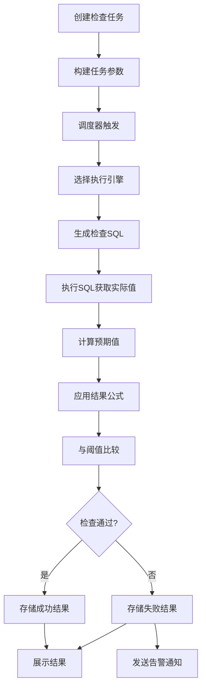

# 数据质量

<cite>
**本文档引用的文件**
- [README.md](file://README.md)
- [MetricType.java](file://datavines-metric/datavines-metric-api/src/main/java/io/datavines/metric/api/MetricType.java)
- [SqlMetric.java](file://datavines-metric/datavines-metric-api/src/main/java/io/datavines/metric/api/SqlMetric.java)
- [ExpectedValue.java](file://datavines-metric/datavines-metric-api/src/main/java/io/datavines/metric/api/ExpectedValue.java)
- [ResultFormula.java](file://datavines-metric/datavines-metric-api/src/main/java/io/datavines/metric/api/ResultFormula.java)
- [datavines-metric-plugins](file://datavines-metric/datavines-metric-plugins)
- [datavines-metric-expected-plugins](file://datavines-metric/datavines-metric-expected-plugins)
- [datavines-metric-result-formula-plugins](file://datavines-metric/datavines-metric-result-formula-plugins)
</cite>

## 目录
1. [引言](#引言)
2. [内置检查规则](#内置检查规则)
3. [质量检查执行流程](#质量检查执行流程)
4. [质量规则配置](#质量规则配置)
5. [检查结果计算与公式](#检查结果计算与公式)
6. [执行平台与调度策略](#执行平台与调度策略)
7. [结果存储、展示与告警](#结果存储展示与告警)
8. [使用示例与最佳实践](#使用示例与最佳实践)
9. [常见问题与优化](#常见问题与优化)

## 引言

DataVines 是一个开源的数据质量服务与可观测性平台，旨在确保数据在集成和处理过程中的准确性。该平台提供全面的数据质量管理能力，支持多种数据质量检查规则，帮助用户构建可靠的数据质量保障体系。其核心功能包括数据目录、数据质量监控、数据概览等，支持插件化扩展，具备高可用性和易部署特性。

**Section sources**
- [README.md](file://README.md#L24-L57)
- [README.zh-CN.md](file://README.zh-CN.md#L26-L58)

## 内置检查规则

DataVines 内置了27种数据质量检查规则，这些规则被组织为4种主要类型，以满足不同场景下的数据验证需求。

### 单表列检查
此类规则针对单个数据表的特定列进行校验，是数据质量检查中最基础和最常用的类型。

- **非空检查** (`column_not_null`): 验证指定列中是否存在空值。
- **唯一性检查** (`column_unique`): 确保指定列中的所有值都是唯一的，无重复。
- **值范围检查** (`column_value_between`): 检查数值型列的值是否在预设的最小值和最大值之间。
- **空值检查** (`column_null`): 统计并验证指定列中空值的数量。
- **枚举值检查** (`column_in_enums`): 验证列的值是否在预定义的枚举列表中。
- **正则匹配检查** (`column_match_regex`): 使用正则表达式验证列的值是否符合特定模式。
- **正则不匹配检查** (`column_match_not_regex`): 验证列的值是否不匹配特定的正则表达式。
- **长度检查** (`column_length`): 验证列值的字符长度。
- **最大/最小值检查** (`column_max`, `column_min`): 检查列中的最大值或最小值。
- **平均值检查** (`column_avg`): 计算并验证列的平均值。
- **总和检查** (`column_sum`): 计算并验证列的总和。
- **标准差/方差检查** (`column_std_dev`, `column_variance`): 计算列值的离散程度。
- **去重计数检查** (`column_distinct`): 统计列中不同值的数量。
- **重复值检查** (`column_duplicate`): 统计并列出列中的重复值。
- **空白值检查** (`column_blank`): 识别并统计空字符串或仅包含空白字符的值。
- **最大/最小长度检查** (`column_max_length`, `column_min_length`): 验证列值的最大或最小字符长度。
- **平均长度检查** (`column_avg_length`): 计算列值的平均字符长度。
- **直方图检查** (`column_histogram`): 对列值进行分桶统计，用于分析数据分布。

### 自定义SQL检查
此类型允许用户编写自定义的SQL查询来定义检查逻辑，提供了极大的灵活性。

- **自定义聚合SQL检查** (`custom_aggregate_sql`): 用户可以编写任意的SELECT聚合查询（如`COUNT(*) WHERE ...`），其返回的单个数值将作为实际值进行后续的阈值判断。

### 跨表准确性检查
此类规则用于验证两个表之间的数据一致性，确保数据在流转过程中没有丢失或损坏。

- **跨表准确性检查** (`multi_table_accuracy`): 通过比较源表和目标表的行数，计算数据的准确率，常用于ETL作业的完整性校验。

### 两表值比较检查
此类规则用于比较两个表中特定字段的值，验证其数值上的差异。

- **两表值比对检查** (`multi_table_value_comparison`): 可以配置比较两个表中相同业务含义字段的聚合值（如SUM、AVG等），并设置允许的差异阈值。

**Section sources**
- [README.md](file://README.md#L46-L52)
- [README.zh-CN.md](file://README.zh-CN.md#L49-L54)
- [MetricType.java](file://datavines-metric/datavines-metric-api/src/main/java/io/datavines/metric/api/MetricType.java)
- [datavines-metric-plugins](file://datavines-metric/datavines-metric-plugins)

## 质量检查执行流程

数据质量检查任务的生命周期包含从创建到结果验证的完整流程，确保了检查的自动化和可追溯性。

1.  **任务创建**: 用户通过Web界面或API创建一个质量检查任务，选择数据源、目标表、检查规则类型和具体的检查项。
2.  **参数构建**: 系统根据用户的选择，结合任务配置（如检查的列、阈值、预期值计算方式等），构建执行所需的参数。这些参数会传递给具体的`SqlMetric`实现。
3.  **执行调度**: 任务被提交到调度系统（如Quartz），根据配置的调度策略（如一次性、每日、每周等）进行调度。调度器负责在预定时间触发任务执行。
4.  **引擎执行**: 根据任务配置的执行引擎（Spark、Flink、Local等），系统调用相应的`EngineExecutor`。执行器会生成并提交具体的执行命令（如Spark-submit）。
5.  **SQL生成与执行**: 在执行器内部，具体的`SqlMetric`插件会根据`getActualValue`方法生成用于计算实际值的SQL语句，并通过`JdbcExecutorClient`或对应的引擎客户端执行该SQL。
6.  **结果获取与计算**: 执行引擎返回SQL查询结果（实际值）。系统根据配置的`ExpectedValue`插件计算预期值（可能通过查询历史数据或使用固定值），然后使用`ResultFormula`插件计算最终结果（如百分比、差异值）。
7.  **结果验证与存储**: 将计算出的结果与用户设定的阈值进行比较，判断检查是否成功。最终的检查结果（包括实际值、预期值、得分、状态等）被持久化存储到系统数据库中。
8.  **告警与展示**: 如果检查失败或达到告警条件，系统会通过配置的告警通道（如邮件）发送通知。用户可以在Web界面上查看历史检查报告、执行日志和错误数据。

**Diagram sources**
- [SqlMetric.java](file://datavines-metric/datavines-metric-api/src/main/java/io/datavines/metric/api/SqlMetric.java#L59)
- [ExpectedValue.java](file://datavines-metric/datavines-metric-api/src/main/java/io/datavines/metric/api/ExpectedValue.java#L48)
- [ResultFormula.java](file://datavines-metric/datavines-metric-api/src/main/java/io/datavines/metric/api/ResultFormula.java#L34)

**Section sources**
- [README.md](file://README.md#L53-L54)
- [README.zh-CN.md](file://README.zh-CN.md#L55-L56)
- [SqlMetric.java](file://datavines-metric/datavines-metric-api/src/main/java/io/datavines/metric/api/SqlMetric.java)
- [datavines-engine](file://datavines-engine)

## 质量规则配置

质量规则的配置是数据质量检查的核心，它定义了检查的具体行为和判断标准。

### 阈值设置
每个检查规则都允许用户设置一个阈值，用于与计算出的结果进行比较。阈值可以是：
- **固定值**: 例如，要求非空检查的通过率必须大于95%。
- **动态值**: 通过与预期值的比较来动态判断，例如，两表比对的差异值必须小于100。

### 预期值计算
预期值是衡量实际值是否合格的基准。DataVines支持多种预期值计算方式，通过`ExpectedValue` SPI插件实现：

- **固定值** (`fix_value`): 预期值为用户直接输入的常量。
- **无预期值** (`none`): 仅使用实际值与固定阈值比较，不涉及预期值计算。
- **历史平均值**:
  - **日平均值** (`daily_avg`): 计算过去每天检查结果的平均值。
  - **周平均值** (`weekly_avg`): 计算过去每周检查结果的平均值。
  - **月平均值** (`monthly_avg`): 计算过去每月检查结果的平均值。
  - **最近7天/30天平均值** (`last7day_avg`, `last30day_avg`): 计算最近7天或30天内检查结果的平均值。
- **表行数** (`table_rows`): 将当前表的总行数作为预期值，常用于与其他表进行比对。
- **目标表行数** (`target_table_rows`): 将另一个目标表的行数作为预期值。

### 结果公式
结果公式定义了如何将实际值和预期值组合成一个有意义的度量结果。通过`ResultFormula` SPI插件实现：

- **百分比** (`percentage`): `实际值 / 预期值 * 100%`，常用于计算准确率、完整率。
- **差异值** (`diff`): `实际值 - 预期值`，用于计算绝对差异。
- **差异百分比** (`diff_percentage`): `(实际值 - 预期值) / 预期值 * 100%`，用于计算相对差异。
- **计数** (`count`): 直接使用实际值作为结果，通常用于空值、重复值等计数场景。

**Section sources**
- [ExpectedValue.java](file://datavines-metric/datavines-metric-api/src/main/java/io/datavines/metric/api/ExpectedValue.java)
- [ResultFormula.java](file://datavines-metric/datavines-metric-api/src/main/java/io/datavines/metric/api/ResultFormula.java)
- [datavines-metric-expected-plugins](file://datavines-metric/datavines-metric-expected-plugins)
- [datavines-metric-result-formula-plugins](file://datavines-metric/datavines-metric-result-formula-plugins)

## 检查结果计算与公式

检查结果的计算是连接实际数据与质量判断的桥梁。其核心是`ResultFormula`接口的`getResult`方法。

1.  **获取实际值**: 通过执行`SqlMetric`的`getActualValue`方法返回的SQL，从数据源中查询得到一个`BigDecimal`类型的数值。
2.  **获取预期值**: 根据配置的`ExpectedValue`类型，系统计算或获取一个`BigDecimal`类型的预期值。
3.  **应用公式**: 将实际值和预期值作为参数，传入`ResultFormula`的`getResult`方法进行计算。
    - 例如，使用`Percentage`公式时，计算过程为 `actualValue.divide(expectedValue, 4, BigDecimal.ROUND_HALF_UP).multiply(new BigDecimal("100"))`。
4.  **结果判断**: 将计算出的结果与用户在任务中设置的阈值进行比较。如果结果满足阈值条件（如 `结果 >= 阈值`），则检查通过；否则，检查失败。

此机制使得DataVines能够灵活地适应各种质量度量场景，从简单的计数到复杂的比率分析。

**Section sources**
- [ResultFormula.java](file://datavines-metric/datavines-metric-api/src/main/java/io/datavines/metric/api/ResultFormula.java#L34)

## 执行平台与调度策略

DataVines支持多种执行平台和灵活的调度策略，以适应不同的生产环境和性能需求。

### 执行平台
- **Spark**: 基于Spark引擎执行，适用于大规模数据集的检查，性能优越。目前主要支持Spark 2.4版本。
- **Local (JDBC)**: 基于JDBC的本地执行引擎，无需依赖外部计算框架，部署简单，适用于小数据量或功能验证场景。
- **Flink**: 支持基于Flink引擎执行，适用于流批一体的数据质量监控场景。
- **Livy**: 通过Livy服务提交Spark作业，提供更灵活的集群交互方式。

### 调度策略
- **定时调度**: 支持Cron表达式，可以配置任务按分钟、小时、天、周、月等周期自动执行。
- **手动触发**: 用户可以通过Web界面或API手动触发单次检查任务。
- **依赖调度**: （未来可能支持）支持任务间的依赖关系，例如，只有当上游数据同步任务完成后，才触发数据质量检查。

**Section sources**
- [README.md](file://README.md#L73)
- [README.zh-CN.md](file://README.zh-CN.md#L75)
- [datavines-engine-plugins](file://datavines-engine/datavines-engine-plugins)

## 结果存储、展示与告警

检查结果的全生命周期管理是保障数据质量闭环的关键。

### 结果存储
检查的最终结果（包括任务ID、检查项、实际值、预期值、计算结果、状态、执行时间等）会被持久化存储在DataVines的系统数据库（如MySQL）中，便于历史追溯和分析。

### 结果展示
- **Web界面**: 用户可以通过DataVines的UI界面查看详细的检查报告，包括历史趋势图、执行日志、以及在检查中发现的错误数据详情。
- **API接口**: 提供RESTful API，方便与其他系统集成，获取检查结果。

### 告警机制
- **SLA告警**: 用户可以为检查任务配置SLA（服务等级协议），当检查失败或结果低于设定的阈值时，系统会自动触发告警。
- **告警通道**: 目前支持邮件告警，未来可能扩展支持钉钉、企业微信等更多通道。
- **通知内容**: 告警通知会包含任务名称、失败原因、实际值、预期值等关键信息，帮助用户快速定位问题。

**Section sources**
- [README.md](file://README.md#L54-L55)
- [README.zh-CN.md](file://README.zh-CN.md#L56)
- [datavines-notification](file://datavines-notification)

## 使用示例与最佳实践

### 使用示例
1.  **核心表非空检查**: 为用户表(`user_info`)的`user_id`列配置`column_not_null`规则，预期值为表总行数，使用`percentage`公式，阈值设为100%，确保主键无空值。
2.  **订单金额范围检查**: 为订单表(`orders`)的`amount`列配置`column_value_between`规则，设置最小值为0，最大值为100000，防止异常数据。
3.  **ETL作业完整性校验**: 为源表`ods_orders`和目标表`dwd_orders`配置`multi_table_accuracy`规则，确保每日ETL后两表行数一致。

### 最佳实践
- **分层检查**: 对核心业务表实施更严格的检查（如100%非空），对非核心表可适当放宽阈值。
- **渐进式监控**: 初期可先监控关键指标，待系统稳定后，再逐步增加检查项。
- **合理设置阈值**: 阈值应基于业务实际情况设定，避免过于严格导致频繁告警，或过于宽松失去监控意义。
- **利用历史数据**: 对于波动性较大的指标，使用“历史平均值”作为预期值比固定值更科学。

**Section sources**
- [README.md](file://README.md#L53-L56)
- [README.zh-CN.md](file://README.zh-CN.md#L55-L57)

## 常见问题与优化

### 常见问题
- **检查性能慢**: 对于大表检查，应优先选择Spark引擎，并优化检查SQL（如添加索引、避免全表扫描）。
- **复杂规则配置**: 对于复杂的业务逻辑，建议使用“自定义SQL检查”来实现。
- **预期值不准确**: 确保用于计算历史平均值的数据源是可靠的，避免因历史数据错误导致预期值偏差。

### 性能优化
- **选择合适的引擎**: 大数据量选择Spark，小数据量选择Local引擎以减少开销。
- **优化SQL**: 在`SqlMetric`的实现中，确保生成的SQL是高效的，利用数据库索引。
- **合理调度**: 避免在业务高峰期执行大规模检查任务。

**Section sources**
- [SqlMetric.java](file://datavines-metric/datavines-metric-api/src/main/java/io/datavines/metric/api/SqlMetric.java)
- [datavines-engine](file://datavines-engine)