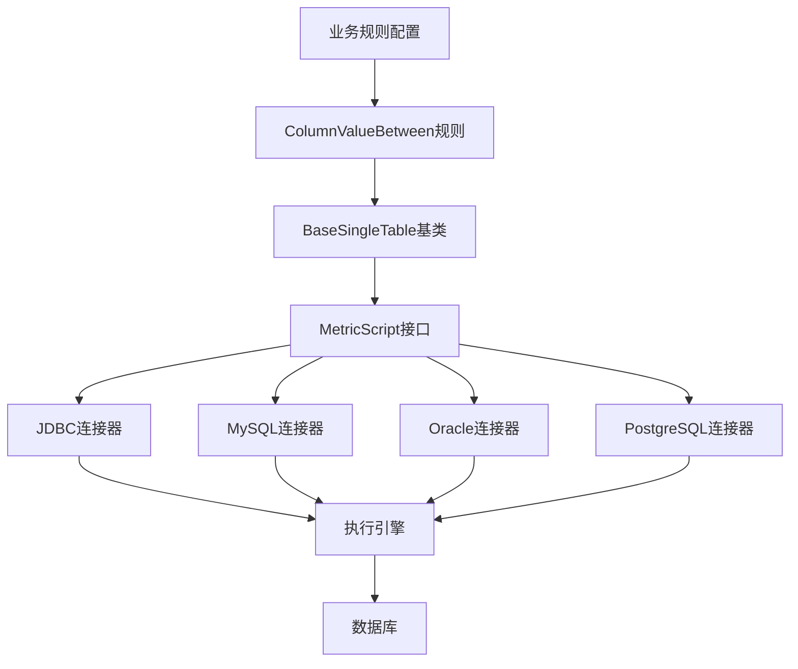
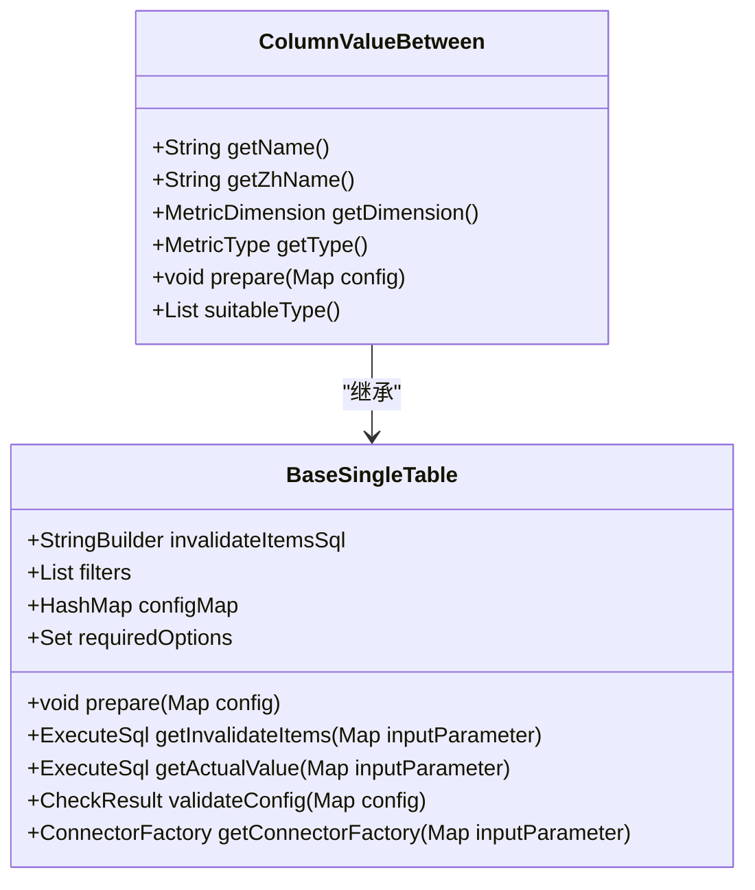
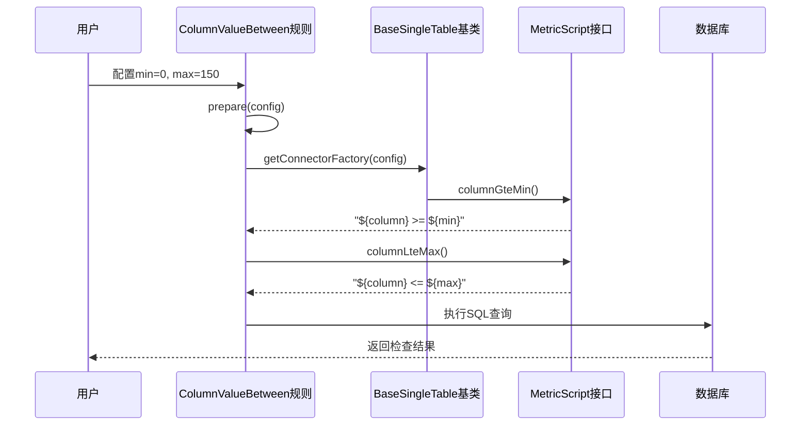
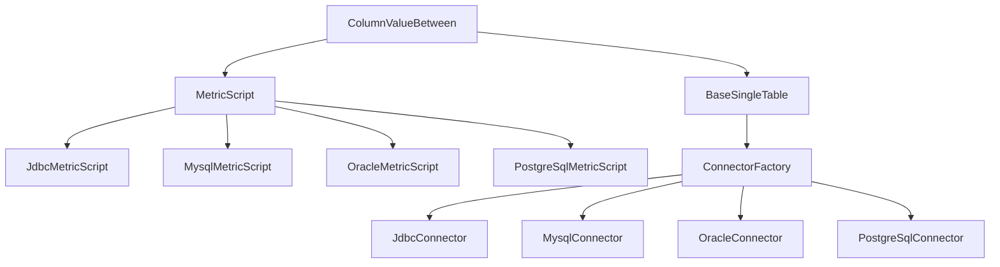

# 业务规则检查

<cite>
**本文档引用的文件**
- [ColumnValueBetween.java](file://datavines-metric\datavines-metric-plugins\datavines-metric-column-value-between\src\main\java\io\datavines\metric\plugin\ColumnValueBetween.java)
- [BaseSingleTable.java](file://datavines-metric\datavines-metric-plugins\datavines-metric-base\src\main\java\io\datavines\metric\plugin\base\BaseSingleTable.java)
- [MetricScript.java](file://datavines-connector\datavines-connector-api\src\main\java\io\datavines\connector\api\MetricScript.java)
- [Validate.java](file://datavines-common\src\main\java\io\datavines\common\param\form\Validate.java)
- [TaskParameter.java](file://datavines-client\datavines-http-client\datavines-http-client-core\src\main\java\io\datavines\http\client\request\TaskParameter.java)
</cite>

## 目录
1. [引言](#引言)
2. [核心组件](#核心组件)
3. [架构概述](#架构概述)
4. [详细组件分析](#详细组件分析)
5. [依赖分析](#依赖分析)
6. [性能考虑](#性能考虑)
7. [故障排除指南](#故障排除指南)
8. [结论](#结论)

## 引言
DataVines是一个数据质量监控平台，提供多种业务规则检查功能。本文档重点介绍单表列业务规则中的值范围检查（ColumnValueBetween）功能，该功能用于验证数值型字段是否在业务定义的合理区间内。通过分析代码实现，我们将详细说明该规则的配置参数、使用场景、性能优化建议以及与执行引擎的集成方式。

## 核心组件
值范围检查规则（ColumnValueBetween）是DataVines中用于验证数据字段值是否在指定范围内的核心组件。该组件允许用户定义最小值和最大值，并可选择是否包含边界值。此规则适用于数值型、字符串型和日期时间型数据，广泛应用于年龄验证、价格校验等业务场景。

**Section sources**
- [ColumnValueBetween.java](file://datavines-metric\datavines-metric-plugins\datavines-metric-column-value-between\src\main\java\io\datavines\metric\plugin\ColumnValueBetween.java#L31-L82)

## 架构概述
DataVines的业务规则检查架构采用插件化设计，将规则定义、SQL生成和执行分离。值范围检查规则作为单表指标插件实现，通过继承BaseSingleTable基类获得基本功能，并利用MetricScript接口生成针对不同数据库的SQL语句。整个架构支持多种数据源，包括MySQL、Oracle、PostgreSQL等，通过SPI机制动态加载相应的连接器和脚本生成器。

**Diagram sources**
- [ColumnValueBetween.java](file://datavines-metric\datavines-metric-plugins\datavines-metric-column-value-between\src\main\java\io\datavines\metric\plugin\ColumnValueBetween.java#L31-L82)
- [BaseSingleTable.java](file://datavines-metric\datavines-metric-plugins\datavines-metric-base\src\main\java\io\datavines\metric\plugin\base\BaseSingleTable.java#L33-L100)
- [MetricScript.java](file://datavines-connector\datavines-connector-api\src\main\java\io\datavines\connector\api\MetricScript.java#L59-L101)

## 详细组件分析

### ColumnValueBetween规则分析
ColumnValueBetween规则实现了对数据字段值范围的验证。该规则通过配置最小值和最大值来定义合法的数据区间，并可选择是否包含边界值。规则支持数值型、字符串型和日期时间型数据，适用于各种业务场景。

#### 配置参数
该规则提供以下配置参数：

| 参数 | 描述 | 必需 |
|------|------|------|
| min | 最小值 | 否 |
| max | 最大值 | 否 |
| table | 表名 | 是 |
| filter | 过滤条件 | 否 |

**Diagram sources**
- [ColumnValueBetween.java](file://datavines-metric\datavines-metric-plugins\datavines-metric-column-value-between\src\main\java\io\datavines\metric\plugin\ColumnValueBetween.java#L31-L82)
- [BaseSingleTable.java](file://datavines-metric\datavines-metric-plugins\datavines-metric-base\src\main\java\io\datavines\metric\plugin\base\BaseSingleTable.java#L33-L100)

### SQL生成机制
值范围检查规则通过MetricScript接口生成SQL语句。当配置了最小值时，系统调用columnGteMin()方法生成大于等于最小值的条件；当配置了最大值时，系统调用columnLteMax()方法生成小于等于最大值的条件。这些条件通过AND操作符连接，形成完整的WHERE子句。

**Diagram sources**
- [ColumnValueBetween.java](file://datavines-metric\datavines-metric-plugins\datavines-metric-column-value-between\src\main\java\io\datavines\metric\plugin\ColumnValueBetween.java#L65-L76)
- [MetricScript.java](file://datavines-connector\datavines-connector-api\src\main\java\io\datavines\connector\api\MetricScript.java#L59-L101)

## 依赖分析
值范围检查规则依赖于多个核心组件，包括BaseSingleTable基类、MetricScript接口和具体的数据库连接器。这些组件通过SPI机制动态加载，确保了系统的可扩展性和灵活性。

**Diagram sources**
- [ColumnValueBetween.java](file://datavines-metric\datavines-metric-plugins\datavines-metric-column-value-between\src\main\java\io\datavines\metric\plugin\ColumnValueBetween.java#L31-L82)
- [BaseSingleTable.java](file://datavines-metric\datavines-metric-plugins\datavines-metric-base\src\main\java\io\datavines\metric\plugin\base\BaseSingleTable.java#L33-L100)
- [MetricScript.java](file://datavines-connector\datavines-connector-api\src\main\java\io\datavines\connector\api\MetricScript.java#L59-L101)

**Section sources**
- [ColumnValueBetween.java](file://datavines-metric\datavines-metric-plugins\datavines-metric-column-value-between\src\main\java\io\datavines\metric\plugin\ColumnValueBetween.java#L31-L82)
- [BaseSingleTable.java](file://datavines-metric\datavines-metric-plugins\datavines-metric-base\src\main\java\io\datavines\metric\plugin\base\BaseSingleTable.java#L33-L100)
- [MetricScript.java](file://datavines-connector\datavines-connector-api\src\main\java\io\datavines\connector\api\MetricScript.java#L59-L101)

## 性能考虑
值范围检查规则的性能主要受以下因素影响：
1. **索引使用**：在被检查的列上创建索引可以显著提高查询性能。
2. **数据量**：大数据量的表需要更长的检查时间，建议在非高峰时段执行检查。
3. **过滤条件**：复杂的过滤条件会增加查询复杂度，影响性能。
4. **并行执行**：多个规则可以并行执行，提高整体检查效率。

为了优化性能，建议：
- 在经常检查的列上创建适当的索引
- 避免在高峰时段执行大规模数据检查
- 使用分区表来减少每次检查的数据量
- 合理配置检查频率，避免过于频繁的检查

**Section sources**
- [ColumnValueBetween.java](file://datavines-metric\datavines-metric-plugins\datavines-metric-column-value-between\src\main\java\io\datavines\metric\plugin\ColumnValueBetween.java#L31-L82)
- [BaseSingleTable.java](file://datavines-metric\datavines-metric-plugins\datavines-metric-base\src\main\java\io\datavines\metric\plugin\base\BaseSingleTable.java#L33-L100)

## 故障排除指南
在使用值范围检查规则时，可能会遇到以下常见问题：

1. **配置错误**：确保最小值小于最大值，且数据类型匹配。
2. **SQL语法错误**：检查生成的SQL语句是否符合目标数据库的语法要求。
3. **性能问题**：如果检查执行时间过长，考虑优化查询或增加索引。
4. **数据类型不匹配**：确保检查的列数据类型与配置的类型一致。

对于问题排查，可以：
- 检查日志文件中的错误信息
- 验证生成的SQL语句是否正确
- 使用数据库的执行计划分析工具优化查询
- 确认连接配置和权限设置

**Section sources**
- [ColumnValueBetween.java](file://datavines-metric\datavines-metric-plugins\datavines-metric-column-value-between\src\main\java\io\datavines\metric\plugin\ColumnValueBetween.java#L31-L82)
- [BaseSingleTable.java](file://datavines-metric\datavines-metric-plugins\datavines-metric-base\src\main\java\io\datavines\metric\plugin\base\BaseSingleTable.java#L33-L100)
- [Validate.java](file://datavines-common\src\main\java\io\datavines\common\param\form\Validate.java#L41-L136)

## 结论
值范围检查规则（ColumnValueBetween）是DataVines中一个重要的业务规则检查功能，能够有效验证数据字段值是否在合理的业务范围内。通过灵活的配置参数和可扩展的架构设计，该规则适用于各种业务场景，如年龄验证、价格校验等。结合适当的性能优化措施，可以确保数据质量检查的高效性和准确性。