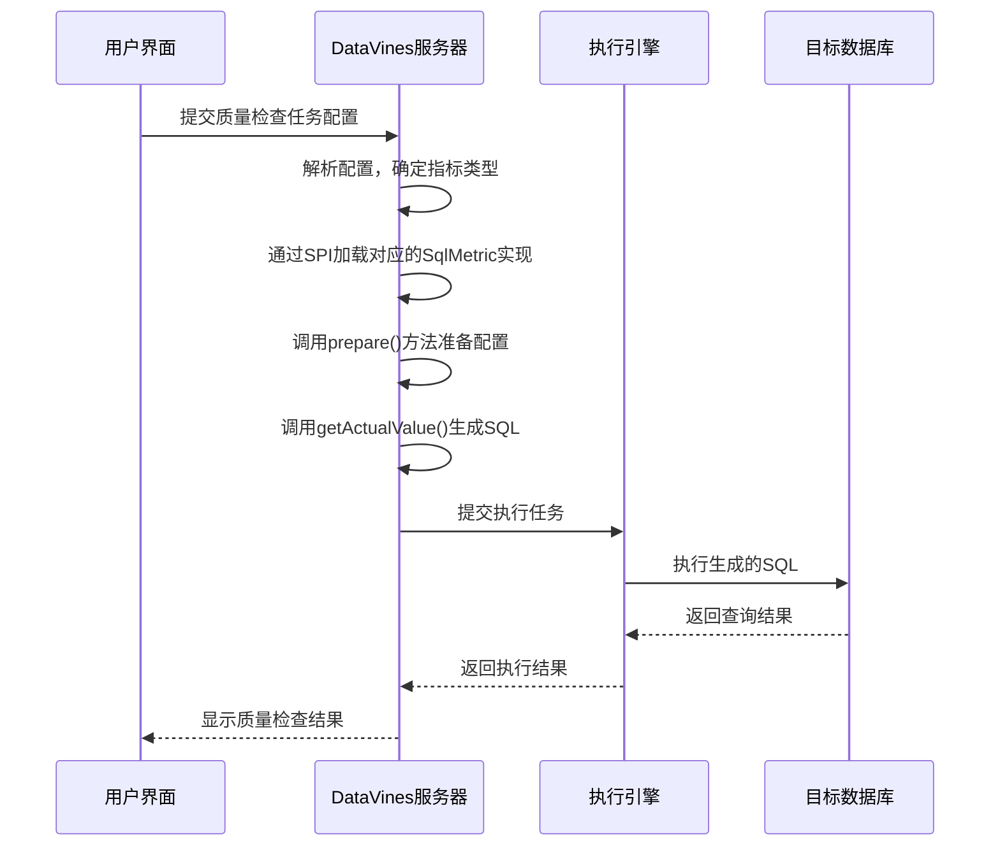

# 单表检查

<cite>
**本文档引用的文件**   
- [SqlMetric.java](file://datavines-metric\datavines-metric-api\src\main\java\io\datavines\metric\api\SqlMetric.java)
- [ColumnNotNull.java](file://datavines-metric\datavines-metric-plugins\datavines-metric-column-not-null\src\main\java\io\datavines\metric\plugin\ColumnNotNull.java)
- [ColumnUnique.java](file://datavines-metric\datavines-metric-plugins\datavines-metric-column-unique\src\main\java\io\datavines\metric\plugin\ColumnUnique.java)
- [ColumnValueBetween.java](file://datavines-metric\datavines-metric-plugins\datavines-metric-column-value-between\src\main\java\io\datavines\metric\plugin\ColumnValueBetween.java)
- [ColumnInEnums.java](file://datavines-metric\datavines-metric-plugins\datavines-metric-column-in-enums\src\main\java\io\datavines\metric\plugin\ColumnInEnums.java)
- [ColumnMatchRegex.java](file://datavines-metric\datavines-metric-plugins\datavines-metric-column-match-regex\src\main\java\io\datavines\metric\plugin\ColumnMatchRegex.java)
- [ColumnLength.java](file://datavines-metric\datavines-metric-plugins\datavines-metric-column-length\src\main\java\io\datavines\metric\plugin\ColumnLength.java)
- [ColumnAvgLength.java](file://datavines-metric\datavines-metric-plugins\datavines-metric-column-avg-length\src\main\java\io\datavines\metric\plugin\ColumnAvgLength.java)
- [ColumnStdDev.java](file://datavines-metric\datavines-metric-plugins\datavines-metric-column-std-dev\src\main\java\io\datavines\metric\plugin\ColumnStdDev.java)
- [ColumnVariance.java](file://datavines-metric\datavines-metric-plugins\datavines-metric-column-variance\src\main\java\io\datavines\metric\plugin\ColumnVariance.java)
- [BaseSingleTableColumnNotUseView.java](file://datavines-metric\datavines-metric-plugins\datavines-metric-base\src\main\java\io\datavines\metric\plugin\base\BaseSingleTableColumnNotUseView.java)
- [BaseSingleTableColumn.java](file://datavines-metric\datavines-metric-plugins\datavines-metric-base\src\main\java\io\datavines\metric\plugin\base\BaseSingleTableColumn.java)
</cite>

## 目录
1. [引言](#引言)
2. [核心架构与实现原理](#核心架构与实现原理)
3. [单表列级质量检查规则详解](#单表列级质量检查规则详解)
   1. [非空检查（ColumnNotNull）](#非空检查columnnotnull)
   2. [唯一性检查（ColumnUnique）](#唯一性检查columnunique)
   3. [值范围检查（ColumnValueBetween）](#值范围检查columnvaluebetween)
   4. [枚举值检查（ColumnInEnums）](#枚举值检查columninenums)
   5. [正则匹配检查（ColumnMatchRegex）](#正则匹配检查columnmatchregex)
   6. [长度检查（ColumnLength）](#长度检查columnlength)
   7. [平均长度检查（ColumnAvgLength）](#平均长度检查columnavglength)
   8. [标准差检查（ColumnStdDev）](#标准差检查columnstddev)
   9. [方差检查（ColumnVariance）](#方差检查columnvariance)
4. [执行引擎集成机制](#执行引擎集成机制)
5. [实际业务场景应用案例](#实际业务场景应用案例)
6. [性能优化建议](#性能优化建议)
7. [结论](#结论)

## 引言

DataVines是一个数据质量监控平台，提供丰富的单表列级质量检查规则。这些规则通过统一的`SqlMetric`接口实现，能够对数据表中的特定列进行各种质量验证。本文档详细描述了DataVines支持的单表列级质量检查规则的实现原理、配置参数、使用场景和性能优化建议。

## 核心架构与实现原理

DataVines的质量检查规则基于`SqlMetric`接口实现，该接口定义了所有质量指标必须实现的核心方法。所有单表列级检查规则都继承自`BaseSingleTableColumn`或`BaseSingleTableColumnNotUseView`基类，这些基类提供了通用的功能和配置管理。

```mermaid
classDiagram
class SqlMetric {
<<interface>>
+String getName()
+String getZhName()
+MetricDimension getDimension()
+MetricType getType()
+boolean isInvalidateItemsCanOutput()
+ExecuteSql getInvalidateItems(Map~String,String~)
+ExecuteSql getActualValue(Map~String,String~)
+void prepare(Map~String,String~)
+DataVinesDataType[] suitableType()
}
class BaseSingleTable {
+Map~String,ConfigItem~ configMap
+String[] requiredOptions
+StringBuilder invalidateItemsSql
+ConnectorFactory getConnectorFactory(Map~String,String~)
+void prepare(Map~String,String~)
}
class BaseSingleTableColumn {
+BaseSingleTableColumn()
+Map~String,ConfigItem~ getConfigMap()
+MetricLevel getLevel()
+boolean isInvalidateItemsCanOutput()
}
class BaseSingleTableColumnNotUseView {
+BaseSingleTableColumnNotUseView()
+Map~String,ConfigItem~ getConfigMap()
+MetricLevel getLevel()
+boolean isInvalidateItemsCanOutput()
+ExecuteSql getDirectActualValue(Map~String,String~)
}
class ColumnNotNull {
+String getName()
+String getZhName()
+MetricDimension getDimension()
+MetricType getType()
+void prepare(Map~String,String~)
+DataVinesDataType[] suitableType()
}
class ColumnUnique {
+String getName()
+String getZhName()
+MetricDimension getDimension()
+MetricType getType()
+void prepare(Map~String,String~)
+DataVinesDataType[] suitableType()
}
class ColumnValueBetween {
+String getName()
+String getZhName()
+MetricDimension getDimension()
+MetricType getType()
+void prepare(Map~String,String~)
+DataVinesDataType[] suitableType()
}
class ColumnInEnums {
+String getName()
+String getZhName()
+MetricDimension getDimension()
+MetricType getType()
+void prepare(Map~String,String~)
+DataVinesDataType[] suitableType()
}
class ColumnMatchRegex {
+String getName()
+String getZhName()
+MetricDimension getDimension()
+MetricType getType()
+void prepare(Map~String,String~)
+DataVinesDataType[] suitableType()
}
class ColumnLength {
+String getName()
+String getZhName()
+MetricDimension getDimension()
+MetricType getType()
+void prepare(Map~String,String~)
+DataVinesDataType[] suitableType()
}
class ColumnAvgLength {
+String getName()
+String getZhName()
+MetricDimension getDimension()
+MetricType getType()
+void prepare(Map~String,String~)
+ExecuteSql getInvalidateItems(Map~String,String~)
+ExecuteSql getActualValue(Map~String,String~)
+DataVinesDataType[] suitableType()
}
class ColumnStdDev {
+String getName()
+String getZhName()
+MetricDimension getDimension()
+MetricType getType()
+void prepare(Map~String,String~)
+ExecuteSql getInvalidateItems(Map~String,String~)
+ExecuteSql getActualValue(Map~String,String~)
+DataVinesDataType[] suitableType()
}
class ColumnVariance {
+String getName()
+String getZhName()
+MetricDimension getDimension()
+MetricType getType()
+void prepare(Map~String,String~)
+ExecuteSql getInvalidateItems(Map~String,String~)
+ExecuteSql getActualValue(Map~String,String~)
+DataVinesDataType[] suitableType()
}
SqlMetric <|-- BaseSingleTable
BaseSingleTable <|-- BaseSingleTableColumn
BaseSingleTable <|-- BaseSingleTableColumnNotUseView
BaseSingleTableColumn <|-- ColumnAvgLength
BaseSingleTableColumn <|-- ColumnStdDev
BaseSingleTableColumn <|-- ColumnVariance
BaseSingleTableColumnNotUseView <|-- ColumnNotNull
BaseSingleTableColumnNotUseView <|-- ColumnUnique
BaseSingleTableColumnNotUseView <|-- ColumnValueBetween
BaseSingleTableColumnNotUseView <|-- ColumnInEnums
BaseSingleTableColumnNotUseView <|-- ColumnMatchRegex
BaseSingleTableColumnNotUseView <|-- ColumnLength
```



**图表来源**
- [SqlMetric.java](file://datavines-metric\datavines-metric-api\src\main\java\io\datavines\metric\api\SqlMetric.java)
- [BaseSingleTableColumn.java](file://datavines-metric\datavines-metric-plugins\datavines-metric-base\src\main\java\io\datavines\metric\plugin\base\BaseSingleTableColumn.java)
- [BaseSingleTableColumnNotUseView.java](file://datavines-metric\datavines-metric-plugins\datavines-metric-base\src\main\java\io\datavines\metric\plugin\base\BaseSingleTableColumnNotUseView.java)

**章节来源**
- [SqlMetric.java](file://datavines-metric\datavines-metric-api\src\main\java\io\datavines\metric\api\SqlMetric.java)
- [BaseSingleTableColumn.java](file://datavines-metric\datavines-metric-plugins\datavines-metric-base\src\main\java\io\datavines\metric\plugin\base\BaseSingleTableColumn.java)
- [BaseSingleTableColumnNotUseView.java](file://datavines-metric\datavines-metric-plugins\datavines-metric-base\src\main\java\io\datavines\metric\plugin\base\BaseSingleTableColumnNotUseView.java)

## 单表列级质量检查规则详解

### 非空检查（ColumnNotNull）

非空检查用于验证指定列中是否存在空值，确保数据的完整性。

**实现原理**：
- 继承自`BaseSingleTableColumnNotUseView`
- 通过`columnNotNull()`方法生成SQL过滤条件
- 在`prepare`方法中添加非空过滤器

**配置参数**：
- `column`: 要检查的列名（必填）
- `filter`: 附加的WHERE条件（可选）

**适用数据类型**：
- 数值类型（NUMERIC_TYPE）
- 字符串类型（STRING_TYPE）
- 日期时间类型（DATE_TIME_TYPE）

**使用场景**：
- 用户表中的手机号、邮箱等关键字段不能为空
- 订单表中的订单号、用户ID等核心字段必须有值

**性能优化建议**：
- 为检查的列创建索引以提高查询性能
- 避免在大表上频繁执行非空检查
- 可以结合分区条件进行检查，减少扫描数据量

**章节来源**
- [ColumnNotNull.java](file://datavines-metric\datavines-metric-plugins\datavines-metric-column-not-null\src\main\java\io\datavines\metric\plugin\ColumnNotNull.java)

### 唯一性检查（ColumnUnique）

唯一性检查用于验证指定列中的值是否唯一，防止重复数据的出现。

**实现原理**：
- 继承自`BaseSingleTableColumnNotUseView`
- 在`prepare`方法中构建包含`GROUP BY`和`HAVING COUNT(*) > 1`的SQL语句
- 使用`groupByHavingCountForUnique()`方法生成分组和计数条件

**配置参数**：
- `column`: 要检查的列名（必填）
- `filter`: 附加的WHERE条件（可选）

**适用数据类型**：
- 数值类型（NUMERIC_TYPE）
- 字符串类型（STRING_TYPE）
- 日期时间类型（DATE_TIME_TYPE）

**使用场景**：
- 用户表中的用户ID、手机号必须唯一
- 订单表中的订单号必须唯一
- 产品表中的产品编码必须唯一

**性能优化建议**：
- 为检查的列创建唯一索引，既保证数据质量又提高查询性能
- 对于大表，考虑使用采样方式检查唯一性
- 避免在没有索引的列上执行唯一性检查

**章节来源**
- [ColumnUnique.java](file://datavines-metric\datavines-metric-plugins\datavines-metric-column-unique\src\main\java\io\datavines\metric\plugin\ColumnUnique.java)

### 值范围检查（ColumnValueBetween）

值范围检查用于验证指定列的值是否在预设的最小值和最大值之间。

**实现原理**：
- 继承自`BaseSingleTableColumnNotUseView`
- 在`prepare`方法中根据配置的`min`和`max`值添加相应的过滤条件
- 使用`columnGteMin()`和`columnLteMax()`方法生成大于等于最小值和小于等于最大值的条件

**配置参数**：
- `column`: 要检查的列名（必填）
- `min`: 最小值（可选）
- `max`: 最大值（可选）
- `filter`: 附加的WHERE条件（可选）

**适用数据类型**：
- 数值类型（NUMERIC_TYPE）
- 字符串类型（STRING_TYPE）
- 日期时间类型（DATE_TIME_TYPE）

**使用场景**：
- 产品表中的价格应在合理范围内
- 用户表中的年龄应在0-150之间
- 订单表中的订单金额应为正数

**性能优化建议**：
- 为检查的列创建索引，特别是范围查询频繁的列
- 避免在大表上频繁执行范围检查
- 可以结合业务逻辑设置合理的范围值

**章节来源**
- [ColumnValueBetween.java](file://datavines-metric\datavines-metric-plugins\datavines-metric-column-value-between\src\main\java\io\datavines\metric\plugin\ColumnValueBetween.java)

### 枚举值检查（ColumnInEnums）

枚举值检查用于验证指定列的值是否在预设的枚举值列表中。

**实现原理**：
- 继承自`BaseSingleTableColumnNotUseView`
- 在`prepare`方法中添加`IN`条件过滤器
- 使用`columnInEnums()`方法生成IN子句

**配置参数**：
- `column`: 要检查的列名（必填）
- `enum_list`: 枚举值列表，用逗号分隔（必填）
- `filter`: 附加的WHERE条件（可选）

**适用数据类型**：
- 数值类型（NUMERIC_TYPE）
- 字符串类型（STRING_TYPE）
- 日期时间类型（DATE_TIME_TYPE）

**使用场景**：
- 用户表中的性别字段只能是"男"或"女"
- 订单表中的订单状态只能是预设的几种状态
- 产品表中的产品类别必须在定义的类别中

**性能优化建议**：
- 对于枚举值较多的情况，考虑使用字典表关联查询
- 为检查的列创建索引以提高IN查询性能
- 枚举值列表不宜过大，否则会影响查询性能

**章节来源**
- [ColumnInEnums.java](file://datavines-metric\datavines-metric-plugins\datavines-metric-column-in-enums\src\main\java\io\datavines\metric\plugin\ColumnInEnums.java)

### 正则匹配检查（ColumnMatchRegex）

正则匹配检查用于验证指定列的值是否符合预设的正则表达式模式。

**实现原理**：
- 继承自`BaseSingleTableColumnNotUseView`
- 在`prepare`方法中添加正则匹配过滤器
- 使用`columnMatchRegex()`方法生成正则匹配条件

**配置参数**：
- `column`: 要检查的列名（必填）
- `regexp`: 正则表达式（必填）
- `filter`: 附加的WHERE条件（可选）

**适用数据类型**：
- 字符串类型（STRING_TYPE）
- 日期时间类型（DATE_TIME_TYPE）

**使用场景**：
- 用户表中的手机号必须符合手机号格式
- 邮箱字段必须符合邮箱格式
- 身份证号码必须符合身份证号码格式

**性能优化建议**：
- 正则表达式应尽量简洁高效，避免复杂的正则模式
- 避免在大表上频繁执行正则匹配检查
- 可以先通过简单的长度或前缀检查过滤大部分数据，再进行正则匹配

**章节来源**
- [ColumnMatchRegex.java](file://datavines-metric\datavines-metric-plugins\datavines-metric-column-match-regex\src\main\java\io\datavines\metric\plugin\ColumnMatchRegex.java)

### 长度检查（ColumnLength）

长度检查用于验证指定列的值长度是否符合预设条件。

**实现原理**：
- 继承自`BaseSingleTableColumnNotUseView`
- 在`prepare`方法中根据配置的长度和比较符添加过滤条件
- 使用`columnLengthCompare()`方法生成长度比较条件

**配置参数**：
- `column`: 要检查的列名（必填）
- `length`: 目标长度值（必填）
- `comparator`: 比较符，如=、!=、>、>=、<、<=（必填）
- `filter`: 附加的WHERE条件（可选）

**适用数据类型**：
- 字符串类型（STRING_TYPE）
- 日期时间类型（DATE_TIME_TYPE）

**使用场景**：
- 用户名长度应在4-20个字符之间
- 密码长度应不少于8个字符
- 手机号长度必须为11位

**性能优化建议**：
- 为检查的列创建索引，特别是长度检查频繁的列
- 避免在大文本字段上执行长度检查
- 可以结合业务逻辑设置合理的长度范围

**章节来源**
- [ColumnLength.java](file://datavines-metric\datavines-metric-plugins\datavines-metric-column-length\src\main\java\io\datavines\metric\plugin\ColumnLength.java)

### 平均长度检查（ColumnAvgLength）

平均长度检查用于计算指定列值的平均长度。

**实现原理**：
- 继承自`BaseSingleTableColumn`
- 重写`getActualValue`方法，使用`avgLengthActualValue()`方法生成计算平均长度的SQL
- 不支持输出无效项，`getInvalidateItems`方法返回null

**配置参数**：
- `column`: 要检查的列名（必填）
- `filter`: 附加的WHERE条件（可选）

**适用数据类型**：
- 数值类型（NUMERIC_TYPE）
- 字符串类型（STRING_TYPE）
- 日期时间类型（DATE_TIME_TYPE）

**使用场景**：
- 分析用户昵称的平均长度
- 监控产品描述字段的平均长度变化
- 评估评论内容的平均长度趋势

**性能优化建议**：
- 为检查的列创建索引以提高聚合查询性能
- 避免在大表上频繁执行平均长度计算
- 可以结合采样方式估算平均长度

**章节来源**
- [ColumnAvgLength.java](file://datavines-metric\datavines-metric-plugins\datavines-metric-column-avg-length\src\main\java\io\datavines\metric\plugin\ColumnAvgLength.java)

### 标准差检查（ColumnStdDev）

标准差检查用于计算指定列数值的标准差，衡量数据的离散程度。

**实现原理**：
- 继承自`BaseSingleTableColumn`
- 重写`getActualValue`方法，使用`stdDevActualValue()`方法生成计算标准差的SQL
- 不支持输出无效项，`getInvalidateItems`方法返回null
- 仅适用于数值类型数据

**配置参数**：
- `column`: 要检查的列名（必填）
- `filter`: 附加的WHERE条件（可选）

**适用数据类型**：
- 数值类型（NUMERIC_TYPE）

**使用场景**：
- 分析订单金额的波动情况
- 监控用户消费金额的标准差变化
- 评估产品价格的离散程度

**性能优化建议**：
- 为检查的列创建索引以提高聚合查询性能
- 避免在大表上频繁执行标准差计算
- 可以结合时间窗口分析标准差的变化趋势

**章节来源**
- [ColumnStdDev.java](file://datavines-metric\datavines-metric-plugins\datavines-metric-column-std-dev\src\main\java\io\datavines\metric\plugin\ColumnStdDev.java)

### 方差检查（ColumnVariance）

方差检查用于计算指定列数值的方差，衡量数据的离散程度。

**实现原理**：
- 继承自`BaseSingleTableColumn`
- 重写`getActualValue`方法，使用`varianceActualValue()`方法生成计算方差的SQL
- 不支持输出无效项，`getInvalidateItems`方法返回null
- 仅适用于数值类型数据

**配置参数**：
- `column`: 要检查的列名（必填）
- `filter`: 附加的WHERE条件（可选）

**适用数据类型**：
- 数值类型（NUMERIC_TYPE）

**使用场景**：
- 分析股票价格的方差
- 监控系统响应时间的方差变化
- 评估产品质量指标的稳定性

**性能优化建议**：
- 为检查的列创建索引以提高聚合查询性能
- 避免在大表上频繁执行方差计算
- 可以结合标准差一起分析数据的离散程度

**章节来源**
- [ColumnVariance.java](file://datavines-metric\datavines-metric-plugins\datavines-metric-column-variance\src\main\java\io\datavines\metric\plugin\ColumnVariance.java)

## 执行引擎集成机制

DataVines的质量检查规则通过`SqlMetric`接口与执行引擎集成。当配置一个质量检查任务时，系统会根据配置的指标类型加载相应的`SqlMetric`实现类，并调用其方法生成执行SQL。



**图表来源**
- [SqlMetric.java](file://datavines-metric\datavines-metric-api\src\main\java\io\datavines\metric\api\SqlMetric.java)
- 各具体指标实现类

**章节来源**
- [SqlMetric.java](file://datavines-metric\datavines-metric-api\src\main\java\io\datavines\metric\api\SqlMetric.java)

## 实际业务场景应用案例

### 用户表手机号非空验证

在用户管理系统中，手机号是关键的联系方式，必须确保其非空。

```json
{
  "metric_type": "column_not_null",
  "config": {
    "column": "phone_number",
    "filter": "status = 'ACTIVE'"
  }
}
```

此配置将检查活跃用户表中手机号字段的非空情况，确保所有活跃用户的手机号都不为空。

### 订单表订单号唯一性校验

订单号是订单的唯一标识，必须保证其唯一性。

```json
{
  "metric_type": "column_unique",
  "config": {
    "column": "order_id",
    "filter": "create_time >= '2023-01-01'"
  }
}
```

此配置将检查2023年以来创建的订单中订单号的唯一性，防止订单号重复。

### 产品表价格范围校验

产品价格应在合理的范围内，避免出现异常值。

```json
{
  "metric_type": "column_value_between",
  "config": {
    "column": "price",
    "min": 0,
    "max": 1000000,
    "filter": "status = 'ON_SALE'"
  }
}
```

此配置将检查在售产品价格是否在0到100万之间，确保价格的合理性。

**章节来源**
- [ColumnNotNull.java](file://datavines-metric\datavines-metric-plugins\datavines-metric-column-not-null\src\main\java\io\datavines\metric\plugin\ColumnNotNull.java)
- [ColumnUnique.java](file://datavines-metric\datavines-metric-plugins\datavines-metric-column-unique\src\main\java\io\datavines\metric\plugin\ColumnUnique.java)
- [ColumnValueBetween.java](file://datavines-metric\datavines-metric-plugins\datavines-metric-column-value-between\src\main\java\io\datavines\metric\plugin\ColumnValueBetween.java)

## 性能优化建议

1. **索引优化**：为经常检查的列创建适当的索引，特别是唯一性检查、非空检查和范围检查的列。

2. **分区策略**：对于大表，利用分区表特性，只检查最新分区的数据，减少扫描数据量。

3. **采样检查**：对于非关键性检查，可以采用采样方式，只检查部分数据以提高性能。

4. **缓存机制**：对于频繁执行且结果变化不大的检查，可以考虑结果缓存。

5. **批量处理**：将多个检查任务合并执行，减少数据库连接和查询开销。

6. **执行时间规划**：将资源密集型检查安排在业务低峰期执行。

7. **SQL优化**：定期审查生成的SQL语句，确保其执行计划最优。

8. **监控与告警**：建立检查任务的性能监控，及时发现和解决性能瓶颈。

**章节来源**
- 所有具体指标实现类

## 结论

DataVines提供了丰富且灵活的单表列级质量检查规则，通过统一的`SqlMetric`接口实现，具有良好的扩展性和可维护性。这些规则覆盖了数据质量的多个维度，包括完整性、有效性、一致性等，能够满足各种业务场景的需求。通过合理配置和性能优化，可以有效保障数据质量，为数据分析和决策提供可靠的数据基础。