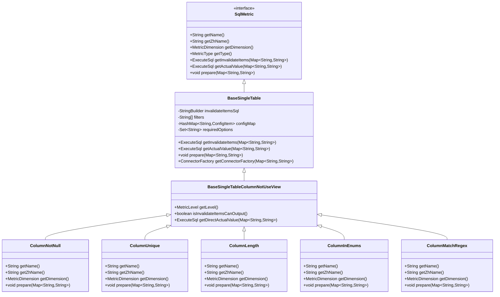

# 基础属性检查

<cite>
**本文档引用的文件**  
- [ColumnNotNull.java](file://datavines-metric\datavines-metric-plugins\datavines-metric-column-not-null\src\main\java\io\datavines\metric\plugin\ColumnNotNull.java)
- [ColumnUnique.java](file://datavines-metric\datavines-metric-plugins\datavines-metric-column-unique\src\main\java\io\datavines\metric\plugin\ColumnUnique.java)
- [ColumnLength.java](file://datavines-metric\datavines-metric-plugins\datavines-metric-column-length\src\main\java\io\datavines\metric\plugin\ColumnLength.java)
- [ColumnInEnums.java](file://datavines-metric\datavines-metric-plugins\datavines-metric-column-in-enums\src\main\java\io\datavines\metric\plugin\ColumnInEnums.java)
- [ColumnMatchRegex.java](file://datavines-metric\datavines-metric-plugins\datavines-metric-column-match-regex\src\main\java\io\datavines\metric\plugin\ColumnMatchRegex.java)
- [BaseSingleTableColumnNotUseView.java](file://datavines-metric\datavines-metric-plugins\datavines-metric-base\src\main\java\io\datavines\metric\plugin\base\BaseSingleTableColumnNotUseView.java)
- [BaseSingleTable.java](file://datavines-metric\datavines-metric-plugins\datavines-metric-base\src\main\java\io\datavines\metric\plugin\base\BaseSingleTable.java)
- [SqlMetric.java](file://datavines-metric\datavines-metric-api\src\main\java\io\datavines\metric\api\SqlMetric.java)
- [ConfigItem.java](file://datavines-metric\datavines-metric-api\src\main\java\io\datavines\metric\api\ConfigItem.java)
</cite>

## 目录
1. [非空检查（ColumnNotNull）](#非空检查columnnotnull)
2. [唯一性检查（ColumnUnique）](#唯一性检查columnunique)
3. [长度检查（ColumnLength）](#长度检查columnlength)
4. [枚举值检查（ColumnInEnums）](#枚举值检查columninenums)
5. [正则匹配检查（ColumnMatchRegex）](#正则匹配检查columnmatchregex)
6. [规则实现与执行引擎集成](#规则实现与执行引擎集成)
7. [实际业务场景应用案例](#实际业务场景应用案例)

## 非空检查（ColumnNotNull）

非空检查（ColumnNotNull）是确保数据完整性的重要规则，用于验证指定列中是否存在空值。该规则通过检查列值是否为NULL或空字符串来保证数据的完整性。在DataVines中，`ColumnNotNull`类实现了这一功能，继承自`BaseSingleTableColumnNotUseView`基类。

该规则适用于数值类型、字符串类型和日期时间类型的数据。配置参数包括表名（table）、列名（column）和可选的过滤条件（filter）。当配置中包含列名时，系统会自动添加相应的过滤条件，确保只检查指定列的非空性。

**中文名称**: 非空检查  
**英文名称**: column_not_null  
**质量维度**: 有效性（EFFECTIVENESS）  
**适用数据类型**: 数值类型、字符串类型、日期时间类型

**配置参数说明**:
- `table`: 要检查的表名
- `column`: 要检查的列名
- `filter`: 可选的过滤条件，用于限定检查范围

**使用场景示例**: 用户表中的手机号字段必须非空，以确保能够联系到用户。

**性能优化建议**: 对于大表，建议在执行检查前对表进行分区或使用索引，以提高查询效率。

**本节来源**
- [ColumnNotNull.java](file://datavines-metric\datavines-metric-plugins\datavines-metric-column-not-null\src\main\java\io\datavines\metric\plugin\ColumnNotNull.java#L34-L71)
- [BaseSingleTableColumnNotUseView.java](file://datavines-metric\datavines-metric-plugins\datavines-metric-base\src\main\java\io\datavines\metric\plugin\base\BaseSingleTableColumnNotUseView.java#L27-L61)

## 唯一性检查（ColumnUnique）

唯一性检查（ColumnUnique）用于保证主键或业务键的唯一性，防止数据重复。该规则通过检查指定列中是否存在重复值来确保数据的唯一性。在DataVines中，`ColumnUnique`类实现了这一功能，同样继承自`BaseSingleTableColumnNotUseView`基类。

该规则适用于数值类型、字符串类型和日期时间类型的数据。配置参数包括表名（table）、列名（column）和可选的过滤条件（filter）。当配置中包含列名时，系统会生成相应的SQL查询，使用GROUP BY和HAVING子句来检测重复值。

**中文名称**: 唯一性检查  
**英文名称**: column_unique  
**质量维度**: 唯一性（UNIQUENESS）  
**适用数据类型**: 数值类型、字符串类型、日期时间类型

**配置参数说明**:
- `table`: 要检查的表名
- `column`: 要检查的列名
- `filter`: 可选的过滤条件，用于限定检查范围

**使用场景示例**: 订单表中的订单号必须唯一，以避免订单冲突。

**性能优化建议**: 对于大表，建议在执行检查前对相关列建立唯一索引，这不仅能提高检查效率，还能在数据插入时自动防止重复。

**本节来源**
- [ColumnUnique.java](file://datavines-metric\datavines-metric-plugins\datavines-metric-column-unique\src\main\java\io\datavines\metric\plugin\ColumnUnique.java#L29-L79)
- [BaseSingleTableColumnNotUseView.java](file://datavines-metric\datavines-metric-plugins\datavines-metric-base\src\main\java\io\datavines\metric\plugin\base\BaseSingleTableColumnNotUseView.java#L27-L61)

## 长度检查（ColumnLength）

长度检查（ColumnLength）用于验证字段长度是否符合预定义的合规性要求。该规则通过比较字段的实际长度与预设长度来确保数据格式的正确性。在DataVines中，`ColumnLength`类实现了这一功能，继承自`BaseSingleTableColumnNotUseView`基类。

该规则主要适用于字符串类型和日期时间类型的数据。配置参数包括表名（table）、列名（column）、长度（length）和比较符（comparator）。比较符可以是等于、大于、小于等操作符，用于定义长度检查的具体条件。

**中文名称**: 长度检查  
**英文名称**: column_length  
**质量维度**: 完整性（COMPLETENESS）  
**适用数据类型**: 字符串类型、日期时间类型

**配置参数说明**:
- `table`: 要检查的表名
- `column`: 要检查的列名
- `length`: 预期的字段长度
- `comparator`: 比较符，如"="、">"、"<"等

**使用场景示例**: 产品表中的产品名称字段长度应在1到100个字符之间。

**性能优化建议**: 对于频繁进行长度检查的字段，可以考虑在数据库层面设置字段长度限制，从而在数据写入时就进行验证。

**本节来源**
- [ColumnLength.java](file://datavines-metric\datavines-metric-plugins\datavines-metric-column-length\src\main\java\io\datavines\metric\plugin\ColumnLength.java#L29-L79)
- [BaseSingleTableColumnNotUseView.java](file://datavines-metric\datavines-metric-plugins\datavines-metric-base\src\main\java\io\datavines\metric\plugin\base\BaseSingleTableColumnNotUseView.java#L27-L61)

## 枚举值检查（ColumnInEnums）

枚举值检查（ColumnInEnums）用于校验字段值是否在预定义的集合内。该规则通过检查字段值是否属于指定的枚举值列表来确保数据的有效性。在DataVines中，`ColumnInEnums`类实现了这一功能，继承自`BaseSingleTableColumnNotUseView`基类。

该规则适用于数值类型、字符串类型和日期时间类型的数据。配置参数包括表名（table）、列名（column）和枚举值列表（enum_list）。枚举值列表是一个逗号分隔的字符串，包含所有允许的值。

**中文名称**: 枚举值检查  
**英文名称**: column_in_enums  
**质量维度**: 有效性（EFFECTIVENESS）  
**适用数据类型**: 数值类型、字符串类型、日期时间类型

**配置参数说明**:
- `table`: 要检查的表名
- `column`: 要检查的列名
- `enum_list`: 允许的枚举值列表，以逗号分隔

**使用场景示例**: 产品表中的分类字段只能是"电子产品"、"服装"、"家居"等预定义的值。

**性能优化建议**: 对于包含大量枚举值的检查，可以考虑将枚举值存储在单独的参考表中，并使用JOIN操作进行检查，这样可以提高查询的可维护性和性能。

**本节来源**
- [ColumnInEnums.java](file://datavines-metric\datavines-metric-plugins\datavines-metric-column-in-enums\src\main\java\io\datavines\metric\plugin\ColumnInEnums.java#L29-L74)
- [BaseSingleTableColumnNotUseView.java](file://datavines-metric\datavines-metric-plugins\datavines-metric-base\src\main\java\io\datavines\metric\plugin\base\BaseSingleTableColumnNotUseView.java#L27-L61)

## 正则匹配检查（ColumnMatchRegex）

正则匹配检查（ColumnMatchRegex）用于验证字段格式是否符合特定的模式，如邮箱、手机号等。该规则通过应用正则表达式来检查字段值的格式是否正确。在DataVines中，`ColumnMatchRegex`类实现了这一功能，继承自`BaseSingleTableColumnNotUseView`基类。

该规则主要适用于字符串类型和日期时间类型的数据。配置参数包括表名（table）、列名（column）和正则表达式（regexp）。正则表达式定义了字段值必须匹配的模式。

**中文名称**: 正则表达式[匹配]检查  
**英文名称**: column_match_regex  
**质量维度**: 完整性（COMPLETENESS）  
**适用数据类型**: 字符串类型、日期时间类型

**配置参数说明**:
- `table`: 要检查的表名
- `column`: 要检查的列名
- `regexp`: 用于验证字段格式的正则表达式

**使用场景示例**: 用户表中的邮箱字段必须符合标准的邮箱格式，如"username@domain.com"。

**性能优化建议**: 对于复杂的正则表达式，建议在执行检查前对数据进行预处理，如去除前后空格，以减少正则匹配的复杂度。同时，对于频繁检查的字段，可以考虑在应用层面进行格式验证，减少数据库层面的计算负担。

**本节来源**
- [ColumnMatchRegex.java](file://datavines-metric\datavines-metric-plugins\datavines-metric-column-match-regex\src\main\java\io\datavines\metric\plugin\ColumnMatchRegex.java#L30-L76)
- [BaseSingleTableColumnNotUseView.java](file://datavines-metric\datavines-metric-plugins\datavines-metric-base\src\main\java\io\datavines\metric\plugin\base\BaseSingleTableColumnNotUseView.java#L27-L61)

## 规则实现与执行引擎集成

DataVines的基础属性检查规则通过`SqlMetric`接口实现，并与执行引擎紧密集成。`SqlMetric`是一个SPI（Service Provider Interface）接口，定义了所有质量检查规则必须实现的方法，如获取规则名称、质量维度、生成SQL查询等。

每个具体的检查规则都实现了`SqlMetric`接口，并继承自`BaseSingleTable`或其子类。`BaseSingleTable`提供了通用的功能，如处理配置参数、生成基础SQL查询等。`BaseSingleTableColumnNotUseView`进一步扩展了这些功能，专门用于处理单表列级别的检查。

执行引擎通过`PluginLoader`加载相应的`SqlMetric`插件，并根据配置参数生成具体的SQL查询。这些查询被发送到目标数据源执行，结果返回给执行引擎进行处理和报告。



**图示来源**
- [SqlMetric.java](file://datavines-metric\datavines-metric-api\src\main\java\io\datavines\metric\api\SqlMetric.java#L28-L112)
- [BaseSingleTable.java](file://datavines-metric\datavines-metric-plugins\datavines-metric-base\src\main\java\io\datavines\metric\plugin\base\BaseSingleTable.java#L33-L100)
- [BaseSingleTableColumnNotUseView.java](file://datavines-metric\datavines-metric-plugins\datavines-metric-base\src\main\java\io\datavines\metric\plugin\base\BaseSingleTableColumnNotUseView.java#L27-L61)

**本节来源**
- [SqlMetric.java](file://datavines-metric\datavines-metric-api\src\main\java\io\datavines\metric\api\SqlMetric.java#L28-L112)
- [BaseSingleTable.java](file://datavines-metric\datavines-metric-plugins\datavines-metric-base\src\main\java\io\datavines\metric\plugin\base\BaseSingleTable.java#L33-L100)
- [BaseSingleTableColumnNotUseView.java](file://datavines-metric\datavines-metric-plugins\datavines-metric-base\src\main\java\io\datavines\metric\plugin\base\BaseSingleTableColumnNotUseView.java#L27-L61)

## 实际业务场景应用案例

### 用户表手机号非空验证

在用户管理系统中，确保用户的手机号非空是非常重要的，因为手机号是联系用户的主要方式之一。通过配置`ColumnNotNull`规则，可以定期检查用户表中的手机号字段，确保没有空值。

**配置示例**:
```json
{
  "table": "users",
  "column": "phone_number",
  "filter": "status = 'active'"
}
```

这个配置会检查所有状态为"active"的用户，确保他们的手机号字段不为空。

### 订单表订单号唯一性校验

在电商系统中，订单号的唯一性至关重要，以避免订单冲突和重复。通过配置`ColumnUnique`规则，可以定期检查订单表中的订单号字段，确保没有重复值。

**配置示例**:
```json
{
  "table": "orders",
  "column": "order_id",
  "filter": "order_date >= '2023-01-01'"
}
```

这个配置会检查2023年1月1日以来的所有订单，确保订单号的唯一性。

### 产品表分类字段枚举值校验

在产品管理系统中，产品的分类应该限制在预定义的范围内，以保持数据的一致性和可管理性。通过配置`ColumnInEnums`规则，可以确保产品表中的分类字段只包含允许的值。

**配置示例**:
```json
{
  "table": "products",
  "column": "category",
  "enum_list": "电子产品,服装,家居,图书,食品"
}
```

这个配置会检查所有产品的分类字段，确保它们只包含预定义的五个类别之一。

**本节来源**
- [ColumnNotNull.java](file://datavines-metric\datavines-metric-plugins\datavines-metric-column-not-null\src\main\java\io\datavines\metric\plugin\ColumnNotNull.java#L34-L71)
- [ColumnUnique.java](file://datavines-metric\datavines-metric-plugins\datavines-metric-column-unique\src\main\java\io\datavines\metric\plugin\ColumnUnique.java#L29-L79)
- [ColumnInEnums.java](file://datavines-metric\datavines-metric-plugins\datavines-metric-column-in-enums\src\main\java\io\datavines\metric\plugin\ColumnInEnums.java#L29-L74)