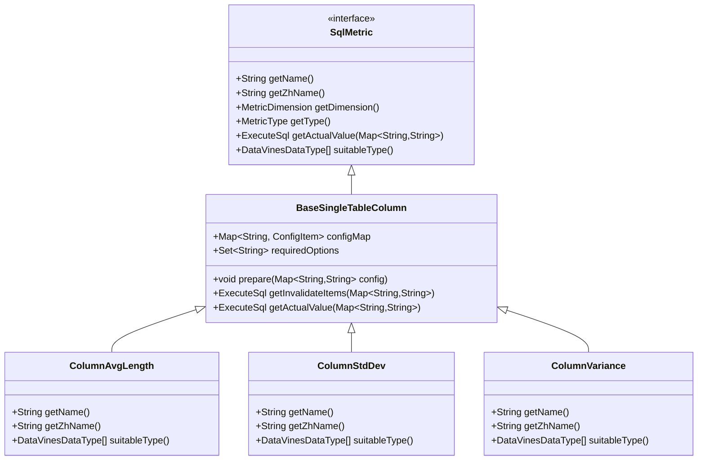
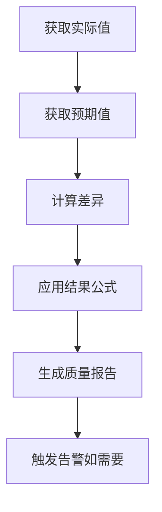
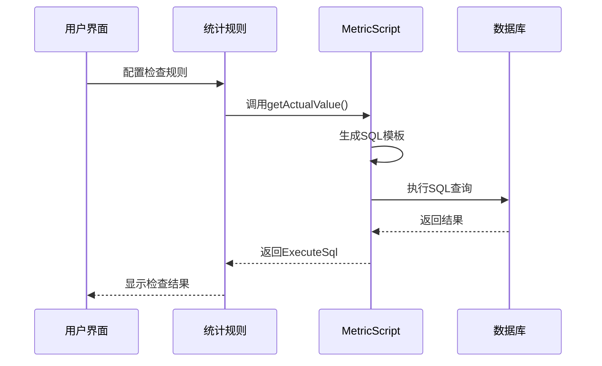
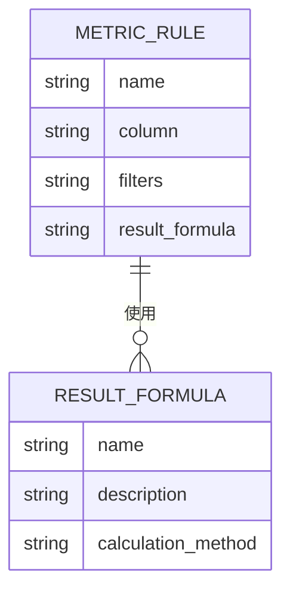

# 统计特征检查

<cite>
**本文档引用的文件**  
- [ColumnAvgLength.java](file://datavines-metric\datavines-metric-plugins\datavines-metric-column-avg-length\src\main\java\io\datavines\metric\plugin\ColumnAvgLength.java)
- [ColumnStdDev.java](file://datavines-metric\datavines-metric-plugins\datavines-metric-column-std-dev\src\main\java\io\datavines\metric\plugin\ColumnStdDev.java)
- [ColumnVariance.java](file://datavines-metric\datavines-metric-plugins\datavines-metric-column-variance\src\main\java\io\datavines\metric\plugin\ColumnVariance.java)
- [BaseSingleTableColumn.java](file://datavines-metric\datavines-metric-plugins\datavines-metric-base\src\main\java\io\datavines\metric\plugin\base\BaseSingleTableColumn.java)
- [SqlMetric.java](file://datavines-metric\datavines-metric-api\src\main\java\io\datavines\metric\api\SqlMetric.java)
- [DataVinesDataType.java](file://datavines-common\src\main\java\io\datavines\common\enums\DataVinesDataType.java)
- [ClickHouseMetricScript.java](file://datavines-connector\datavines-connector-plugins\datavines-connector-clickhouse\src\main\java\io\datavines\connector\plugin\ClickHouseMetricScript.java)
- [SparkDailyAvg.java](file://datavines-metric\datavines-metric-expected-plugins\datavines-metric-expected-daily-avg\src\main\java\io\datavines\metric\expected\plugin\SparkDailyAvg.java)
- [SparkWeeklyAvg.java](file://datavines-metric\datavines-metric-expected-plugins\datavines-metric-expected-weekly-avg\src\main\java\io\datavines\metric\expected\plugin\SparkWeeklyAvg.java)
- [SparkMonthlyAvg.java](file://datavines-metric\datavines-metric-expected-plugins\datavines-metric-expected-monthly-avg\src\main\java\io\datavines\metric\expected\plugin\SparkMonthlyAvg.java)
- [FixValue.java](file://datavines-metric\datavines-metric-expected-plugins\datavines-metric-expected-fix\src\main\java\io\datavines\metric\expected\plugin\FixValue.java)
- [DiffPercentage.java](file://datavines-metric\datavines-metric-result-formula-plugins\datavines-metric-result-formula-diff-percentage\src\main\java\io\datavines\metric\result\formula\DiffPercentage.java)
</cite>

## 目录
1. [引言](#引言)
2. [核心统计特征检查规则](#核心统计特征检查规则)
3. [平均长度检查（ColumnAvgLength）](#平均长度检查columnavglength)
4. [标准差检查（ColumnStdDev）](#标准差检查columnstddev)
5. [方差检查（ColumnVariance）](#方差检查columnvariance)
6. [预期值插件与趋势监控](#预期值插件与趋势监控)
7. [SQL聚合函数实现原理](#sql聚合函数实现原理)
8. [实际业务应用场景](#实际业务应用场景)
9. [性能优化建议](#性能优化建议)
10. [配置参数说明](#配置参数说明)

## 引言

DataVines 是一个数据质量监控平台，支持多种单表列统计特征的质量检查规则。本文档重点介绍三种核心的统计特征检查：平均长度检查（ColumnAvgLength）、标准差检查（ColumnStdDev）和方差检查（ColumnVariance）。这些规则通过SQL聚合函数计算统计指标，并结合预期值插件进行趋势监控，帮助用户发现数据异常和质量问题。

**本文档引用的文件**  
- [ColumnAvgLength.java](file://datavines-metric\datavines-metric-plugins\datavines-metric-column-avg-length\src\main\java\io\datavines\metric\plugin\ColumnAvgLength.java)
- [ColumnStdDev.java](file://datavines-metric\datavines-metric-plugins\datavines-metric-column-std-dev\src\main\java\io\datavines\metric\plugin\ColumnStdDev.java)
- [ColumnVariance.java](file://datavines-metric\datavines-metric-plugins\datavines-metric-column-variance\src\main\java\io\datavines\metric\plugin\ColumnVariance.java)

## 核心统计特征检查规则

DataVines的统计特征检查规则基于`SqlMetric`接口实现，所有规则都继承自`BaseSingleTableColumn`基类。这些规则通过SQL聚合函数计算统计指标，并将结果与预期值进行比较，以评估数据质量。

**图表来源**  
- [SqlMetric.java](file://datavines-metric\datavines-metric-api\src\main\java\io\datavines\metric\api\SqlMetric.java)
- [BaseSingleTableColumn.java](file://datavines-metric\datavines-metric-plugins\datavines-metric-base\src\main\java\io\datavines\metric\plugin\base\BaseSingleTableColumn.java)
- [ColumnAvgLength.java](file://datavines-metric\datavines-metric-plugins\datavines-metric-column-avg-length\src\main\java\io\datavines\metric\plugin\ColumnAvgLength.java)
- [ColumnStdDev.java](file://datavines-metric\datavines-metric-plugins\datavines-metric-column-std-dev\src\main\java\io\datavines\metric\plugin\ColumnStdDev.java)
- [ColumnVariance.java](file://datavines-metric\datavines-metric-plugins\datavines-metric-column-variance\src\main\java\io\datavines\metric\plugin\ColumnVariance.java)

## 平均长度检查（ColumnAvgLength）

平均长度检查用于分析文本字段的平均长度趋势，帮助监控文本数据的完整性。该规则适用于字符串、数值和日期时间类型的数据。

### 配置参数说明

| 参数 | 说明 | 必填 |
|------|------|------|
| column | 要检查的列名 | 是 |
| filters | 过滤条件，用于限定检查范围 | 否 |

### 使用场景示例

- 监控用户评论的平均长度变化，确保用户输入内容的完整性
- 检查产品描述字段的平均长度，防止描述过短影响用户体验
- 跟踪日志消息的平均长度，及时发现异常日志模式

### 性能优化建议

- 对于大表，建议添加适当的过滤条件以减少计算量
- 在高频率检查场景下，考虑使用采样策略
- 确保被检查的列上有适当的索引以提高查询性能

**本文档引用的文件**  
- [ColumnAvgLength.java](file://datavines-metric\datavines-metric-plugins\datavines-metric-column-avg-length\src\main\java\io\datavines\metric\plugin\ColumnAvgLength.java)
- [DataVinesDataType.java](file://datavines-common\src\main\java\io\datavines\common\enums\DataVinesDataType.java)

## 标准差检查（ColumnStdDev）

标准差检查用于衡量数值字段的离散程度，反映数据的波动性。标准差越大，表示数据点越分散；标准差越小，表示数据点越集中。

### 配置参数说明

| 参数 | 说明 | 必填 |
|------|------|------|
| column | 要检查的列名 | 是 |
| filters | 过滤条件，用于限定检查范围 | 否 |

### 使用场景示例

- 检测交易金额的异常波动，识别潜在的欺诈行为
- 监控系统响应时间的标准差，评估系统稳定性
- 分析用户活跃度指标的离散程度，识别用户行为模式变化

### 性能优化建议

- 对于大数据集，考虑使用近似算法计算标准差
- 在实时监控场景下，可以采用滑动窗口计算标准差
- 确保数值列的数据类型正确，避免类型转换开销

**本文档引用的文件**  
- [ColumnStdDev.java](file://datavines-metric\datavines-metric-plugins\datavines-metric-column-std-dev\src\main\java\io\datavines\metric\plugin\ColumnStdDev.java)
- [DataVinesDataType.java](file://datavines-common\src\main\java\io\datavines\common\enums\DataVinesDataType.java)

## 方差检查（ColumnVariance）

方差检查用于评估数据的波动性，是标准差的平方。方差越大，表示数据的离散程度越高；方差越小，表示数据越集中。

### 配置参数说明

| 参数 | 说明 | 必填 |
|------|------|------|
| column | 要检查的列名 | 是 |
| filters | 过滤条件，用于限定检查范围 | 否 |

### 使用场景示例

- 评估投资组合的风险水平，方差越大风险越高
- 监控生产过程中的质量指标方差，确保产品质量稳定
- 分析网络流量的方差，检测潜在的DDoS攻击

### 性能优化建议

- 与标准差检查类似，考虑使用近似算法处理大数据集
- 对于时间序列数据，可以结合移动方差进行趋势分析
- 定期清理历史数据以保持计算效率

**本文档引用的文件**  
- [ColumnVariance.java](file://datavines-metric\datavines-metric-plugins\datavines-metric-column-variance\src\main\java\io\datavines\metric\plugin\ColumnVariance.java)
- [DataVinesDataType.java](file://datavines-common\src\main\java\io\datavines\common\enums\DataVinesDataType.java)

## 预期值插件与趋势监控

DataVines提供多种预期值插件，用于与实际统计值进行比较，实现趋势监控。

### 预期值插件类型

| 插件 | 说明 |
|------|------|
| 固定值（FixValue） | 使用预设的固定值作为预期值 |
| 日均值（DailyAvg） | 使用历史日均值作为预期值 |
| 周均值（WeeklyAvg） | 使用历史周均值作为预期值 |
| 月均值（MonthlyAvg） | 使用历史月均值作为预期值 |

### 趋势监控流程

**图表来源**  
- [FixValue.java](file://datavines-metric\datavines-metric-expected-plugins\datavines-metric-expected-fix\src\main\java\io\datavines\metric\expected\plugin\FixValue.java)
- [SparkDailyAvg.java](file://datavines-metric\datavines-metric-expected-plugins\datavines-metric-expected-daily-avg\src\main\java\io\datavines\metric\expected\plugin\SparkDailyAvg.java)
- [SparkWeeklyAvg.java](file://datavines-metric\datavines-metric-expected-plugins\datavines-metric-expected-weekly-avg\src\main\java\io\datavines\metric\expected\plugin\SparkWeeklyAvg.java)
- [SparkMonthlyAvg.java](file://datavines-metric\datavines-metric-expected-plugins\datavines-metric-expected-monthly-avg\src\main\java\io\datavines\metric\expected\plugin\SparkMonthlyAvg.java)

## SQL聚合函数实现原理

统计特征检查通过SQL聚合函数计算实际值，不同数据库的实现可能略有差异。

### SQL实现示例

**图表来源**  
- [ColumnAvgLength.java](file://datavines-metric\datavines-metric-plugins\datavines-metric-column-avg-length\src\main\java\io\datavines\metric\plugin\ColumnAvgLength.java)
- [ClickHouseMetricScript.java](file://datavines-connector\datavines-connector-plugins\datavines-connector-clickhouse\src\main\java\io\datavines\connector\plugin\ClickHouseMetricScript.java)

## 实际业务应用场景

### 用户评论平均长度监控

监控电商平台用户评论的平均长度变化，确保用户反馈的完整性。当平均长度显著下降时，可能表示用户参与度降低或存在刷评行为。

### 交易金额异常波动检测

通过标准差和方差检查金融交易金额的波动性。当方差突然增大时，可能表示存在异常交易模式，需要进一步调查。

### 系统性能指标监控

监控系统响应时间的标准差，评估系统稳定性。标准差持续增大可能表示系统负载不均衡或存在性能瓶颈。

**本文档引用的文件**  
- [ColumnAvgLength.java](file://datavines-metric\datavines-metric-plugins\datavines-metric-column-avg-length\src\main\java\io\datavines\metric\plugin\ColumnAvgLength.java)
- [ColumnStdDev.java](file://datavines-metric\datavines-metric-plugins\datavines-metric-column-std-dev\src\main\java\io\datavines\metric\plugin\ColumnStdDev.java)
- [ColumnVariance.java](file://datavines-metric\datavines-metric-plugins\datavines-metric-column-variance\src\main\java\io\datavines\metric\plugin\ColumnVariance.java)

## 性能优化建议

1. **索引优化**：确保被检查的列上有适当的索引，特别是对于大表的统计计算。
2. **采样策略**：对于超大数据集，考虑使用随机采样来估算统计指标。
3. **分区查询**：利用表分区特性，只查询相关分区的数据以提高效率。
4. **缓存机制**：对于频繁查询的统计结果，考虑使用缓存减少重复计算。
5. **并行处理**：在支持的数据库中，启用并行查询以加速大表的统计计算。

**本文档引用的文件**  
- [ColumnAvgLength.java](file://datavines-metric\datavines-metric-plugins\datavines-metric-column-avg-length\src\main\java\io\datavines\metric\plugin\ColumnAvgLength.java)
- [ColumnStdDev.java](file://datavines-metric\datavines-metric-plugins\datavines-metric-column-std-dev\src\main\java\io\datavines\metric\plugin\ColumnStdDev.java)
- [ColumnVariance.java](file://datavines-metric\datavines-metric-plugins\datavines-metric-column-variance\src\main\java\io\datavines\metric\plugin\ColumnVariance.java)

## 配置参数说明

### 通用配置参数

| 参数 | 说明 | 类型 | 必填 |
|------|------|------|------|
| column | 要检查的列名 | 字符串 | 是 |
| filters | SQL WHERE子句条件 | 字符串 | 否 |
| result_formula | 结果计算公式 | 枚举 | 否 |

### 结果公式类型

| 公式 | 说明 | 计算方式 |
|------|------|------|
| diff | 差值 | \|实际值 - 期望值\| |
| percentage | 百分比 | 实际值/期望值×100% |
| diff_percentage | 差异百分比 | \|实际值-期望值\|/期望值×100% |

**图表来源**  
- [DiffPercentage.java](file://datavines-metric\datavines-metric-result-formula-plugins\datavines-metric-result-formula-diff-percentage\src\main\java\io\datavines\metric\result\formula\DiffPercentage.java)