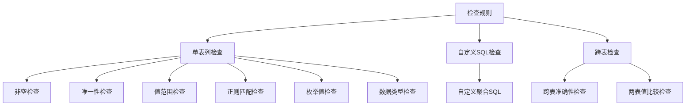

# 检查规则

<cite>
**本文档中引用的文件**  
- [MetricType.java](file://datavines-metric/datavines-metric-api/src/main/java/io/datavines/metric/api/MetricType.java)
- [SqlMetric.java](file://datavines-metric/datavines-metric-api/src/main/java/io/datavines/metric/api/SqlMetric.java)
- [ColumnNotNull.java](file://datavines-metric/datavines-metric-plugins/datavines-metric-column-not-null/src/main/java/io/datavines/metric/plugin/ColumnNotNull.java)
- [ColumnUnique.java](file://datavines-metric/datavines-metric-plugins/datavines-metric-column-unique/src/main/java/io/datavines/metric/plugin/ColumnUnique.java)
- [ColumnValueBetween.java](file://datavines-metric/datavines-metric-plugins/datavines-metric-column-value-between/src/main/java/io/datavines/metric/plugin/ColumnValueBetween.java)
- [ColumnMatchRegex.java](file://datavines-metric/datavines-metric-plugins/datavines-metric-column-match-regex/src/main/java/io/datavines/metric/plugin/ColumnMatchRegex.java)
- [ColumnInEnums.java](file://datavines-metric/datavines-metric-plugins/datavines-metric-column-in-enums/src/main/java/io/datavines/metric/plugin/ColumnInEnums.java)
- [CustomAggregateSql.java](file://datavines-metric/datavines-metric-plugins/datavines-metric-custom-aggregate-sql/src/main/java/io/datavines/metric/plugin/CustomAggregateSql.java)
- [MultiTableAccuracy.java](file://datavines-metric/datavines-metric-plugins/datavines-metric-multi-table-accuracy/src/main/java/io/datavines/metric/plugin/MultiTableAccuracy.java)
- [MultiTableValueComparison.java](file://datavines-metric/datavines-metric-plugins/datavines-metric-multi-table-value-comparison/src/main/java/io/datavines/metric/plugin/MultiTableValueComparison.java)
- [BaseSingleTableColumn.java](file://datavines-metric/datavines-metric-base/src/main/java/io/datavines/metric/plugin/base/BaseSingleTableColumn.java)
- [ExpectedValue.java](file://datavines-metric/datavines-metric-api/src/main/java/io/datavines/metric/api/ExpectedValue.java)
</cite>

## 目录
1. [引言](#引言)
2. [检查规则分类](#检查规则分类)
3. [单表列检查规则](#单表列检查规则)
4. [自定义SQL检查规则](#自定义sql检查规则)
5. [跨表检查规则](#跨表检查规则)
6. [规则配置与使用场景](#规则配置与使用场景)
7. [规则组合与优先级](#规则组合与优先级)
8. [性能优化建议](#性能优化建议)
9. [结论](#结论)

## 引言
DataVines 是一个数据质量检查平台，提供了27种内置的检查规则，用于确保数据的准确性、完整性和一致性。这些规则分为三大类：单表列检查、自定义SQL检查和跨表检查。本文档详细描述了这些规则的实现原理、使用场景、配置示例和性能优化建议。

**检查规则分类**
- [MetricType.java](file://datavines-metric/datavines-metric-api/src/main/java/io/datavines/metric/api/MetricType.java#L24-L34)

## 检查规则分类
DataVines的检查规则主要分为以下三类：
1. **单表列检查**：针对单个表的列进行数据质量检查，包括非空检查、唯一性检查、值范围检查等。
2. **自定义SQL检查**：通过自定义聚合SQL实现复杂业务规则的验证。
3. **跨表检查**：在多个表之间进行数据准确性检查和值比较。

**Diagram sources**
- [MetricType.java](file://datavines-metric/datavines-metric-api/src/main/java/io/datavines/metric/api/MetricType.java#L24-L34)

**Section sources**
- [MetricType.java](file://datavines-metric/datavines-metric-api/src/main/java/io/datavines/metric/api/MetricType.java#L24-L34)

## 单表列检查规则
单表列检查规则用于验证单个表中列的数据质量。这些规则通过SQL查询实现，检查结果可以用于评估数据的完整性、一致性和准确性。

### 非空检查
非空检查用于验证指定列中是否存在空值。该规则通过`COUNT`函数和`IS NULL`条件实现。

**实现原理**：
- 查询指定列中空值的数量。
- 如果空值数量大于0，则检查失败。

**使用场景**：
- 确保关键字段（如用户ID、订单号）不为空。
- 验证数据导入过程中是否有缺失值。

**Section sources**
- [ColumnNotNull.java](file://datavines-metric/datavines-metric-plugins/datavines-metric-column-not-null/src/main/java/io/datavines/metric/plugin/ColumnNotNull.java)

### 唯一性检查
唯一性检查用于验证指定列中的值是否唯一。该规则通过`COUNT`和`GROUP BY`实现。

**实现原理**：
- 查询指定列中重复值的数量。
- 如果重复值数量大于0，则检查失败。

**使用场景**：
- 确保主键字段的唯一性。
- 验证业务唯一标识符（如身份证号、手机号）的唯一性。

**Section sources**
- [ColumnUnique.java](file://datavines-metric/datavines-metric-plugins/datavines-metric-column-unique/src/main/java/io/datavines/metric/plugin/ColumnUnique.java)

### 值范围检查
值范围检查用于验证指定列中的值是否在预定义的范围内。该规则通过`BETWEEN`或比较操作符实现。

**实现原理**：
- 查询指定列中超出范围的值的数量。
- 如果超出范围的值数量大于0，则检查失败。

**使用场景**：
- 验证年龄、价格等数值字段的合理性。
- 确保时间字段在有效范围内。

**Section sources**
- [ColumnValueBetween.java](file://datavines-metric/datavines-metric-plugins/datavines-metric-column-value-between/src/main/java/io/datavines/metric/plugin/ColumnValueBetween.java)

### 正则匹配检查
正则匹配检查用于验证指定列中的值是否符合预定义的正则表达式模式。该规则通过`REGEXP`或类似函数实现。

**实现原理**：
- 查询指定列中不符合正则表达式的值的数量。
- 如果不符合的值数量大于0，则检查失败。

**使用场景**：
- 验证邮箱、电话号码等格式的正确性。
- 确保数据符合特定的格式要求。

**Section sources**
- [ColumnMatchRegex.java](file://datavines-metric/datavines-metric-plugins/datavines-metric-column-match-regex/src/main/java/io/datavines/metric/plugin/ColumnMatchRegex.java)

### 枚举值检查
枚举值检查用于验证指定列中的值是否在预定义的枚举值列表中。该规则通过`IN`操作符实现。

**实现原理**：
- 查询指定列中不在枚举值列表中的值的数量。
- 如果不在列表中的值数量大于0，则检查失败。

**使用场景**：
- 验证状态字段（如订单状态、用户状态）的合法性。
- 确保数据符合预定义的业务规则。

**Section sources**
- [ColumnInEnums.java](file://datavines-metric/datavines-metric-plugins/datavines-metric-column-in-enums/src/main/java/io/datavines/metric/plugin/ColumnInEnums.java)

### 数据类型检查
数据类型检查用于验证指定列中的值是否符合预定义的数据类型。该规则通过类型转换和异常处理实现。

**实现原理**：
- 尝试将指定列中的值转换为预定义的数据类型。
- 如果转换失败，则检查失败。

**使用场景**：
- 验证数值字段是否为有效数字。
- 确保日期字段为有效日期格式。

**Section sources**
- [BaseSingleTableColumn.java](file://datavines-metric/datavines-metric-base/src/main/java/io/datavines/metric/plugin/base/BaseSingleTableColumn.java)

## 自定义SQL检查规则
自定义SQL检查规则允许用户通过编写自定义聚合SQL来实现复杂的业务规则验证。

### 实现机制
- 用户提供自定义SQL查询。
- 系统执行SQL查询并获取结果。
- 根据预定义的阈值和预期结果进行比较。

**使用场景**：
- 验证复杂的业务逻辑，如订单总额与明细总额的一致性。
- 实现特定的统计指标计算。

**Section sources**
- [CustomAggregateSql.java](file://datavines-metric/datavines-metric-plugins/datavines-metric-custom-aggregate-sql/src/main/java/io/datavines/metric/plugin/CustomAggregateSql.java)

## 跨表检查规则
跨表检查规则用于在多个表之间进行数据质量检查，确保数据的一致性和准确性。

### 跨表准确性检查
跨表准确性检查用于验证两个表之间的数据是否一致。该规则通过`JOIN`操作和比较实现。

**实现原理**：
- 将两个表进行`JOIN`操作。
- 比较关键字段的值是否一致。
- 如果不一致的记录数量大于0，则检查失败。

**使用场景**：
- 验证源表和目标表之间的数据一致性。
- 确保数据迁移或同步过程中的数据完整性。

**Section sources**
- [MultiTableAccuracy.java](file://datavines-metric/datavines-metric-plugins/datavines-metric-multi-table-accuracy/src/main/java/io/datavines/metric/plugin/MultiTableAccuracy.java)

### 两表值比较检查
两表值比较检查用于比较两个表中特定字段的聚合值。该规则通过`SUM`、`COUNT`等聚合函数实现。

**实现原理**：
- 分别计算两个表中指定字段的聚合值。
- 比较两个聚合值是否在预定义的阈值范围内。
- 如果差异超出阈值，则检查失败。

**使用场景**：
- 验证订单表和支付表的总金额是否一致。
- 确保统计报表数据的准确性。

**Section sources**
- [MultiTableValueComparison.java](file://datavines-metric/datavines-metric-plugins/datavines-metric-multi-table-value-comparison/src/main/java/io/datavines/metric/plugin/MultiTableValueComparison.java)

## 规则配置与使用场景
每种检查规则都支持详细的配置，包括参数设置、阈值配置和预期结果定义。

### 参数设置
- **列名**：指定要检查的列。
- **阈值**：定义检查通过的阈值。
- **预期结果**：定义期望的检查结果。

### 阈值配置
- **绝对阈值**：指定具体的数值阈值。
- **相对阈值**：指定相对于某个基准的百分比阈值。

### 预期结果定义
- **固定值**：预期结果为固定值。
- **动态计算**：预期结果通过其他规则或SQL查询动态计算。

**Section sources**
- [ExpectedValue.java](file://datavines-metric/datavines-metric-api/src/main/java/io/datavines/metric/api/ExpectedValue.java)

## 规则组合与优先级
DataVines支持规则的组合使用和优先级处理，以满足复杂的业务需求。

### 组合使用方式
- **AND组合**：所有规则都必须通过。
- **OR组合**：至少一个规则通过。
- **嵌套组合**：支持复杂的逻辑嵌套。

### 优先级处理机制
- **高优先级规则**：优先执行，结果直接影响最终检查结果。
- **低优先级规则**：在高优先级规则通过后执行。

**Section sources**
- [SqlMetric.java](file://datavines-metric/datavines-metric-api/src/main/java/io/datavines/metric/api/SqlMetric.java)

## 性能优化建议
为了提高检查规则的执行效率，建议采取以下优化措施：

### 避免全表扫描
- **索引优化**：为检查列创建适当的索引。
- **分区表**：使用分区表减少扫描范围。

### 优化复杂规则执行效率
- **缓存结果**：对频繁使用的查询结果进行缓存。
- **并行执行**：将独立的检查规则并行执行。

**Section sources**
- [BaseSingleTableColumn.java](file://datavines-metric/datavines-metric-base/src/main/java/io/datavines/metric/plugin/base/BaseSingleTableColumn.java)

## 结论
DataVines提供的27种内置检查规则覆盖了数据质量检查的各个方面，从简单的非空检查到复杂的跨表比较。通过合理的配置和优化，可以有效提升数据质量，确保业务数据的准确性和一致性。