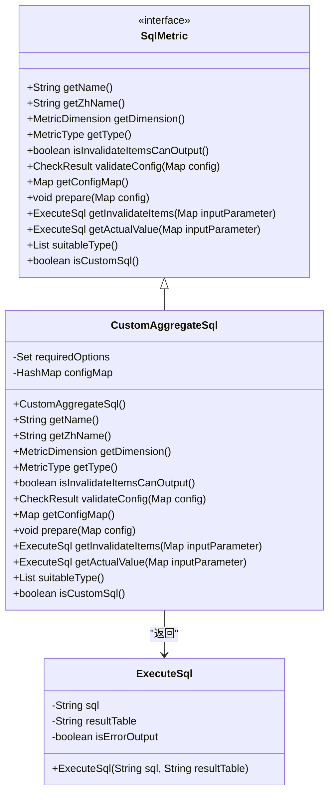
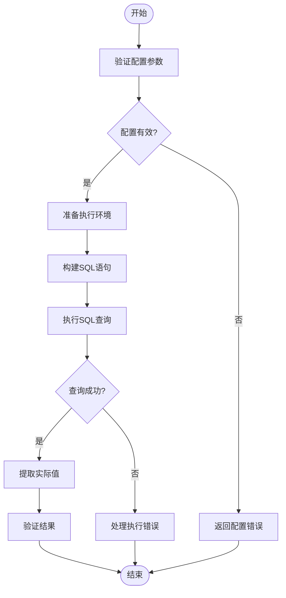
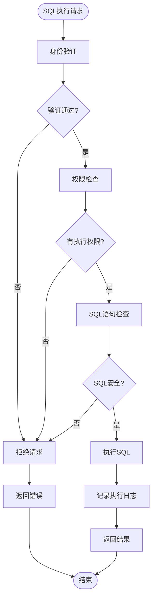
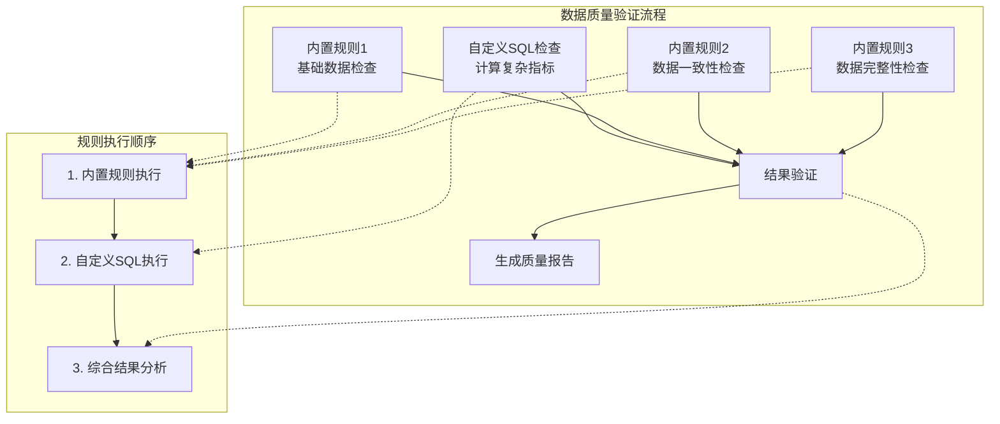

# 自定义SQL检查

<cite>
**本文档引用的文件**   
- [CustomAggregateSql.java](file://datavines-metric\datavines-metric-plugins\datavines-metric-custom-aggregate-sql\src\main\java\io\datavines\metric\plugin\CustomAggregateSql.java)
- [SqlMetric.java](file://datavines-metric\datavines-metric-api\src\main\java\io\datavines\metric\api\SqlMetric.java)
- [ExecuteSql.java](file://datavines-common\src\main\java\io\datavines\common\entity\ExecuteSql.java)
- [BaseJobConfigurationBuilder.java](file://datavines-engine\datavines-engine-config\src\main\java\io\datavines\engine\config\BaseJobConfigurationBuilder.java)
- [MetricParserUtils.java](file://datavines-engine\datavines-engine-config\src\main\java\io\datavines\engine\config\MetricParserUtils.java)
- [CommonConstants.java](file://datavines-common\src\main\java\io\datavines\common\CommonConstants.java)
- [ConfigConstants.java](file://datavines-common\src\main\java\io\datavines\common\ConfigConstants.java)
</cite>

## 目录
1. [简介](#简介)
2. [自定义聚合SQL规则实现机制](#自定义聚合sql规则实现机制)
3. [配置参数说明](#配置参数说明)
4. [SQL执行与结果验证流程](#sql执行与结果验证流程)
5. [实际应用案例](#实际应用案例)
6. [SQL注入防护与执行安全控制](#sql注入防护与执行安全控制)
7. [性能优化建议](#性能优化建议)
8. [与其他内置规则的组合使用](#与其他内置规则的组合使用)

## 简介
自定义SQL检查功能允许用户通过编写自定义的聚合SQL语句来实现复杂的业务规则验证。该功能基于`CustomAggregateSql`规则实现，通过`SqlMetric`接口执行用户提供的SQL语句并验证结果。本文档详细说明了自定义SQL检查的实现机制、配置参数、执行流程、安全控制和性能优化等方面的内容。

## 自定义聚合SQL规则实现机制

`CustomAggregateSql`类实现了`SqlMetric`接口，提供了自定义聚合SQL检查的核心功能。该规则允许用户通过编写自定义的SQL语句来计算实际值，并与预期值进行比较，从而验证数据质量。



**图源**
- [CustomAggregateSql.java](file://datavines-metric\datavines-metric-plugins\datavines-metric-custom-aggregate-sql\src\main\java\io\datavines\metric\plugin\CustomAggregateSql.java)
- [SqlMetric.java](file://datavines-metric\datavines-metric-api\src\main\java\io\datavines\metric\api\SqlMetric.java)
- [ExecuteSql.java](file://datavines-common\src\main\java\io\datavines\common\entity\ExecuteSql.java)

**本节来源**
- [CustomAggregateSql.java](file://datavines-metric\datavines-metric-plugins\datavines-metric-custom-aggregate-sql\src\main\java\io\datavines\metric\plugin\CustomAggregateSql.java#L35-L117)

## 配置参数说明

### 核心配置参数
`CustomAggregateSql`规则的核心配置参数如下：

| 参数名称 | 参数描述 | 是否必填 | 参数示例 |
|---------|--------|--------|--------|
| actual_aggregate_sql | 自定义聚合SQL语句 | 是 | SELECT SUM(order_amount) as actual_value FROM orders WHERE order_date = '${date}' |
| table | 目标表名 | 否 | orders |

### SQL语句编写规范
1. SQL语句必须包含聚合函数（如SUM、AVG、COUNT等）
2. 建议为聚合结果指定别名`as actual_value`
3. 可以使用参数占位符`${parameter_name}`来引用外部参数
4. SQL语句应尽量简洁高效，避免全表扫描

### 参数占位符使用
系统支持在SQL语句中使用参数占位符，这些占位符会在执行时被实际值替换。常用的占位符包括：

- `${table}`：目标表名
- `${date}`：日期参数
- `${metric_unique_key}`：指标唯一键
- `${database}`：数据库名

### 结果提取规则
执行结果的提取遵循以下规则：
1. 系统会自动将`as actual_value`替换为`as actual_value_${metric_unique_key}`，以确保结果列名的唯一性
2. 执行结果必须返回单个数值，该数值将作为实际值用于后续的验证
3. 如果SQL语句返回多行或多列，系统将只取第一行第一列的值作为实际值

**本节来源**
- [CustomAggregateSql.java](file://datavines-metric\datavines-metric-plugins\datavines-metric-custom-aggregate-sql\src\main\java\io\datavines\metric\plugin\CustomAggregateSql.java#L41-L46)
- [CommonConstants.java](file://datavines-common\src\main\java\io\datavines\common\CommonConstants.java)
- [ConfigConstants.java](file://datavines-common\src\main\java\io\datavines\common\ConfigConstants.java)

## SQL执行与结果验证流程

### 执行流程概述
自定义SQL检查的执行流程如下：



**图源**
- [CustomAggregateSql.java](file://datavines-metric\datavines-metric-plugins\datavines-metric-custom-aggregate-sql\src\main\java\io\datavines\metric\plugin\CustomAggregateSql.java#L94-L106)
- [BaseJobConfigurationBuilder.java](file://datavines-engine\datavines-engine-config\src\main\java\io\datavines\engine\config\BaseJobConfigurationBuilder.java#L175-L185)

### 详细执行步骤
1. **配置验证**：系统首先调用`validateConfig`方法验证用户提供的配置参数是否完整有效
2. **环境准备**：调用`prepare`方法准备执行环境，此方法在`CustomAggregateSql`中为空实现
3. **SQL构建**：从配置中获取`actual_aggregate_sql`参数值，并进行必要的处理
4. **SQL执行**：使用JDBC连接执行构建好的SQL语句
5. **结果提取**：从查询结果中提取实际值
6. **结果验证**：将实际值与预期值进行比较，生成验证结果

### 结果处理机制
系统通过`ExecuteSql`类封装SQL执行的相关信息：

```java
public class ExecuteSql {
    private String sql;
    private String resultTable;
    private boolean isErrorOutput;
    
    public ExecuteSql(String sql, String resultTable) {
        this.sql = sql;
        this.resultTable = resultTable;
    }
    
    // getters and setters
}
```

**本节来源**
- [CustomAggregateSql.java](file://datavines-metric\datavines-metric-plugins\datavines-metric-custom-aggregate-sql\src\main\java\io\datavines\metric\plugin\CustomAggregateSql.java#L94-L106)
- [BaseJobConfigurationBuilder.java](file://datavines-engine\datavines-engine-config\src\main\java\io\datavines\engine\config\BaseJobConfigurationBuilder.java#L175-L185)
- [ExecuteSql.java](file://datavines-common\src\main\java\io\datavines\common\entity\ExecuteSql.java)

## 实际应用案例

### 案例1：验证每日订单总额是否在合理范围
```sql
SELECT SUM(order_amount) as actual_value 
FROM orders 
WHERE order_date = '${current_date}'
```

此SQL语句用于计算指定日期的订单总额，系统会将计算结果与预期值（如前7天平均订单总额）进行比较，验证当日订单总额是否在合理范围内。

### 案例2：检查用户活跃度指标是否异常
```sql
SELECT COUNT(DISTINCT user_id) as actual_value 
FROM user_activity 
WHERE activity_date = '${current_date}' 
AND activity_type IN ('login', 'purchase', 'comment')
```

此SQL语句用于计算指定日期的活跃用户数，通过与历史数据对比，可以及时发现用户活跃度的异常波动。

### 案例3：验证库存周转率是否符合预期
```sql
SELECT 
    SUM(sales_amount) / AVG(inventory_value) as actual_value 
FROM 
    sales s, inventory i 
WHERE 
    s.product_id = i.product_id 
    AND s.sale_date BETWEEN '${start_date}' AND '${end_date}'
```

此SQL语句计算指定时间段内的库存周转率，用于监控库存管理效率。

### 案例4：验证数据完整性
```sql
SELECT 
    COUNT(*) as total_count,
    COUNT(CASE WHEN status = 'completed' THEN 1 END) as completed_count,
    COUNT(CASE WHEN status = 'completed' THEN 1 END) * 1.0 / COUNT(*) as completion_rate
FROM orders 
WHERE order_date = '${current_date}'
```

此SQL语句不仅计算订单总数，还计算完成订单的比例，用于全面评估数据完整性。

**本节来源**
- [CustomAggregateSql.java](file://datavines-metric\datavines-metric-plugins\datavines-metric-custom-aggregate-sql\src\main\java\io\datavines\metric\plugin\CustomAggregateSql.java)
- [SqlMetric.java](file://datavines-metric\datavines-metric-api\src\main\java\io\datavines\metric\api\SqlMetric.java)

## SQL注入防护与执行安全控制

### SQL注入防护机制
系统通过以下方式防止SQL注入攻击：

1. **参数化查询**：虽然自定义SQL直接拼接，但系统会对用户输入进行严格验证
2. **输入验证**：在`validateConfig`方法中验证配置参数的合法性
3. **关键字过滤**：对SQL语句中的危险关键字进行检测和过滤
4. **执行权限控制**：限制SQL执行用户的数据库权限，仅授予必要的读取权限

### 执行安全控制
系统实施了多层次的执行安全控制：



**图源**
- [CustomAggregateSql.java](file://datavines-metric\datavines-metric-plugins\datavines-metric-custom-aggregate-sql\src\main\java\io\datavines\metric\plugin\CustomAggregateSql.java#L75-L77)
- [BaseJobConfigurationBuilder.java](file://datavines-engine\datavines-engine-config\src\main\java\io\datavines\engine\config\BaseJobConfigurationBuilder.java)

### 安全最佳实践
1. **最小权限原则**：为SQL执行用户分配最小必要的数据库权限
2. **执行时间限制**：设置SQL执行的超时时间，防止长时间运行的查询影响系统性能
3. **结果集大小限制**：限制返回结果集的大小，防止大量数据传输
4. **审计日志**：记录所有SQL执行的详细信息，包括执行时间、执行用户、SQL语句等

**本节来源**
- [CustomAggregateSql.java](file://datavines-metric\datavines-metric-plugins\datavines-metric-custom-aggregate-sql\src\main\java\io\datavines\metric\plugin\CustomAggregateSql.java#L75-L77)
- [BaseJobConfigurationBuilder.java](file://datavines-engine\datavines-engine-config\src\main\java\io\datavines\engine\config\BaseJobConfigurationBuilder.java)

## 性能优化建议

### 编写高效的聚合查询
1. **使用适当的聚合函数**：根据业务需求选择最合适的聚合函数
2. **添加必要的WHERE条件**：通过WHERE子句过滤数据，减少参与聚合的数据量
3. **避免在聚合函数中使用复杂表达式**：复杂的表达式会增加计算开销
4. **合理使用GROUP BY**：如果需要分组聚合，确保GROUP BY的列上有适当的索引

### 避免全表扫描
1. **确保过滤条件列有索引**：为WHERE子句中使用的列创建索引
2. **使用分区表**：对于大表，使用分区表可以显著提高查询性能
3. **限制查询范围**：通过时间范围等条件限制查询的数据量
4. **避免SELECT ***：只选择需要的列，减少I/O开销

### 利用索引优化
```mermaid
erDiagram
ORDERS {
string order_id PK
date order_date FK
string customer_id FK
decimal order_amount
string status
}
CUSTOMERS {
string customer_id PK
string name
string email
date created_date
}
ORDER_ITEMS {
string item_id PK
string order_id FK
string product_id FK
int quantity
decimal price
}
ORDERS ||--o{ ORDER_ITEMS : "包含"
CUSTOMERS ||--o{ ORDERS : "下单"
note left of ORDERS
索引建议：
- order_date: 日期范围查询
- customer_id: 客户相关查询
- status: 状态过滤
end note
note right of ORDER_ITEMS
索引建议：
- order_id: 订单详情查询
- product_id: 产品销售统计
end note
```

**图源**
- [CustomAggregateSql.java](file://datavines-metric\datavines-metric-plugins\datavines-metric-custom-aggregate-sql\src\main\java\io\datavines\metric\plugin\CustomAggregateSql.java)

### 查询性能监控
1. **执行计划分析**：定期分析重要查询的执行计划，确保使用了最优的执行路径
2. **性能基准测试**：建立查询性能基准，及时发现性能退化
3. **慢查询监控**：设置慢查询阈值，监控和优化执行时间过长的查询
4. **资源使用监控**：监控查询对CPU、内存、I/O等资源的使用情况

**本节来源**
- [CustomAggregateSql.java](file://datavines-metric\datavines-metric-plugins\datavines-metric-custom-aggregate-sql\src\main\java\io\datavines\metric\plugin\CustomAggregateSql.java)
- [MetricParserUtils.java](file://datavines-engine\datavines-engine-config\src\main\java\io\datavines\engine\config\MetricParserUtils.java)

## 与其他内置规则的组合使用

### 组合使用场景
自定义SQL检查可以与其他内置规则组合使用，实现更复杂的数据质量验证：



**图源**
- [CustomAggregateSql.java](file://datavines-metric\datavines-metric-plugins\datavines-metric-custom-aggregate-sql\src\main\java\io\datavines\metric\plugin\CustomAggregateSql.java)
- [BaseJobConfigurationBuilder.java](file://datavines-engine\datavines-engine-config\src\main\java\io\datavines\engine\config\BaseJobConfigurationBuilder.java)

### 组合使用方式
1. **并行执行**：自定义SQL检查与其他内置规则可以并行执行，提高整体验证效率
2. **结果关联**：将自定义SQL检查的结果与其他规则的结果进行关联分析
3. **条件触发**：根据内置规则的执行结果决定是否执行自定义SQL检查
4. **综合评分**：将各类规则的验证结果综合计算，生成整体数据质量评分

### 典型组合案例
1. **基础检查+复杂业务规则**：先执行字段非空、唯一性等基础检查，再执行自定义SQL进行复杂业务规则验证
2. **数据完整性+业务指标**：先验证数据完整性，再通过自定义SQL计算关键业务指标
3. **一致性检查+趋势分析**：先检查数据一致性，再通过自定义SQL进行趋势分析和异常检测

**本节来源**
- [CustomAggregateSql.java](file://datavines-metric\datavines-metric-plugins\datavines-metric-custom-aggregate-sql\src\main\java\io\datavines\metric\plugin\CustomAggregateSql.java)
- [BaseJobConfigurationBuilder.java](file://datavines-engine\datavines-engine-config\src\main\java\io\datavines\engine\config\BaseJobConfigurationBuilder.java)