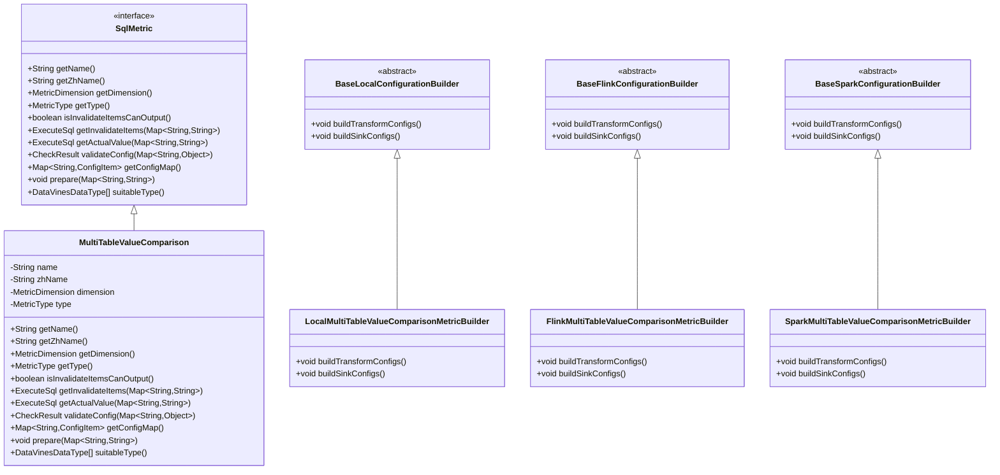
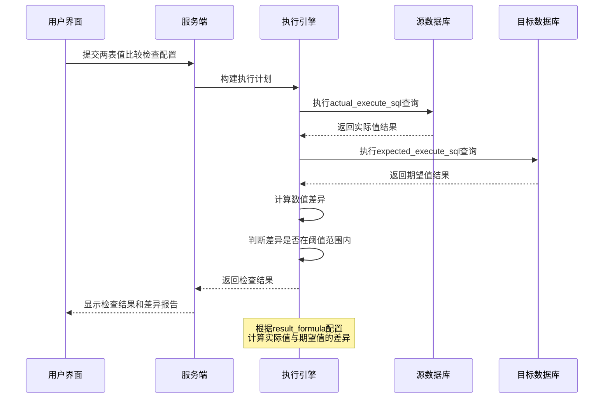
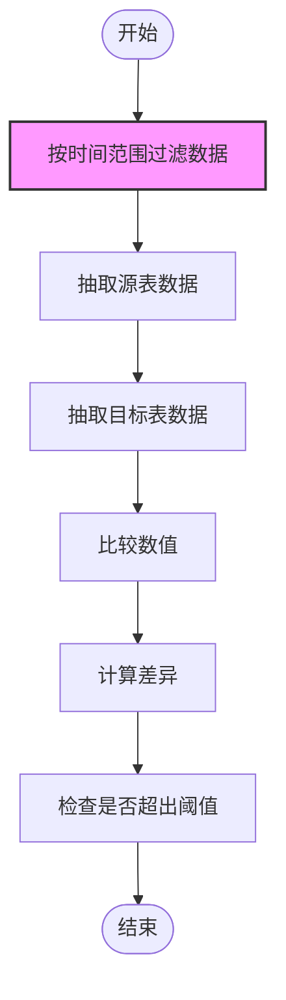

# 两表值比较检查

<cite>
**本文档引用的文件**  
- [MultiTableValueComparison.java](file://datavines-metric\datavines-metric-plugins\datavines-metric-multi-table-value-comparison\src\main\java\io\datavines\metric\plugin\MultiTableValueComparison.java)
- [LocalMultiTableValueComparisonMetricBuilder.java](file://datavines-engine\datavines-engine-plugins\datavines-engine-local\datavines-engine-local-config\src\main\java\io\datavines\engine\local\config\LocalMultiTableValueComparisonMetricBuilder.java)
- [FlinkMultiTableValueComparisonMetricBuilder.java](file://datavines-engine\datavines-engine-plugins\datavines-engine-flink\datavines-engine-flink-config\src\main\java\io\datavines\engine\flink\config\FlinkMultiTableValueComparisonMetricBuilder.java)
- [SparkMultiTableValueComparisonMetricBuilder.java](file://datavines-engine\datavines-engine-plugins\datavines-engine-spark\datavines-engine-spark-config\src\main\java\io\datavines\engine\spark\config\SparkMultiTableValueComparisonMetricBuilder.java)
- [ConfigConstants.java](file://datavines-common\src\main\java\io\datavines\common\ConfigConstants.java)
- [CommonConstants.java](file://datavines-common\src\main\java\io\datavines\common\CommonConstants.java)
- [RuleSelect/index.tsx](file://datavines-ui\Editor\components\MetricModal\RuleSelect\index.tsx)
- [MetricType.java](file://datavines-metric\datavines-metric-api\src\main\java\io\datavines\metric\api\MetricType.java)
</cite>

## 目录
1. [简介](#简介)
2. [核心组件](#核心组件)
3. [配置参数详解](#配置参数详解)
4. [实现原理](#实现原理)
5. [使用场景与配置示例](#使用场景与配置示例)
6. [性能优化策略](#性能优化策略)
7. [常见问题与解决方案](#常见问题与解决方案)
8. [结论](#结论)

## 简介
两表值比较检查（MultiTableValueComparison）是DataVines数据质量框架中的一个重要功能，用于验证两个不同表中具有相同业务含义的字段在数值上的一致性。该功能特别适用于ETL过程中的数据转换验证、不同业务系统间关键指标的核对等场景。通过比较源系统和目标系统中的金额字段等关键数值，确保数据在迁移或处理过程中的准确性。

## 核心组件

两表值比较检查功能由多个核心组件构成，包括度量指标实现、配置构建器和用户界面组件。`MultiTableValueComparison`类是该功能的核心实现，实现了`SqlMetric`接口，定义了度量的基本属性和行为。该类位于`datavines-metric-plugins`模块中，负责定义度量的名称、维度和类型等元数据。



**图源**  
- [MultiTableValueComparison.java](file://datavines-metric\datavines-metric-plugins\datavines-metric-multi-table-value-comparison\src\main\java\io\datavines\metric\plugin\MultiTableValueComparison.java)
- [LocalMultiTableValueComparisonMetricBuilder.java](file://datavines-engine\datavines-engine-plugins\datavines-engine-local\datavines-engine-local-config\src\main\java\io\datavines\engine\local\config\LocalMultiTableValueComparisonMetricBuilder.java)
- [FlinkMultiTableValueComparisonMetricBuilder.java](file://datavines-engine\datavines-engine-plugins\datavines-engine-flink\datavines-engine-flink-config\src\main\java\io\datavines\engine\flink\config\FlinkMultiTableValueComparisonMetricBuilder.java)
- [SparkMultiTableValueComparisonMetricBuilder.java](file://datavines-engine\datavines-engine-plugins\datavines-engine-spark\datavines-engine-spark-config\src\main\java\io\datavines\engine\spark\config\SparkMultiTableValueComparisonMetricBuilder.java)

**章节源**  
- [MultiTableValueComparison.java](file://datavines-metric\datavines-metric-plugins\datavines-metric-multi-table-value-comparison\src\main\java\io\datavines\metric\plugin\MultiTableValueComparison.java#L31-L87)
- [LocalMultiTableValueComparisonMetricBuilder.java](file://datavines-engine\datavines-engine-plugins\datavines-engine-local\datavines-engine-local-config\src\main\java\io\datavines\engine\local\config\LocalMultiTableValueComparisonMetricBuilder.java#L45-L141)
- [FlinkMultiTableValueComparisonMetricBuilder.java](file://datavines-engine\datavines-engine-plugins\datavines-engine-flink\datavines-engine-flink-config\src\main\java\io\datavines\engine\flink\config\FlinkMultiTableValueComparisonMetricBuilder.java#L31-L76)
- [SparkMultiTableValueComparisonMetricBuilder.java](file://datavines-engine\datavines-engine-plugins\datavines-engine-spark\datavines-engine-spark-config\src\main\java\io\datavines\engine\spark\config\SparkMultiTableValueComparisonMetricBuilder.java#L31-L76)

## 配置参数详解

两表值比较检查功能提供了丰富的配置参数，以满足不同场景下的需求。主要配置参数包括两个表的连接信息、用于比较的字段选择、容差阈值设置等。

### 基本配置参数

| 参数名称 | 参数说明 | 配置来源 |
|--------|--------|--------|
| `table` | 源表名称 | ConfigConstants.TABLE |
| `table2` | 目标表名称 | CommonConstants.TABLE2 |
| `datasource_id` | 源数据源ID | ConfigConstants.DATASOURCE_ID |
| `target_datasource_id` | 目标数据源ID | ConfigConstants.TARGET_DATASOURCE_ID |
| `actual_execute_sql` | 源表实际值查询SQL | ConfigConstants.ACTUAL_EXECUTE_SQL |
| `expected_execute_sql` | 目标表期望值查询SQL | ConfigConstants.EXPECTED_EXECUTE_SQL |
| `threshold` | 容差阈值 | ConfigConstants.THRESHOLD |
| `result_formula` | 结果计算公式 | ConfigConstants.RESULT_FORMULA |

### 高级配置参数

| 参数名称 | 参数说明 | 配置来源 |
|--------|--------|--------|
| `mappingColumns` | 字段映射关系 | ConfigConstants.MAPPING_COLUMNS |
| `on_clause` | 表连接条件 | ConfigConstants.ON_CLAUSE |
| `where_clause` | 查询过滤条件 | ConfigConstants.WHERE_CLAUSE |
| `failure_strategy` | 失败处理策略 | ConfigConstants.FAILURE_STRATEGY |
| `data_time` | 数据时间 | ConfigConstants.DATA_TIME |

**章节源**  
- [ConfigConstants.java](file://datavines-common\src\main\java\io\datavines\common\ConfigConstants.java#L20-L183)
- [CommonConstants.java](file://datavines-common\src\main\java\io\datavines\common\CommonConstants.java#L177-L180)

## 实现原理

两表值比较检查的实现原理主要包括数据抽取、字段映射、数值计算和差异判断等步骤。系统首先从两个不同的数据源中抽取数据，然后根据配置的字段映射关系进行数据对齐，最后计算数值差异并判断是否在允许的容差范围内。



**图源**  
- [LocalMultiTableValueComparisonMetricBuilder.java](file://datavines-engine\datavines-engine-plugins\datavines-engine-local\datavines-engine-local-config\src\main\java\io\datavines\engine\local\config\LocalMultiTableValueComparisonMetricBuilder.java#L48-L84)
- [MultiTableValueComparison.java](file://datavines-metric\datavines-metric-plugins\datavines-metric-multi-table-value-comparison\src\main\java\io\datavines\metric\plugin\MultiTableValueComparison.java#L31-L87)

**章节源**  
- [LocalMultiTableValueComparisonMetricBuilder.java](file://datavines-engine\datavines-engine-plugins\datavines-engine-local\datavines-engine-local-config\src\main\java\io\datavines\engine\local\config\LocalMultiTableValueComparisonMetricBuilder.java#L48-L84)
- [FlinkMultiTableValueComparisonMetricBuilder.java](file://datavines-engine\datavines-engine-plugins\datavines-engine-flink\datavines-engine-flink-config\src\main\java\io\datavines\engine\flink\config\FlinkMultiTableValueComparisonMetricBuilder.java#L34-L51)
- [SparkMultiTableValueComparisonMetricBuilder.java](file://datavines-engine\datavines-engine-plugins\datavines-engine-spark\datavines-engine-spark-config\src\main\java\io\datavines\engine\spark\config\SparkMultiTableValueComparisonMetricBuilder.java#L34-L51)

## 使用场景与配置示例

### ETL过程中的数据转换验证

在ETL（Extract, Transform, Load）过程中，数据从源系统抽取后经过转换加载到目标系统。两表值比较检查可以用于验证转换前后的数据一致性，确保关键业务指标在转换过程中没有发生意外变化。

```json
{
  "metric_type": "multi_table_value_comparison",
  "metric_parameter": {
    "datasource_id": "source_datasource_001",
    "table": "sales_fact",
    "actual_execute_sql": "SELECT SUM(amount) as actual_value FROM sales_fact WHERE date = '${system.biz.date}'",
    "target_datasource_id": "target_datasource_001",
    "table2": "sales_fact_dw",
    "expected_execute_sql": "SELECT SUM(amount) as expected_value FROM sales_fact_dw WHERE date = '${system.biz.date}'",
    "threshold": "0.01",
    "result_formula": "diff_percentage"
  }
}
```

### 不同业务系统间关键指标核对

当企业有多个业务系统（如ERP、CRM、财务系统）时，可以通过两表值比较检查来核对各系统间的关键业务指标是否一致，及时发现数据不一致问题。

```json
{
  "metric_type": "multi_table_value_comparison",
  "metric_parameter": {
    "datasource_id": "erp_datasource",
    "table": "order_header",
    "actual_execute_sql": "SELECT COUNT(*) as actual_value FROM order_header WHERE order_date = '${system.biz.date}' AND status = 'COMPLETED'",
    "target_datasource_id": "crm_datasource",
    "table2": "customer_order",
    "expected_execute_sql": "SELECT COUNT(*) as expected_value FROM customer_order WHERE order_date = '${system.biz.date}' AND status = 'SHIPPED'",
    "threshold": "0",
    "result_formula": "diff"
  }
}
```

**章节源**  
- [RuleSelect/index.tsx](file://datavines-ui\Editor\components\MetricModal\RuleSelect\index.tsx#L371-L394)
- [LocalMultiTableValueComparisonMetricBuilder.java](file://datavines-engine\datavines-engine-plugins\datavines-engine-local\datavines-engine-local-config\src\main\java\io\datavines\engine\local\config\LocalMultiTableValueComparisonMetricBuilder.java#L86-L102)

## 性能优化策略

### 时间范围过滤减少数据量

在配置查询SQL时，应尽量使用时间范围过滤条件，避免全表扫描。可以利用DataVines提供的系统参数（如`${system.biz.date}`）来动态指定查询的时间范围。



**图源**  
- [LocalMultiTableValueComparisonMetricBuilder.java](file://datavines-engine\datavines-engine-plugins\datavines-engine-local\datavines-engine-local-config\src\main\java\io\datavines\engine\local\config\LocalMultiTableValueComparisonMetricBuilder.java#L87-L92)
- [CommonConstants.java](file://datavines-common\src\main\java\io\datavines\common\CommonConstants.java#L277-L282)

### 大规模数据的增量比对

对于大规模数据的比对，建议采用增量比对策略，只比对最近一段时间内发生变化的数据，而不是全量比对。可以通过在查询SQL中添加增量条件来实现。

```sql
-- 源表增量查询
SELECT SUM(amount) as actual_value 
FROM sales_fact 
WHERE update_time >= '${last_check_time}' 
  AND date = '${system.biz.date}'

-- 目标表增量查询  
SELECT SUM(amount) as expected_value 
FROM sales_fact_dw 
WHERE update_time >= '${last_check_time}' 
  AND date = '${system.biz.date}'
```

**章节源**  
- [ConfigConstants.java](file://datavines-common\src\main\java\io\datavines\common\ConfigConstants.java#L61-L62)
- [LocalMultiTableValueComparisonMetricBuilder.java](file://datavines-engine\datavines-engine-plugins\datavines-engine-local\datavines-engine-local-config\src\main\java\io\datavines\engine\local\config\LocalMultiTableValueComparisonMetricBuilder.java#L87-L92)

## 常见问题与解决方案

### 单位不一致问题

当源系统和目标系统的数值单位不一致时（如源系统为元，目标系统为分），需要在查询SQL中进行单位转换。

**解决方案**：
```sql
-- 源表查询（元转换为分）
SELECT SUM(amount * 100) as actual_value FROM sales_fact WHERE date = '${system.biz.date}'

-- 目标表查询（保持为分）
SELECT SUM(amount) as expected_value FROM sales_fact_dw WHERE date = '${system.biz.date}'
```

### 汇率换算问题

当涉及跨国业务时，不同系统的货币单位可能不同，需要考虑汇率换算。

**解决方案**：
```sql
-- 使用汇率表进行换算
SELECT SUM(s.amount * r.rate) as actual_value 
FROM sales_fact s
JOIN exchange_rate r ON s.currency = r.from_currency AND r.to_currency = 'CNY' AND r.date = '${system.biz.date}'
WHERE s.date = '${system.biz.date}'
```

### 四舍五入误差

由于不同系统可能采用不同的四舍五入规则，可能导致微小的数值差异。

**解决方案**：
1. 设置合理的容差阈值（如0.01）
2. 在比较前统一四舍五入规则
```sql
-- 统一保留两位小数
SELECT ROUND(SUM(amount), 2) as actual_value FROM sales_fact WHERE date = '${system.biz.date}'
```

**章节源**  
- [ConfigConstants.java](file://datavines-common\src\main\java\io\datavines\common\ConfigConstants.java#L52-L53)
- [LocalMultiTableValueComparisonMetricBuilder.java](file://datavines-engine\datavines-engine-plugins\datavines-engine-local\datavines-engine-local-config\src\main\java\io\datavines\engine\local\config\LocalMultiTableValueComparisonMetricBuilder.java#L64-L68)

## 结论

两表值比较检查是DataVines数据质量框架中一个强大而灵活的功能，能够有效验证不同表之间关键数值的一致性。通过合理的配置和使用，可以确保数据在ETL过程、系统迁移和业务运营中的准确性。该功能支持多种执行引擎（Local、Flink、Spark），并提供了丰富的配置选项和性能优化策略，能够满足不同规模和复杂度的数据质量检查需求。在实际应用中，应注意处理单位不一致、汇率换算和四舍五入误差等常见问题，以确保检查结果的准确性和可靠性。