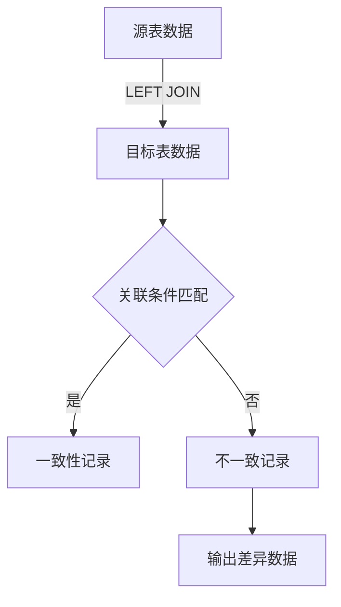
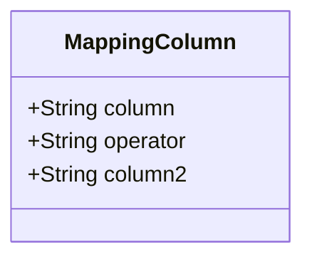
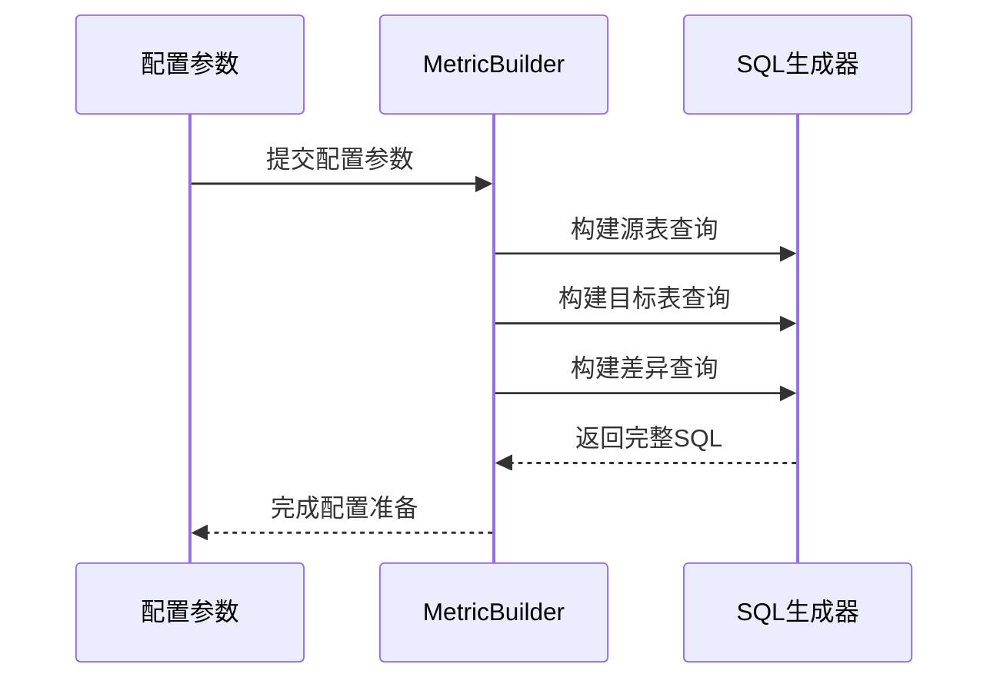
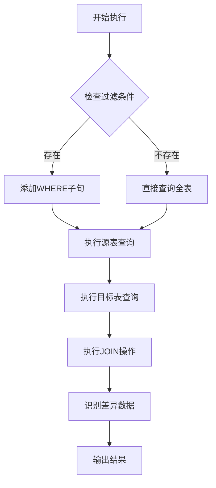
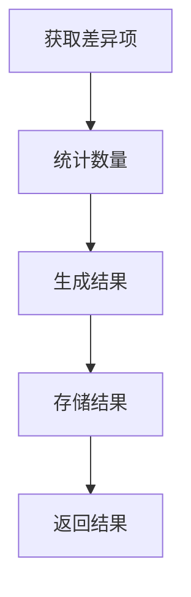

# 跨表准确性检查

<cite>
**本文档中引用的文件**  
- [MultiTableAccuracy.java](file://datavines-metric\datavines-metric-plugins\datavines-metric-multi-table-accuracy\src\main\java\io\datavines\metric\plugin\MultiTableAccuracy.java)
- [SparkMultiTableAccuracyMetricBuilder.java](file://datavines-engine\datavines-engine-plugins\datavines-engine-spark\datavines-engine-spark-config\src\main\java\io\datavines\engine\spark\config\SparkMultiTableAccuracyMetricBuilder.java)
- [LocalMultiTableAccuracyMetricBuilder.java](file://datavines-engine\datavines-engine-plugins\datavines-engine-local\datavines-engine-local-config\src\main\java\io\datavines\engine\local\config\LocalMultiTableAccuracyMetricBuilder.java)
- [FlinkMultiTableAccuracyMetricBuilder.java](file://datavines-engine\datavines-engine-plugins\datavines-engine-flink\datavines-engine-flink-config\src\main\java\io\datavines\engine\flink\config\FlinkMultiTableAccuracyMetricBuilder.java)
- [MetricParserUtils.java](file://datavines-engine\datavines-engine-config\src\main\java\io\datavines\engine\config\MetricParserUtils.java)
- [MappingColumn.java](file://datavines-common\src\main\java\io\datavines\common\entity\MappingColumn.java)
- [submit_job_mysql_storage.json](file://datavines-runner\src\main\resources\submit_job_mysql_storage.json)
</cite>

## 目录
1. [简介](#简介)
2. [核心实现机制](#核心实现机制)
3. [配置参数详解](#配置参数详解)
4. [使用场景与示例](#使用场景与示例)
5. [执行流程分析](#执行流程分析)
6. [性能优化策略](#性能优化策略)
7. [常见问题与解决方案](#常见问题与解决方案)
8. [总结](#总结)

## 简介

跨表准确性检查（MultiTableAccuracy）是DataVines数据质量框架中的一个重要功能，用于验证两个数据表之间的数据一致性。该功能通过主键或唯一键关联源表和目标表，检查两个表之间的数据是否一致，从而确保数据在迁移、同步或复制过程中的准确性。

该功能适用于多种场景，包括数据迁移验证、主从数据库同步校验、ETL过程数据一致性检查等。通过精确的数据比对，可以帮助用户及时发现数据不一致问题，保障数据质量。

**Section sources**
- [MultiTableAccuracy.java](file://datavines-metric\datavines-metric-plugins\datavines-metric-multi-table-accuracy\src\main\java\io\datavines\metric\plugin\MultiTableAccuracy.java#L44-L47)

## 核心实现机制

跨表准确性检查的核心实现基于SQL的JOIN操作，通过LEFT JOIN将源表和目标表进行关联，然后识别出在源表中存在但在目标表中不存在的记录。

### 数据比对原理

跨表准确性检查的实现原理主要依赖于三个核心SQL语句的构建：

1. **源表查询语句**：`SELECT * FROM ${table}`
2. **目标表查询语句**：`SELECT * FROM ${table2}`
3. **差异项查询语句**：通过LEFT JOIN构建的复合查询



**Diagram sources**
- [MultiTableAccuracy.java](file://datavines-metric\datavines-metric-plugins\datavines-metric-multi-table-accuracy\src\main\java\io\datavines\metric\plugin\MultiTableAccuracy.java#L33-L37)

### 关联字段配置

系统通过`MappingColumn`类来定义两个表之间的字段映射关系。每个`MappingColumn`对象包含三个属性：
- `column`：源表字段名
- `operator`：比较操作符
- `column2`：目标表字段名

这些映射关系用于构建JOIN条件和WHERE子句，确保两个表能够正确关联。



**Diagram sources**
- [MappingColumn.java](file://datavines-common\src\main\java\io\datavines\common\entity\MappingColumn.java#L29-L36)

**Section sources**
- [MultiTableAccuracy.java](file://datavines-metric\datavines-metric-plugins\datavines-metric-multi-table-accuracy\src\main\java\io\datavines\metric\plugin\MultiTableAccuracy.java#L33-L94)
- [MappingColumn.java](file://datavines-common\src\main\java\io\datavines\common\entity\MappingColumn.java#L29-L36)

## 配置参数详解

跨表准确性检查功能提供了丰富的配置参数，允许用户灵活定义数据比对的各个方面。

### 基础连接配置

| 参数 | 说明 | 必填 |
|------|------|------|
| `table` | 源表名称 | 是 |
| `table2` | 目标表名称 | 是 |
| `database` | 源表数据库 | 是 |
| `database2` | 目标表数据库 | 否 |
| `filter` | 源表过滤条件 | 否 |
| `filter2` | 目标表过滤条件 | 否 |

### 字段映射配置

字段映射通过`MAPPING_COLUMNS`参数进行配置，采用JSON数组格式定义多个字段的映射关系：

```json
[
  {
    "column": "id",
    "operator": "=",
    "column2": "user_id"
  },
  {
    "column": "name",
    "operator": "=",
    "column2": "full_name"
  }
]
```

### 别名配置

| 参数 | 说明 |
|------|------|
| `table_alias` | 源表别名 |
| `table2_alias` | 目标表别名 |
| `table_alias_columns` | 源表字段列表 |
| `table2_alias_columns` | 目标表字段列表 |

### 关联条件配置

系统自动根据字段映射生成JOIN条件和WHERE子句：

- `ON_CLAUSE`：基于字段映射生成的JOIN条件
- `WHERE_CLAUSE`：用于识别不一致记录的过滤条件

**Section sources**
- [SparkMultiTableAccuracyMetricBuilder.java](file://datavines-engine\datavines-engine-plugins\datavines-engine-spark\datavines-engine-spark-config\src\main\java\io\datavines\engine\spark\config\SparkMultiTableAccuracyMetricBuilder.java#L53-L57)
- [LocalMultiTableAccuracyMetricBuilder.java](file://datavines-engine\datavines-engine-plugins\datavines-engine-local\datavines-engine-local-config\src\main\java\io\datavines\engine\local\config\LocalMultiTableAccuracyMetricBuilder.java#L57-L61)

## 使用场景与示例

### 数据迁移验证

在数据从旧系统迁移到新系统后，使用跨表准确性检查验证数据完整性：

```json
{
  "metricParameterList": [
    {
      "metricType": "multi_table_accuracy",
      "metricParameter": {
        "table": "users_old",
        "table2": "users_new",
        "database": "legacy_db",
        "database2": "modern_db",
        "mapping_columns": "[{\"column\":\"id\",\"operator\":\"=\",\"column2\":\"user_id\"},{\"column\":\"email\",\"operator\":\"=\",\"column2\":\"email\"}]",
        "table_alias": "t1",
        "table2_alias": "t2"
      }
    }
  ]
}
```

### 主从数据库同步校验

定期检查主数据库和从数据库之间的数据一致性：

```json
{
  "metricParameterList": [
    {
      "metricType": "multi_table_accuracy",
      "metricParameter": {
        "table": "orders",
        "table2": "orders",
        "database": "master_db",
        "database2": "slave_db",
        "filter": "created_date > '2023-01-01'",
        "filter2": "created_date > '2023-01-01'",
        "mapping_columns": "[{\"column\":\"order_id\",\"operator\":\"=\",\"column2\":\"order_id\"},{\"column\":\"amount\",\"operator\":\"=\",\"column2\":\"amount\"}]"
      }
    }
  ]
}
```

### ETL过程数据一致性检查

在ETL流程完成后，验证源数据和目标数据仓库之间的一致性：

```json
{
  "metricParameterList": [
    {
      "metricType": "multi_table_accuracy",
      "metricParameter": {
        "table": "raw_sales",
        "table2": "dw_sales_fact",
        "database": "staging",
        "database2": "data_warehouse",
        "mapping_columns": "[{\"column\":\"transaction_id\",\"operator\":\"=\",\"column2\":\"fact_id\"},{\"column\":\"amount\",\"operator\":\"=\",\"column2\":\"sales_amount\"},{\"column\":\"customer_id\",\"operator\":\"=\",\"column2\":\"customer_dim_id\"}]",
        "table_alias": "src",
        "table2_alias": "tgt"
      }
    }
  ]
}
```

**Section sources**
- [submit_job_mysql_storage.json](file://datavines-runner\src\main\resources\submit_job_mysql_storage.json#L17-L32)

## 执行流程分析

跨表准确性检查的执行流程分为多个阶段，每个阶段都有明确的职责。

### 配置准备阶段

在`prepare`方法中，系统根据配置参数构建SQL查询语句：



**Diagram sources**
- [MultiTableAccuracy.java](file://datavines-metric\datavines-metric-plugins\datavines-metric-multi-table-accuracy\src\main\java\io\datavines\metric\plugin\MultiTableAccuracy.java#L80-L94)

### 数据抽取阶段

系统执行构建好的SQL语句，从源表和目标表抽取数据：



**Diagram sources**
- [MultiTableAccuracy.java](file://datavines-metric\datavines-metric-plugins\datavines-metric-multi-table-accuracy\src\main\java\io\datavines\metric\plugin\MultiTableAccuracy.java#L102-L109)

### 结果计算阶段

系统通过以下步骤计算最终结果：

1. 执行`getInvalidateItems`获取不一致的记录
2. 执行`getActualValue`统计不一致记录的数量
3. 执行`getDirectActualValue`直接获取统计结果



**Diagram sources**
- [MultiTableAccuracy.java](file://datavines-metric\datavines-metric-plugins\datavines-metric-multi-table-accuracy\src\main\java\io\datavines\metric\plugin\MultiTableAccuracy.java#L102-L129)

**Section sources**
- [MultiTableAccuracy.java](file://datavines-metric\datavines-metric-plugins\datavines-metric-multi-table-accuracy\src\main\java\io\datavines\metric\plugin\MultiTableAccuracy.java#L80-L129)

## 性能优化策略

### 分区字段利用

对于大表数据比对，建议使用分区字段来减少数据扫描量：

```json
{
  "filter": "partition_date = '2023-01-01'",
  "filter2": "partition_date = '2023-01-01'"
}
```

通过在`filter`和`filter2`参数中指定分区条件，可以显著减少需要比对的数据量，提高执行效率。

### 大表JOIN优化

对于大表JOIN操作，系统提供了以下优化策略：

1. **索引利用**：确保关联字段上有适当的索引
2. **数据预过滤**：通过`filter`参数提前过滤数据
3. **分批处理**：对于超大表，考虑分批进行数据比对

### 执行引擎优化

不同执行引擎的优化配置：

#### Spark引擎优化
```java
// Spark引擎配置优化
SparkMultiTableAccuracyMetricBuilder builder = new SparkMultiTableAccuracyMetricBuilder();
// 启用广播JOIN优化小表
builder.setBroadcastJoinThreshold(10485760); // 10MB
```

#### Flink引擎优化
```java
// Flink引擎配置优化
FlinkMultiTableAccuracyMetricBuilder builder = new FlinkMultiTableAccuracyMetricBuilder();
// 配置状态后端和检查点
builder.setStateBackend("rocksdb");
builder.setCheckpointInterval(60000);
```

#### Local引擎优化
```java
// Local引擎配置优化
LocalMultiTableAccuracyMetricBuilder builder = new LocalMultiTableAccuracyMetricBuilder();
// 配置内存限制
builder.setMaxMemory("2g");
// 启用并行处理
builder.setParallelism(4);
```

**Section sources**
- [SparkMultiTableAccuracyMetricBuilder.java](file://datavines-engine\datavines-engine-plugins\datavines-engine-spark\datavines-engine-spark-config\src\main\java\io\datavines\engine\spark\config\SparkMultiTableAccuracyMetricBuilder.java#L44-L63)
- [FlinkMultiTableAccuracyMetricBuilder.java](file://datavines-engine\datavines-engine-plugins\datavines-engine-flink\datavines-engine-flink-config\src\main\java\io\datavines\engine\flink\config\FlinkMultiTableAccuracyMetricBuilder.java#L42-L61)
- [LocalMultiTableAccuracyMetricBuilder.java](file://datavines-engine\datavines-engine-plugins\datavines-engine-local\datavines-engine-local-config\src\main\java\io\datavines\engine\local\config\LocalMultiTableAccuracyMetricBuilder.java#L48-L67)

## 常见问题与解决方案

### 数据类型不匹配

**问题描述**：源表和目标表的关联字段数据类型不一致，导致JOIN失败。

**解决方案**：
1. 在数据库中统一字段数据类型
2. 使用CAST函数进行类型转换
3. 在配置中添加类型转换规则

```json
{
  "mapping_columns": "[{\"column\":\"id\",\"operator\":\"=\",\"column2\":\"CAST(user_id AS VARCHAR)\"}]"
}
```

### 空值处理

**问题描述**：NULL值在JOIN操作中不匹配，导致误报不一致记录。

**解决方案**：
1. 使用COALESCE函数处理NULL值
2. 在WHERE子句中明确处理NULL情况
3. 配置空值替换规则

```java
// 在MetricParserUtils中处理空值
public static String getCoalesceString(String table, String column, boolean needQuote) {
    return String.format("COALESCE(CAST(%s.%s AS STRING), '')", table, QuoteIdentifier.quote(column, needQuote));
}
```

### 字符编码差异

**问题描述**：不同数据库系统的字符编码不一致，导致字符串比较失败。

**解决方案**：
1. 统一数据库字符编码为UTF-8
2. 在比较前进行字符编码转换
3. 使用二进制比较模式

```sql
-- 使用BINARY关键字进行二进制比较
ON BINARY t1.name = BINARY t2.full_name
```

### 性能瓶颈

**问题描述**：大表JOIN操作执行缓慢，消耗大量资源。

**解决方案**：
1. 添加适当的索引
2. 使用分区过滤减少数据量
3. 调整执行引擎资源配置
4. 考虑分批处理策略

**Section sources**
- [MetricParserUtils.java](file://datavines-engine\datavines-engine-config\src\main\java\io\datavines\engine\config\MetricParserUtils.java#L193-L195)
- [MultiTableAccuracy.java](file://datavines-metric\datavines-metric-plugins\datavines-metric-multi-table-accuracy\src\main\java\io\datavines\metric\plugin\MultiTableAccuracy.java#L81-L87)

## 总结

跨表准确性检查是DataVines数据质量框架中的核心功能之一，通过精确的SQL操作实现了两个数据表之间的数据一致性验证。该功能具有以下特点：

1. **灵活性**：支持多种数据库类型和复杂的字段映射关系
2. **可配置性**：提供丰富的配置参数，满足不同场景需求
3. **高效性**：通过优化的SQL生成和执行策略，确保大表比对的性能
4. **易用性**：统一的API接口和清晰的执行流程，便于集成和使用

通过合理配置和优化，跨表准确性检查可以有效保障数据在各种场景下的质量和一致性，是数据治理和数据质量管理的重要工具。