# 结果公式

<cite>
**本文档中引用的文件**   
- [ResultFormula.java](file://datavines-metric/datavines-metric-api/src/main/java/io/datavines/metric/api/ResultFormula.java)
- [ResultFormulaType.java](file://datavines-metric/datavines-metric-api/src/main/java/io/datavines/metric/api/ResultFormulaType.java)
- [DataQualityLevel.java](file://datavines-server/src/main/java/io/datavines/server/enums/DataQualityLevel.java)
- [Count.java](file://datavines-metric/datavines-metric-result-formula-plugins/datavines-metric-result-formula-count/src/main/java/io/datavines/metric/result/formula/Count.java)
- [Diff.java](file://datavines-metric/datavines-metric-result-formula-plugins/datavines-metric-result-formula-diff/src/main/java/io/datavines/metric/result/formula/Diff.java)
- [ActualMinusExpectedDiff.java](file://datavines-metric/datavines-metric-result-formula-plugins/datavines-metric-result-formula-diff-actual-expected/src/main/java/io/datavines/metric/result/formula/ActualMinusExpectedDiff.java)
- [Percentage.java](file://datavines-metric/datavines-metric-result-formula-plugins/datavines-metric-result-formula-percentage/src/main/java/io/datavines/metric/result/formula/Percentage.java)
- [DiffPercentage.java](file://datavines-metric/datavines-metric-result-formula-plugins/datavines-metric-result-formula-diff-percentage/src/main/java/io/datavines/metric/result/formula/DiffPercentage.java)
- [MetricValidator.java](file://datavines-metric/datavines-metric-api/src/main/java/io/datavines/metric/api/MetricValidator.java)
- [MetricController.java](file://datavines-server/src/main/java/io/datavines/server/api/controller/MetricController.java)
</cite>

## 目录
1. [引言](#引言)
2. [结果公式类型](#结果公式类型)
3. [质量等级映射](#质量等级映射)
4. [结果公式扩展机制](#结果公式扩展机制)
5. [精度控制与性能优化](#精度控制与性能优化)
6. [异常处理与边界情况](#异常处理与边界情况)
7. [实际应用示例](#实际应用示例)
8. [结论](#结论)

## 引言

结果公式是数据质量平台的核心组件，用于计算质量得分和评估数据质量。该系统通过定义不同的公式类型来满足各种质量检查需求，包括百分比、差异值、差异百分比和计数等。结果公式不仅计算实际值与期望值之间的关系，还根据业务需求生成相应的质量评分。本文档详细描述了结果公式的计算方法、类型分类、扩展机制以及与其他系统组件的集成方式。

**本节来源**
- [ResultFormula.java](file://datavines-metric/datavines-metric-api/src/main/java/io/datavines/metric/api/ResultFormula.java)

## 结果公式类型

### 计数公式 (Count)

计数公式是最简单的结果公式类型，直接返回实际值作为计算结果。这种公式适用于只需要记录实际数值的场景，如记录表行数、空值数量等。其业务意义在于提供原始数据的直接度量，不进行任何转换或比较。

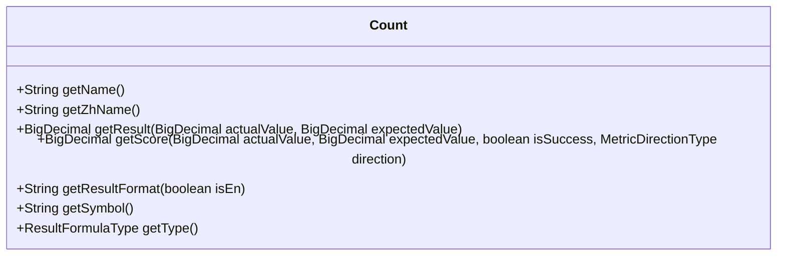

**图示来源**
- [Count.java](file://datavines-metric/datavines-metric-result-formula-plugins/datavines-metric-result-formula-count/src/main/java/io/datavines/metric/result/formula/Count.java)

### 绝对差异公式 (Diff)

绝对差异公式计算实际值与期望值之间的绝对差值，即 |实际值 - 期望值|。这种公式适用于需要衡量偏差大小的场景，而不关心偏差的方向。其数学原理基于绝对值运算，确保结果始终为非负数。

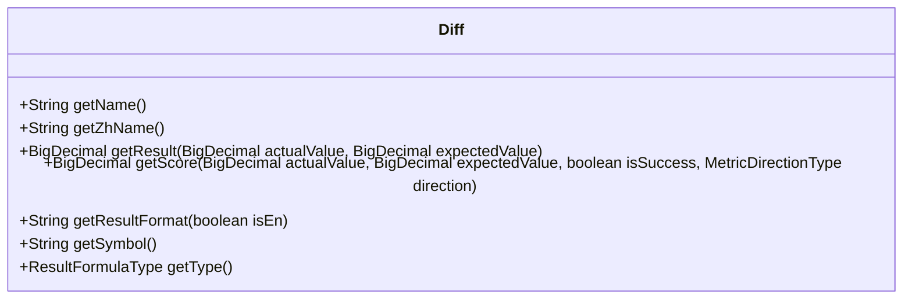

**图示来源**
- [Diff.java](file://datavines-metric/datavines-metric-result-formula-plugins/datavines-metric-result-formula-diff/src/main/java/io/datavines/metric/result/formula/Diff.java)

### 实际值减期望值公式 (ActualMinusExpectedDiff)

实际值减期望值公式计算实际值与期望值之间的代数差值，即 实际值 - 期望值。与绝对差异公式不同，此公式保留了差异的符号信息，可以区分正向偏差和负向偏差。这在需要了解偏差方向的业务场景中非常有用。

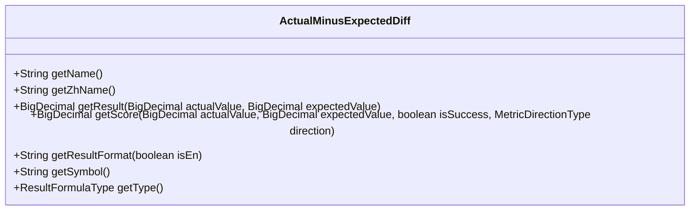

**图示来源**
- [ActualMinusExpectedDiff.java](file://datavines-metric/datavines-metric-result-formula-plugins/datavines-metric-result-formula-diff-actual-expected/src/main/java/io/datavines/metric/result/formula/ActualMinusExpectedDiff.java)

### 百分比公式 (Percentage)

百分比公式计算实际值相对于期望值的百分比，即 (实际值 / 期望值) × 100%。这种公式适用于需要评估完成率、达成率等相对指标的场景。其业务意义在于提供一个标准化的度量，便于跨不同规模的数据集进行比较。

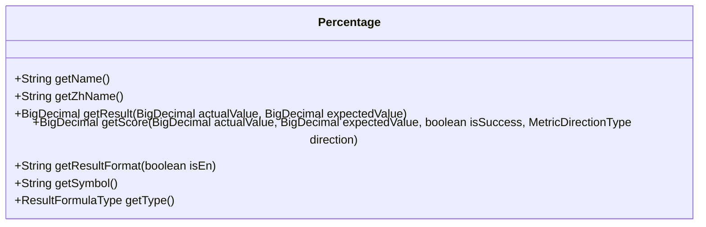

**图示来源**
- [Percentage.java](file://datavines-metric/datavines-metric-result-formula-plugins/datavines-metric-result-formula-percentage/src/main/java/io/datavines/metric/result/formula/Percentage.java)

### 差异百分比公式 (DiffPercentage)

差异百分比公式计算实际值与期望值之间差异的相对百分比，即 |实际值 - 期望值| / 期望值 × 100%。这种公式适用于需要评估偏差程度的场景，特别是在期望值本身具有重要意义时。它提供了一个标准化的偏差度量，便于比较不同规模数据的质量。

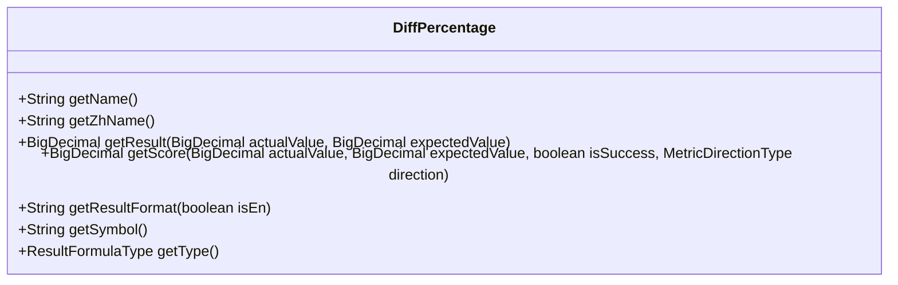

**图示来源**
- [DiffPercentage.java](file://datavines-metric/datavines-metric-result-formula-plugins/datavines-metric-result-formula-diff-percentage/src/main/java/io/datavines/metric/result/formula/DiffPercentage.java)

## 质量等级映射

质量等级映射是将计算得到的质量得分转换为可读性更强的质量等级的过程。系统定义了五个质量等级：优秀、良好、中等、合格和不合格。这些等级基于得分区间进行划分，为用户提供直观的质量评估。

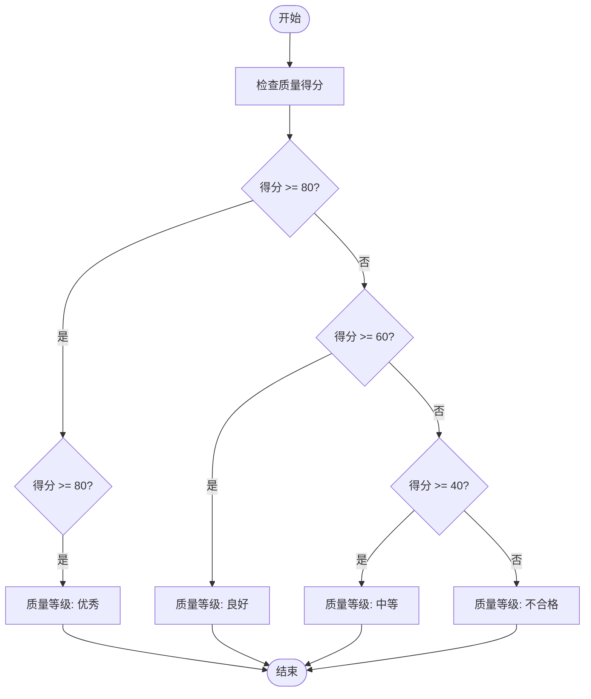

**图示来源**
- [DataQualityLevel.java](file://datavines-server/src/main/java/io/datavines/server/enums/DataQualityLevel.java)

## 结果公式扩展机制

### 插件化架构

结果公式系统采用插件化架构设计，通过 SPI (Service Provider Interface) 机制实现扩展。每个结果公式实现都作为一个独立的插件存在，系统在运行时动态加载和管理这些插件。这种设计提供了高度的灵活性和可扩展性。

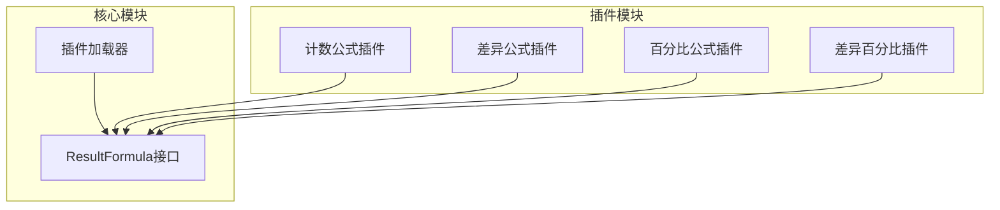

**图示来源**
- [ResultFormula.java](file://datavines-metric/datavines-metric-api/src/main/java/io/datavines/metric/api/ResultFormula.java)
- [MetricController.java](file://datavines-server/src/main/java/io/datavines/server/api/controller/MetricController.java)

### 自定义公式开发

开发自定义结果公式需要遵循以下步骤：首先实现 `ResultFormula` 接口，然后在 `META-INF/plugins` 目录下创建服务配置文件，最后将插件打包并部署到系统中。这种机制允许用户根据特定业务需求开发和集成新的计算公式。

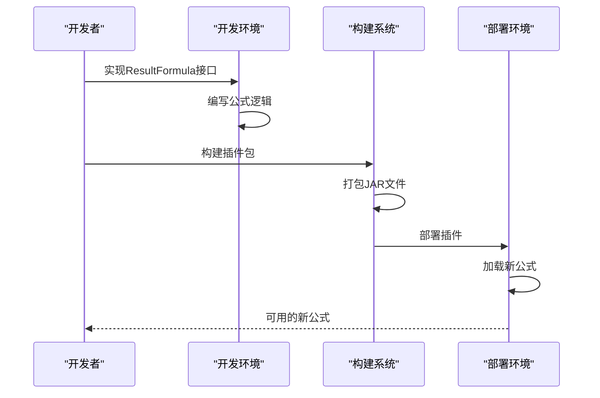

**图示来源**
- [ResultFormula.java](file://datavines-metric/datavines-metric-api/src/main/java/io/datavines/metric/api/ResultFormula.java)

## 精度控制与性能优化

### 精度控制

系统在计算过程中采用 `BigDecimal` 类型进行高精度计算，避免浮点数运算带来的精度损失。对于除法运算，系统指定了明确的舍入模式（如 HALF_UP）和小数位数（通常为4位），确保计算结果的一致性和可预测性。

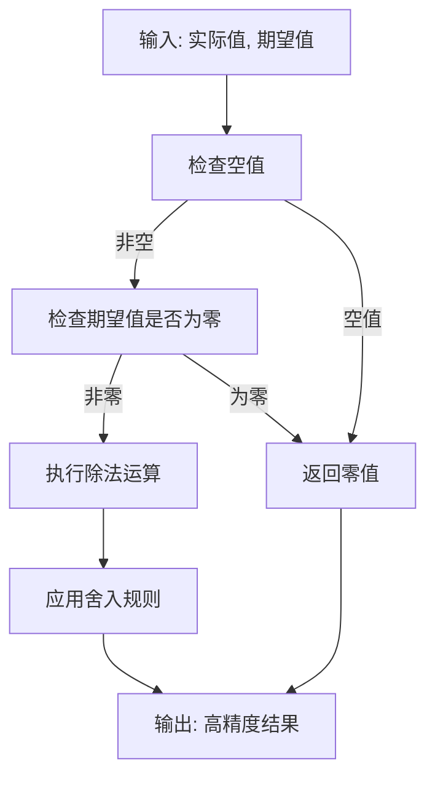

**图示来源**
- [Percentage.java](file://datavines-metric/datavines-metric-result-formula-plugins/datavines-metric-result-formula-percentage/src/main/java/io/datavines/metric/result/formula/Percentage.java)
- [DiffPercentage.java](file://datavines-metric/datavines-metric-result-formula-plugins/datavines-metric-result-formula-diff-percentage/src/main/java/io/datavines/metric/result/formula/DiffPercentage.java)

### 性能优化

系统通过缓存机制优化性能，避免重复加载和实例化相同的公式插件。`PluginLoader` 负责管理插件的生命周期，确保每个插件在系统中只有一个实例，从而减少内存占用和初始化开销。

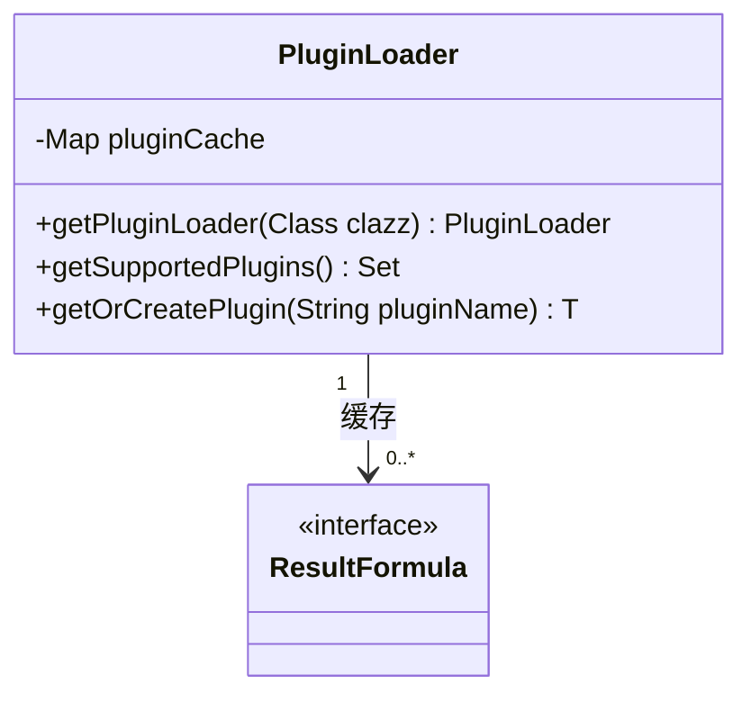

**图示来源**
- [MetricValidator.java](file://datavines-metric/datavines-metric-api/src/main/java/io/datavines/metric/api/MetricValidator.java)

## 异常处理与边界情况

### 异常处理机制

系统在计算过程中充分考虑了各种异常情况，如空值、除零错误等。当遇到这些情况时，系统会返回安全的默认值（通常是零值），而不是抛出异常，确保整个质量检查流程的稳定性。

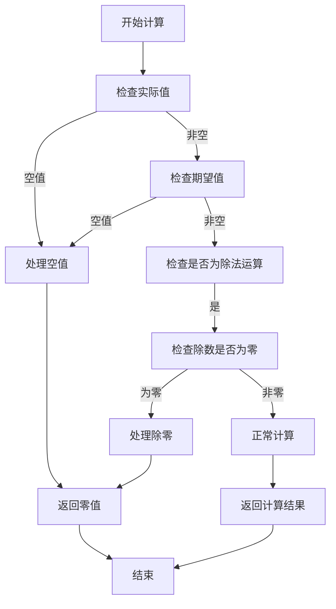

**图示来源**
- [Percentage.java](file://datavines-metric/datavines-metric-result-formula-plugins/datavines-metric-result-formula-percentage/src/main/java/io/datavines/metric/result/formula/Percentage.java)
- [DiffPercentage.java](file://datavines-metric/datavines-metric-result-formula-plugins/datavines-metric-result-formula-diff-percentage/src/main/java/io/datavines/metric/result/formula/DiffPercentage.java)

### 边界情况处理

系统特别处理了多种边界情况，包括：当期望值为零时的除法运算、实际值或期望值为空的情况、以及极端大数值的计算。这些处理确保了系统在各种输入条件下都能稳定运行。

**本节来源**
- [Percentage.java](file://datavines-metric/datavines-metric-result-formula-plugins/datavines-metric-result-formula-percentage/src/main/java/io/datavines/metric/result/formula/Percentage.java)
- [DiffPercentage.java](file://datavines-metric/datavines-metric-result-formula-plugins/datavines-metric-result-formula-diff-percentage/src/main/java/io/datavines/metric/result/formula/DiffPercentage.java)

## 实际应用示例

### 表行数质量检查

在表行数质量检查中，使用计数公式直接返回实际行数。如果实际行数达到预期目标，则质量得分为100分，否则为0分。这种检查适用于监控数据表的完整性。

**本节来源**
- [Count.java](file://datavines-metric/datavines-metric-result-formula-plugins/datavines-metric-result-formula-count/src/main/java/io/datavines/metric/result/formula/Count.java)

### 数据新鲜度检查

在数据新鲜度检查中，使用差异公式计算实际更新时间与期望更新时间之间的差异。较小的差异值表示数据更新及时，质量较高。这种检查适用于监控数据的时效性。

**本节来源**
- [Diff.java](file://datavines-metric/datavines-metric-result-formula-plugins/datavines-metric-result-formula-diff/src/main/java/io/datavines/metric/result/formula/Diff.java)

### 完成率检查

在完成率检查中，使用百分比公式计算实际完成量与预期目标的比率。例如，在数据同步任务中，计算已同步记录数占总记录数的比例。这种检查提供了直观的进度评估。

**本节来源**
- [Percentage.java](file://datavines-metric/datavines-metric-result-formula-plugins/datavines-metric-result-formula-percentage/src/main/java/io/datavines/metric/result/formula/Percentage.java)

### 偏差程度检查

在偏差程度检查中，使用差异百分比公式评估实际值与期望值之间的相对偏差。例如，在财务数据核对中，计算两个系统间金额差异的百分比。这种检查有助于识别潜在的数据质量问题。

**本节来源**
- [DiffPercentage.java](file://datavines-metric/datavines-metric-result-formula-plugins/datavines-metric-result-formula-diff-percentage/src/main/java/io/datavines/metric/result/formula/DiffPercentage.java)

## 结论

结果公式系统为数据质量平台提供了灵活而强大的计算能力。通过定义多种公式类型，系统能够满足各种质量检查需求。插件化架构设计使得系统具有良好的可扩展性，允许用户根据业务需求开发自定义公式。同时，系统在精度控制、性能优化和异常处理方面都进行了充分考虑，确保了计算的准确性和系统的稳定性。质量等级映射机制将复杂的数值计算结果转化为直观的等级评估，便于用户理解和决策。